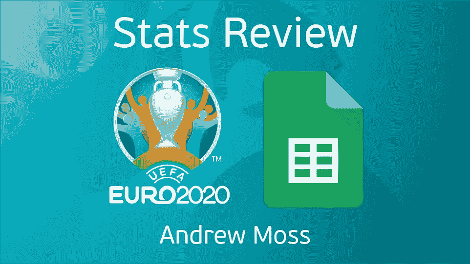

# 2020 年欧洲杯统计回顾

> 原文：<https://medium.com/analytics-vidhya/euro-2020-stats-review-5ec522203752?source=collection_archive---------23----------------------->

## 打开锦标赛统计数据

上周日，在 2020 年欧洲杯决赛中，意大利凭借点球击败英国，获得了他们的第二个欧洲杯冠军。

对于三狮军团来说，这是一个老掉牙的故事，他们在过去的九场主要国际赛事中输掉了七场点球大战。