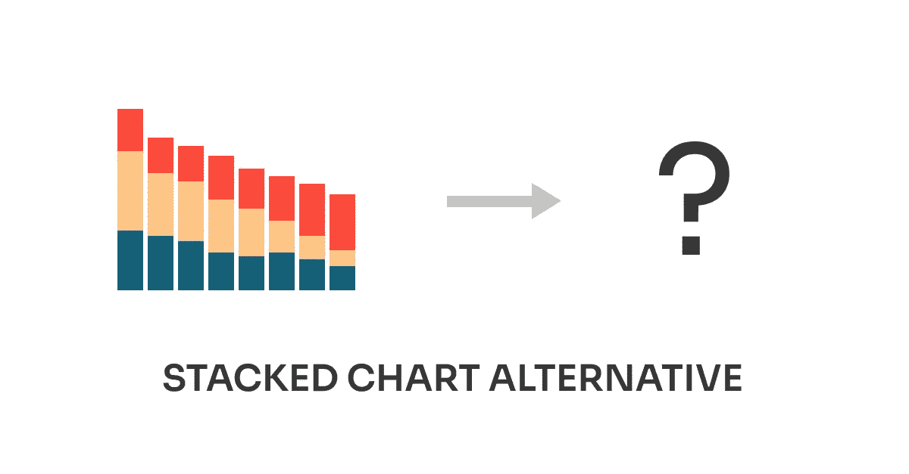

# 多个条形图——我最近发现的一个很有见地的选择

> 原文：<https://medium.com/analytics-vidhya/eurostat-tourism-participation-in-eu-4fcb84ecbb42?source=collection_archive---------23----------------------->

## 增量改进#03:堆积条形图

这是关于**增量改进**的系列文章的第三篇，为了使视觉设计更好，可以做这些改进。在每篇文章中，我都会分析数据可视化，看看哪些有效，哪些无效，以及如何改进。