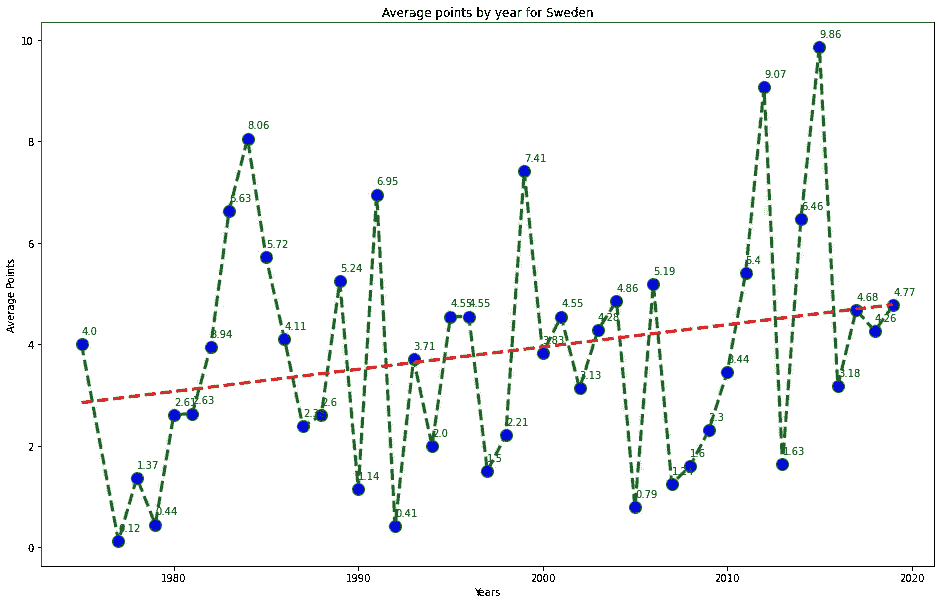
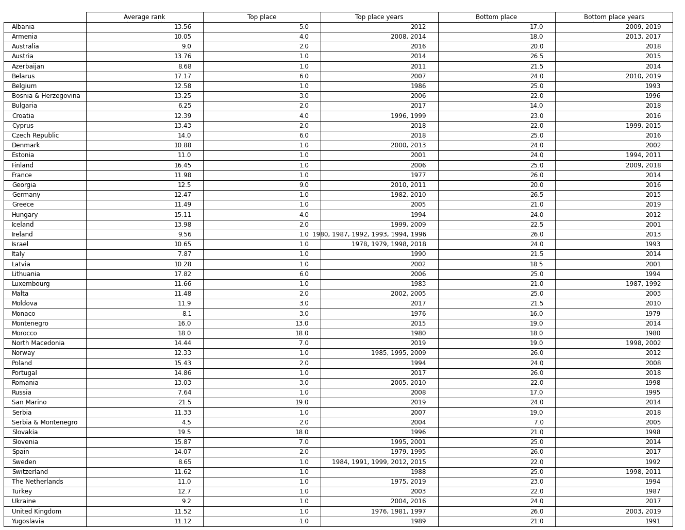
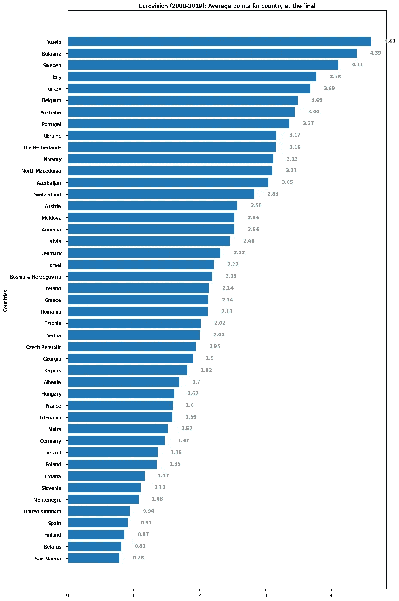

# 欧洲歌唱大赛分析

> 原文：<https://medium.com/analytics-vidhya/eurovision-song-contest-analysis-6aaa26a7771?source=collection_archive---------5----------------------->

# 介绍

2018 年，Netta 凭借歌曲《Toy》赢得了当年在里斯本举行的欧洲电视网(Eurovision)歌曲大赛，并第三次将比赛场地带回以色列——这一次是特拉维夫。


*2018 年来自以色列的欧洲歌唱大赛冠军 Netta Barzilai。Rolf Klatt/REX/Shutterstock 的照片*

一年后，比赛的准备工作全面展开，我决定成为以色列公共广播公司 KAN 的志愿者，并被选为葡萄牙代表团的主持人。我和他们一起去了耶路撒冷和死海，参加了开幕式和其他音乐活动。我在观众席上观看了两场半决赛和盛大的决赛彩排。我也有机会和我的家人一起招待代表团吃安息日晚餐。多好的体验啊！


2019 年 1 月 24 日，在特拉维夫中心街道上看到的即将举行的 2019 年欧洲电视网歌曲大赛的街头广告。(亚当·舒尔曼/Flash90)

荷兰歌手 Duncan Laurence 凭借歌曲《Arcade》获奖后，新冠肺炎疫情风靡欧洲和世界。该节目首次被取消。该节目的取消向 EBU-欧洲广播联盟提出了挑战，要求其制定一个计划，包括四个场景，以便在重大危机时期举办一场节目，事实上 2021 年的比赛将在鹿特丹举行。


鹿特丹 Ahoy 的欧洲歌唱大赛设计。照片:NPO/NOS/AVROTROS

在本文中，我们将从这个 Kaggle 的链接中深入了解欧洲歌唱大赛投票数据集:[欧洲歌唱大赛 1975 年至 2019 年的得分数据集](https://www.kaggle.com/datagraver/eurovision-song-contest-scores-19752019)。我们将看到参与国之间的政治和社会关系及其对投票的影响。剧透警报！陪审团投票除了明显的公众投票外，还有政治关联。

最后，我们将看到具有相似社会政治属性的国家集群，我们将绘制每个国家的关系强度图，我们将使用网络图来可视化国家之间的联系，并查看哪些国家平均得分最高和最低。


荷兰歌手邓肯·劳伦斯(Duncan Laurence)在 2019 年最后一届欧洲电视网(Eurovision)上凯旋。GETTY IMAGES

# 探索性数据分析( **EDA) &预处理**

我们的数据集包含从 1975 年到 2019 年的欧洲电视网歌曲比赛。从那一年——1975 年，一种新的投票制度被引入，这种制度一直沿用至今——比赛中的每个国家给其他国家 10 张 1、2、3、4、5、6、7、8、10 和 12 的选票。在那之前，比赛只有一场盛大的决赛，但在 2004 年引入了半决赛，因为由于苏联和南斯拉夫解体成为更小的独立国家，参赛国家的数量开始增加。从 2008 年开始，在总决赛前有 2 场半决赛，和今天一样。

```
df = pd.read_excel('eurovision_song_contest_voting_dataset.xlsx')
df.head()
```


```
df.tail()
```


*   **年**特征是从 1975 年到 2019 年。
*   **(半决赛)决赛**特征由['f '，' sf '，' sf1 '，' sf2']组成，分别对应决赛，半决赛，半决赛 1 和半决赛 2。
*   **评审团或电话投票**功能由['J '，' T']组成。
*   **点**从 0 到 12 - 0，1，2，3，4，5，6，7，8，10，12。
*   **重复**特征用‘x’标记具有相同**‘自’和‘至’国家的行。因为一个国家不能给自己加分，所以这些行是过时的，我们将删除这些行。**

**在清理并用更新的国家名称替换旧名称后，我们得到了过去参与或至今仍在参与的国家的列表:**

```
['Belgium', 'Finland', 'France', 'Germany', 'Ireland', 'Israel',
'Italy', 'Luxembourg', 'Malta', 'Monaco', 'Norway', 'Portugal',
'Spain', 'Sweden', 'Switzerland', 'The Netherlands', 'Turkey',
'United Kingdom', 'Yugoslavia', 'Austria', 'Greece', 'Denmark',
'Morocco', 'Cyprus', 'Iceland', 'Bosnia & Herzegovina', 'Croatia',
'Slovenia', 'Estonia', 'Hungary', 'Lithuania', 'Poland', 'Romania',
'Russia', 'Slovakia', 'North Macedonia', 'Latvia', 'Ukraine',
'Albania', 'Serbia & Montenegro', 'Andorra', 'Belarus', 'Moldova',
'Bulgaria', 'Armenia', 'Georgia', 'Serbia', 'Czech Republic',
'Montenegro', 'Azerbaijan', 'San Marino', 'Australia']
```

## **Douze 或 lose (12 分对 0 分)**

**我们将会看到哪个国家得到最多的 12 分。**

```
df_douze = df[df[‘Points’] == 12][[‘Jury or Televoting’, ‘From country’, ‘To country’, ‘Points’]]df_douze['To country'].value_counts()
```

****

**是瑞典。**

**现在我们将看到哪个国家得到最多的 0 分。**

```
df_zero = df[df[‘Points’] == 0][[‘Jury or Televoting’, ‘From country’, ‘To country’, ‘Points’]]df_zero['To country'].value_counts()
```

****

**是西班牙。**

**让我们看看哪些国家给了最多的 12 分**

```
df_douze_points_countries_relationships = df_douze.groupby(['To country', 'From country']).size().sort_values(ascending=False).reset_index(name='counts')df_douze_points_countries_relationships.drop_duplicates(subset=['To country'], keep='first', inplace=True)df_douze_points_countries_relationships
```

****

**塞浦路斯 34 次给希腊 12 分！**

**我们通过给对方打 12 分，开始看到国与国之间的社会政治关系。**

**让我们看看哪些国家给了最多的 0 分**

```
df_zero_points_countries_relationships = df_zero.groupby(['To country', 'From country']).size().sort_values(ascending=False).reset_index(name='counts')df_zero_points_countries_relationships.drop_duplicates(subset=['To country'], keep='first', inplace=True)df_zero_points_countries_relationships
```

****

**瑞典 39 次给西班牙 0 分！**

****

**ESC2019 总决赛(YouTube 上的欧洲歌唱大赛频道)**

## **每个国家的平均分数**

```
df_average_points_per_country = df.groupby('To country').agg({'Points': ['mean']}).sort_values(('Points', 'mean'), ascending = False)labels = df_average_points_per_country[('Points', 'mean')].index
avg_points = list(df_average_points_per_country[('Points', 'mean')])fig, ax = plt.subplots(figsize=(12,18))
rects = ax.barh(labels, avg_points)ax.invert_yaxis()ax.set_ylabel('Countries')
ax.set_title('Eurovision (1975-2019): Average points')
ax.xaxis.set_tick_params(pad = 5)
ax.yaxis.set_tick_params(pad = 10)for i in ax.patches:
    plt.text(i.get_width()+0.2, i.get_y()+0.5,
             str(round((i.get_width()), 2)),
             fontsize = 10, fontweight ='bold',
             color ='grey')fig.tight_layout()plt.show()
```

****

**塞尔维亚和黑山国家联盟参加了两次欧洲歌唱大赛:2004 年[和 2005 年](https://en.wikipedia.org/wiki/Eurovision_Song_Contest_2004)。他们的首次亮相非常成功，由 eljko joksimovi 演唱的歌曲“ [Lane moje](https://en.wikipedia.org/wiki/Lane_moje) 获得第二名。第二年，他们排名第七。**

**让我们画出瑞典每年的平均分数:**

```
df_average_points_per_country_by_year = df.groupby(['To country', 'Year']).agg({'Points': ['mean']})country = 'Sweden'
x = df_average_points_per_country_by_year.loc[[country]].index.get_level_values('Year')
y = df_average_points_per_country_by_year.loc[[country]][('Points', 'mean')]
z = np.poly1d(np.polyfit(x, y, 1))(x)plt.figure(figsize=(16,10))
plt.plot(x, y, color='green', linestyle='dashed', linewidth = 3, marker='o', markerfacecolor='blue', markersize=12)
plt.plot(x, z,"r--", linewidth = 3)
for year, average_points in zip(x, y): 
    plt.text(year, average_points+0.2, str(round(average_points, 2)))
plt.xlabel('Years')
plt.ylabel('Average Points')
plt.title('Average points by year for ' + country)
plt.show()
```

****

**自 1975 年以来，瑞典每年参赛的平均分数。**

```
print('Maximum average points for', country, 'is', round(y.max(), 2), 'in', y.idxmax()[1])
print('Minimum average points for', country, 'is', round(y.min(), 2), 'in', y.idxmin()[1])
print('The gradient is',round((z[-1] - z[0]) / (max(x) - min(x)), 3))Maximum average points for Sweden is 9.86 in 2015
Minimum average points for Sweden is 0.12 in 1977
The gradient is 0.044
```

## **等级**

**排名是基于每年每一版(sf、sf1、sf2 和 f)中每个国家的得分。排名可以是基于共享点数的与另外 1 个或多个国家的共享排名(平均排名)。例如，在 1991 年的决赛中，法国和瑞典同积 146 分，所以他们的排名是 1.5 (1 和 2)。根据当时的规则，瑞典被宣布获胜。**

```
df_rank = df.groupby(['Edition', 'To country']).agg({'Points': ['sum']})
df_rank.columns = ['Total Points']df_rank['Rank'] = df_rank.groupby(level=0).rank(ascending=False)
df_rank = df_rank.sort_values(['Edition','Rank'], ascending=[True, True])df_rank.loc[['2019f']][:5]
```

****

**2019 年决赛的前 5 名**

## **赢家和输家**

**让我们记住，1991 年法国和瑞典得分相同，但瑞典赢了:**

```
df_rank.loc[('1991f', 'Sweden'), 'Rank'] = 1.0
```

**这是每个版本最好和最差的地方:**

```
n_winners_and_losers = 1
winners = df_rank.groupby(level=0).apply(lambda x: x.iloc[:n_winners_and_losers])
losers = df_rank.groupby(level=0).apply(lambda x: x.iloc[-n_winners_and_losers:])df_winners_and_losers = pd.DataFrame({'Edition': winners.index.get_level_values(0)})
df_winners_and_losers.set_index('Edition', inplace=True)df_winners_and_losers['Winning country'] = winners.index.get_level_values('To country')
df_winners_and_losers['Winning rank'] = list(winners['Rank'])
df_winners_and_losers['Winning points'] = list(winners['Total Points'])
df_winners_and_losers['Last place country'] = losers.index.get_level_values('To country')
df_winners_and_losers['Last place rank'] = list(losers['Rank'])
df_winners_and_losers['Last place points'] = list(losers['Total Points'])
df_winners_and_losers
```

********

**来自葡萄牙的 Salvador Sobral 凭借优美的歌曲 Amar Pelos Dois 赢得了 2017 年欧洲电视网歌曲大赛的冠军。照片:安德烈斯推杆**

## **每个国家在决赛中的平均排名、最佳和最差名次**

**我们将只关注决赛，因为半决赛中的排名在相互比较和与决赛比较时可能有所不同。**

```
df_final_rank = df_rank[~df_rank.index.get_level_values('Edition').str.contains('sf')]
```

****

**让我们来看看瑞典的年度排名:**

```
country = 'Sweden'
country_rank_and_points_in_finals = df_final_rank[df_final_rank.index.get_level_values('To country') == country].reset_index()x = [int(year[:4]) for year in country_rank_and_points_in_finals['Edition']]
y = country_rank_and_points_in_finals['Rank']
z = np.poly1d(np.polyfit(x, y, 1))(x)plt.figure(figsize=(16,10))
plt.plot(x, y, color='green', linestyle='dashed', linewidth = 3, marker='o', markerfacecolor='blue', markersize=12)
plt.plot(x, z,"r--", linewidth = 3)
for year, average_points in zip(x, y): 
    plt.text(year+0.3, average_points-0.3, str(round(average_points, 2)))
plt.xlabel('Years')
plt.ylabel('Rank (place)')
plt.gca().invert_yaxis()
plt.title('Rank (place) by year for ' + country)
plt.show()
```

****

**瑞典自 1975 年以来每年都有参赛。**

```
print('Best place for', country, 'is', df_final_rank_for_country.loc[country]['Top place'], 'in', df_final_rank_for_country.loc[country]['Top place years'])
print('Worst place for', country, 'is', df_final_rank_for_country.loc[country]['Bottom place'], 'in', df_final_rank_for_country.loc[country]['Bottom place years'])
print('The gradient is',round(-(z[-1] - z[0]) / (max(x) - min(x)), 3))Best place for Sweden is 1.0 in 1984, 1991, 1999, 2012, 2015
Worst place for Sweden is 22.0 in 1992
The gradient is 0.078
```

## **半决赛和决赛中每个国家的平均得分(2008-2019)**

**从现在开始，我们将只看近几年的比赛，从 2008 年到 2019 年，采用我们今天所知道的半决赛和决赛的形式。**

```
df_with_semi_finals = df[df.Year >= df[df[‘(semi-) final’] == ‘sf1’][‘Year’].unique()[0]]
```

****

**中暑项目& Olia Tira-Run Away(摩尔多瓦)2010 年欧洲电视网歌曲大赛现场(YouTube 上的欧洲电视网歌曲大赛频道)。**

## **半决赛中国家的平均得分**

```
df_average_points_per_country_in_sf = df_with_semi_finals.loc[(df_with_semi_finals['(semi-) final'] == 'sf1') | (df_with_semi_finals['(semi-) final'] == 'sf2')].groupby('To country')['Points'].mean().sort_values(ascending=False).reset_index(name='counts')labels = df_average_points_per_country_in_sf['To country']
avg_points = list(df_average_points_per_country_in_sf['counts'])fig, ax = plt.subplots(figsize=(12,18))
rects = ax.barh(labels, avg_points)ax.invert_yaxis()ax.set_ylabel('Countries')
ax.set_title('Eurovision (2008-2019): Average points for country at the semi-finals')
ax.xaxis.set_tick_params(pad = 5)
ax.yaxis.set_tick_params(pad = 10)for i in ax.patches:
    plt.text(i.get_width()+0.2, i.get_y()+0.5,
             str(round((i.get_width()), 2)),
             fontsize = 10, fontweight ='bold',
             color ='grey')fig.tight_layout()plt.show()
```

****

**近年来，瑞典队在半决赛中的平均得分一直领先**

**我们将把半决赛的平均分分配给评审团和电话投票:**

****

****评审团**喜欢**澳大利亚和瑞典**，但是**公众**在半决赛中投票给**乌克兰和保加利亚**。陪审团和公众投票的最大差异在保加利亚和葡萄牙。**

## **国家在决赛中的平均得分**

```
df_average_points_per_country_in_final = df_with_semi_finals[df_with_semi_finals['(semi-) final'] == 'f'].groupby('To country')['Points'].mean().sort_values(ascending=False).reset_index(name='counts')labels = df_average_points_per_country_in_final['To country']
avg_points = list(df_average_points_per_country_in_final['counts'])fig, ax = plt.subplots(figsize=(12,18))
rects = ax.barh(labels, avg_points)ax.invert_yaxis()ax.set_ylabel('Countries')
ax.set_title('Eurovision (2008-2019): Average points for country at the final')
ax.xaxis.set_tick_params(pad = 5)
ax.yaxis.set_tick_params(pad = 10)for i in ax.patches:
    plt.text(i.get_width()+0.2, i.get_y()+0.5,
             str(round((i.get_width()), 2)),
             fontsize = 10, fontweight ='bold',
             color ='grey')fig.tight_layout()plt.show()
```

****

**俄罗斯在近几年的总决赛中平均得分一直领先**

**我们将把决赛的平均分分配给评审团和电话投票:**

****

****评审团**喜欢**瑞典和澳大利亚**，但是**公众**在决赛中投票给**俄罗斯和罗马尼亚**。陪审团和公众投票的最大差异在 T21 和俄国。**

## **一个国家和所有其他参与者之间的平均分数**

**我们将查看亚美尼亚的关系强度，在本例中，它是亚美尼亚的平均分和亚美尼亚给每个国家的平均分之间的平均值。**

```
country = 'Armenia'
df_country_relationships = country_relationship_strength(country)
df_country_relationships[['country', 'Average Points']]
```

****

**这开始变得有趣——我们可以看到国家之间的社会政治投票。有时可能是不对称关系，正如我们在这个图中看到的:**

****

**例如，我们可以看到，与瑞士给亚美尼亚的平均分相比，瑞士给亚美尼亚的平均分更高。**

# **分层聚类**

**我们将使用聚类方法来查看不同国家集团的投票情况。从 2008 年开始，我们将继续使用与半决赛相同的投票数据，就像我们以前使用的一样。**

```
from scipy.cluster.hierarchy import linkage, dendrogram
from scipy.cluster.vq import whitendf_average_points_to = df_with_semi_finals.groupby(['To country', 'From country']).agg({'Points': ['mean']}).sort_values(('Points', 'mean'), ascending = False)dist = df_average_points_to.pivot(index='From country', columns='To country', values='Points')
dist.fillna(12, inplace=True)df_scaled = whiten(dist.to_numpy())
mergings = linkage(df_scaled, method='ward')
plt.figure(figsize=(20,12))
dn = dendrogram(mergings, labels=np.array(dist.index), color_threshold=0.3*max(mergings[:,2]), leaf_rotation=90, leaf_font_size=14)

plt.show()
```

****

**最大 0.3 *的分层聚类(合并[:，2])**

**我们可以看到“最好的朋友”的基本集团:**

*   **北欧国家:**芬兰、冰岛、挪威、瑞典和丹麦**。**
*   **波罗的海国家:**拉托维亚、立陶宛和爱沙尼亚**。**
*   **不列颠群岛:**英国和爱尔兰**。**
*   **伊比利亚半岛:**西班牙和葡萄牙**。**
*   **中东欧:**匈牙利和波兰**。**
*   **中欧:**奥地利和瑞士。****
*   **比荷卢(不含卢森堡):**比利时和荷兰。****
*   **巴尔干锅#1: **黑山和北马其顿。****
*   **巴尔干锅#2: **塞尔维亚，克罗地亚，斯洛文尼亚，波斯尼亚&黑塞哥维纳。****
*   **东欧和西亚:**乌克兰、白俄罗斯、格鲁吉亚和俄罗斯。****
*   **东南欧:**罗马尼亚和摩尔多瓦。****
*   **南欧锅#1: **阿尔巴尼亚和圣马力诺。****
*   **南欧锅#2: **意大利和马耳他。****
*   **东地中海:**希腊和塞浦路斯。****
*   **离群国家(不属于任何低等级集团):**澳大利亚、安道尔、斯洛伐克、法国、以色列、捷克共和国、德国、阿塞拜疆、土耳其、亚美尼亚和保加利亚。****

**现在，我们将通过提高阈值来继续更高层次的块:**

****

**最大 0.5 *的分层聚类(合并[:，2])**

**我们有 6 个区块:**

*   **北欧集团和澳大利亚:**芬兰、冰岛、挪威、瑞典、丹麦和澳大利亚。****
*   **西北和东北集团:**拉脱维亚、立陶宛、爱沙尼亚、英国和爱尔兰。****
*   **中西部和以色列集团:**西班牙、葡萄牙、匈牙利、波兰、捷克、奥地利、瑞士、德国、比利时、荷兰、法国和以色列。****
*   **巴尔干集团:**黑山、北马其顿、塞尔维亚、克罗地亚、斯洛文尼亚、波斯尼亚&黑塞哥维那。****
*   **东方集团:阿塞拜疆、俄罗斯、乌克兰、白俄罗斯和格鲁吉亚。**
*   **东南集团:土耳其、罗马尼亚、摩尔多瓦、阿尔巴尼亚、圣马力诺、意大利、马耳他、希腊、塞浦路斯、保加利亚和亚美尼亚。**
*   ****安道尔和斯洛伐克**，是离群国家，可以与中西部和以色列集团联系在一起。**

**一些见解:**

*   ****澳洲**是一个类似北欧的国家。**
*   ****以色列**与法国相连，与欧盟的其他国家相连，这使得以色列成为一个中欧国家。**
*   **巴尔干集团非常以自我为中心，与其他集团隔绝。**
*   ****安道尔**与**西班牙**联系紧密(他们总是给对方 12 分)，但因为场均分低，出场次数少，国家离集团太远。**
*   ****东欧**和**西欧**之间有明显的差距，那些不是来自欧洲，但有着相同心态的国家，都属于西方或东方的同一个集团。**

## **只有陪审团投票**

****

**类似于最初的聚类，但有一些变化，澳大利亚现在是中欧类型的国家，而以色列是东方类型的国家。**

## **只有电话投票**

****

**较小的以自我为中心的孤立集团，具有相同的文化、语言、人民、地域、食物等共同属性。**

# **绘制平均点**

**我们将绘制“关系强度”，这基本上是一个国家的平均投票数(往返)。**

```
import plotly.graph_objects as go
import plotly.express as pxdef plot_map(country):
    df = country_relationship_strength(country)fig = go.Figure(data=[go.Choropleth(
        locations=[codes_dict[country]],
        z = [0],
        text = [country],
        colorscale='Reds',
        reversescale=True,
        ), go.Choropleth(
        locations = df['code'],
        z = df['Average Points'],
        text = df['country'],
        colorscale = 'Blues',
        autocolorscale=False,
        reversescale=False,
        marker_line_color='darkgray',
        marker_line_width=0.5,
        colorbar_title = 'Average points',
    )])fig.update_layout(
        title_text='All average votes/scores (to and from) given during the (semi) finals from jury and televoting for <b>' + country,
        geo=dict(
            showframe=False,
            showcoastlines=False,
            projection_type='equirectangular'
        ),
        annotations = [dict(
            x=0.55,
            y=0.1,
            xref='paper',
            yref='paper',
            text='source: <a href="[https://www.kaggle.com/datagraver/eurovision-song-contest-scores-19752019](https://www.kaggle.com/datagraver/eurovision-song-contest-scores-19752019)">\
                Eurovision Song Contest scores 2008-2019</a>',
            showarrow = False
        )]
    )

    return fig
```

****

**每个国家/地区在半决赛比赛期间由评审团和电话投票给出的平均分(往返)图**

**国家之间的平均分越高，颜色就越深。**

****

# **网络(图形)**

**NetworkX 是一个 Python 包，用于创建、操作和研究复杂网络的结构、动态和功能，如欧洲电视网歌曲比赛投票。**

```
import networkx as nx
```

## **使用地理位置定位节点。**

**节点(或国家)是基于经度和纬度定位的。**

*   **国旗越大，平均得分越多。**
*   **国家之间的界限越宽，国家之间的联系就越强(平均分越高)。**
*   **国与国之间的界线越坚实，国与国之间的联系就越强(平均分越高)。**

****

**基于地理位置的图表，结合了陪审团投票和电话投票**

## **陪审团投票和电话投票**

****

**陪审团倾向于瑞典、澳大利亚和阿塞拜疆，而公众倾向于俄罗斯、葡萄牙和摩尔多瓦。**

## **使用 Fruchterman-Reingold 力定向算法定位节点。**

**力定向图形绘制算法是一类以美观的方式绘制图形的算法。它们的目的是在二维或三维空间中定位图的节点，使得所有的边都或多或少地等长，并且有尽可能少的交叉边，通过基于它们的相对位置在边集合和节点集合之间分配力，然后使用这些力来模拟边和节点的运动或者最小化它们的能量。**

****

**陪审团投票和电话投票相结合的力有向图**

# **结论**

**我们从 0 分 12 分票的 EDA 开始。我们看到**瑞典得到最多的 12 分**(杜泽)，而**西班牙得到最多的 0 分**。**

**我们继续计算每个国家的平均分数。黑山共和国的平均分最高，为 6.14 分，但他们作为一个国家参赛才两年。**平均第二高的国家是俄罗斯**，4.6。**平均最低的是摩洛哥【0.39，至今仍在参赛的**平均最低的国家是圣马力诺**1.29。****

**我们绘制了瑞典(可以是任何其他国家)每年的平均分数和排名。**总的来说，瑞典的平均水平和排名都在不断提高**。**

**我们看到了每一版的赢家(第一名)和输家(最后一名)。也是每个国家在决赛中最好和最差的地方。**

**我们从 2018 年的 2 个半决赛版本继续分析大赛。我们看到**瑞典在半决赛中胜出**俄罗斯在决赛中胜出。**

****评审团**更倾向于投票给**澳洲和瑞典**，而**大众**更倾向于投票给半决赛**乌克兰和保加利亚**，决赛**俄罗斯和罗马尼亚**。**

****关系强度**是指两个国家之间的**平均票数，这也暴露了两者之间的**社会政治联系**。在我们的例子中，亚美尼亚与俄罗斯、格鲁吉亚和希腊有着牢固的关系，它们分享着同样的东方基督教文化。由于冲突等原因，与阿塞拜疆的关系很弱。****

**通过使用**等级聚类**，我们绘制了国家之间的**等级图**，得到了不同等级的**投票群体**总投票、评审团投票和公众投票。由文化相似的国家组成的集团。**

**我们绘制了每个国家的 T42 关系强度图。我们可以清楚地看到每个国家的地区投票。**

**我们用 Python 包 **NetworkX** 绘制了由节点(国家)和边(选票)组成的**复杂投票网络**。我们使用了两种方法:第一种是通过每个国家的**地理位置**，第二种是通过 Fruchterman-Reingold **力定向算法**。**

## **遗言…**

**尽管投票可能看起来是政治性或社会性的，获胜的歌曲被选中是因为它是最好的歌曲。获奖歌曲的选择可能对自己来说很奇怪，但它是基于陪审团和公众的不同意见的总和。**

**这就是为什么很难预测哪首歌会胜出的原因之一，因为它不仅基于政治，也基于统计数据，还基于对这首歌的热爱以及每年歌词、旋律、舞蹈、时尚、烟火、舞台、效果等的质量。它还依赖于同一节目中其他参与者的歌曲。**

**虽然欧洲电视网赔率网站试图预测获胜歌曲和其他歌曲的顺序，但基于其他特征，如点赞数、YouTube 浏览量，可能会有一首“百搭”歌曲在最后一秒钟占据第一名，让所有人感到惊讶。**

**这就是为什么欧洲歌唱大赛看起来如此有趣。**

****

**芬兰的怪兽摇滚乐队 Lordi 庆祝他们在 2006 年欧洲电视网歌曲大赛中的胜利**

**你可以在我的 [GitHub](http://www.github.com/EranPer/Eurovision-Song-Contest-Analysis) 上的笔记本里看到我的完整分析。**

# **参考**

**[基于欧洲电视网投票的国家等级聚类](/swlh/hierarchical-clustering-of-countries-based-on-eurovision-votes-2d02ae40b063)**

**[社交网络分析:从图论到 Python 应用](https://towardsdatascience.com/social-network-analysis-from-theory-to-applications-with-python-d12e9a34c2c7)**