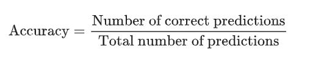
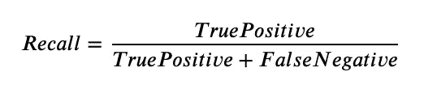
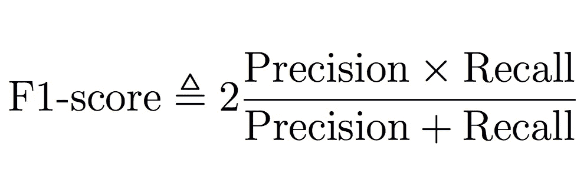

# 评估我们的机器学习模型性能

> 原文：<https://medium.com/analytics-vidhya/evaluating-our-machine-learning-model-performance-a33cade9d804?source=collection_archive---------14----------------------->

模型评估是开发机器学习流水线中最重要的步骤之一。想象一下，设计一个模型，然后直接将其部署到生产中。假设你的模型被用于医疗领域，那么它可能会导致多人死亡(如果你的模型表现不佳)。但是不要担心，本文将为您提供评估和改进模型性能所需的所有工具。

**分类问题**

众所周知，分类问题是那些输出为离散值的问题。例如垃圾邮件检测、癌症检测等。

就本文的范围而言，我们将主要关注二进制分类，其中输出为 0 或 1。

*让我们采用一个机器学习模型来预测一个人是良性(阳性类别)还是恶性(阴性类别)肿瘤。我们将把我们所有的评估指标应用到这个模型中。*

**评估指标**

我们将根据何时使用评估指标，将其分为两类。

*   数据集平衡时的评估指标。
*   数据集不平衡时的评估指标。

**不平衡数据集**

> 任何具有不平等类别分布的**数据集**在技术上是**不平衡的**。然而，当问题的每个类别的示例数量之间存在显著的，或者在某些情况下极端的不均衡时，数据集**被称为**不均衡**。**

假设，我们有一个数据集，其中有 900 个良性肿瘤样本和 100 个恶性肿瘤样本。

**精度:模型的精度**通过以下公式计算:

精确度公式

现在假设我们的模型预测所有的输出都是良性肿瘤，那么根据上面的公式，我们的准确率是 90%(想想吧！).我们可以清楚地看到，我们的模型未能预测恶性肿瘤。现在想象一下，如果你在现实世界中使用这个模型，那会是多么大的灾难。

**学习:**只有当我们的数据集平衡时，才应该使用准确性作为评估指标。

**不平衡数据集的评估指标**

*   **混淆矩阵**:顾名思义，混淆矩阵是一个矩阵，它告诉我们在不同的类之间，我们的模型对于什么值变得混淆。

混淆矩阵

**与混淆矩阵相关的定义**

*   **TP:** 真阳性是那些实际上是阳性并被预测为阳性的例子。实际输出是良性肿瘤(阳性肿瘤),并且该模型也预测了良性肿瘤。
*   **FP:** 假阳性也称为**1 型错误**是那些实际上是阴性但我们的模型预测为阳性的例子。实际输出是恶性肿瘤(阴性类别)，但我们的模型预测是良性肿瘤。
*   **FN:** 假阴性也称为**2 型错误**是那些实际上是阳性的例子，但是我们的模型预测它们是阴性的。实际输出是良性肿瘤(阳性类别)，但我们的模型预测它是恶性肿瘤。
*   **TN:** 真阴性是那些实际上是阴性的例子，我们的模型预测它们是阴性的。实际输出是恶性肿瘤(阴性类别),我们的模型也将其预测为恶性肿瘤。

每当我们训练我们的模型时，我们应该努力减少假阳性和假阴性，这样我们的模型就能做出尽可能多的正确预测。

通过查看混淆矩阵，我们可以了解我们的模型在特定类上的表现。不像准确性，它给出了整个模型的估计。

**精度和召回**

这是评估模型性能的两个非常重要的指标。没有谁比谁更好，这取决于用例以及业务需求。让我们先来看看它们的定义，然后我们将发展一种直觉，在什么时候使用它们

**精度:模型的精度**由以下公式给出:

精度可以定义为“在所有正预测值中，有多少实际上是正的。”

**召回:**通过使用以下公式给出模型的召回

回忆可以定义为“在所有实际正值中，有多少是实际预测的正值。”

**小迷糊？**

我花了一些时间来理解这个定义。但是不用担心，我们会用一个例子来理解这一点。

*   假设您有一个垃圾邮件检测模型，将垃圾邮件作为肯定类别，而不是垃圾邮件作为否定类别。现在想一想，您将使用哪个指标(精确度或召回率)来评估您的模型。

思考…………..

好吧，让我们明白，在这个问题中，我们不希望任何重要的邮件被遗漏，以防它被预测为垃圾邮件。因此，我们希望减少误报(被预测为垃圾邮件的非垃圾邮件)，从而提高我们的精确度。因此，在这种情况下，我们将更关注精度而不是召回。

*   现在，让我们再举一个例子，我们想预测一个人是否患有癌症。在这种情况下，得了癌症就是正面例子，没得癌症就是负面例子。现在，休息一下，考虑一下您将用于评估该模型的评估指标。

思考…………..

让我们看看，在这个例子中，我们不能把一个得了癌症的人归类为没有得癌症(这关乎生死)。因此，我们将尝试减少假阴性(预测阴性类别为实际阳性类别)，这反过来将增加我们的回忆。在这种情况下，我们将更多地关注召回率而不是精确度。

**给你的任务**

想出更多的例子，自己看看可以应用哪些指标。

**F1-得分**

虽然精确度和召回率都很好，但是它们并没有给我们比较两个模型的能力。如果一个模型有很好的召回率，而另一个有很好的精确度，那么使用哪一个来完成我们的任务就变得非常混乱了(直到我们完全确定我们只需要关注一个指标)。

**F1-得分营救**

F1-score 取精确率和召回率的调和平均值，并给出一个值来评估我们的模型。它由以下模型给出。

> 我们使用**调和平均值**而不是简单平均值，因为它惩罚极端值。精度为 1.0、召回率为 0.0 的分类器的简单平均值为 0.5，但 **F1 得分**为 0。

现在，您可以使用 F1 分数来比较不同的车型，并选择最适合您的车型。

**作业时间**

*   ROC 和 AUC 评价指标的研究。
*   我们可以使用混淆矩阵进行多类分类吗？如果可以，我们如何计算精度和召回率？
*   尝试不同的模型，如决策树、逻辑回归，并使用不同的指标评估您的模型。

**快乐学习！！！**