# 分类模型的评估标准

> 原文：<https://medium.com/analytics-vidhya/evaluation-metrics-for-classification-models-e2f0d8009d69?source=collection_archive---------1----------------------->

## 评估分类模型时广泛使用的最常见指标

Ernesto Velázquez 在 [Unsplash](https://unsplash.com?utm_source=medium&utm_medium=referral) 上的照片

# 介绍

评估指标用于衡量模型的质量。机器学习最重要的课题之一就是如何评估你的模型。当你建立你的模型时，衡量它预测你的预期结果有多准确是非常重要的。

对于不同的机器学习算法，我们有不同的评估指标。对于评估分类模型，我们使用分类度量，对于评估回归模型，我们使用回归度量。在本文中，我将只讨论分类指标。在我们深入研究评估指标之前，让我们先谈谈一些基础知识:

# 一些热身:……

对于**监督的**和**非监督的**机器学习算法，都有各种评估指标。

**监督学习** -我们已经标记了输入，任务是通过训练模型来预测标记的输出。这些算法进一步分为两类:分类和回归

*   **分类:**根据一些输入，预测一个类别。这些问题试图将一个数据点归类到一个特定的类别/类中。这里，目标结果将是一个离散/分类值，如是/否、垃圾邮件/非垃圾邮件等。例如，客户是否会拖欠贷款。
*   **回归:**根据一些输入，预测某个数字。这些问题使用输入变量，通过仅使用训练数据来预测连续值。在这里，目标结果总是数量/实际值，如时间序列数据、销售数字、身高、体重等。例如，他们客户的预期违约金额或房屋价格是多少？

**无监督学习**——这些算法帮助我们分析和聚类未标记的数据集。我们没有任何目标标签。这些算法帮助我们发现数据中隐藏的模式。

**训练/验证/测试分割:**

来源: [Stackexchange](https://datascience.stackexchange.com/questions/61467/clarification-on-train-test-and-val-and-how-to-use-implement-it)

在我们深入研究指标之前，我们有一定的**模型评估程序**。我们需要知道一个模型对样本外数据的概括能力有多强。

*   **在相同的数据上训练和测试:**当你在相同的数据上训练和测试时，你将会过度拟合训练数据，它也不会泛化。

> 评估模型时，最好不要在整个数据集上训练模型。

*   **训练和测试分割:**典型的训练/测试分割是将 70%的数据用于训练，30%的数据用于测试。评估您的模型以找到模型的最佳参数很重要，但我们不能使用此测试集进行评估，因为我们得到的参数可能是最佳的，但不一定能很好地概括。

> 最好将数据分成两部分，即训练集和测试集。最好将数据分成三部分，即训练、验证和测试集。

*   **训练/验证/测试分割:**为了在构建和调整模型的同时评估您的模型，我们需要创建第三个子集，即验证集。这种划分是将 60%的数据用于训练，20%的数据用于验证，20%的数据用于测试。验证集用于评估具有不同超参数值的模型的性能。它还用于检测训练阶段的过度拟合。

> 在进行分割之前打乱数据是很有用的，这样每个分割都可以准确地表示数据。

让我们深入研究一下指标。

# 为什么我们需要评估指标？

评估指标可以帮助您评估模型的性能，监控生产中的 ML 系统，并控制模型以满足您的业务需求。

我们的目标是创建和选择一个对样本外数据给出高精度的模型。使用多个评估指标来评估您的模型是非常重要的，因为一个模型可能使用一个评估指标的一个度量表现良好，而使用另一个评估指标的另一个度量表现不佳。

# 分类评估指标

在这里，我将讨论一些用于评估模型的常见分类指标。

# **分类精度:**

模型评估最简单的标准是准确性。它是一个数据集的正确预测数与预测总数的比率。

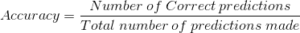

> 当目标类平衡良好时，精度是有用的，但对于不平衡的类，精度不是一个好的选择。

例如，有两个目标类的数据集包含 100 个样本。在我们的训练数据中，98 个样本属于 A 类，2 个样本属于 B 类，我们的模型将给我们 98%的准确率。这就是为什么我们需要查看更多的指标来获得更好的结果。

这里，我们用 python 实现了准确性:

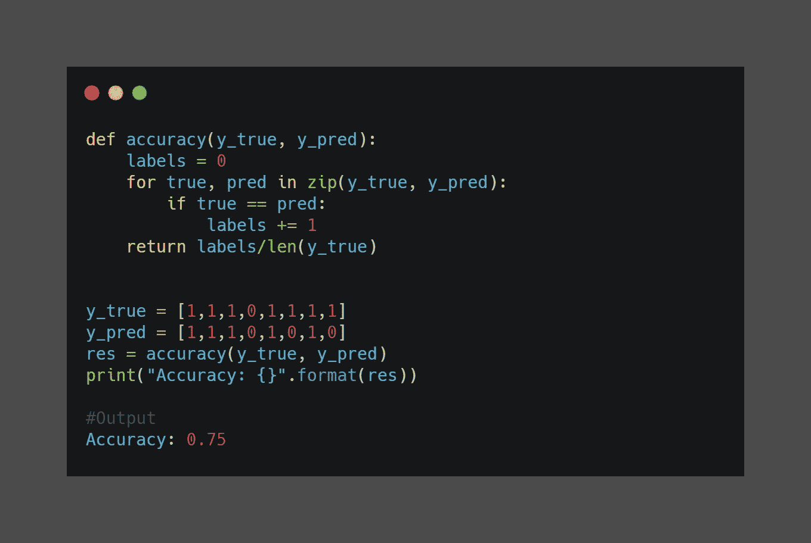

计算精确度

准确性让我们对模型预测的可信度有了一个总体的了解。这一指标无视错误类别和类型之间的差异。这就是为什么它对不平衡数据集不够好的原因。

# 对数损失或对数损失:

当分类器的输出是数字概率而不是类标签时，可以使用 Log Loss。对数损失衡量的是来自使用预测器而非真实标签的额外噪声的不可预测性。

**二元分类器的对数损失:**

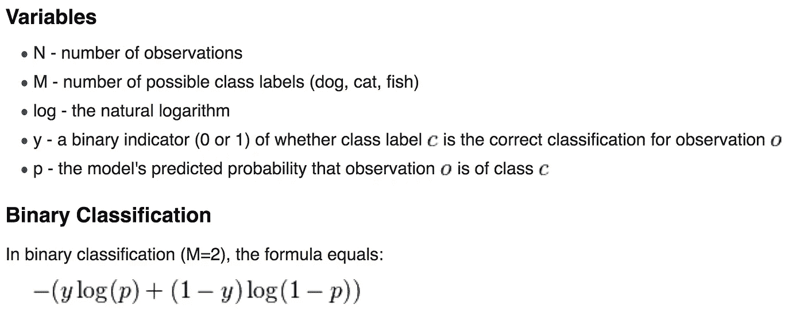

来源: [Stackoverflow](https://stackoverflow.com/questions/58776695/how-to-calculate-the-log-loss-metric-in-scala-spark)

**多类分类的测井损失:**

考虑，N 个样本属于 M 类。在哪里，

y_ij 表示样本 I 是否属于类 j

p_ij 表示样本 I 属于类 j 的概率

## 它是如何工作的？

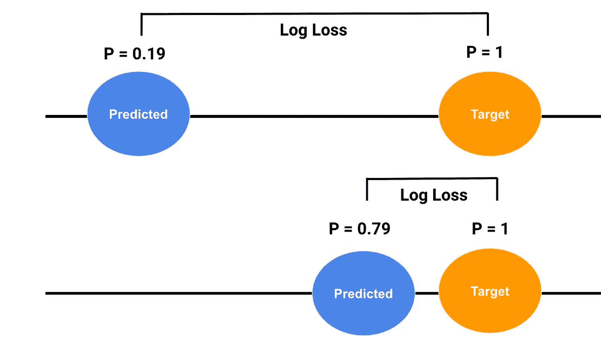

[来源](https://emilyswebber.github.io/LogLoss/)

上图是实际(目标)和预测的概率。

*   上图描绘了一个糟糕的预测，因为实际概率和预测概率之间的巨大差异给我们带来了巨大的对数损失。在这里，函数惩罚模型确信的错误答案。
*   下图描绘了一个很好的预测，因为预测的概率接近实际概率，这给了我们一个小的对数损失。这里，该函数奖励模型确信的正确答案。

对数损失没有上限，它存在于范围[0，∞)内。最小化日志损失为分类器提供了更高的准确性。

这里，我们有一个日志丢失的 scikit-learn 实现:

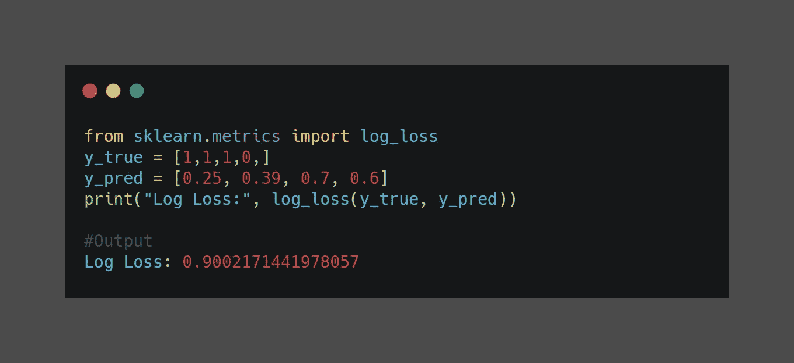

计算日志损失

# 混淆矩阵:

混淆矩阵或错误矩阵是一个表格，它显示了与测试集中的实际分类相比，模型做出的正确和错误预测的数量，或者正在出现的错误类型。

此矩阵描述了分类模型对真实值已知的测试数据的性能。它是一个 n*n 矩阵，其中 n 是类的数量。这个矩阵可以在对测试数据进行预测之后生成。

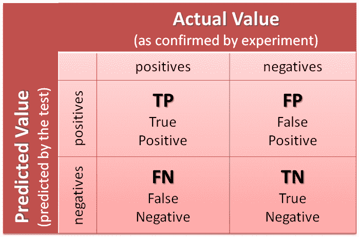

来源:[alearningday](https://alearningaday.blog/2016/09/14/confusion-matrix/)

这里，列表示测试数据中实际分类的计数，而行表示模型预测分类的计数。

> 让我们以一个分类问题为例，我们预测一个人是否患有糖尿病。让我们给目标变量一个标签:
> 
> **1:** 一个人有糖尿病| **0:** 一个人没有糖尿病

执行分类预测时，可能会出现四种结果:

*   **真阳性(TP):** 实际阳性和预测阳性的结果数。

例如:在这种情况下，一个人实际上患有糖尿病(1)，而模型预测此人患有糖尿病(1)。

*   **真阴性(TN):** 实际阴性和预测阴性的结果数。

例如:在这种情况下，一个人实际上没有糖尿病(0)，而模型预测这个人没有糖尿病(0)。

*   **假阳性(FP):** 实际为阴性但预测为阳性的结果数。这些错误也被称为**1 型错误。**

例如:在这种情况下，一个人实际上没有糖尿病(0)，但模型预测此人患有糖尿病(1)。

*   **假阴性(FN):** 实际阳性但预测为阴性的结果数。这些错误也被称为**类型 2 错误。**

例如:在这种情况下，一个人实际上患有糖尿病(1)，但模型预测此人没有糖尿病(0)。

正反指的是预测本身。真假是指预测的正确性。

这里，我们有一个混淆矩阵的 scikit-learn 实现:

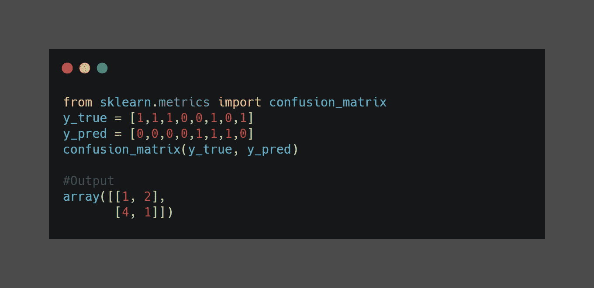

计算混淆矩阵

> 来自 Scikit-learn 官方文档:
> 
> 对角线元素表示预测标签等于真实标签的点的数量，而非对角线元素是那些被分类器错误标记的点。混淆矩阵的对角线值越高越好，表明有许多正确的预测。

## 我们可以从混淆矩阵中得到 4 个分类指标:

## 1.)精度:

也可以根据二元分类的正和负来计算:

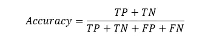

它没有给我们太多关于假阳性和假阴性分布的信息。

这里是一个 scikit-learn 实现的准确度分数:

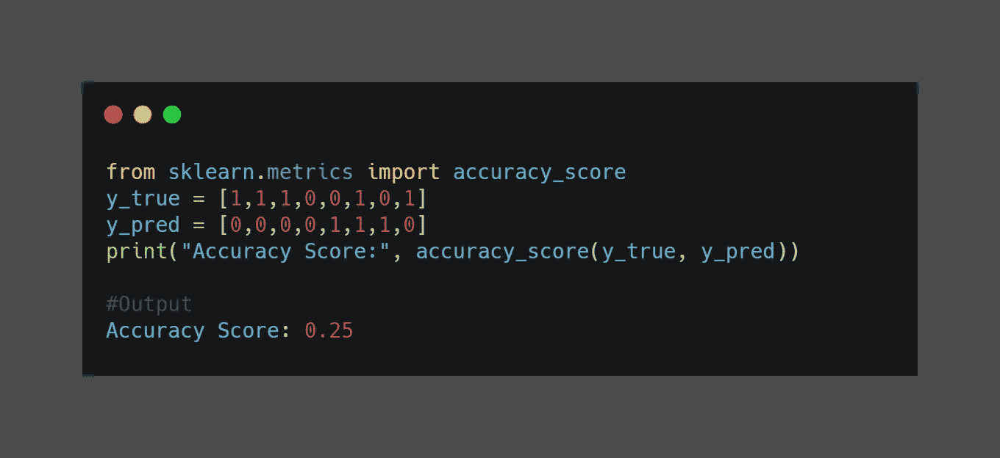

计算准确度分数

## 2.)精度或阳性预测值(PPV):

它是真阳性与模型预测的所有阳性的比率。这对于倾斜和不平衡的数据集非常有用。模型预测的假阳性越多，精确度就越低。

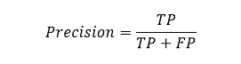

例如，我们对 20 名患者进行了医学测试，测试发现其中 8 人患有该疾病。在通过测试识别的 8 个中，5 个实际上患有该疾病(真阳性)，而另外 3 个没有(假阳性)。我们后来发现，该测试遗漏了另外 4 名被证明患有该疾病的患者(假阴性)。

这些值是 TP=5，FP=3，FN=4，TN=8。

精度= 5/5+3 = 0.625

这是一个 scikit-learn 实现的 Precision:

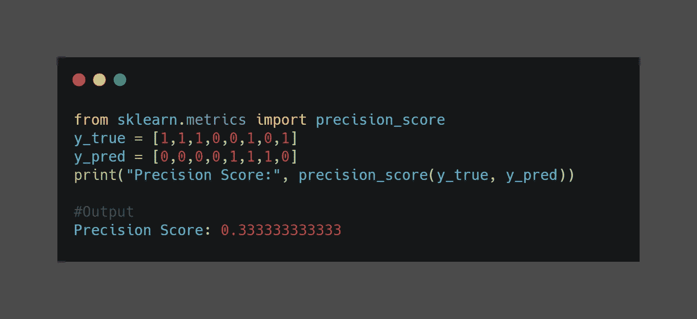

计算精确度分数

## 3.)回忆或敏感度或真阳性率(TPR):

它是真阳性与数据集中所有阳性的比率。它测量模型检测阳性样本的能力。模型预测的假阴性越多，召回率就越低。

根据前面的精度示例，值为 TP=5，FP=3，FN=4，TN=8。

回忆= 5/5+4 = 0.56

下面是一个 scikit-learn 实现的回忆:

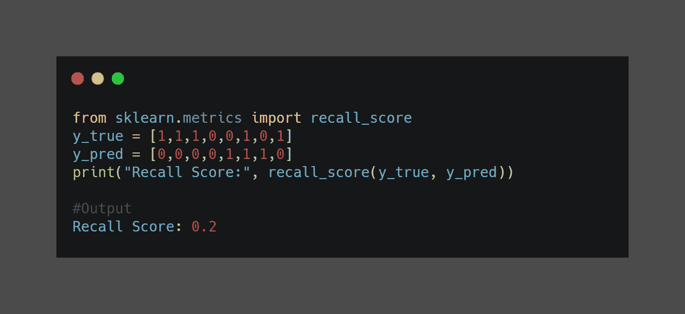

计算召回分数

*   精度考虑了阳性和阴性样本的分类方式，但召回在其计算中仅考虑阳性样本。换句话说，精确度依赖于负样本和正样本，但是召回率仅依赖于正样本(并且独立于负样本)。
*   精度考虑样本何时被分类为*阳性*，但不关心正确分类*所有*阳性样本。召回关心的是正确分类*所有*阳性样本，但不关心一个阴性样本是否被分类为阳性。

## 4.)F1-得分或 F-测量:

这是一个结合了精确度和召回率的单一指标。F1 分数越高，我们模型的性能越好。F1 分数的范围是[0，1]。

F1 分数是精确度和召回率的加权平均值。只有在精确度和召回率都很高的情况下，分类器才会得到高 F 值。该指标只支持具有相似精度和召回率的分类器。

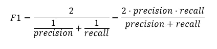

这是 F1 分数的 scikit-learn 实现:

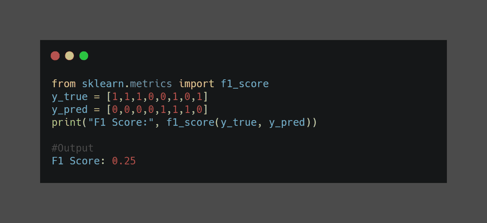

计算 f1 分数

## 特例:因子为β的 F 分数

F1 分数是总体 F 分数的一般化情况。总体 F 分数有一个因子β，它定义了精确度/召回率对评估的影响程度:

*   β < 1: Precision oriented evaluation
*   β > 1:面向回忆的评价

F1 分数是一个广义的情况，其中β是 1，意味着精确度和召回率是平衡的。

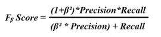

下面是 F-beta 分数的 scikit-learn 实现:

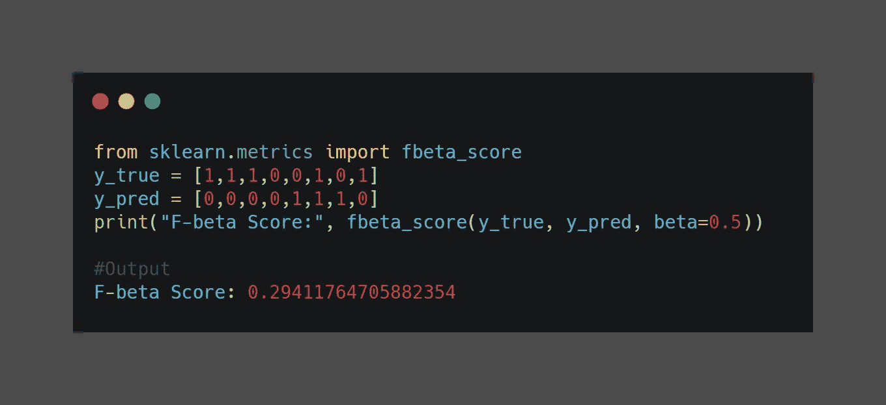

计算 fbeta 分数

# ROC 曲线:

**ROC 曲线(接收器操作特性曲线)**是示出分类模型的性能的曲线图。对于我们的预测模型，这是一种使用不同的决策阈值(用于决定预测是标记为“真”还是“假”的阈值)来可视化真阳性率(TPR)和假阳性率(FPR)之间的权衡的方法。

该阈值用于控制 TPR 和 FPR 之间的权衡。提高阈值通常会提高精确度，但会降低召回率。

首先，让我们看看 TPR 和 FPR:-

*   **真阳性率(TPR /灵敏度/召回率):**真阳性率对应于所有阳性数据点中被正确认为是阳性的阳性数据点的比例。

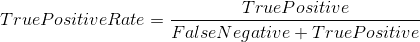

*   **假阳性率(FPR):** 假阳性率对应于所有阴性数据点中被误认为阳性的阴性数据点的比例。

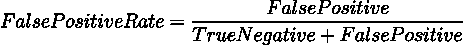

它们都具有在[0，1]范围内的值，这些值是在不同的阈值下计算的。

> 完美的分类器将具有高的真阳性率值和低的假阳性率值。

下面是代表更精确模型的 ROC 曲线:

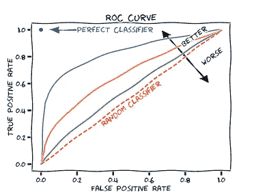

来源:[维基百科](https://en.wikipedia.org/wiki/Receiver_operating_characteristic)

*   任何 ROC 曲线在随机猜测分类器线上的模型都可以被认为是更好的模型。
*   任何 ROC 曲线低于随机猜测分类器线的模型都可以被断然拒绝。

该曲线绘制了不同分类阈值下的 TPR 和 FPR，但是这是低效的，因为我们必须在不同的阈值下评估我们的模型。有一种有效的基于排序的算法可以为我们提供这些信息，这就是 AUC。

下面是 ROC 曲线的 scikit-learn 实现:

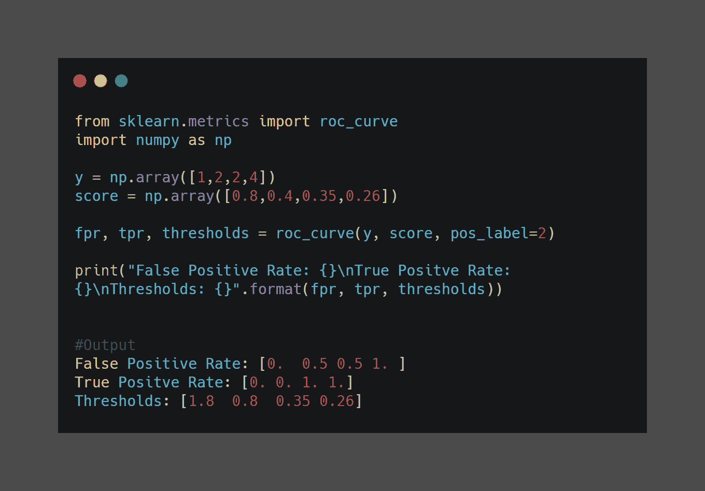

计算 ROC 曲线

# AUC:

一个 **AUC(曲线下面积)**或 ROC 曲线下面积，因此该术语是 roc_auc 的简称。

AUC 是一种通过使用单个数字来总结图表的指标。它用于二进制分类问题。

注意:AUC 是在曲线上给出点的函数。

> AUC 等于分类器对随机正例的排序高于随机负例的概率。

以下是 AUC 的 scikit-learn 实现:

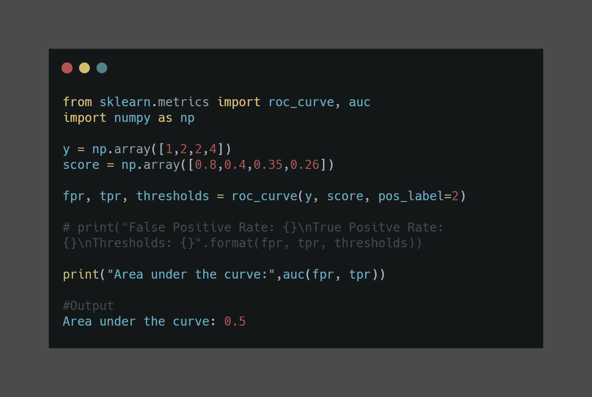

计算 AUC

AUC 有助于比较不同的模型，因为它总结了整个 ROC 曲线的数据。AUC 的范围是[0，1]。值越大，我们模型的性能越好。

# 结论

在这篇文章中，我们学到了很多东西。我们了解到，准确性只是模型性能的一部分，尤其是当数据不平衡或误报影响较大时，反之亦然。我们讨论了其他一些被广泛使用的通用指标。

查看 scikit-learn 官方文档，了解本文未涉及的其他指标。

sci kit-learn:[https://sci kit-learn . org/stable/modules/model _ evaluation . html # class ification-metrics](https://scikit-learn.org/stable/modules/model_evaluation.html#classification-metrics)