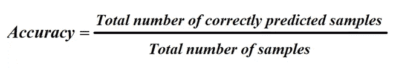
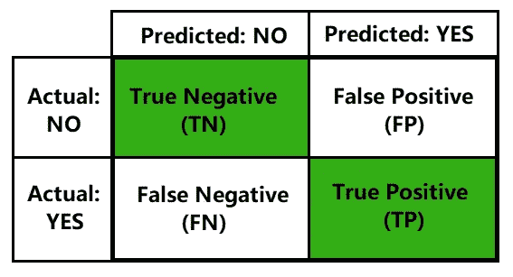
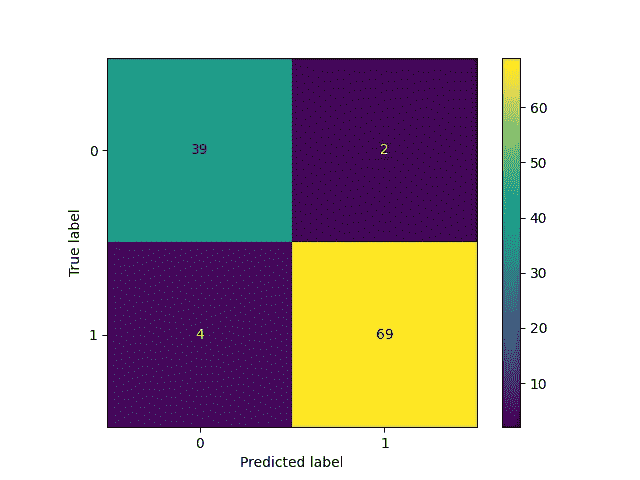
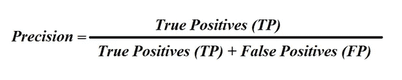
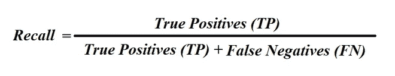
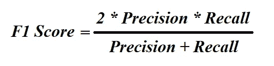
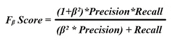
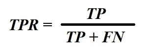
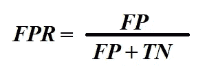
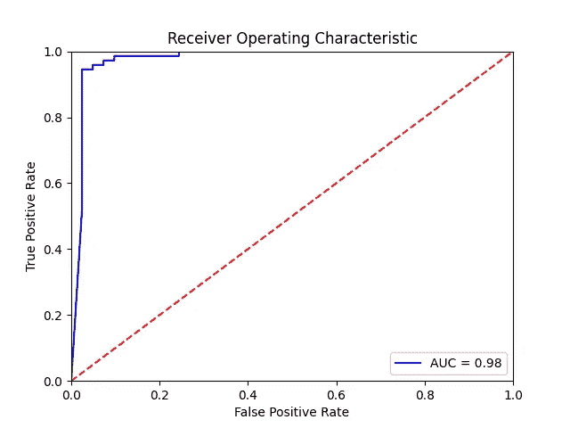

# Python 中实现的分类问题的评估指标

> 原文：<https://medium.com/analytics-vidhya/evaluation-metrics-for-classification-problems-with-implementation-in-python-a20193b4f2c3?source=collection_archive---------0----------------------->

*本文重点介绍了用于分类问题的所有最常用的评估指标，以及应根据数据使用的指标类型，并提供了一个乳腺癌数据集演示。*


分类是一种监督学习技术，涉及预测给定输入数据的类别标签。在分类问题中，我们理解问题，探索数据，处理数据，然后使用机器学习算法或深度学习技术建立分类模型。在机器学习或深度学习的情况下，测试模型总是最佳实践。通过评估模型，我们可以测量模型的质量，并且可以看到我们的模型在用例方面做得有多好。

*   准确(性)
*   混淆矩阵
*   精确
*   回忆
*   F1 分数
*   AUC-ROC 曲线

让我们考虑乳腺癌数据集，并尝试理解基于为乳腺癌预测建立的分类器的度量。

# 准确(性)

分类器的精度计算为正确预测的样本总数与样本总数之比。



精确度公式

当数据集是平衡数据集时，可以使用准确度度量来评估分类器。当数据集不平衡时，不应使用准确性指标。让我们考虑具有两个目标类别的数据集，包含 100 个样本，其中 95 个样本属于类别 1，5 个样本属于类别 2。当我们尝试为上述数据集构建分类器时，该分类器将偏向于类别 1，并将导致预测所有样本为类别 1 样本。这将导致 95%的准确率，这是错误的。为了避免这种错误，准确性指标应该只用于平衡数据集。

现在让我们看看代码，以获得分类器的准确性:

```
Output:
Accuracy of the classifier is: 0.9473684210526315
```

# 混淆矩阵

混淆矩阵是一个 N 维方阵，其中 *N* 表示目标类别或分类的总数。当数据集不平衡时，混淆矩阵可用于评估分类器。让我们考虑一个二元分类问题，即目标类别的数量是 2。具有两个目标类别(比如“是”和“否”)的典型混淆矩阵如下所示:



*混乱矩阵*

**混淆矩阵中有四个重要术语**

1.  **真阳性(TP):** 这些是预测的“是”实际上属于类“是”的情况。
2.  **真否定(TN):** 这些是预测的“不”实际上属于类别“不”的情况。
3.  **假阳性(FP):** 这些是预测的“是”实际上属于类别“否”的情况。
4.  **假阴性(FN):** 这些是预测的“否”实际上属于类别“是”的情况。

现在让我们看看代码，为我们的乳腺癌分类器生成和绘制混淆矩阵。

```
Output:
[[39  2]
 [ 4 69]]
```



乳腺癌分类器的混淆矩阵

从上面的混淆矩阵中可以看出:

*   **真阳性(TP):** 69
*   **误报(FP):** 2
*   **真底片(TN):** 39
*   **假阴性(FN):** 4

可以使用下面的公式从混淆中计算分类器的准确度:

***准确度=(TP+TN)/(TP+FP+TN+FN)***

我们的分类器的准确率是:(69+39) / (69+39+2+4) = 0.947 = 94.7%

# 精确度(或阳性预测值)

精度是真阳性(TP)与真阳性(TP)和假阳性(FP)之和的比率。



精确公式

让我们考虑一个具有两个目标类(比如正和负)的数据集，然后 precision 告诉我们，在所有预测的正值中，有多少实际上是正的。精度应该基于用例来使用。以垃圾邮件检测为例。如果我们的模型检测到一封邮件是垃圾邮件，而它实际上不是垃圾邮件，那么用户可能会错过一封重要的邮件，也就是说，这里应该减少误报。因此，在这个用例中，我们需要使用精度作为度量来衡量我们的分类器的质量。

现在让我们来看看计算乳腺癌分类器的精度分数的代码:

```
Output:
Precision Score of the classifier is: 0.971830985915493
```

# 回忆(或敏感度或真阳性率)

召回率是真阳性(TP)与真阳性(TP)和假阴性(FN)之和的比率。



回忆公式

让我们考虑一个有两个目标类(比如正类和负类)的数据集，然后回忆告诉我们，在总的实际负值中，我们的分类器负面预测了多少。与 precision 类似，recall 也应该基于用例来使用。举一个癌症预测的例子。考虑这样一个人，他实际上患有癌症，但我们的分类器预测他为非癌症患者，这可能导致对他的虐待，也就是说，在这里应该减少假阴性。因此，在这种情况下，我们需要使用召回作为度量来衡量我们的分类器的质量。

现在让我们来看看计算乳腺癌分类器召回分数的代码:

```
Output:
Recall Score of the classifier is: 0.9452054794520548
```

# F1 分数

当精确度和召回率对用例都很重要时，应该使用 F1 分数。F1 分数是精确度和召回率的调和平均值。它位于[0，1]之间。



F1 分数

F1 分数来源于 Fβ分数。F Beta 分数是精确度和召回率的加权调和平均值。



Fᵦ分数

*   如果假阳性(FP)和假阴性(FN)都很重要，那么β = 1。
*   如果假阳性(FP)很重要，那么β介于 0 和 1 之间。
*   如果假阴性(FN)很重要，那么β > 1。

现在让我们来看看计算乳腺癌分类器 f1 分数的代码:

```
Output:
F1 Score of the classifier is: 0.9583333333333334
```

# AUC-ROC 曲线

AUC-ROC 曲线是用于测量分类模型在不同阈值下的性能的性能度量。ROC 是受试者工作特征曲线，AUC 是曲线下面积。AUC(曲线下面积)的值越高，我们的分类器在预测类别时就越好。AUC-ROC 主要用于二元分类问题。

ROC 曲线绘制在真阳性率(TPR)和假阳性率(FPR)之间，即 TPR 在 y 轴上，FPR 在 x 轴上。AUC 是 ROC 曲线下的面积。优秀的分类器的 AUC 值接近 1，而表现不佳的分类器的 AOC 值接近 0。AOC 分数为 0.5 的分类器没有任何类别分离能力。



真实阳性率



假阳性率

现在让我们来看看计算和绘制乳腺癌分类器 ROC AUC 的代码:

```
Output:
AUC of the classifier is: 0.9769462078182426
```



ROC AUC

> 如果你喜欢这篇文章，请跟我来。如果您发现公式、代码或内容中有任何错误，请告诉我。
> 
> 你可以在 [LinkedIn](https://www.linkedin.com/in/venugopalkadamba) ， [GitHub](https://github.com/venugopalkadamba) 找到我

[](https://www.linkedin.com/in/venugopalkadamba) [## Venu Gopal Kadamba | LinkedIn

### 在世界上最大的职业社区 LinkedIn 上查看 Venu Gopal Kadamba 的个人资料。Venu Gopal 列出了 3 项工作…

www.linkedin.com](https://www.linkedin.com/in/venugopalkadamba) [](https://github.com/venugopalkadamba) [## venugopalkadamba - Github

### 学生👨‍🎓和 Python 程序员。venugopalkadamba 有 21 个存储库。在 GitHub 上关注他们的代码。

github.com](https://github.com/venugopalkadamba)