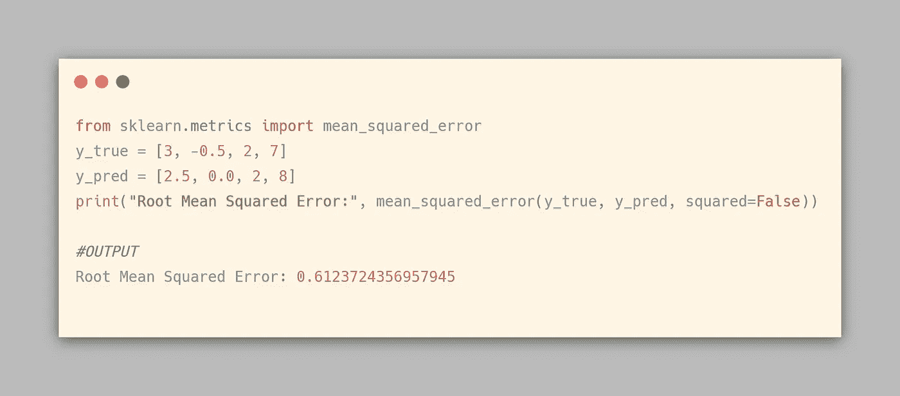

# 回归模型的评估标准

> 原文：<https://medium.com/analytics-vidhya/evaluation-metrics-for-regression-models-c91c65d73af?source=collection_archive---------3----------------------->

## 用于评估模型性能的最广泛使用的回归指标

安妮·尼加德在 [Unsplash](https://unsplash.com?utm_source=medium&utm_medium=referral) 上拍摄的照片

[在我之前的文章](/analytics-vidhya/evaluation-metrics-for-classification-models-e2f0d8009d69)中，我谈到了分类模型中用于评估的各种度量标准。在本文中，我将讨论我们在回归模型中使用的一些度量标准。

在分类中，我们的模型预测类别标签，而我们的模型预测回归中的数值。在回归中，我们不能用分类精度来评价我们的模型。有专为回归模型设计的误差指标。我们将在本文中进行更多讨论。

那我们开始吧…

# 介绍

回归是这样一个问题，我们试图用一组自变量来预测一个连续的因变量。比如天气预报，市场趋势等。这些问题用来回答“多少？”或者“有多少？”

在回归问题中，预测误差用于定义模型性能。预测误差也被称为残差，它被定义为实际值和预测值之间的差异。

[来源](http://www.shodor.org/interactivate/discussions/FindingResiduals/)

回归模型试图拟合一条线，使预测值和实际值(测量值)之间的差异最小。

确定模型质量时，残差很重要。您可以根据残差的大小和/或它们是否形成一种模式来检查残差。

*   当残差都为 0 时，模型预测完全正确。残差离 0 越远，模型越不精确。
*   当平均残差不为 0 时，这意味着模型是有系统性偏差的(即，一贯预测过度或预测不足)。
*   当残差包含模式时，这意味着模型在质量上是错误的，因为它无法解释数据的某些属性。

**残差=实际值—预测值**

*错误(e)* = *y* — *ŷ*

> **所以，问题是当你有残差时，为什么我们需要不同的指标？让我们找出答案...**

我们可以计算数据集中每个点的残差，这些残差中的每一个都将在评估中有用。

来源:[显示器](https://www.displayr.com/learn-what-are-residuals/)

残差=通货膨胀—预测

我们可以从技术上检查所有残差，以判断模型的准确性，但如果我们有数千或数百万个数据点，这就不成比例了。这就是为什么我们有汇总测量，将我们收集的残差压缩成一个代表我们模型预测能力的*值。*

现在，我们将把注意力转向模型的指标。

# 回归评估指标:

在这一节中，我们将仔细看看回归模型的流行指标。

## 平均绝对误差(MAE):

它是实际值和模型预测值之间的绝对差值的平均值。

**平均绝对误差**

在哪里，

**N** =数据点总数

**Yi** =实际值

**ŷi**=预测值

如果我们不取绝对值，那么负的差将抵消正的差，求和时我们将得到一个零。

> 较小的 MAE 表示该模型在预测方面非常出色，而较大的 MAE 表示您的模型在某些方面可能有问题。MAE 为 0 意味着您的模型是输出的完美预测器。

下面是 MAE 的 Scikit-learn 实现:

绝对平均误差

平均绝对误差(MAE)与原始数据具有相同的单位，并且它只能在以相同单位测量误差的模型之间进行比较。

MAE 越大，错误越严重。它对异常值是鲁棒的。因此，通过取绝对值，MAE 可以处理异常值

在这里，一个大的错误不会压倒许多小的错误，因此输出为我们提供了一个关于模型如何执行的相对公正的理解。因此，它未能惩罚较大的误差项。

MAE 是不可微的，所以我们必须应用各种优化器，如梯度下降，它可以是可微的。

## 均方差(MSE):

它是实际值和预测值之差的平均值。

值越低，回归模型越好。

**均方误差**

在哪里，

**n** =数据点总数

**yi** =实际值

**ŷi** =预测值

它的单位是变量单位的平方。

下面是 MSE 的 Scikit-learn 实现:

均方误差

> 如果数据集中有异常值，那么它对异常值的惩罚最大，计算出的 MSE 更大。因此，简而言之，它对异常值不稳健，而异常值在 MAE 中是一个优势。

MSE 使用平方运算来消除每个误差值的符号，并惩罚较大的误差。

当我们取误差的平方时，较大误差的影响变得比较小误差更明显，因此模型现在可以更多地关注较大误差。

这不是那么有用的主要原因是，如果我们做出一个非常糟糕的预测，平方将使误差更糟，它可能会使指标偏向高估模型的糟糕程度。

另一方面，如果所有的误差都很小，或者说，小于 1，那么我们可能低估了模型的坏。

## 均方根误差(RMSE):

它是实际值和预测值之间的平均均方根差。通过求 MSE 的平方根，我们得到均方根误差。

我们希望 RMSE 值尽可能低，RMSE 值越低，模型的预测就越好。较高的 RMSE 表明预测值和实际值之间存在较大偏差。

**均方根误差**

在哪里，

**n** =数据点总数

**yj** =实际值

**ŷj** =预测值

下面是 RMSE 的 Scikit-learn 实现:

**均方根误差**

## 最大误差:

虽然 RMSE 是最常见的指标，但它可能很难解释。一种替代方法是查看绝对百分比误差分布的分位数。最大误差度量是预测值和真实值之间的最坏情况**误差。**

下面是 Max Error 的 Scikit-learn 实现:

**最大误差**

## r 得分，决定系数:

r 平方解释了一个变量的方差在多大程度上解释了第二个变量的方差。换句话说，它衡量自变量解释的因变量方差的比例。

r 平方是一个用于识别模型准确性的流行指标。它表明数据点与回归算法生成的拟合线有多接近。更大的 R 平方值表示更好的拟合。这有助于我们找到自变量与因变量之间的关系。

> r 评分范围从 0 到 1。R 越接近 1，回归模型越好。如果 R 等于 0，则该模型并不比随机模型表现得更好。如果 R 为负，则回归模型是错误的。

它是平方和与总平方和的比值

**R2 得分**

其中 **SSE** 是实际值和预测值之差的平方和

**误差平方和**

并且， **SST** 是实际值与实际值均值之差的平方和总和。

**总平方和**

这里， **yi** 为观测目标值， **ŷi** 为预测值，**t5】y-bar**为平均值， ***m*** 表示观测总数。

当我们在数据中添加新特征时，R2 分数开始增加或保持不变，但从不减少，因为它假设当添加更多数据时，数据的方差增加。

但问题是，当我们在数据集中添加不相关的要素时，R2 有时会开始增加，这是不正确的。

下面是 R2 分数的 Scikit-learn 实现:

**R2 得分**

R2 描述了由回归模型解释的因变量的方差的比例。如果回归模型是“完美的”，上证指数是 0，R2 指数是 1。如果回归模型完全失败，上证综指等于 SST，回归解释不了任何方差，R2 为零。

## 调整后的 R 平方:

**调整后的 R** 与标准 R 相同，除了它在添加额外功能时惩罚模型。

为了解决 r-square 所面临的问题，调整的 R-square 不利于增加更多的独立变量，而这些变量并没有增加回归模型的解释能力。

调整后的 r 平方值总是小于或等于 r 平方值。

范围从 0 到 1，值越接近 1 越好。

它衡量的是仅由实际影响因变量的自变量解释的变化。

**调整后的 R 平方**

在哪里

**n** 是数据点的数量

**k** 是模型中自变量的个数

## 结论:

在本文中，我们讨论了几个重要的回归评估指标。根据具体情况，一些指标可能比其他指标更相关。

在所有情况下，目标都是估计预测模型和实际值之间的距离。关键是要对这些指标有一个微妙的理解，以便充分地使用它们。

更多度量标准我推荐 Scikit-learn 官方文档:[https://Scikit-learn . org/stable/modules/model _ evaluation . html # regression-metrics](https://scikit-learn.org/stable/modules/model_evaluation.html#regression-metrics)