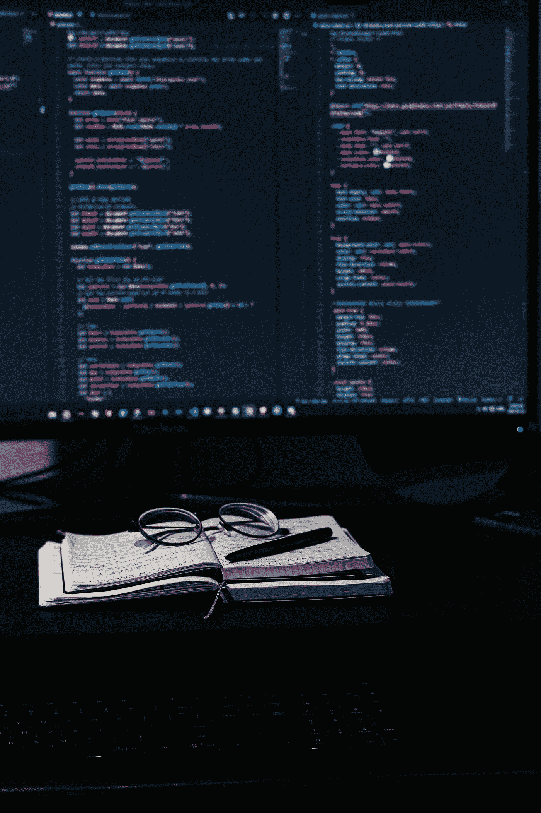

# 每个聪明的 Python 程序员都应该知道这些

> 原文：<https://medium.com/analytics-vidhya/every-smart-python-programmer-should-know-these-c19930f3055d?source=collection_archive---------1----------------------->

## Python 中能让你成为聪明的 Python 程序员的 20 大技巧

好的程序员和聪明的程序员的区别是什么？显然，程序员的表现方式。在这篇文章中，我们将看到一些可以在 Python 中使用的技巧。这些可以让我们看起来比一个优秀的 Python 程序员更聪明。

凯文·卡纳斯在 [Unsplash](https://unsplash.com?utm_source=medium&utm_medium=referral) 上的照片