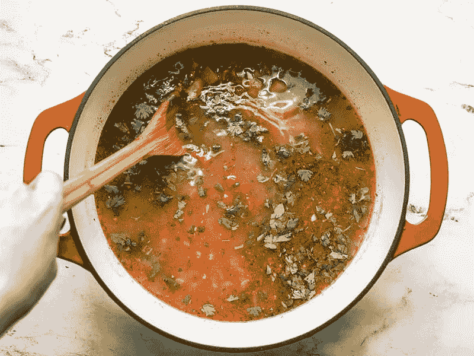

# 每个人都是数据科学家(定性的)，现实生活中的例子可以证明这一点

> 原文：<https://medium.com/analytics-vidhya/everyone-is-a-data-scientist-qualitatively-and-real-life-examples-to-prove-it-f7486c869b3c?source=collection_archive---------21----------------------->

让我解释一下。我正在读这本关于“大数据”和互联网的书，这是我在奥斯汀机场的一家便利店随便买的。

这本书的名字是*，作者是**塞斯·斯蒂芬斯-达维多维茨**，书中深入探讨了几个真正有趣的主题，主要围绕数据科学、互联网和人类心理学。*

*在本书的前几章中，作者提供了一些有见地的例子，说明人们是如何根据以前的经历来做日常决定的。其中一个例子涉及提交人的祖母。*

*他谈到他的祖母是如何帮助他选择合适的约会对象的。每次他带人回家吃饭或聚会，大多数家庭成员都会给他错误的建议，而他的祖母会准确地预测那个人是否与他合得来(二元分类)。*

**

*这种直觉完全基于她对作者的习惯、偏好、态度以及之前约会经历(训练数据)的熟悉程度。*

*虽然它不是基于真实数据的定量决策，但它是基于经验的定性决策，并大量借鉴真实数据科学概念。因此，这个例子**启发我将常见的现实生活中的例子映射到实际的数据科学技术**，或许可以帮助人们更直观地理解这些概念。*

*开始了。*

## *在 Spotify 上创建不同的播放列表——主题建模或聚类*

*这第一首真的引起了我个人的共鸣，因为我很小心地将我喜欢的歌曲放入有意义的类别中。然后，我可以根据我的心情播放特定播放列表中的歌曲，而不必花太多精力挑选每首歌曲。*

**

*我本质上做的是 [*主题建模*](https://towardsdatascience.com/topic-modeling-and-latent-dirichlet-allocation-in-python-9bf156893c24) 或者 [*聚类*](https://en.wikipedia.org/wiki/Cluster_analysis) 。我正在听歌，挑选出不同的属性(特征)并基于这些属性，**将具有相似属性的歌曲归入一组**。结果，我们得到了几个具有不同特征的组(主题/集群/播放列表)。*

## *品尝食物前先搅拌一下锅——随机抽样*

*厨师们通常会品尝他们正在制作的食物，以确保每样东西的味道都符合预期。然而，人们不能简单地拿起任何近在咫尺的东西。食物需要混合或搅拌，以便不同的成分混合在一起。*

*这使得配料在各处的分布更加一致，从而在品尝过程中更好地概括整个菜肴。*

**

*随机抽样的工作方式是一样的。为了防止诸如 [*便利偏差*](https://en.wikipedia.org/wiki/Convenience_sampling) 之类的偏差悄悄进入，确保抽样是随机进行的非常重要，这样可以更好地概括总体(食物)。*

## *在杂货店采摘新鲜鳄梨—异常检测*

*大多数鳄梨爱好者(比如我)需要在杂货店里用身体去感受它，以判断它的新鲜程度。不能太硬也不能太熟，必须恰到好处。这种完美的新鲜本质上代表了鳄梨的预期价值。*

**

*如果一个鳄梨比预期的更软或更硬，它将被识别为异常值或异常值。因此，我们会拒绝它，并继续下一个。*

## *决定是亲自去办公室还是远程工作——二元分类*

*同样，这个例子很容易理解。如果你像我一样，可以选择在隔离期间亲自去办公室，那么每天都要考虑是否可以远程工作，或者是否需要做好去办公室的准备。*

**

*在这种情况下，人们需要查看当天工作的不同方面，例如:*

*   *我需要使用办公室才有的设备或工具吗？*
*   *我打算在外面吃午餐吗？*
*   *我需要在工作时运送物品吗？*
*   *我必须在家才能收到重要的货物吗？*

*上述示例用作特征，**我们使用隔离期间前几个工作日的经验作为训练数据**。然后我们每天做一个预测。*

## *为朋友调制鸡尾酒——A/B 测试*

*假设你在一个派对上，被分配了调酒的任务。你决定尝试为每个人制作莫斯科骡子，但不太确定原料是什么或应该遵循什么步骤。你很快找到一份食谱，然后变出一批骡子。*

*然而，你也遇到了第二个食谱，它建议比第一个多加些石灰。出于好奇，你继续用新配方做了另一批。*

**

*然后你给不同的人服用这两批药物，并试图判断他们会有什么反应。原来，在参加聚会的 25 人中，有 15 人喜欢第二批，而只有 10 人喜欢第一批。从这些数据中，你可以清楚地看到，第三批应该是有额外石灰的那一批。这里的**关键是只改变一个变量，观察结果的差异**。这是 [A/B 测试](https://en.wikipedia.org/wiki/A/B_testing)的基础。*

*在真实的定量分析中，需要为每个版本的解决方案收集更大的数据样本，并且需要使用统计推断技术，如[假设检验](https://en.wikipedia.org/wiki/Statistical_hypothesis_testing)，以确定两个批次之间的结果差异是否具有统计学意义。*

## *手动标记照片中的朋友—图像分类*

*这实际上不是最好的例子，因为大多数使用图片的应用程序已经实现了这项技术，可以根据面部特征自动标记人。深度学习技术，例如使用 [*卷积神经网络(CNN)*](https://en.wikipedia.org/wiki/Convolutional_neural_network) 算法的图像分类，被广泛用于该应用。*

**

*然而，如果我们考虑算法不能识别某些人的边缘情况，如果你识别了他们，你仍然可以手动标记他们。**你对正确标记人的直觉是基于你大脑中储存的数千张人脸图片(训练数据)**的广博知识。*

## *阅读 Twitter 帖子上的评论——情绪分析*

*通常在 Twitter 或任何社交媒体平台上发布一些东西后，看看人们可能会发表什么评论是很有趣的。来自朋友、家人甚至某个完全随机的人的鼓励性评论往往会让你精神振奋，而负面评论可能会让你想知道帖子中的什么让他们心烦意乱。*

*无论如何，**我们很快就能从评论中找到线索，知道他们表达了什么样的情绪**，比如喜悦、愤怒、异议、娱乐、好奇等等。*

**

*[*情感分析*](https://en.wikipedia.org/wiki/Sentiment_analysis) 是自然语言处理(NLP)最广泛使用的应用之一，它通过摄取大量文本来做同样的事情，这些文本通常来自在线来源，如 Twitter、Instagram、脸书、亚马逊评论、雅虎财经聊天室等。*

## *向朋友、家人和同事推荐节目或电影—推荐引擎*

*这可能是这篇文章列出的所有例子中最常见的一个。人们一直在谈论电影和电视剧，尤其是随着网飞、Hulu、亚马逊 Prime、HBO 和迪士尼等流媒体服务越来越受欢迎。*

*此外，朋友之间往往会定期互相推荐。家庭成员甚至工作中的同事也是如此。*

*今天，一种被称为 [*推荐引擎*](https://en.wikipedia.org/wiki/Recommender_system) 的机器学习算法被广泛用于在广泛的产品和服务中以自动化的方式做同样的事情。它部署在流媒体服务、电子商务平台、社交媒体平台和其他几个领域。*

**

*推荐引擎的**协同过滤**方法使用来自一群相似的人的对等信息，比如朋友、家庭成员、同事等等。，向用户推荐产品、电影、服务。**另一方面，基于内容的过滤**考虑了用户行为，如喜欢、购买、页面浏览、点击，以推荐相似的内容。*

## *检查点饮料的人的 id—回归*

*这是一个酒保检查人们的身份证以确保他们达到饮酒年龄的例子。在这个过程中，如果顾客明显在 21 岁以上，主人可能连身份证都不会要。然而，在顾客看起来相对年轻的情况下，可能需要检查。*

**

*不管结果如何，主人在这种情况下直觉上要做的是**根据面部特征、身高、行为、着装、说话方式等来估计顾客的年龄**。而且由于他/她是在试图预测一个连续变量(年龄)，所以本质上是一个回归问题。*

*这就是我们如何在日常生活中潜意识地使用数据科学和机器学习的 10 个例子。请在下面的评论中告诉我你还想到了哪些例子。希望你喜欢这篇文章！*

**原载于*[*http://thecraftofdata.com*](http://thecraftofdata.com/2021/02/everyone-is-a-data-scientist-qualitatively-and-real-life-examples-to-prove-it)*。**