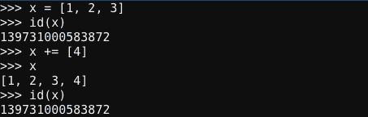

# 在 Python 中，一切都是对象

> 原文：<https://medium.com/analytics-vidhya/everything-is-an-object-in-python-c1bc01a4a15b?source=collection_archive---------3----------------------->


现在是时候谈谈编程中最常用的语言之一，也是由于其简单的语法而最容易学习的语言之一。这篇文章的内容是技术性的，因为我将分享这种语言是如何工作的。Python 的流行不仅仅是因为它简单的语法，还因为它令人难以置信的广泛的使用可能性，存在大量的模块，可以在你能想象的任何开发领域工作，甚至是视频游戏！

# Python 中面向对象范例的简要介绍

首先，Python 是一种面向对象编程(OOP)语言，这意味着它的整个结构围绕着面向对象的范例。这种范式基于“对象”的概念，对象可以包含数据和函数:字段形式的数据(通常称为属性)和过程形式的函数(通常称为方法)。在这种范式下制作的程序是通过将它们从相互交互的对象中制作出来而设计的。除了 python 之外，许多其他语言都使用它们。所以让 python 从其他语言中脱颖而出的是，一切都被认为是对象。我们请求存储空间的每个数据类型都是一个对象。是的，这听起来很奇怪，但是对于 python 解释器来说，即使是整数也被认为是一个对象。

# Python 中的对象

一个对象通常被创建为具有可以修改其自身数据字段的方法(在 python 中这可以使用“self”)。这使得用户可以根据需要操纵对象。Python 是一种基于类的 OOP 语言，意味着对象是类的实例，这也决定了它们的类型。

在 Python 中要创建一个对象，我们需要创建一个类，这样我们的对象就可以从中实例化。我们可以把一个类看作具有相似特征的对象的模板，对象将继承它们。一旦我们声明了我们的类，我们就可以从中实例化一个对象。在 python 中，对象被认为是数据的抽象。Python 程序中的所有数据都由对象或它们之间的关系来表示。

每个对象都有标识、类型和值。对象的标识一旦被创建就永远不会改变；它是对象在内存中的地址。为了比较两个对象的身份，我们使用“is”操作符和 id“()”函数来获取表示身份的整数。

对象的类型决定了对象支持的操作(例如，“它有长度吗？”)并为该类型的对象定义了可能的值。' type()'函数返回对象的类型(即对象本身)。像它的身份一样，对象的类型也是不可改变的。它的类型由对象继承的类定义。例如，对象的类将是 str，int(或者我们创建的一个更复杂的类)，而 id 将给出对象在内存中的地址。


# 可变和不可变对象

对象的值的工作方式稍有不同。一些对象的值可以改变，而另一些不能。其值可以改变的对象被命名为可变的；而一旦被创建，其值就不可改变的对象被称为不可变的。这种可变性是由其类型决定的。数字、字符串和元组是不可变的，而列表、字典和集合是可变的。

对于后两种类型，我们可以自由地设置、取消设置和修改它的值，但是如果我们试图在不可变的类型上这样做，解释器会给出一个错误。

我们可以像这样用方括号'[ ]'定义一个列表:numbers = [1，2，3]。定义一个 tuple，我们只需要把括号替换成圆括号'( )'就像这样:numbers = (1，2，3)。在这两种数据类型中，我们都可以通过索引来访问元素，并且可以对它们进行迭代。主要区别在于元组一旦定义就不能更改。

然而，如果我们想扩展这两种数据类型，我们可以两者都用。但是会发生一件稍微不同的事情。为了做到这一点，我们使用“+=”操作符。让我们看看下图中的例子，“x”是一个列表，“y”是一个元组。我们开始定义它们，然后扩展它们的价值。如果我们特别注意 id 号，我们可以看到，当我们给元组赋值时，它的 id 号会发生变化。现在，由于元组的不变性，它是一个不同的对象。



当我们试图改变其他不可变对象类型的值时，比如数字(int 和 floats)和字符串，也会发生同样的事情。它的 id 号将会改变，它将是一个不同的对象，但它仍然指向相同的值。Python 是用 C 语言构建的，所以处理这种底层数据的工作类似于处理指针，然而，python 为我们做了所有的工作。当我们改变一个不可变对象的值时，一个新的对象开始指向这个值。这就是为什么它的值不变而它的对象 id 却变了。

# Python 不可变函数参数

现在，让我们指定当这些数据作为函数的参数传递给时，Python 如何处理这种类型的数据。不可变对象像可变对象一样通过引用传递。

如果我们传递一个我们不能在内部改变的参数，函数就没那么有用了，所以神奇的事情发生了。由于不可变(不可改变)对象的状态，如果一个整数或字符串值在函数块内被改变，那么它的行为很像一个对象复制。创建功能块范围内的调用程序对象的本地新副本，以便在功能内操作。调用者对象将保持不变。因此，调用程序块不会注意到在函数块范围内对不可变对象所做的任何更改。下面的例子会更清楚。


*   原始对象整数“x”(不可变)被传递给函数“f_arg()”。
*   创建“x”的新的本地副本(“a”)以在被调用的函数中使用。因为整数是不可变的对象，不能被改变，所以函数创建一个重复的值，这样它就可以使用它。
*   “a”的值在函数内部被修改。将返回该值
*   a 的返回值存储在变量' y '中，它们将具有相同的 id，因此它们将指向同一个整数对象。

```
Output:id of a: 1456621360x: 10y: 11id of x: 1456621344id of y: 1456621360
```

# Python 可变函数参数

像字典和列表这样的可变对象也是通过引用传递的。假设一个可变对象的值在一个函数范围内被改变。因为是可变对象，所以无论传递的参数的名称是什么，值都会改变。在这种情况下，Python 不会像上一个示例那样将值复制到另一个对象。下图将阐明这一概念。


python 一开始是如何管理对象和值的，听起来有点混乱。然而，当你开始在一些程序中使用它时，你会很快习惯它，并且明白大多数关于语言如何工作的决定都是为了给开发者创造一个更直观的环境。Python 是一种很棒的编程语言，是每个开发人员的必学之作。