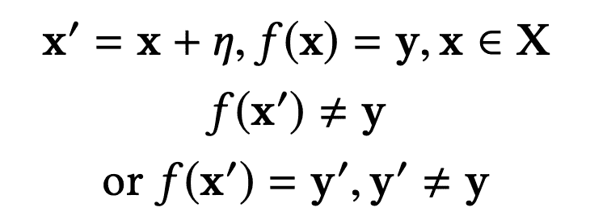
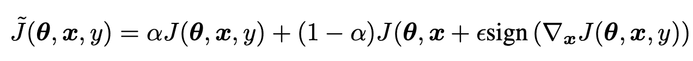
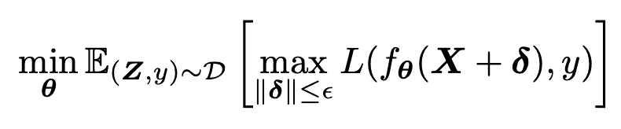
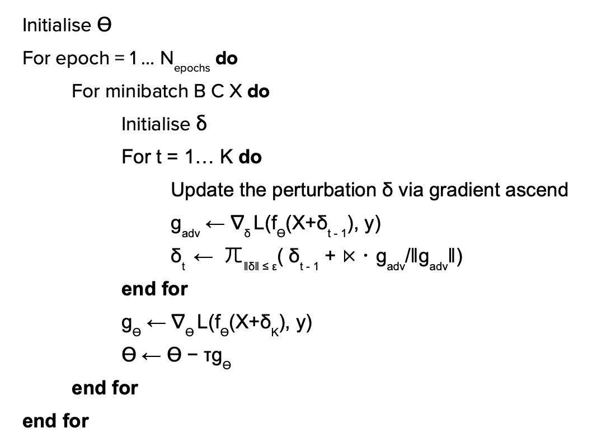
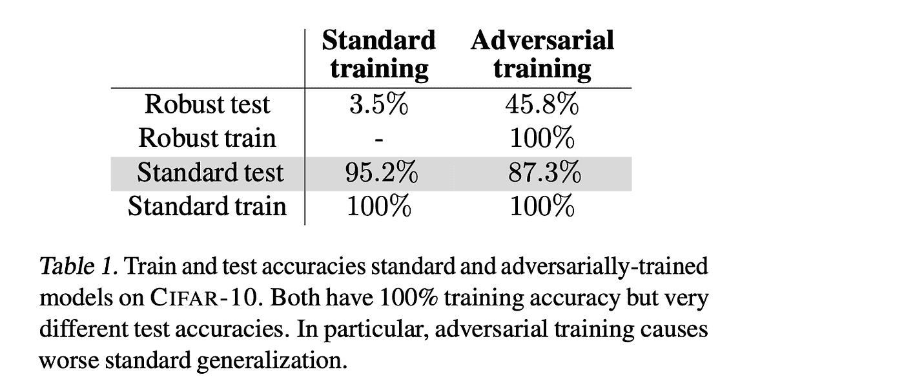
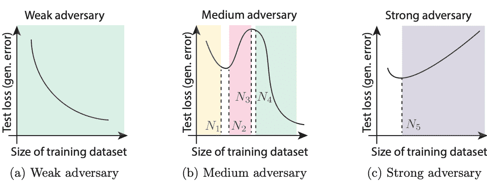

# 你需要知道的关于 NLP 中对抗性训练的一切

> 原文：<https://medium.com/analytics-vidhya/everything-you-need-to-know-about-adversarial-training-in-nlp-b249301b6229?source=collection_archive---------3----------------------->

# **简介**

对抗性训练是机器学习中一个相当新但非常令人兴奋的领域。自从 Christian Szegedy[1]在 2013 年首次引入对抗性例子以来，它们揭示了深度神经网络在正确分类对抗性扰动输入的能力方面的基本限制。这些扰动被强制变得极其微小，通常人类无法察觉，但它们却能够欺骗现代最先进的神经模型。对抗训练是为了克服这些限制并提高 DNNs 对对抗攻击的通用性和鲁棒性而开发的技术。这篇博文将涵盖你需要知道的关于 NLP 中对抗性训练的一切——概念、动机和挑战。

# **背景——对抗范例和对抗训练**

这篇博文将涵盖对抗性例子的概念(最初在计算机视觉中)，这些概念在 NLP 中的应用，以及对抗性训练和鲁棒优化的最近发展和挫折。

## **反面例子**

Christian Szegedy[1]在他的论文《神经网络的有趣特性》中引入了对立例子的概念。他使用 QuocNet 和 AlexNet 模型在 MNIST 数据集上进行实验。

用于 x ε X 和 Y，Y′εY 的一个*对立示例*X′可以表述如下

第二行显示了一个以**为目标的** **对抗示例**，其中我们强制扰动输入的输出成为一个特定的标签，而不是输入标签。第三行显示了一个**无目标的对抗示例**，其中受干扰标签的输出不是输入标签

这里，η是添加到原始输入示例 x 的一些扰动。

使用大的扰动来制作对立的例子是微不足道的，因为在大多数情况下，如果输入彼此非常不同，模型的输出会改变。

> 因此，对抗示例的一个重要标准是扰动非常小(人类观察者无法察觉)。如果输入在连续空间中(像像素或单词/字符嵌入)，扰动向量的范数(幅度)通常被限制为一个小值。

另一件要注意的事情是，对立的例子可以有两种类型——给定一个试图欺骗的模型，一个**黑盒**对立的例子是在无法访问模型梯度或模型参数的情况下创建的。另一方面，**白盒**对抗示例是通过访问模型梯度而创建的(这可用于确定模型对某些扰动的敏感度，我们将在后面看到)

以下是克里斯蒂安·塞格迪在论文中展示的对抗性例子——

第一列是输入图像。第二列是添加到图像中的小扰动。第三列是结果图像。可以看出，结果图像非常类似于输入图像。添加小噪声导致模型对所有这些图像预测“鸵鸟”！

## **计算机视觉 VS 自然语言处理中的对立例子**

扰动输入空间的想法(假设扰动是不可感知的)非常适合计算机视觉领域。这是因为以下原因-

*   输入空间是连续的(像素)。
*   像素值的微小变化不会改变结果图像(抵抗微小扰动)。

然而，在 NLP 中应用同样的思想来创建对立的例子并不那么简单。这是由于以下原因-

*   图像数据(像素值)是连续的，但文本数据(标记)是离散的，因此如果我们将标记视为输入空间，输入扰动的概念就没有意义。
*   对此的解决方案是将嵌入空间(连续空间)视为输入空间。然而，我们如何将扰动的嵌入转换回令牌呢？扰动后它还会是有效的令牌吗？
*   另一个更重要的问题是，与图像像素不同，文本嵌入实际上可能对微小的扰动非常敏感。事实上，一个小的干扰可能会导致一个句子的句法结构不正确或语义完全不同。

因此，在 NLP 中产生对立例子的算法主要处理字符/单词/句子级别的扰动，而不是关注嵌入空间。举几个例子-

*   贾和梁[2]通过在不改变问题答案的情况下插入句子来愚弄阅读理解模型。(黑盒)
*   梁等人[3]使用梯度来确定模型对某些单词/字符的敏感度，并手动将其替换为常见的拼写错误(白盒)
*   Samanta 等人[4]提出了一种删除-添加策略，这种策略限制了替换，从而保留了语法。(白盒)
*   Jin 等人[5]根据单词的重要性对单词进行排序，并用同义词替换它们，同时保持语法意义和句子意义。(黑盒)
*   其他基于释义和编辑的文本扰动(黑框)

现在我们已经有了一些关于对抗性例子的基本知识(以及它们在计算机视觉和 NLP 之间的区别)，让我们看看对抗性训练，这是由 Ian Goodfellow 引入的一种方法，用于解决深度学习模型中的这种漏洞。

## **对抗性训练和稳健优化**

*对抗训练*是一种通过在模型训练过程中加入对抗实例来提高神经网络的鲁棒性和泛化能力的方法。

有两种方法可以做到-

1.  简单但不太有效的方法是使用一些成功愚弄了模型的对立例子来重新训练模型。直觉上，一种是将欺骗模型的例子添加到训练数据本身，导致模型变得对这些扰动鲁棒，并且正确地分类这些对立的例子。
2.  第二种也是更有效的方法是将输入扰动作为模型训练过程的一部分。

值得注意的是，第一种方法在模型训练过程中只暴露某些类型的对立例子。例如，如果生成对抗性例子的算法用输入单词的同义词替换输入单词来创建对抗性例子，则当涉及到这种特定类型的扰动时，模型只会变得更加健壮。它仍然容易受到其他敌对例子的攻击。相比之下，第二种方法将扰动作为模型训练过程的一部分，通常通过向连续输入空间添加小扰动来完成，如下所述。因此，它保证了对对立例子的更一般和有效的鲁棒性。

> 因为我们的目标是对抗性地优化损失函数，而不是创建对抗性的例子，所以当我们处理自然语言时，对抗性地干扰嵌入空间是可能的。因此，通过扰动输入示例的连续嵌入空间，下面讨论的算法可以应用于 NLP。

**正规一步对抗性训练**

对抗训练是由 Goodfellow 等人[6]在 Christian Sxegedy 论文的后续论文中首次提出的。他建议在输入例子中加入扰动，作为损失函数中的正则项。ERM 中的损失函数修改如下-

𝛂是正则化参数，ε是扰动(非常小的值)。符号是指值的符号。

因此，在参数相对于损失函数的梯度方向上，非常小的扰动被添加到原始输入示例中。直观地说，与远离梯度的方向相反(如在 SGD 中执行权重更新时所做的),通过沿着梯度的方向前进，可以使该示例的损失最大化，而不是最小化。因此，模型对这个方向上的噪声敏感，这个方向上的小扰动可能导致模型改变其预测。这提供了一种快速有效的方法来产生对抗的例子，并且还引入了对抗训练的思想。

**注意** —这是一步扰动(我们只扰动输入一次)，其中对抗性项作为正则项添加到损失函数中。

**K 步扰动(最小/最大)**

遵循 Goodfellow 提出的对抗性训练的思想，Madry 等人[7]进一步将 ERM 目标修改为最小/最大鞍点优化问题，如下所示

提出的最小-最大型优化是一个**内部非凹最大化**(使用[投影梯度下降](http://niaohe.ise.illinois.edu/IE598_2016/pdf/IE598-lecture10-projected%20gradient%20descent.pdf)解决)问题和一个**外部非凸最小化**问题(使用随机梯度下降解决)的组合。这里，外部最小化被优化以找到使损失函数最小化的参数(如前所述),同时，内部最大化被优化以找到使特定实例/小批量的损失最大化的扰动向量。

这种方法在以下几个方面不同于原始命题

*   该方法使扰动成为作为训练过程的一部分被学习的参数，而不是扰动输入一次(在梯度的方向上)。这需要一个内循环，其中对于每个小批量，扰动向量被更新 K 次，以使损失最大化。因此，这就是所谓的 K-PGD 对手。
*   由于这是为了最大化δ而设计的，它**保证**最终模型在 ϵ **标准球内对扰动具有鲁棒性**。这是以前的方法没有提供的。因此，在 K-PGD 下的对抗性训练在模型鲁棒性方面提供了更大的信心。****
*   这种方法不是增加扰动作为正则项的一部分，而是直接修改损失函数以包含扰动。

K-PGD 对抗性训练有以下算法-

通过查看算法可以明显看出，对于每次权重更新，K-PGD 需要 K 次通过网络的前向-后向传递，而标准 SGD 更新只需要一次。也就是说，模型权重更新仅在 K-ascent 步骤之后发生一次。因此，K-PGD 对抗训练在计算上要昂贵得多，需要大约 K+1 倍以上的计算。对于这个问题有许多提议的解决方案——FreeAT[8]、YOPO[9]、FreeLB[10],它们以很少或没有计算开销实现了 K-PGD 敌手。这些实现还通过对抗性地干扰嵌入空间来将这些算法应用于 NLP。

# 对抗训练的挑战和缺点

尽管对抗性训练提高了模型的鲁棒性，并使它们更不容易受到对抗性攻击，但最近的论文表明，在模型的泛化(即标准测试准确性)和其鲁棒性(对抗性数据集上的准确性)之间存在权衡。也就是说，用对立目标训练的模型通常显示稳健精度的增加，但标准精度的降低。

根据 Tsipras 等人[11]的观点，标准绩效和对抗稳健性的目标可能存在根本的冲突。他们通过表明甚至在相当简单和自然的设置中也存在折衷来得出这一结论，并且这种折衷的根源是标准和健壮分类器所学习的特征可能根本不同的事实，并且这种现象甚至在无限数据设置中也持续存在。

从上图可以看出，Raghunathan 等人。[12]表明，用对抗目标训练的模型具有更好的稳健(对抗)测试准确性，但标准测试准确性较差。由于两个数据集的训练精度都是 100%，因此可以得出的结论是，带有敌对目标的训练会损害模型的泛化。

事实上，Min 等人[13]表明，即使在无限数据限制下，这种一般化和稳健性之间的权衡也存在。如图所示，在强劲对手的情况下(其中ϵ是较大的值，意味着扰动可以更大)，即使在无限数据设置中，标准损耗也单调增加。这一观察证实了齐普拉斯的主张，即优化对抗性目标时学到的特征与优化标准目标时学到的特征有着根本的不同。因此，对手越强，学习到的特征越有可能不同于在标准优化中学习到的特征，导致强对手的损失单调增加。

# **结论**

在这篇博文中，我们讨论了对立例子的概念，以及它们在计算机视觉和 NLP 中的区别。我们还介绍了对抗训练和健壮优化的概念，并讨论了对抗训练的各种算法。更重要的是，我们知道，由于对抗性训练的目标是对抗性地优化损失函数，而不是创建对抗性的例子，所以在计算机视觉中开发的对抗性训练算法可以应用于 NLP。最后，我们了解了对抗训练领域最近暴露出来的缺点。在未来的博客文章中，我将介绍最近一篇名为[大型自然语言模型的对抗性训练](https://arxiv.org/pdf/2004.08994.pdf)的论文，该论文解决了这些限制，并声称在 NLP 的对抗性训练设置中提高了鲁棒性和泛化能力。

# **参考文献**

1.  《神经网络有趣的特性》。*ArXiv:1312.6199【Cs】*，2014 年 2 月。*arXiv.org*，[http://arxiv.org/abs/1312.6199](http://arxiv.org/abs/1312.6199)。
2.  贾、罗宾和珀西.梁。评估阅读理解系统的对立例子。*ArXiv:1707.07328【Cs】*，2017 年 7 月。*arXiv.org*，[http://arxiv.org/abs/1707.07328](http://arxiv.org/abs/1707.07328)。
3.  梁，斌，等。“深层文本分类可以被愚弄”。*第二十七届人工智能国际联席会议论文集*，人工智能组织国际联席会议，2018 年，第 4208–15 页。*DOI.org(交叉引用)*，doi:10.24963/ijcai.2018/585。
4.  萨曼塔，苏兰杰那和萨梅普·梅塔。“制作文本对抗样本”。*ArXiv:1707.02812【Cs】*，2017 年 7 月。*arXiv.org*，[http://arxiv.org/abs/1707.02812](http://arxiv.org/abs/1707.02812)。
5.  金，狄，等。伯特真的健壮吗？自然语言攻击文本分类和蕴涵的强大基线。ArXiv:1907.11932 [Cs] ，2020 年 4 月。*arXiv.org*，[http://arxiv.org/abs/1907.11932](http://arxiv.org/abs/1907.11932)。
6.  伊恩·j·古德费勒等人《解释和利用对立的例子》。 *ArXiv:1412.6572 [Cs，Stat]* ，2015 年 3 月。*arXiv.org*，[http://arxiv.org/abs/1412.6572](http://arxiv.org/abs/1412.6572)。
7.  Madry，Aleksander 等人，“走向抗对抗性攻击的深度学习模型”。 *ArXiv:1706.06083 [Cs，Stat]* ，2019 年 9 月。arXiv.org，[http://arxiv.org/abs/1706.06083.](http://arxiv.org/abs/1706.06083.)
8.  沙法希，阿里，等。“对抗训练免费！” *ArXiv:1904.12843 [Cs，Stat]* ，2019 年 11 月。*arXiv.org*，[http://arxiv.org/abs/1904.12843](http://arxiv.org/abs/1904.12843)。
9.  张，丁槐，等。“你只繁殖一次:用最大原理加速对抗性训练”。*ArXiv:1905.00877【Cs，Math，Stat】*，2019 年 11 月。*arXiv.org*，[http://arxiv.org/abs/1905.00877](http://arxiv.org/abs/1905.00877)。
10.  朱，陈，等。FreeLB:自然语言理解中的强化对抗训练。2020 年 4 月 ArXiv:1909.11764 [Cs] 。*arXiv.org*，[http://arxiv.org/abs/1909.11764](http://arxiv.org/abs/1909.11764)。
11.  Tsipras，Dimitris 等人，“稳健性可能与准确性不一致”。 *ArXiv:1805.12152 [Cs，Stat]* ，2019 年 9 月。*arXiv.org*，[http://arxiv.org/abs/1805.12152.](http://arxiv.org/abs/1805.12152.)
12.  Raghunathan，Aditi 等人，“对抗性训练会伤害泛化”。*ArXiv:1906.06032【Cs，Stat】*，2019 年 8 月。*arXiv.org*，[http://arxiv.org/abs/1906.06032](http://arxiv.org/abs/1906.06032)。
13.  Min，Yifei 等人，《对立稳健模型的奇特案例:更多的数据可以帮助，双倍下降，或伤害一般化》。*ArXiv:2002.11080【Cs，Stat】*，2020 年 6 月。*arXiv.org*，[http://arxiv.org/abs/2002.11080.](http://arxiv.org/abs/2002.11080.)