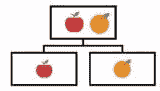
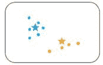
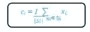

# 关于 K-均值聚类你需要知道的一切

> 原文：<https://medium.com/analytics-vidhya/everything-you-need-to-know-about-k-means-clustering-88ad4058cce0?source=collection_archive---------8----------------------->

如果你想知道 K-means 聚类是怎么一回事，那你就来对地方了！让我们立即开始吧！

图片来源:谷歌图片

# 介绍

## 聚类的类型

聚类是一种无监督学习，其中数据点根据其相似程度被分组到不同的集合中。

*了解更多关于监督/非监督学习的信息*——[***机器学习入门指南***](/analytics-vidhya/a-beginners-guide-for-getting-started-with-machine-learning-7ba2cd5796ae)

***聚类主要有两类:***

*   *层次聚类*
*   *划分聚类*

## 分层聚类

***层次聚类进一步细分为:***

*   *凝聚聚类*
*   *分裂聚类*

*层次聚类采用树状结构，像这样:*

在 ***凝聚式聚类*** 中，有一种 ***自下而上的方法*** 。我们从每个元素作为一个独立的集群开始，然后将它们合并成更大的集群，如下所示:

*是一种 ***自上而下的方法*** 。我们从整个集合开始，然后将它分成一个个更小的集群，如下所示:*

**

## *划分聚类*

****划分聚类进一步细分为:****

*   **K 均值聚类**
*   **模糊 C 均值聚类**

*划分聚类分为两个子类型——*K 均值聚类*和*模糊 C 均值。**

*在 K-means 聚类中，对象被分成几个由数字“K”表示的聚类*

> *因此，如果我们说 K = 2，对象被分成两个集群，c1 和 c2，如下所示:*

**

> *这里，比较特征或特性，并且将具有相似特性的所有对象聚集在一起。*

**模糊 c 均值*非常类似于 k 均值，它将具有相似特征的对象聚类在一起。在 k-means 聚类中，一个对象不能属于两个不同的聚类。但是在 c-means 中，对象可以*属于多个集群*，如图所示。*

**

## *k 均值聚类*

*K-means 类似于 ***KNN*** ，因为它着眼于距离来预测类成员。然而，与 KNN 不同，K-means 是一种 ***无监督学习算法*** *。它的目标是发现不同的点如何聚集在一起。这个数学模型背后的直觉是，相似的数据点会靠得更近。**

*K-means 随后尝试确定称为 ***质心*** 的不同 k 点，这些点位于与同一类的其他点的*(最小累积距离)*的中心，但是离另一类的点更远。*

> *这种算法很直观，但计算量很大，因此它主要用于对较小的数据集进行探索性分析。*

**了解更多关于 KNN*—[***KNN 和 MNIST 手写数字识别入门使用 KNN 从零开始***](https://tp6145.medium.com/a-beginners-guide-to-knn-and-mnist-handwritten-digits-recognition-using-knn-from-scratch-df6fb982748a)*

> *为了更好地理解 K-means，让我们举一个板球的例子。假设您收到了来自世界各地的许多板球运动员的数据，这些数据提供了运动员得分以及他们在最近十场比赛中的得分情况。*

*基于这些信息，我们需要将数据分为两类，即击球手和投球手。*让我们来看看创建这些集群的步骤:**

## *解决办法*

****分配数据点****

*这里，我们将数据集标绘在“x”和“y”坐标上。y 轴上的信息是关于得分的跑垒，x 轴上的信息是关于运动员的三柱门。*

**如果我们绘制数据，它看起来是这样的:**

**

## *执行聚类*

**我们需要创建集群，如下所示:**

****

*考虑相同的数据集，让我们使用 K 均值聚类(取 K = 2)来解决这个问题。K 均值聚类的第一步是随机分配两个质心(当 K=2 时)。两个点被指定为质心。*

> *它们被称为质心，但最初，它们不是给定数据集的中心点。*

**

*下一步是从随机分配的质心确定每个数据点之间的距离。对于每个点，距离都是从两个质心开始测量的，无论哪个距离更小，该点都被指定给该质心。*

> *您可以看到连接到质心的数据点，在这里用蓝色和黄色表示。*

**

*下一步是确定这两个集群的实际质心。原始随机分配的质心将被重新定位到聚类的实际质心。*

**

*这个计算距离和重新定位质心的过程一直持续到我们获得最终的聚类。*然后质心重新定位停止。**

**

> *如上所述，质心不需要再重新定位，这意味着算法已经收敛，我们有两个具有质心的聚类。*

## *应用程序*

**K-Means 聚类在现实生活中的各种例子或商业案例中使用，比如:**

*   **学习成绩**
*   **诊断系统**
*   **搜索引擎**
*   **无线传感器网络**

## *测量距离*

****距离度量决定了两个元素之间的相似性，并影响聚类的形状。****

**K-Means 聚类支持各种距离度量，例如:**

*   ****欧几里得距离度量****
*   ****曼哈顿距离测量****
*   ****欧氏距离的平方度量****
*   ****余弦距离度量****

## *欧几里德距离测度*

*最常见的情况是确定两点之间的距离。如果我们有一个点 P 和点 Q，欧氏距离就是一条普通的直线。 ***它是欧氏空间中两点之间的距离。****

**两点间距离的公式如下:**

**

## *平方欧几里德距离测度*

*这与欧几里德距离测量相同，但最后不求平方根。*公式如下:**

**

## *曼哈顿距离度量*

*曼哈顿距离是水平和垂直分量的简单总和，或者是沿垂直轴测量的两点之间的距离。*

**公式如下:**

**

## *余弦距离度量*

**在这种情况下，我们取两个向量之间的角度，这两个向量是通过连接原点的点形成的。公式如下所示:**

**

*有关 ***距离度量*** 的更多信息，请参考—[***【KNN 和 MNIST 手写数字识别入门指南】从头开始使用 KNN***](https://tp6145.medium.com/a-beginners-guide-to-knn-and-mnist-handwritten-digits-recognition-using-knn-from-scratch-df6fb982748a)*

## *工作*

**下面的流程图总结了* ***K 均值聚类*** *如何工作:**

**

*我们可以通过指定 ***K (=3，4，5)的值来使用*试错法*..)*** 。随着我们的进展，我们不断改变值，直到我们得到最好的集群。*

*另一种方法是用 ***肘法*** 来确定 k 的值*

> *一旦我们得到了 K 的值，系统将随机分配那么多质心，并测量每个数据点到这些质心的距离。*

*因此，它会将这些点分配给距离最小的相应质心。因此，每个数据点将被分配到离它最近的质心。因此，我们有 K 个初始聚类。*

****肘法*** 是求星团个数的最好方法。肘方法构成了在数据集上运行 K-Means 聚类。*

*接下来，我们使用平方和作为一种度量，来寻找可以为给定数据集形成的最佳聚类数。***【WSS】***内的平方和被定义为*集群中每个成员与其质心之间距离的平方之和。**

**

*为 K 的每个值测量 WSS。*WSS 量最少的 K 值被作为* ***最佳值。****

*现在，我们在 WSS 和星团数量之间画一条曲线。*

**

> *这里，y 轴是 WSS，x 轴是星团数量。*

*可以看到随着 K 值从 2 开始增加，WSS 的值有一个非常 ***的渐变*** 。*

*所以，你可以把肘点值作为 k 的最优值，它应该是二，三，或者最多四。但是，除此之外，增加群集数量*不会显著改变*WSS 的值，它会使 ***变得稳定。****

# *k-均值聚类算法*

**假设我们有 x1，x2，x3……x(n)作为我们的输入，我们想把它分成 K 个集群。**

****形成集群的步骤有:****

****第一步:*** 选择 K 个随机点作为聚类中心称为 ***质心。****

****步骤 2:*** 通过实现欧几里德距离(即，计算其到每个质心的距离)将每个 x(i)分配到最近的聚类*

****第三步:*** 通过取指定点的平均值来识别新的质心。*

****第四步:*** 不断重复第二步和第三步，直到达到收敛！*

****让我们在这些步骤中的每一步都仔细看看:****

## *第一步*

*我们随机选择 K(质心)。我们把它们命名为 ***c1，c2，…..ck*** *，我们可以这么说:**

**

*这里 C 是所有质心的集合。*

## *第二步*

*我们将每个数据点分配到其最近的中心，这是通过计算欧几里德距离来实现的。*

**

**其中 dist()是* ***的欧氏距离。****

> *这里，我们从每个 c 值计算每个 x 值的距离，即 x1-c1、x1-c2、x1-c3 之间的距离，以此类推。然后我们找到最低的值，并将 x1 指定给这个质心。*
> 
> *类似地，我们找到 x2、x3 等的最小距离。*

## *第三步*

**我们通过取分配给该聚类的所有点的平均值来识别实际质心。**

**

**其中 Si 是分配给第 I 个聚类的所有点的集合。**

> *这意味着原来的点，我们认为是质心，将转移到新的位置，这是每个组的实际质心。*

## *第四步*

**不断重复步骤 2 和步骤 3，直到达到收敛。**

> *一旦聚类变成静态的，k-means 算法就被认为是收敛的。*

# *其他资源和参考*

****关于 K-means 聚类的更多实现:****

* [## 基于 K 均值聚类的犯罪数据模式分析与可视化

### 犯罪模式分析通过发现犯罪事件发生的地点、时间和地点，揭示了犯罪事件之间潜在的相互作用过程

tp6145.medium.com](https://tp6145.medium.com/crime-data-pattern-analysis-and-visualization-using-k-means-clustering-ceeb963a2b47)  [## 从头开始使用 K-均值聚类的图像分割

### 在数字图像处理和计算机视觉中，图像分割是将一幅数字图像分割成几个部分的过程

tp6145.medium.com](https://tp6145.medium.com/image-segmentation-using-k-means-clustering-from-scratch-1545c896e38e)  [## 从零开始使用 K-均值聚类提取图像中的主色

### 从头开始，在不到 5 分钟的时间内从您选择的任何图像中提取主色！

tp6145.medium.com](https://tp6145.medium.com/extracting-dominant-colours-in-an-image-using-k-means-clustering-from-scratch-2ce79a3eea5d)  [## tanvipenumudy/Winter-实习-实习

### 存储库跟踪每天分配的工作-tanvipenumudy/Winter-实习-实习

github.com](https://github.com/tanvipenumudy/Winter-Internship-Internity/tree/main/Day%2011%20-%20K-means%20%26%20Image%20Segmentation) 

> 希望你喜欢并充分利用这篇文章！敬请关注我即将发布的博客！如果您觉得我的内容有帮助/有帮助，请务必鼓掌**并跟随**和**！***