# 关于线性回归你需要知道的一切

> 原文：<https://medium.com/analytics-vidhya/everything-you-need-to-know-about-linear-regression-750a69a0ea50?source=collection_archive---------3----------------------->

***线性回归*** *是现实生活中机器学习问题中使用最广泛的人工智能算法之一——这要归功于它的简单性、可解释性和速度！在接下来的几分钟里，我们将了解这个算法背后的工作原理！*

来源:谷歌图片

# 什么是线性回归？

***线性回归*** 试图通过将**线性**方程拟合到观察到的数据来模拟两个变量之间的关系。一个变量被认为是*解释变量*或*自变量*，另一个被认为是*因变量—来源:*[***Yale.edu***](http://www.stat.yale.edu/Courses/1997-98/101/linreg.htm#:~:text=Linear%20regression%20attempts%20to%20model,to%20be%20a%20dependent%20variable.)

# 线性回归的应用和方法

## 商业应用

***线性回归用于各种商业预测问题:***

1.  *股票预测*
2.  *预测未来价格/成本*
3.  *预测未来收入*
4.  *新产品性能对比*

## 线性回归的好处

1.  *缓解*
2.  *可解释性*
3.  *可扩展性*
4.  *在线设置部署良好*

## 线性回归的机器学习方法

1.  *简单和多元线性回归*
2.  *多项式回归*
3.  *岭回归和套索回归(线性回归的升级)*
4.  *决策树回归*
5.  *支持向量回归*

## 通俗地说就是线性回归

> 你可以把线性回归看作是问题**“我如何用 X 来预测 Y？”**，其中 X 是你有的一些信息，Y 是你想知道的一些信息。

***我们来看下面这个经典的例子——***[***来源***](https://www.keboola.com/blog/linear-regression-machine-learning)

你可能想卖掉你的房子，并且你有关于那栋房子的*卧室数量* ***(X)*** 的信息，在这里，关键是找到房子的*价格****【Y】***。

> 线性回归创建了一个方程，其中输入给定的数字(X ),输出想要找出的目标变量(Y)。

在这种情况下，我们将使用包含房屋购买历史记录的数据集，其形式为 ***(“卧室数量”、“售价”)*** :

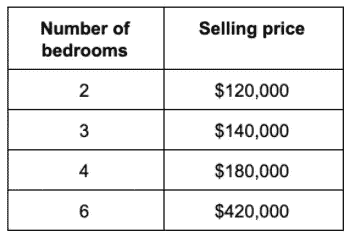

> 现在让我们将相同的数据可视化

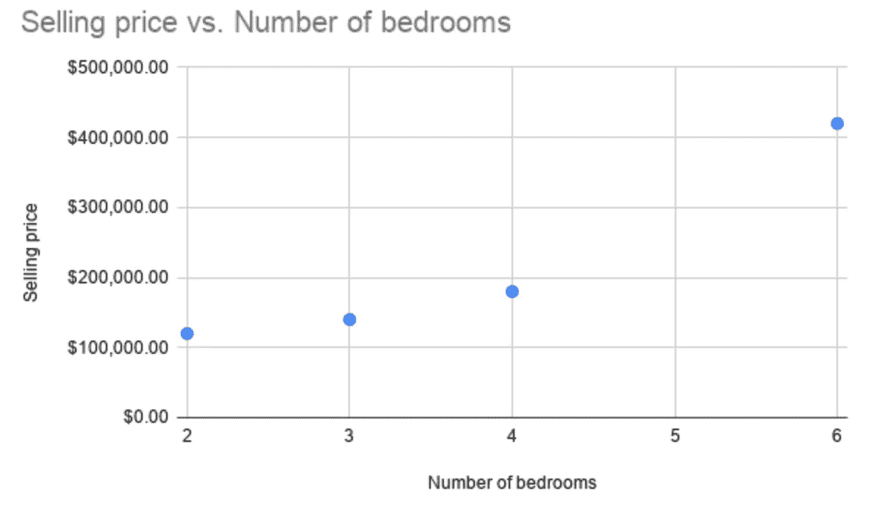

**X 轴**上的卧室数量**X 轴**和 Y 轴**上的**售价****

> 看散点图，似乎有一个趋势:一个房子的卧室越多，它的售价越高(老实说，这并不奇怪)。

现在，假设我们训练了一个线性回归模型来得到一个如下形式的方程:

*售价= 77143 *(卧室数量)—74286*

> 这个等式起到了预测的作用。如果你输入卧室的数量，你会得到房子出售价格的预测值。

对于上面的具体例子:

*你的售价= 77143 *两间卧室——74286 = 8 万*

换句话说，你可以以大约 8 万美元的价格卖掉你的两居室。但是线性回归不仅仅如此。我们也可以把它形象化，看看不同卧室数量的房子的价格是多少

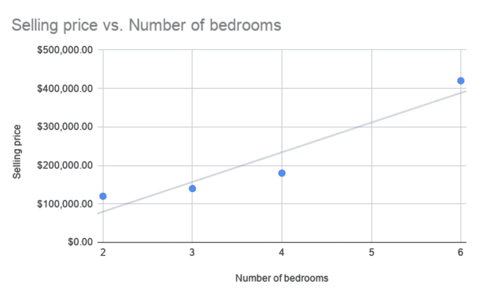

> 这是因为线性回归试图找到一条**最符合数据**的直线。线性回归不仅限于房地产问题:它还可以应用于各种业务用例。

# 数学解释

## 简单线性回归

线性回归是如此有用和成熟的算法，它既是一个统计模型，也是一个机器学习模型。在这里，我们将主要关注机器学习方面，但我们也将绘制一些与统计学类似的东西，以便描绘一幅完整的画面。

一旦定型，该模型就采取这种类型的线性回归方程的形式:

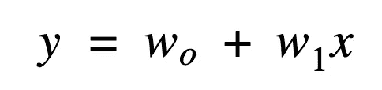

***等式中的术语—***

*   ***y*** 是输出变量。在机器学习中又称为*目标变量*，或者在统计建模中称为*因变量*。它代表了我们试图预测的连续值。
*   ***x*** 是输入变量。在机器学习中，x 被称为*特征*，而在统计学中，它被称为*自变量*。它代表了在任何给定时间给我们的信息。
*   ***w0*** 是*偏置项*或 y 轴截距。
*   ***w1*** 是*回归系数*或比例因子。在经典统计学中，它相当于线性回归模型拟合后产生的最佳拟合直线上的斜率。
*   ***wi*** 统称为*砝码*。

> 回归分析(建模)的目标是找到方程中未知参数的值；也就是说，为了找到权重 w0 和 w1 的值

## 多元线性回归

简单和多重线性回归都假设输入变量和输出目标变量之间存在线性关系。

主要的区别是它们作为输入的独立变量的数量。简单线性回归只取单个特征，多元线性回归取多个 x 值。对于具有 n 个输入变量的模型，上述公式可以改写为:

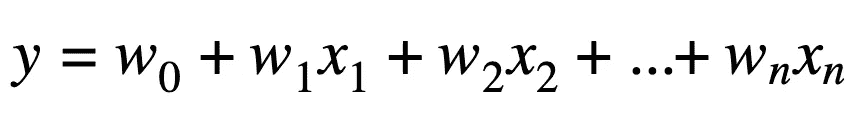

> 其中 xi 是第 I 个特征，具有自己的 wi 权重。

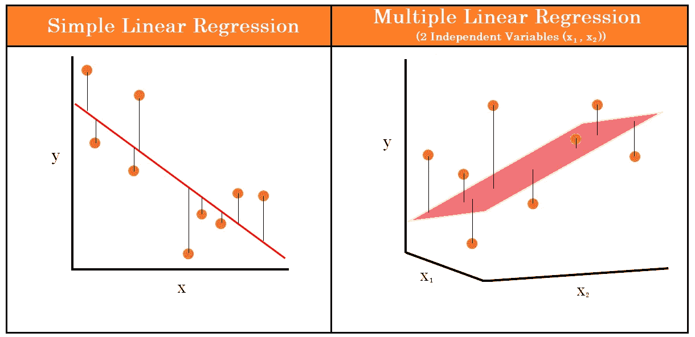

图片来源:Keboola

> 简单线性回归模型可以用图形表示为数据点之间的最佳拟合线，而多元线性回归模型可以表示为**平面(二维)**或**超平面(高维)。**

尽管存在差异，简单回归模型和多元回归模型都是线性模型——它们采用线性方程的形式。这就是所谓的线性假设。

> 很简单，这意味着我们假设独立变量和独立特征之间的关系类型是线性的。

# 训练 LR 模型

我们用一种叫做 ***普通最小二乘法***—***OLS***(或者就是最小二乘法)的方法来训练线性回归算法。训练的目标是找到线性方程 ***y = wo + w1x 中的权重 wi。***

1.  随机权重初始化。实际中，w0 和 w1 在开始时是未知的。该过程的目标是为这些模型参数找到合适的值。为了开始这个过程，我们随机设置权重值，或者初始化为 0。

> 还有其他数学上的正当性如 **Xavier 初始化**等。

2.将初始化的权重输入到线性方程中，并为每个观测点生成预测。

3.计算**(RSS)。残差，或误差项*，是每个*和 ***预测输出*** 之间的差值。**

> **它们是对我们的回归函数预测输出与真实值相比有多好的逐点估计。我们通过计算每个观测值的*实际值——预测值*来获得残差。**

**我们 ***对每个观察点的残差*** *求平方，并对残差求和以达到我们的 RSS。***

**这里的基础是，较低的 RSS 意味着我们的 ***最佳拟合线*** 更接近每个数据点，反之亦然。**

**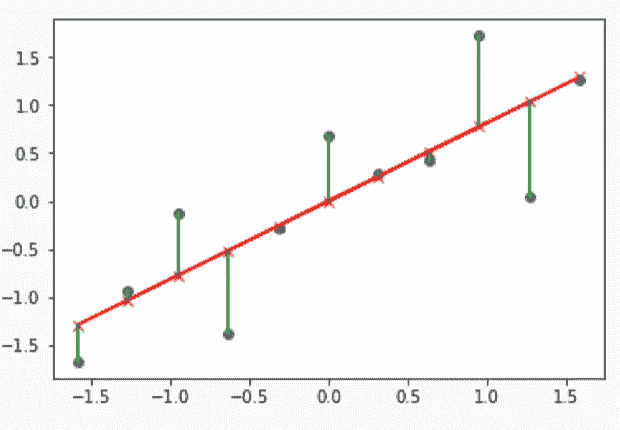**

**实际值(蓝点)越接近回归线(红线)越好。**

**4.最小化 RSS 的模型参数选择。机器学习方法通过定义*成本函数*和*经由 ***梯度下降最小化*来寻找线性模型的最佳参数。*****

> *通过这样做，我们获得了权重的最佳可能值。*

## *价值函数*

*在线性回归的情况下，成本函数与误差的残差和相同。该算法解决了最小化问题，并使用 ***梯度下降来实现。****

## *梯度下降*

*梯度下降是一种根据每个数据点的损失函数改变权重的方法。我们计算每个输入输出数据点的误差平方和。我们对*权重*和*偏差*取*偏导数*，得到每一点的成本函数的*斜率。**

> *基于斜率，梯度下降更新该组权重和偏差的值，并在新值上重复训练循环(向期望的目标靠近一步)。*

*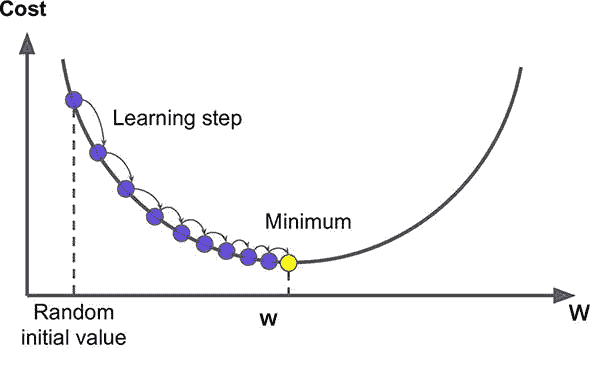*

*图片来源:Morioh——渐变下降图解*

*重复该迭代方法，直到达到最小误差，并且梯度下降不能进一步最小化成本函数，它取决于各种超参数，其中一个关键参数是 ***学习速率*** 。*

> ***学习率**是指每次迭代时参数变化的程度。如果学习率太高，模型无法收敛，并从好的成本优化跳到坏的成本优化。如果学习率太低，模型将需要太长时间才能收敛到最小误差。*

*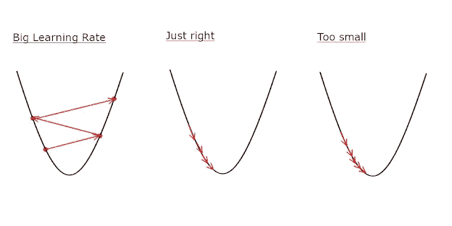*

*图片来源:ka ggle——学习率图解*

# *评估我们的模型*

****我们如何评价我们模型的准确性？****

> *首先，您需要确保在训练数据集上训练模型，并在测试集上构建评估指标，以避免过度拟合。之后，您可以检查几个评估指标来确定您的模型执行得有多好。*

****评价拟合优度有多种度量:****

***均方误差***

*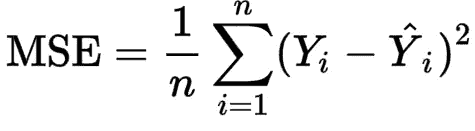*

*MSE 的计算方法是 RSS 除以数据点的总数，即给定数据集中的观察值或样本的总数。MSE 告诉我们每个数据点的平均 RSS 是多少。*

***均方根误差(RMSE)***

**

*RMSE 采用 MSE 值，并对其应用平方根。RMSE 可以直接用来解释我们的预测模型产生的“平均误差”。*

***R2 或 R 平方或 R2 分数***

*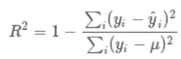*

*r 平方是对线性函数所占因变量方差的度量。*

> *一旦我们训练和评估了我们的模型，我们就改进它以做出更准确的预测。*

# *改进我们的模型*

**有多种方法可以改善你的线性回归模型。**

## *数据预处理*

*正确地 ***清理您的数据*** 会对您的建模产生最大的改进。*

**确保:**

1.  ****清除异常值:*** 异常值在定量反应 y 倾斜线的斜率不成比例。移除它们以获得更合适的线条。*
2.  ****移除多重共线性:*** 为所有要素创建一个*相关矩阵*，以检查哪些要素对具有高相关性。删除这些功能，只保留一个。*
3.  ****断言正态分布:*** 模型假设自变量遵循一个 ***高斯分布*** 。如果变量不是正态分布的，则使用对数变换对其进行变换。*
4.  ****断言线性假设:*** 如果你的自变量与你的预测变量没有线性关系，对数变换它们，将多项式关系重塑为线性。*

> *欲了解更多关于**概率分布**的信息，请参考—[https://medium . com/datadriveninvestor/mathematics-for-machine-learning-part-5-8df 72392 ec10](/datadriveninvestor/mathematics-for-machine-learning-part-5-8df72392ec10)*

## *特征缩放*

*特征可以有不同的数量级。随着梯度下降，不同比例的要素转换较慢(或根本不转换)。*

*[***将***](https://www.kdnuggets.com/2020/04/data-transformation-standardization-normalization.html) 你的特征正常化、标准化，以加快和改善模型训练。*

## *正规化*

*正则化*(通常不用于简单回归)*可以认为是一种 ***特征选择方法。****

> *由此对拟合优度贡献较低的特征被移除和/或减弱其效果，而重要的特征被强调。*

*在线性回归设置中，有两种常用的正则化技术:*

1.  *[***【套索】L1 回归***](https://www.geeksforgeeks.org/lasso-vs-ridge-vs-elastic-net-ml/)-使用惩罚项来移除对整体模型性能影响不大的预测变量*
2.  *[***岭 L2 回归***](https://www.geeksforgeeks.org/lasso-vs-ridge-vs-elastic-net-ml/)*-使用惩罚项降低预测变量的影响(但不移除特征)**

# **初学者的挑战**

1.  **[*根据多年工作经验预测薪资*](https://www.kaggle.com/rsadiq/salary)**
2.  **[*根据历史数据建立美国食品进口的经济预测*](https://www.kaggle.com/poojarangi/annual-food-imports-to-us)**
3.  **[*比较不同的广告渠道如何影响总销售额*](https://www.kaggle.com/ashydv/advertising-dataset)**
4.  **[*预测一个社交媒体帖子将获得的支持票数*](https://www.kaggle.com/umairnsr87/predict-the-number-of-upvotes-a-post-will-get)**

# **其他资源和参考**

** [## 线性回归:初学者的机器学习算法

### 线性回归是最简单的机器学习算法，非常适合初学者。在…

elleknowsmachines.com](https://elleknowsmachines.com/linear-regression/)  [## 机器学习的线性回归-机器学习掌握

### 线性回归也许是统计学和机器中最著名和最容易理解的算法之一

machinelearningmastery.com](https://machinelearningmastery.com/linear-regression-for-machine-learning/)  [## 机器学习线性回归终极指南

### 线性回归和逻辑回归是在现实生活中使用最广泛的机器学习算法之一

www.keboola.com](https://www.keboola.com/blog/linear-regression-machine-learning) 

***对于线性回归:从零开始实现，请查看我的 GitHub 库—***

 [## tanvipenumudy/Winter-实习-实习

### 存储库跟踪每天分配的工作-tanvipenumudy/Winter-实习-实习

github.com](https://github.com/tanvipenumudy/Winter-Internship-Internity/blob/main/Day%207%20-%20Linear%20Regression/Linear%20Regression.ipynb) 

( ***使用的数据集***—[*https://www . ka ggle . com/c/house-prices-advanced-regression-techniques/data*](https://www.kaggle.com/c/house-prices-advanced-regression-techniques/data))

***分拆文章—***

 [## 从零开始用线性回归预测房价

### 今天，让我们从零开始，尝试用线性回归算法解决经典的房价预测问题。

medium.com](/analytics-vidhya/house-price-prediction-using-linear-regression-from-scratch-b2b48fd73689)**