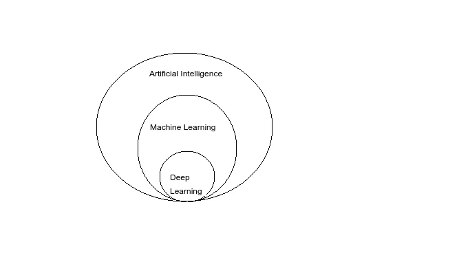
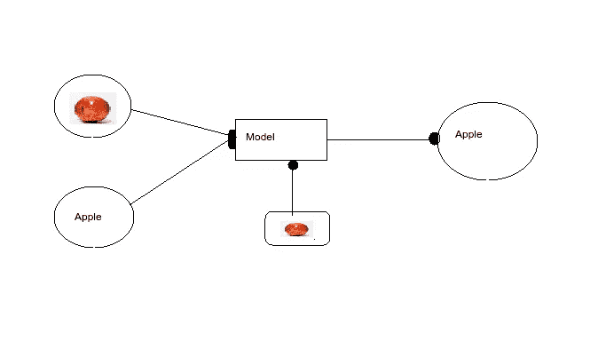

# 你需要知道的一切“机器学习”

> 原文：<https://medium.com/analytics-vidhya/everything-you-need-to-know-machine-learning-aa356bfbb694?source=collection_archive---------19----------------------->

> (3 月 21 日)这篇文章谈论机器学习和与之相关的术语。

什么是机器学习？

AI、ML、DL 之间的关系

今天“人工智能和人工智能”是到处都在使用的时髦术语。人工智能是计算机科学的一个分支，致力于建造能够执行人类任务的智能机器。**机器学习**被定义为让一台机器从某组例子中学习，然后让它从自己的表现中改进自己。**深度学习**是机器学习进一步深入的部分。机器学习是 AI 的子集，深度学习是 ML 的子集。

从你的网飞建议到社交媒体上的好友建议，一切都是使用机器学习完成的。

**机器学习的类型**

机器学习主要有三种类型:**有监督的**、**无监督的**和**强化的**机器学习。

**监督学习:**将输入变量映射到输出变量。你也可以把它理解为师生关系，老师给你看一个苹果(输入)的图像，然后她告诉你这是一个苹果(输出)，你利用它的特征记住它。

监督学习

监督学习问题进一步分为:**分类**和**回归**

**分类:**分类问题是当输出变量是分类变量时，如 0/1、是/否等。一些分类算法:支持向量机(SVM)，KNN，决策树

**回归:**回归问题是当输出变量连续时，如年龄、距离等。一些回归算法:随机森林，XG Boost

监督算法:线性回归，逻辑回归，支持向量机，决策树，随机森林，助推算法(Ada 助推，XG 助推，梯度助推)，KNN

**无监督学习:**定义为当你只有一个输入变量，没有对应的输出变量时。无监督学习的目标是从数据中识别结构和模式。在这个模型中，没有正确的答案，因为没有老师。

无监督学习问题分为两种类型:**聚类**和**关联**

**聚类:**这是您想要发现数据中的内在分组的地方，比如根据成绩对学生进行分组。前 KNN

关联:这是您希望发现描述大部分数据的规则的地方，例如电影预测等。先验的

**强化学习:**它描述了一类问题，其中代理在一个环境中操作，并且必须学习使用反馈来操作。你可以这样理解，你的模型根据顾客之前的订单预测顾客将要点的食物类型，然后要求顾客根据他的预测给出反馈。如果预测是肯定的，这意味着模型是好的，如果是否定的，这意味着它需要改进它的预测。

算法:策略梯度(PG)，信赖域策略优化等

*感谢您的阅读。订阅相关内容。*