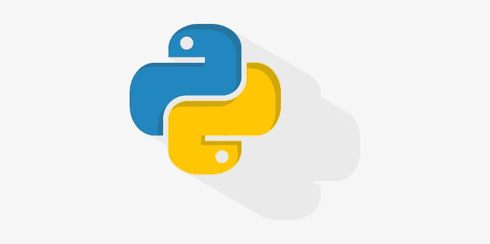

# 成为 Python 编程语言大师所需要知道的一切。

> 原文：<https://medium.com/analytics-vidhya/everything-you-need-to-know-to-become-a-master-at-the-python-programming-language-7b32a74d1d7d?source=collection_archive---------8----------------------->

## 那么达到那个水平需要什么呢？

来自 [Pexels](https://www.pexels.com/photo/woman-in-grey-jacket-sits-on-bed-uses-grey-laptop-935743/?utm_content=attributionCopyText&utm_medium=referral&utm_source=pexels) 的 Andrea Piacquadio 的照片

我们都想成为**专家**，在某项技能上被称为**认证大师**，尤其是在我们喜欢做的事情上。

> 但是要达到那个水平需要什么呢？

**对所述技能集的疯狂了解？🔥🔥那应该可以了！...不过经验可能是需要的😁**

作者图片

我将这些技能分为 4 个主要级别。
1。基本级别
2。中级
3。高级水平
4。专家/大师级别。

如果你是一个初学编程的人，你可以把这当成一门课程，或者是你应该学习的技能和学习顺序的指南。

如果你是中级或高级的人，也许我会提到一些你以前没有听说过的技能和话题，也许我会给你一些想法，你可能会想把它们结合起来以提高你的 python 技能。

> 在我开始之前，很重要的一点是要注意，你必须练习这些你实际上正在学习的技能，以变得擅长它，比如了解语法、用语言解决问题、构建项目等等。

# 这是清单。

# 1.基础知识

所以让我们从基础开始。

作者图片

它是关于基础编程概念和对编程基本构件的深刻理解。比如程序读取的方式，核心语法等等。

**来了！**
1。基本数据类型——什么是字符串，理解布尔等。

2.变量——你想了解它们是如何工作的，以及为什么在编程中使用它们。条件——包括不同变量的比较，诸如此类。

4.链接条件句-理解其评估和语法。

5.运算符——我们如何加减两个变量，模数运算符是做什么的，等等。

6.控制流——像 if、else、elif 语句这样的主题。

7.循环和迭代——比如 while 循环、for 循环、遍历字典、列表等。

然而，这让我顺利地进入下一个话题

8.理解列表、集合、字典、浮点等等。

*之后，您可以继续操作*

9.函数——它们在 Python 中起着至关重要的作用。
对函数的深刻理解会给你以后更多的题目打下很好的基础。

10.可变和不可变数据类型

11.Python 中的常用方法——比如如何将字符串改为小写等等。

10.文件 IO(输入输出操作)CSV 文件如何工作

Python [初学者速成班](https://m.youtube.com/watch?v=4F2m91eKmts)由 [Rafeh Qazi](https://medium.com/u/c1a517a199d2?source=post_page-----7b32a74d1d7d--------------------------------)

观看此视频，了解基本知识

# 2.中间能级

照片由克里斯蒂安·休姆在 Unsplash 上拍摄

所以我们有:

1.面向对象编程-理解类和理解对象。
2。数据结构
3。理解——列表理解、字典理解等等。Lambda 函数——这些是匿名函数。
5。贴图，滤镜
6。收集模块
7。*args 和** kwargs
8。继承——这是面向对象编程的一种方式。
9。类似高级类行为的 Dunder 方法
10。PIP -模块安装
11。Python 环境——例如，anaconda 环境。
12。模块创建
13。异步编程(异步 IO)

 [## Tim 技术-中级 Python 教程-techwithtim.net

### 这些由 tech with tim 编写的中级 python 教程涵盖了基础知识之外的主题，并向您介绍了更多…

www.techwithtim.net](https://www.techwithtim.net/tutorials/python-programming/intermediate-python-tutorials/) 

**点击上面的链接，开始学习中级技能**

接下来，我们将进入高级和专家级别的更复杂的话题。

**现在让我说，作为 Python 开发人员或软件工程师，你不需要学习高级部分的主题。如果你知道基础和中级主题，你可以随时学习这些。**

# 3.高级水平。

布鲁斯·马斯在 Unsplash 上拍摄的照片

我们开始吧！
1。装修工
2。发电机
3。上下文管理器 4。元类
5。并发和并行
6。测试
7。包装的开发和操作
8。cy thon——负责编写可以与 Python 交互的 C 代码。

 [## Udemy、Coursera 和 Pluralsight 的 8 门高级 Python 课程

### 这些是 Udemy、Coursera、Pluralsight 等网站提供的掌握 Python 编程的最好、最高级的 Python 课程…

medium.com](/javarevisited/8-advanced-python-programming-courses-for-intermediate-programmer-cc3bd47a4d19) 

查看此内容，开始学习高级部分

这篇文章是由 javinpaul 写的

# 4.专家/大师级别。

照片由西格蒙在 Unsplash 上拍摄

我不知道在这里放什么......首先，因为我不是专家。第二，因为我完全相信这取决于你想专攻什么，或者你想把你的技能用于什么。也许是在 web 开发、道德黑客等领域。或者你想开发自己的语言，可能是因为你对编译器和低级语言的工作方式有深刻的理解。

***我前面说过，这完全取决于你的决定。***

> 所以完成这些级别，你将成为 Python 编程语言的大师。

***意下如何？***

感谢您的时间和好运！
Agbejule kehinde 青睐