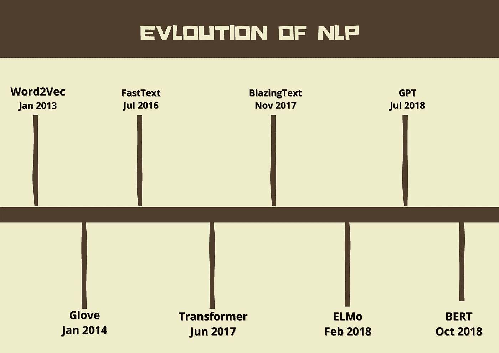

# 自然语言处理的发展

> 原文：<https://medium.com/analytics-vidhya/evolution-of-natural-language-processing-nlp-ac941b6523e9?source=collection_archive---------5----------------------->

在这篇文章中，我想分享一下过去十年中文本分析算法的发展。

自然语言(NLP)已经存在很长时间了，事实上，一个非常简单的单词袋模型是在 20 世纪 50 年代提出的。

但是在这篇文章中，我想把重点放在 NLP 最近的发展上。

自 2013 年以来，由于机器学习算法的发展和进步，以及计算和内存成本的降低，该领域取得了巨大进展。

# **Word2Vec**

2013 年，由谷歌的托马斯·迈克尔·奥夫(Thomas Michael off)领导的研究团队推出了 Word2Vec 算法。

Word2Vec 将文本转换成向量，也称为嵌入。每个向量由 300 个值组成，所以简称为 300 维向量。

因为它代表 300 维向量空间。然后，您可以使用这些矢量表示作为机器学习的输入。

使用这些向量，我们可以应用像 K 最近邻分类或聚类算法这样的算法。

Word2Vec 以两种不同的模型架构而闻名，

*   连续背单词
*   连续跳跃图

该体系结构基于浅层两层神经网络。

*CBOW 从周围上下文单词的窗口中预测当前单词，而 continuous skip gram 使用当前单词来预测周围上下文单词的窗口。*

Word2Vec 面临的一个挑战是，它往往会遇到所谓的词汇问题，因为它的词汇只有 300 万个单词。建模体系结构给该单词分配零，这基本上是丢弃该单词。

[更多关于 Word2Vec](https://en.wikipedia.org/wiki/Word2vec)

# **手套**

2014 年，由斯坦福大学的 Jeffrey Pennington 领导的研究团队引入了手套或全局向量。

手套新方法使用回归模型通过无监督学习来学习单词表示。

该模型的主要直觉是简单的观察，即单词-单词共现概率的比率有可能编码某种形式的意义。

GloVe 还是有超词汇的问题。

[关于手套的更多信息](https://nlp.stanford.edu/projects/glove/)

# 快速文本

2016 年，脸书的人工智能研究(FAIR)实验室在 FastText 上发表了他们的工作。

> 他们说，这是高效文本分类和表示学习的图书馆

FastText 建立在 Word2Vec 的基础上，但是它将每个单词视为一组称为字符 n-grams 的子单词。这有助于解决 Word2Vec 和 Glove 中的词汇问题。

例如，单词“farming”被分成 n 个字母组，如

"农耕" => "f "，" fa "，" far "，" farm "，" farmi "，" farmin "，"农耕"

即使单词“farming”不在词汇表中，也有可能是“farm”。FastText 学习的单词的嵌入是每个 n-gram 的嵌入的聚合，FastText 使用相同的 CBOW 和 skip-gram 模型，FastText 将 Word2Vec 的词汇效果增加到三百万个单词之外。

[关于 FastText 的更多信息](https://fasttext.cc/)

# 变压器

文本分析演变的另一个大型里程碑是 2017 年在一篇名为“ [*注意力是你所需要的一切*](https://arxiv.org/abs/1706.03762)*的论文中引入了 Transformer 架构。*

*介绍了一种基于自注意机制的新型神经网络架构(隐藏状态的加权和作为上下文向量传递到未来时间步长，通常传递到序列到序列 RNN 的解码器部分)。*

*注意力的概念之前已经针对不同的模型架构进行了研究，并且通常是指一个模型组件捕获输入和输出之间的相关性。在 NLP 术语中，注意力将把模型输出的每个单词映射到输入序列中的单词，根据它们对预测单词的重要性为它们分配权重。这种新的 transformer 架构中的自我关注机制专注于捕获输入序列中所有单词之间的关系，从而显著提高自然语言理解任务(如机器翻译)的准确性。虽然 transformer 架构标志着 NLP 的一个非常重要的里程碑，但其他研究团队仍在不断发展，将此作为替代架构的基础。*

*[关于变压器的更多信息](/inside-machine-learning/what-is-a-transformer-d07dd1fbec04)*

# *BlazingText*

*2017 年，AWS 推出了 BlazingText，他们说，BlazingText 基于 [AWS](https://aws.amazon.com/) ，提供了 Word2Vec 和文本分类算法的高度优化的实现。BlazingText 使用多个 CPU 或 GPU 进行训练来扩展和加速 Word2Vec。类似地，文本分类算法的 BlazingText 实现扩展了 FastText，以使用带有自定义 CUDA 内核的 GPU 加速。CUDA 或 compute unified device architecture 是由 Nvidia 开发的并行计算平台和编程模型。使用炽热的文本，您可以使用多核 CPU 或 GPU 在几分钟内训练一个超过 10 亿个单词的模型。BlazingText 使用连续的单词包和 skip gram 训练体系结构创建字符 n-gram 和嵌入，BlazingText 还允许您在事件基础上停止训练您的模型训练，比如说当验证准确性停止增加时。BlazingText 还为存储在亚马逊简单存储服务或亚马逊 S3 中的数据集优化了 IO。*

*[关于 BlazingText 的更多信息](https://docs.aws.amazon.com/sagemaker/latest/dg/blazingtext.html)*

# *工程与后勤管理局*

*来自语言模型的嵌入(ElMo)，AllenNLP 开发的 NLP 框架，2018。*

> **他们喜欢这种深层次的语境化的词语表述。**

*ELMo 是一种在向量或嵌入中表示单词的新方法。这些单词向量是深度双向语言模型(biLM)的内部状态的学习函数，该模型是在大型文本语料库上预先训练的。*

*在 ELMO，单词向量是通过深度双向语言模型学习的。ELMO 结合了前向和后向语言模型，因此能够更好地捕捉不同语言环境中的句法和语义。*

*[关于 ELMo 的更多信息](https://www.analyticsvidhya.com/blog/2019/03/learn-to-use-elmo-to-extract-features-from-text/)*

# *GPT 北部*

*OpenAI 的生殖预训练(GPT)，2018 年。就是半监督学习模型系列。*

*GPT 基于变压器架构，但是执行两个训练步骤*

1.  *GPT 从大型未标记文本语料库中学习语言模型。*
2.  *GPT 使用标记数据执行监督学习步骤，以学习特定的 NLP 任务，如文本分类。*

*GPT 是单向的。*

*[关于 GPT 车型的更多信息](/walmartglobaltech/the-journey-of-open-ai-gpt-models-32d95b7b7fb2)*

# *伯特*

*来自变形金刚(BERT)的双向编码器表示，谷歌人工智能语言，2018。*

*自然语言处理的最新语言模型。*

*它起源于预训练上下文表征，包括[半监督序列学习](https://en.wikipedia.org/w/index.php?title=Semi-supervised_Sequence_Learning&action=edit&redlink=1)、[生成式预训练](https://en.wikipedia.org/w/index.php?title=Generative_Pre-Training&action=edit&redlink=1)、 [ELMo](https://en.wikipedia.org/wiki/ELMo) 等。*

*BERT 考虑给定单词的每次出现的**上下文**，*

*举个例子，*

*考虑两句话，*

*“他在经营一家公司”和“他在跑马拉松”*

*对于单词“running ”, BERT 将提供一个上下文化的嵌入，根据句子的不同而不同。*

*伯特是真正双向的，*

*在无监督训练步骤中，BERT 从无标签文本、从左到右以及从右到左的上下文中学习表示。*

*最初的英语语言 BERT 有两种模型:*

*(BERT _ BASE:具有 12 个双向自关注头的 12 个编码器，以及*

*(2)BERT _ LARGE:24 个编码器，16 个双向自关注头。*

*这两个模型都是根据从拥有 8 亿单词的[图书语料库](https://en.wikipedia.org/w/index.php?title=BooksCorpus&action=edit&redlink=1)和拥有 2500 万单词的英语维基百科中提取的未标记数据进行预训练的。*

*这种新颖的方法引起了整个行业对 BERT 的兴趣，并导致了许多 BERT 模型的变化。其中一些是特定于语言、特定于领域的，而 BERT 模型是这类模型中最流行的。*

*[阅读更多关于伯特的信息](https://towardsdatascience.com/bert-explained-state-of-the-art-language-model-for-nlp-f8b21a9b6270)*