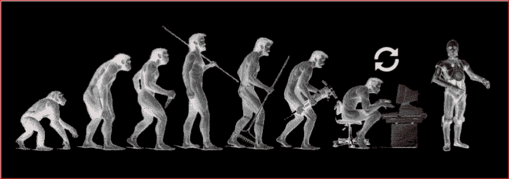
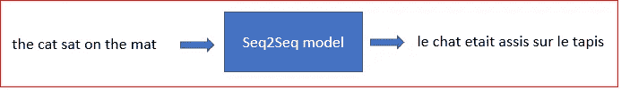
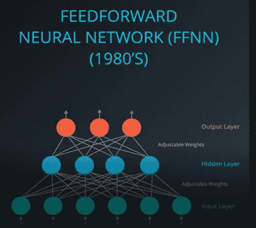
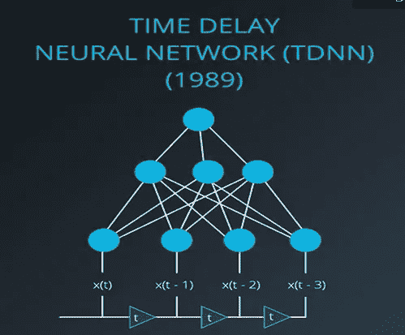
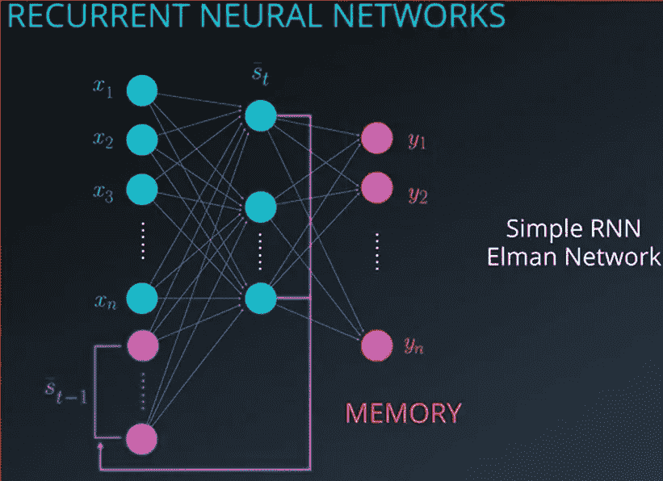
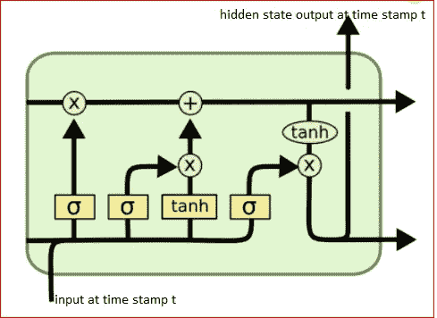
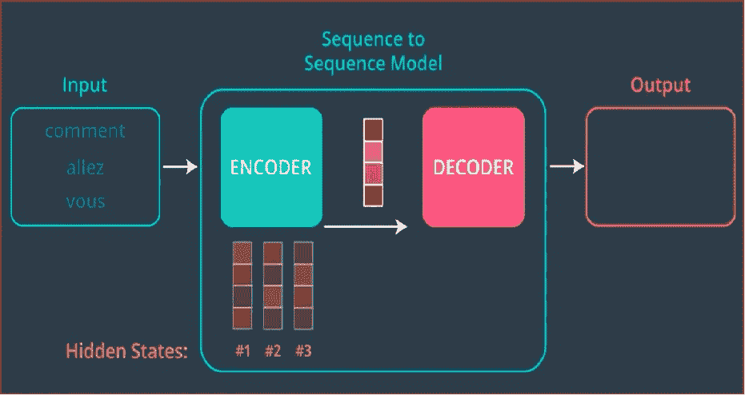
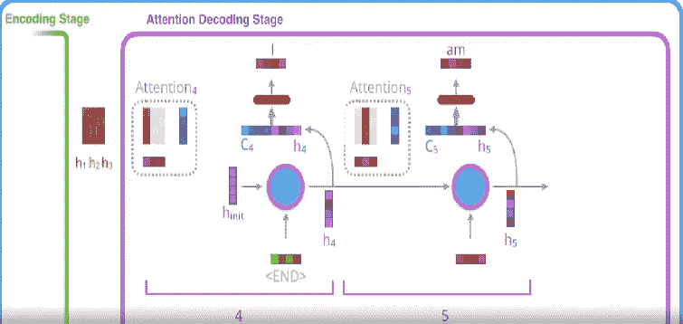
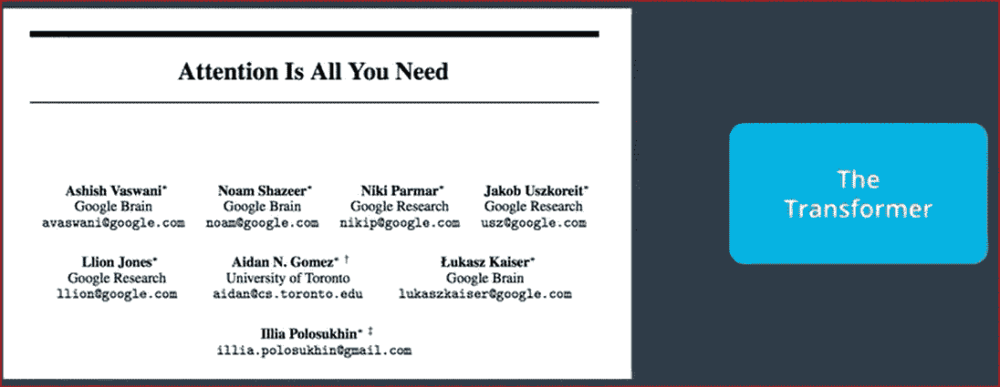
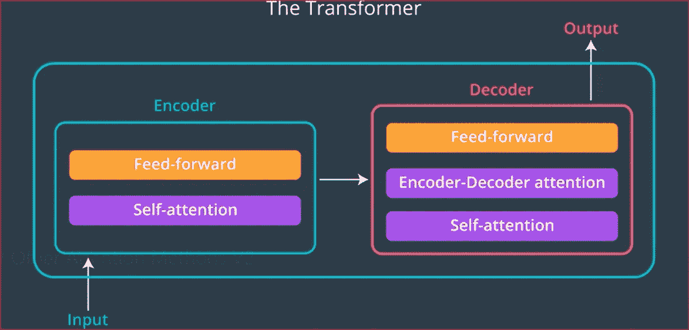

# 序列到序列学习的进化——从“前馈神经网络”到“变压器”的旅程

> 原文：<https://medium.com/analytics-vidhya/evolution-of-sequence-to-sequence-learning-a-journey-from-feed-forward-neural-network-to-the-2f2d9344a5d3?source=collection_archive---------22----------------------->

[https://miro . medium . com/max/1694/1 * aj7rs 6 unxbtxujmrtcj 4 ew . JPEG](https://miro.medium.com/max/1694/1*aj7Rs6UNxbTXuJmrTcj4Ew.jpeg)

这篇博客的主要目的是展示不同序列对序列(Seq2Seq)模型的局限性，以及如何在这一领域不断改进。

## Seq2Seq 学习是什么？

Seq2Seq 模型将单词序列(一个或多个句子)作为输入，并生成单词输出序列。利用 Seq2Seq 学习可以开发许多应用程序。一些用例是机器翻译、文档摘要、语音识别、阅读理解、实体提取、图像字幕等等。

## 应用:

1-机器翻译

2-文档摘要

3-语音识别

# 前馈神经网络:

最简单的神经网络架构- FFNN，其中信息仅单向流动，即从输入层到输出层。

图片来源: [Udacity NLP 纳米学位课程](https://www.udacity.com/course/natural-language-processing-nanodegree--nd892)

## FFNN 的局限性:

在 80 年代中期，人们认识到 FFNN 模型不能捕捉时间相关性，即随时间变化的相关性。几乎所有的真实用例要么是顺序的，要么是时变的。换句话说，给定时间戳的输出不仅取决于当前输入，还取决于过去的输入。FFNN 无法处理这些属性，因为缺少捕获过去输入状态的内部内存元素。然而，我们将在后面看到，FFNN 如何与其他更复杂的算法相结合，以产生各种 NLP 任务中的艺术状态。

# 时间延迟神经网络(TDNN):

第一次尝试是在神经网络中引入记忆元素。网络能够查看当前输入以及过去的输入。

图片来源: [Udacity NLP 纳米学位课程](https://www.udacity.com/course/natural-language-processing-nanodegree--nd892)

## TDNN 的局限性:

虽然 TDNNs 能够捕获时间相关性，但它仅限于所选的时间窗口。这意味着，网络无法看到过去的输入超过选定的时间戳。

# 递归神经网络(RNN):

接下来是 rnn，它们能够通过向网络引入反馈或记忆元素来捕捉时间依赖性。隐藏层的输出作为下一个训练步骤的输入，允许网络查看过去的输入。

图片鸣谢: [Udacity NLP 纳米学位课程](https://www.udacity.com/course/natural-language-processing-nanodegree--nd892)

## rnn 的限制:

90 年代初，人们发现所有的 rnn 都存在消失梯度问题。如果网络看得更深(时间戳大于 8 或 10)，它就失去了捕捉过去输入的本质的能力。换句话说，RNNs 无法学习“长期依赖”。

# LSTM:

LSTM 是专门为避免长期依赖问题而设计的。它使用门来固定状态变量，并决定在将来适当的时候是否重新引入。因此，可以表示任意时间间隔，且可以捕捉时间相关性。

LSTM 的另一个变种叫做 GRU(门控循环单元),它被证明在捕获长期依赖方面非常有效。

序列到序列模型有两个组件-编码器和解码器。编码器接收所有输入，对其进行处理，并将捕获的信息(上下文向量)发送给解码器，以生成输出序列。编码器和解码器只不过是 LSTM\GRU 的 rnn

图片鸣谢: [Udacity NLP 纳米学位课程](https://www.udacity.com/course/natural-language-processing-nanodegree--nd892)

## 限制:

如果你注意到，编码器只把最后一个隐藏状态传递给解码器，而不管输入大小的长度。因此，最后一个隐藏状态(也称为上下文向量)的大小是 Seq2Seq 模型中的一个限制因素。甚至，如果我们将上下文向量的大小固定得非常大，模型倾向于在短句上过度拟合。注意力解决了这个问题。

# 注意机制

与以前的 Seq2Seq 模型相比，注意力不仅仅传递给最后一个隐藏状态，而是传递给解码器所有的隐藏状态。这提供了上下文向量大小的灵活性，更长的序列可以具有更长的上下文向量，其捕获输入序列的更好信息。现在，轮到解码器来识别输入序列的哪一部分需要更多的关注。解码器通过在输入隐藏状态的帮助下计算上下文向量来做到这一点。

图片鸣谢:[https://jalammar . github . io/visualizing-neural-machine-translation-mechanics-of-seq 2 seq-models-with-attention/](https://jalammar.github.io/visualizing-neural-machine-translation-mechanics-of-seq2seq-models-with-attention/)

## 注意机制的限制:

在注意机制中使用 RNNs 增加了模型的复杂性，并且不允许模型对模型训练进行并行处理。题为“注意力是你所需要的全部”的论文提出了一种新的方法，其中编码器和解码器仅使用注意力，而不使用 RNNs。他们称这个模型为变形金刚。

# 变形金刚

变压器是编码器和解码器的堆叠，本文提出了 6 层。编码器和解码器都使用了一个叫做自我关注的概念和一个前馈神经网络。事实证明，模型在质量上更胜一筹，训练时间也相对更短。

图片鸣谢: [Udacity NLP 纳米学位课程](https://www.udacity.com/course/natural-language-processing-nanodegree--nd892)。

基于 Transformer 的模型被证明是非常强大的，因为它们已经在许多 NLP 任务中实现了 SOTA。迁移学习允许实践者在 NLP 的下游任务中使用预先训练的模型。研究人员和实践者开始把这想象成 NLP 和 NLU 任务中的图像网络时刻。

这个领域仍然广泛开放，需要更多的研究，在未来我们将看到更多的进步。

# 参考资料:

 [## 自然语言处理在线课程

### 新的！纳米学位课程预计时间为 3 个月，每周 10-15 小时，2021 年 2 月 24 日前注册进入教室…

www.udacity.com](https://www.udacity.com/course/natural-language-processing-nanodegree--nd892)  [## 了解 LSTM 网络

### 2015 年 8 月 27 日发布人类不是每秒钟都从零开始思考。当你读这篇文章时，你…

colah.github.io](https://colah.github.io/posts/2015-08-Understanding-LSTMs/)  [## 杰伊·阿拉玛

### 通过可视化模型层之间的隐藏状态，我们可以得到一些关于模型“思维过程”的线索…

jalammar.github.io](https://jalammar.github.io/) 

## 我的联系方式:

www.linkedin.com/in/dhirendra-srivastava-894b4b195

【https://twitter.com/iamDhirendraS 