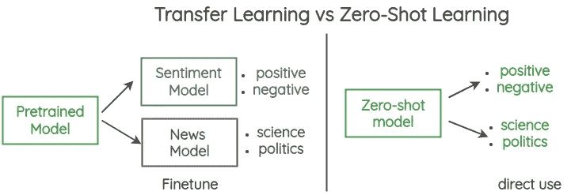

# 与伯特一起进化:罗伯塔简介

> 原文：<https://medium.com/analytics-vidhya/evolving-with-bert-introduction-to-roberta-5174ec0e7c82?source=collection_archive---------0----------------------->

> 再好，也总可以变得更好，这才是激动人心的地方。

在这篇文章中，我将讨论“令人兴奋的部分”，即[脸书研究](https://medium.com/u/25aae929dbb1?source=post_page-----5174ec0e7c82--------------------------------)人工智能机构如何修改现有[谷歌](https://medium.com/u/be36e94a7e47?source=post_page-----5174ec0e7c82--------------------------------) BERT 的培训程序，向世界证明总有改进的空间。

让我们看看一种用于预训练自然语言处理(NLP)系统(RoBERTa)的鲁棒优化方法的开发。


# Google 开源的 BERT

来自 Transformers 的双向编码器表示，或称为 BERT，是谷歌在 2018 年发布的一种自我监督方法**。**

> 伯特是历史上最理解语言的工具/模型。它是免费的，而且非常通用，因为它可以解决大量与语言任务相关的问题。你在不知情的情况下利用了伯特。
> 
> 如果你用过谷歌搜索，你就已经用过 BERT 了

# 建筑:

## 变压器模型 BERT 的基础概念

BERT 基于变压器模型架构

检查模型，就好像它是一个单一的黑匣子，机器翻译应用程序会把一种语言的句子翻译成另一种语言。


执行机器翻译任务的变压器[ [来源](https://jalammar.github.io/illustrated-transformer/)

*   基本 Transformer 由一个读取文本输入的编码器和一个为任务产生预测的解码器组成。


变压器的基本结构[来源](https://jalammar.github.io/illustrated-transformer/)

*   由于 BERT 的目标是生成语言表示模型，所以只需要编码器部分。因此， **BERT 基本上是一个经过训练的变压器编码器堆栈**


编码器模块的基本结构[来源](https://jalammar.github.io/illustrated-transformer/)

要理解其机制的进一步实现，请参考我之前的博客

## 伯特的训练

在预训练期间，BERT 使用两个目标:掩蔽语言建模和下一句预测。

*   **屏蔽语言建模(** `**MLM**` **)** 基本上**屏蔽随机选择的 15%的输入标记中的 80%**并使用其他标记来尝试预测屏蔽(丢失的单词)。


*   **下一句预测(** `**NSP**` **)** 是一种**二元分类损失**，用于预测两个片段是彼此跟随还是来自不同的文档以创建语义。


# **B**BERT 优化的开始:RoBERTa 简介

## **BERT 的改进空间**


BERT 中改进的学习范围

## BERT 明显训练不足，以下区域属于修改范围。

## **1。BERT 训练中的掩蔽:**

在数据预处理期间，屏蔽只进行一次，从而产生单个静态屏蔽。因此，相同的输入掩码在每个时期都被输入到模型中。

## **2。下一句预测:**

*   BERT 中使用的原始输入格式是**段对+NSP 损耗。**
*   在这种情况下，每个输入都有一对片段，每个片段可以包含多个自然句子，但是总的组合长度必须少于 512 个标记。
*   值得注意的是，单个句子会损害下游任务的性能，根据假设，这是因为该模型无法学习长期依赖关系，因此作者可以通过删除/添加 NSP 损失来实验，以查看模型性能的影响。

## 3.文本编码:

*   最初的 BERT 实现使用大小为 30K 的字符级 BPE 词汇表。
*   BERT 使用 WordPiece 方法，这是一种基于语言建模的字节对编码变体。

## 4.培训批量:

最初，BERT 被训练用于具有 256 个序列的批量大小的 **1M 步，这显示了在掩蔽语言建模目标的复杂度方面的改进空间。**

# 改变培训程序:

## 1.用动态屏蔽代替静态屏蔽:

为了避免多次屏蔽同一个单词，脸书使用了动态屏蔽；训练数据被重复 10 次，每一次，被屏蔽的单词将会不同，这意味着句子将是相同的，但是被屏蔽的单词将会不同。

## **2。移除 NSP :**

**测试 1:喂食以下交替训练形式。**

**2.1。保留 NSP 损失:**

*   **句子对+NSP:** 每个输入包含一对自然句子，从一个文档或单独文档的连续部分取样。NSP 损失得以保留。

**2.2。移除 NSP 损失:**

*   **完整句子:**每个输入都包含从单个或交叉文档中连续采样的完整句子，因此总长度最多为 512 个标记。我们消除了 NSP 损失。
*   **文档句子**:输入的构造类似于完整句子，除了它们不能跨越文档边界。在文档末尾附近采样的输入可能少于 512 个标记，因此我们在这些情况下动态增加批量大小，以实现与完整句子相似的标记总数。我们消除了 NSP 损失。

## 结果—

*   与具有 NSP 损耗的原始 BERT 相比，去除 NSP 损耗匹配或稍微改善了下游任务性能。
*   如*表 1 所示，来自单个文档的序列(文档句子)比来自多个文档的打包序列(完整句子)表现稍好。*


表 1:有无 NSP 损耗模型的性能比较(图片取自[论文](https://arxiv.org/abs/1907.11692)

## 3.大批量小批量培训:

值得注意的是，用大的小批量训练模型改善了 MLM 目标的复杂性和最终准确性。

> 1M 步骤，批量大小为 256 与 31K 步骤，批量大小为 8K 的计算成本相当。

通过分布式并行训练，大批量也更容易并行化。

## 4.字节对编码:

*   这里对原始字节使用字节对编码，而不是 Unicode 字符。
*   BPE 的子词词汇量减少到 50K(仍然大于伯特的词汇容量)单位。


字节对编码的一个简单例子(BPE) [ [来源](https://encrypted-tbn0.gstatic.com/images?q=tbn:ANd9GcQCZAAiwMGZi20JrcMwe9Nn-L4Vn2enNZj4lA&usqp=CAU)

尽管在某些情况下会降低最终任务的性能，但这种方法还是用于编码，因为它是一种通用的编码方案，不需要任何预处理和标记化规则。

## 5.增加训练数据:

据观察，在更大的数据集上训练 BERT 极大地提高了它的性能。因此，训练数据增加到 160GB 的未压缩文本。


谷歌的伯特看到修改后！[来源](https://www.google.com/search?q=bert+meme+face&tbm=isch&hl=en&sa=X&ved=2ahUKEwi4uv7VnrrxAhU-xHMBHRwTCGIQrNwCKAJ6BAgBEHE&biw=1519&bih=722#imgrc=3M9gWEsbSbq_NM&imgdii=nOdlVxygRt-izM)

# 脸书的 RoBERTa:一种预训练自监督 NLP 系统的优化方法


上面讨论的问题是由脸书人工智能研究所(FAIR)发现的，因此，他们提出了一个“优化”和“稳健”的 BERT 版本。

> 罗伯塔实际上在 NLU 任务中表现强劲，脸书的绝对天才实际上做到了，这不是一个点击诱饵！

> RoBERTa 是脸书不断致力于推进自我监督系统发展的一部分，这种系统可以减少对时间和资源密集型数据标签的依赖。

它的行为更像是给输入的其余部分提供上下文(实际的上下文)，这就是为什么 RoBERTa 比实际上在诸如 SQUAD 等任务上经过微调的模型工作得更好的原因。

# 为什么罗伯塔很重要？

世界欣赏谷歌，因为他们让这个自然语言处理程序向世界开源。通过 RoBERTA，我们看到 BERT 开源的举动给 NLP 带来了巨大的变化。

该研究证明了充分预训练的模型如何在扩展到极限时导致琐碎任务的改善。

> **提高 BERT 的潜力，对市场和经济前景产生巨大影响。**

*   BERT 和 RoBERTa 用于
    NLP 任务的改进，因为他们利用了上下文丰富的嵌入向量空间。
*   使用 RoBERTa 对数据进行预处理，对于所有小型产品到大型跨国公司来说都是一个重大进步，因为主要工作是整合数据进行分析以提取信息。

这是很重要的，因为作为这些研究、实验和发展的结果，我们正越来越接近 NLP 模型的更大挑战，即实现人类水平的语言理解！

# 罗伯塔和伯特有什么不同

## 罗伯塔的作者认为，伯特在很大程度上训练不足，因此，他们提出了以下相同的改进。

*   更多**训练数据** (16G 对 160G)
*   使用**动态屏蔽模式**代替**静态屏蔽模式。**
*   将**下一句预测**目标替换为**不带 NSP 的完整句子。**
*   关于**更长序列的训练。**


不同模型的精度与训练步骤数的关系图。[ [来源](https://encrypted-tbn0.gstatic.com/images?q=tbn:ANd9GcRLIXLOFlu96piyukpXw3zCBlt5h5ohpuU4tw&usqp=CAU)


BERT、RoBERTa、DistilBERT 和 XLNet 在培训策略方面的比较

# 和罗伯塔一起零距离学习

## 零射击学习:

这是一种机器学习技术，其中模型的使用不需要对特定任务进行微调。



解释零射击学习

## 您可以使用下面的示例来实现任何文本序列分类任务(一次性分类),只需按照以下步骤操作即可。它也广泛用于序列回归任务。

## **从 torch.hub 加载 RoBERTa**

使用 Pytorch 加载预训练的 RoBERTa 大型模型

```
import torch
roberta = torch.hub.load('pytorch/fairseq', 'roberta.large')
roberta.eval()
```

## Roberta 用于序列分类:

RoBERTa Model transformer 在顶部有一个序列分类/回归头(在合并输出的顶部有一个线性层),例如用于粘合任务。

## 1.下载已经为 MNLI 微调的 RoBERTa

RoBERTa 还接受了 MNLI(多体裁自然语言推理是一个由 433k 个句子对组成的众包集合，其中标注了文本蕴涵信息)的预训练。

```
roberta = torch.hub.load('pytorch/fairseq', 'roberta.large.mnli')
roberta.eval()  # disable dropout for evaluation
```

## 2.对一对句子进行编码，并做出预测

```
tokens = roberta.encode('Roberta is a heavily optimized version of BERT.', 'Roberta is not very optimized.')
roberta.predict('mnli', tokens).argmax()
```

## 3.编码另一对句子

```
tokens = roberta.encode(‘Roberta is a heavily optimized version of BERT.’, ‘Roberta is based on BERT.’)
roberta.predict(‘mnli’, tokens).argmax()
```

# 进一步讨论

变形金刚非常占用内存。因此，在训练更大的模型或更长的时期时，我们很有可能会耗尽内存或超出运行时间限制。

因此，在我的下一篇博客中，我将讨论和实施一些**有前途的、众所周知的、有影响力的开箱即用的策略** **，用优化策略来加速 transformer，以减少培训时间。**

# 一起创造纽带、故事和魔法！


那是我通过屏幕与你联系！[来源](https://blog.textnow.com/blog/2020/04/23/distance-learning-how-textnow-is-helping-teachers-stay-connected-pt-2/)

> 我意识到技术正在发展，人们的思维变得更加好奇，结果也变得更加有趣。也正因为如此，我们才不断的学习和成长！

祝贺你坚持到博客的最后，那就是我！

如果你今天喜欢学习 RoBERTa，请在下面的评论中告诉我你使用的是什么技术，并随时回答任何问题。