# 精确推断，在置信分布框架下，综合罕见事件的临床试验。

> 原文：<https://medium.com/analytics-vidhya/exact-inference-under-the-confidence-distribution-framework-to-synthesize-clinical-trials-of-70755f92dbe7?source=collection_archive---------14----------------------->

*【正在审核】*

由四十八(48)项罗格列酮与作为对照的另一种治疗方法的对比研究组成的数据提供了关于心肌梗死(MI)风险和心血管原因导致的心血管死亡(死亡)的数据(田等人，2009)。我们在这里加载它们[，然后将它们复制到一个](https://www.ncbi.nlm.nih.gov/pmc/articles/PMC2648899/bin/kxn034_index.html) [txt.file](https://www.dropbox.com/home/Rare%20Events%20in%20clinical%20trials?preview=RareEvents.txt) 中，并导出到一个 excel.file 中(但是将文件保存为一个 [csv.file](https://www.dropbox.com/home/Rare%20Events%20in%20clinical%20trials?preview=Rare+Events.csv) ，更适合 R 操作)，我们在其中添加了标题:研究 ID、研究名称、n.TRT、MI。TRT，死亡。TRT，北卡罗来纳州 CTRL，密歇根州。CTRL，死亡。

前 6 个和后 6 个观察值是:

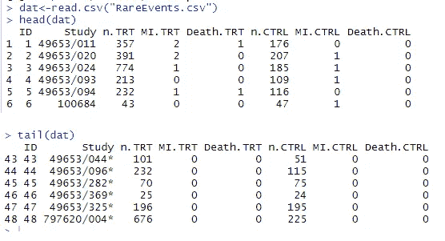

我们使用来自*库“meta”*的函数 *metabin()* 来将固定效果模型 FEM 和随机效果模型 REM 仅拟合到关于结果 MI 的二进制数据。

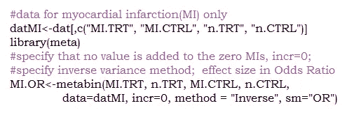

还可以指定*sm =*“RD”为风险差(风险的差异)，或者“RR”为风险比(两种风险的比值，对照组的风险总是在分母；赔率类似)。这些都是衡量两组干预措施之间效果大小的常用方法，这些干预措施报告了一个二元的具体结果。

我们打印对象“MI”的摘要。或者”:

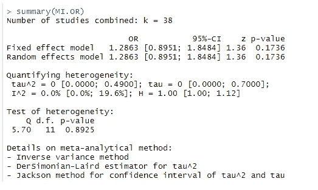

在这 48 项研究中，我们从以下代码中确认，其中 10 项(研究编号 20、31、33、38、43、44、45、46、47 和 48)报告两个治疗组均无心肌梗死:

> dat MIfor(I in 1:length(dat MI $ ID)){
> if(dat MI $ MI。TRT[i]==0 & datMI$MI。CTRL[I]= = 0){ print(datMI $ ID[I])}
> }

[1]20
[1]31
[1]33
[1]38
[1]43
[1]44
[1]45
[1]46
[1]47
[1]48

固定效应和随机效应产生相同的总体估计值 1.29，95%可信区间为[0.89；1.85]，p 值为 0.17。异质性检验当然没有显著性，p 值= 0.89，τ= 0。所以我们没有足够的证据来证明所涉及的研究的异质性。

两组之间没有统计学上的显著差异，

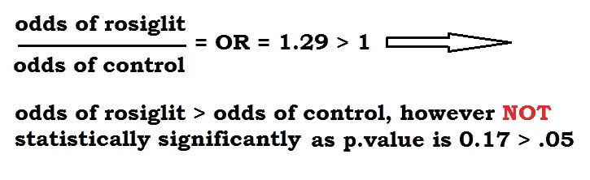

罗格列酮组患者发生心梗事件的几率大于对照组，但我们对此并不确定，因为此外，CI[0.89；1.85]表明 OR 可以是 1 或小于 1。

零单元阻止 R 计算 or 估计值的标准误差，因此默认情况下，R 为其生成零值。这使得关于感兴趣的效应大小的推断不可靠。让我们给这些零单元增加一个小的频率值，比如 0.3，看看会发生什么:

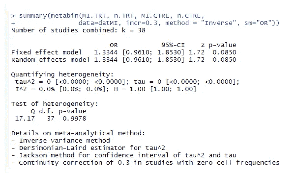

让 R 做治疗臂连续性矫正(TACC)怎么样(Sweeting et al .，2004；戴蒙德等人，2007)？

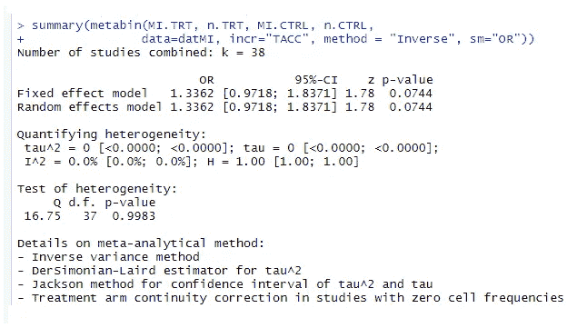

我们还可以考虑的第三种情况是没有指定元素“incr”。在这种情况下，R 采用 0.5 作为零单元的默认频率值。

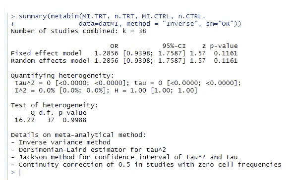

尽管 Sweeting 等人(2004 年)有令人信服的证据表明“include”的任意值会产生不同的结论，但在我们的案例中，无论有无连续性校正，结果都没有改善。

刘等人(2012 年)提出了一种替代方法，不需要这种校正。该方法被称为“精确方法”，并在["*gmeta*"](https://cran.r-project.org/web/packages/gmeta/gmeta.pdf)-广义元分析方法-函数中指定为 *methods = "exact1 "。*在组合置信分布(CDs)的框架下，它综合了来自 2x2 表的证据。我们以如下方式在 R 中实现它:

排列数据集“datMI”中的列，使得第一列和第三列分别是罗格列酮和对照组的事件数(MI。密歇根州 TRT。第二列和第四列分别是罗格列酮组和对照组的患者总数(TRT 对照组)。从下面的输出来看，

> > colnames(dat MI)
> 【1】“MI。”的“咪。CTRL " " n TRT " " n CTRL "

我们将在 gmeta 函数中使用的数据(gmeta 同时也是一个包)存储在对象 *"datMI4exact"* 中

> 下面的 dat mi 4 exact

Finally, the “exact1” meta-analysis on log-odd-ratio (LOR) based on Liu et al (2012), is derived from the object*" mi . exact lor "*

> mi . exact or 置信水平=.95，mc.iteration = 10000)

顺便说一下，一个 2 乘 2 的桌子看起来像这样:

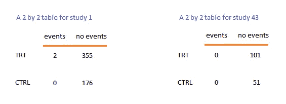

2 x 2 表格的示例

摘要输出如下所示

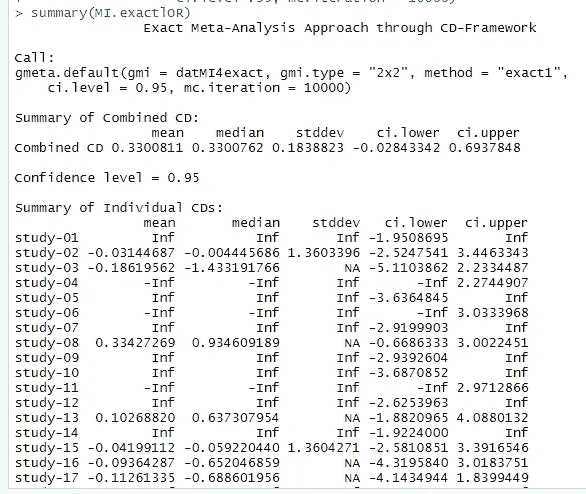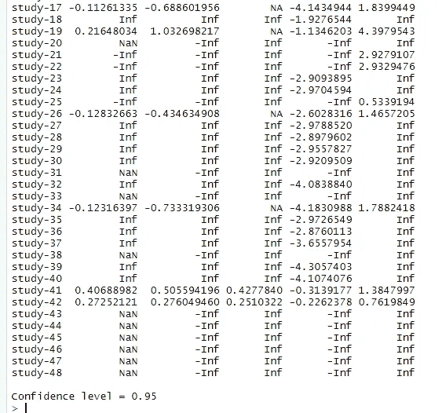

对象的结构告诉我们如何到达上面摘要中的元素

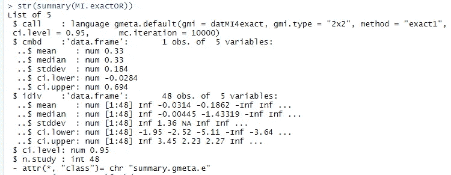

所以我们提取了“精确”的估计值，这是从像这样的 48 项研究的综合置信分布中得出的

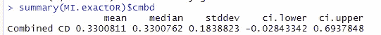

我们从对数标度转换回原始标度

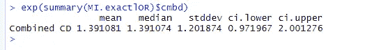

这些结果(OR=1.39，95% CI[0.97；2])仍然表明，两组之间没有统计学上的显著差异，但这种方法的一个显著特点是，我们可以显式地获得感兴趣参数(OR 中的效应大小)的方差值(即标准偏差 *stddev* 的平方)。

## **部分情节**

我们将一些研究(研究编号 2、8、26、33 和 45) 的*置信分布与 *MI* 条件下的*总体置信分布*在一张图上进行对比。*

> > plot(MI.exactlOR，studies = c(2，8，26，33，45)，option=T，xlim = c(-5，5)，xlab = "Exact log(OR) for MI")
> 无法绘制研究 33 的置信分布，因为它包含零-零事件。
> 研究 45 的置信分布无法绘制，因为它包含零-零事件。

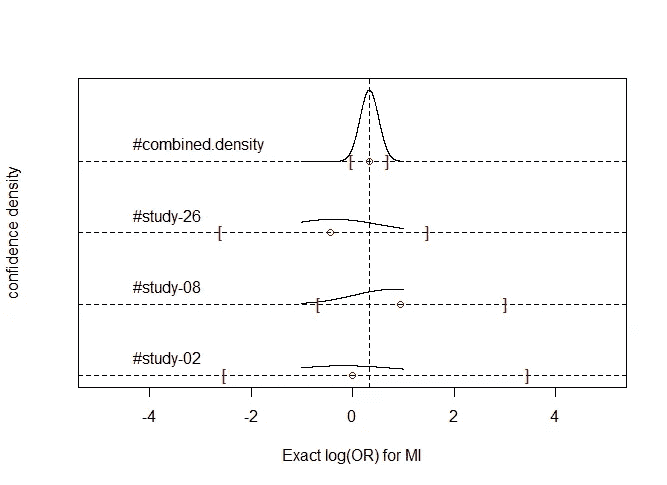

plot()函数的输出不仅仅是一组图形，而且还有一条消息告诉我们为什么没有生成另外两个图，这并不奇怪。为“死亡”结果生成了类似的图形:

> > plot(Death.exactlOR，studies = c(2，8，26，33，45)，option=T，xlim = c(-5，5)，xlab = " Exact log(OR)for Death ")
> 无法绘制研究 2 的置信分布，因为它包含零-零事件。
> 研究 45 的置信分布无法绘制，因为它包含零-零事件。

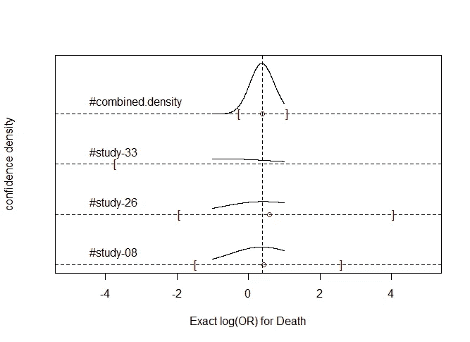

**练习:**使用*“exact 2”*方法生成两组的*“RD”*的估计值。

## **结论**

固定效应和随机效应模型不适用于罕见事件。置信分布使用精确分布来组合研究结果。已经在 R 包*“gmeta”*中实现，方便使用。这篇关于如何处理荟萃分析中罕见事件的概述，实际上摘自 Karl E. Peace 等人 2018 年出版的《生物制药应用统计学研讨会:第 2 卷临床试验的生物统计学分析》一书的第 8 章。

# 进一步阅读

1.  莱恩，P . w .(2012 年)。罕见事件发生率的荟萃分析。*医学研究中的统计方法*，2012 年 1 月 4 日。
2.  萨顿，A. J .，库珀，新泽西州，等人(2002 年)。罕见和不良事件数据的荟萃分析。*药物经济学和结果研究专家综述，2(4)，*367–379。
3.  Sweeting，M. J .，Sutton，A. J .等人(2004):什么是无中生有？稀疏数据荟萃分析中连续性校正的使用和避免。*医学统计学，23，*1351–1375。
4.  田，蔡，t，费佛，m，(2009)。meta 分析的精确而有效的推理过程及其在分析具有所有可用数据但没有人工连续性校正的独立 2x2 表中的应用。*生物统计学，10(2)* 。275–281.