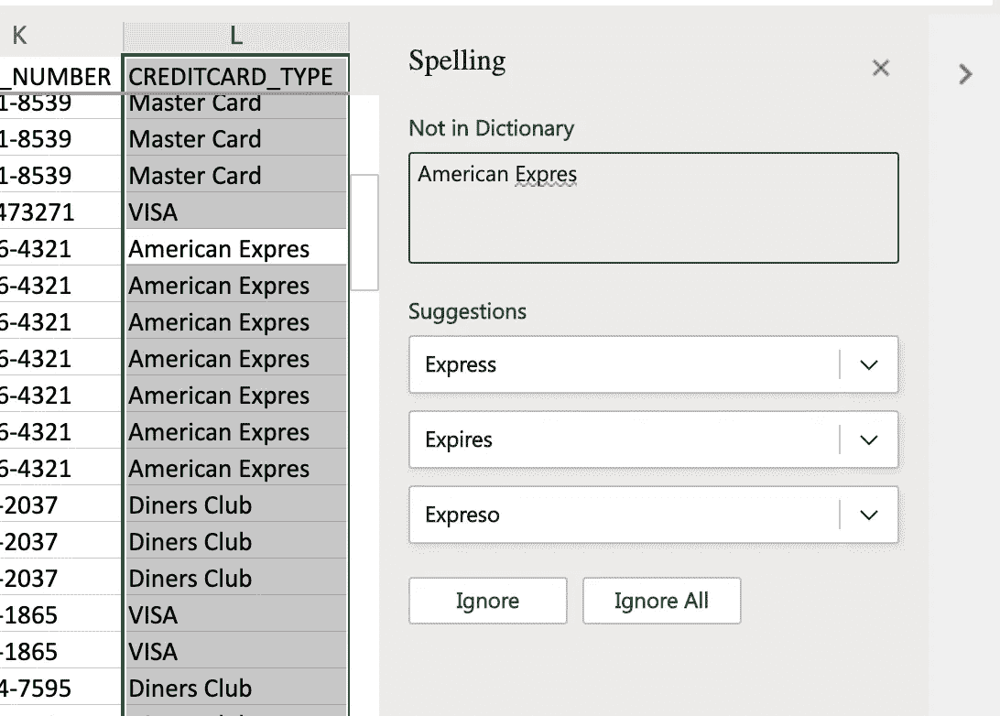
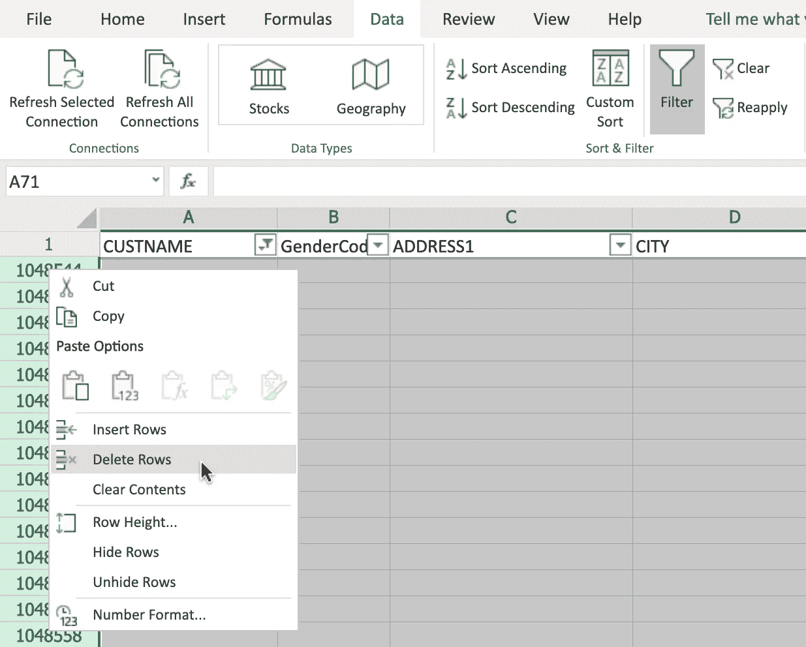
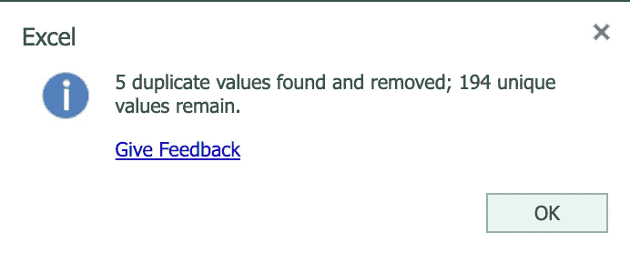

# Excel 基础—第 3 部分

> 原文：<https://medium.com/analytics-vidhya/excel-basics-part-3-a8967e4242f9?source=collection_archive---------16----------------------->

**好数据的五个特质:**

准确性、完整性、可靠性、相关性和及时性。数据分析师必须通过删除重复项、更正格式错误和删除空白行来清理数据集。

**删除重复或不准确的数据和空行:**

在收集或导入数据时，无论是通过正常流程还是自动化流程，都很容易在数据中发现错误和不一致之处。这可能很简单，如拼写错误、文本中使用的额外空格或大小写错误、数据中的空行或缺失值、不准确或重复的数据。数据中存在这些错误和不一致会导致公式不起作用、排序和过滤操作不成功以及数据结果的可视化和呈现不充分等问题。这些数据错误和不一致要求您执行某种形式的数据清理例程，以提高数据的质量和可用性。

**检查拼写:**

1.  选择拼写错误的列，然后单击**检查**选项卡并选择拼写。
2.  单击正确的建议来更改拼写。

**删除空行:**

1.  选择整个工作表，点击**数据**部分的**过滤器**。
2.  点击**全选**复选框，取消全选。然后只选择**空白**，然后**确定**。
3.  右键单击选中的行，然后单击**删除行**。
4.  最后，在**数据**选项卡上，点击**清除**，然后点击**过滤**。

我们要寻找的下一个不一致是重复的数据行，在导入的数据中存在重复的数据行是很常见的，这是由人工输入错误或导入过程中的错误引起的。

删除重复行:

1.  选择整个数据集。
2.  在**数据**选项卡上，点击**删除重复**。
3.  在移除重复对话框中，确保选中了**选择所有列**，并且也选中了**我的数据有标题**，然后单击**确定**。
4.  在弹出框中通知您找到并删除了多少重复值，点击**确定**。

在本文中，我介绍了数据分析所需的基本数据清理概念。

为了阅读以前的 Excel 基础文章，请访问下面的链接

 [## Excel 基础知识第 1 部分

### Microsoft Excel 是任何行业中使用最广泛的工具之一。虽然有些人喜欢玩枢轴表和…

spall6640.medium.com](https://spall6640.medium.com/excel-basics-part-1-e555fe1df917) 

[https://spall 6640 . medium . com/excel-basics-part-2-BD 2078 CDE 042](https://spall6640.medium.com/excel-basics-part-2-bd2078cde042)