# Excel，认识数据透视表

> 原文：<https://medium.com/analytics-vidhya/excel-meet-pivottables-547b78faaa20?source=collection_archive---------5----------------------->

## 强大的工具允许**计算**、**总结、&分析**数据

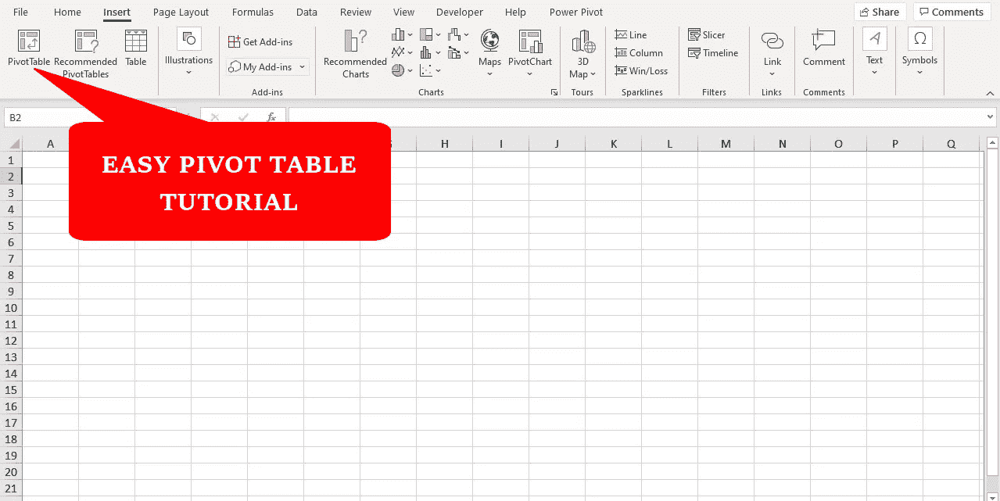

作者图片

数据透视表是一个强大的工具，可以**计算**、**汇总和分析**存储在表格中的数据，让你看到数据中的比较、模式和趋势。

假设你是 ABC 公司的数据分析师，经理带着问题来找你，想从销售数据中找到答案。因此，作为数据分析师，你的职责是首先清理数据，然后使用数据透视表汇总数据。

我将通过视频例子解释数据透视表的所有功能。在每个例子中，你都会学到一个新概念。所以请确保在整篇文章中保持注意力。链接到帖子中使用的[数据集](https://community.tableau.com/s/question/0D54T00000CWeX8SAL/sample-superstore-sales-excelxls)。

那么让我们开始吧

# 1)公司在每个类别中的总销售额是多少

选择您想要汇总的表格，然后进入**插入**选项卡，点击**数据透视表**将弹出显示*创建数据透视表*点击确定。

现在在右边，有"*数据透视表字段*"区域，拖动**销售，类别**列中的**值，行中的**节。

您可以更改数字格式，右击任意数字，选择**数字格式**选项**。**

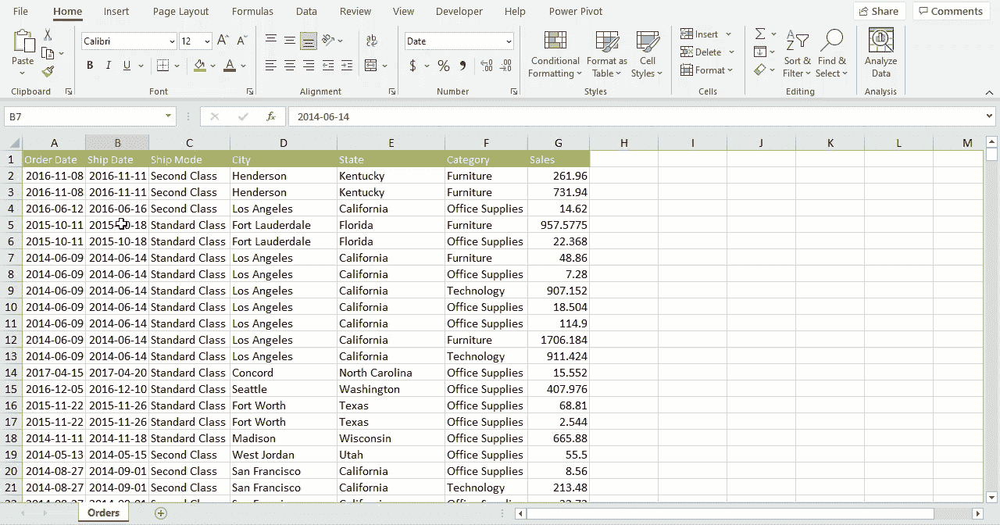

作者视频:示例 1-数据透视表(**数字格式**)

# 每个类别的最高销售额是多少

使用**销售、类别**列创建数据透视表。默认情况下，数据汇总为**和**(参考示例 1)。

现在右键单击数据透视表中的任意数字。选择**通过**汇总数值，并选择**最大值**选项，找出最高销售额。

您可以通过最小值、计数、平均值和更多可用选项来汇总值。

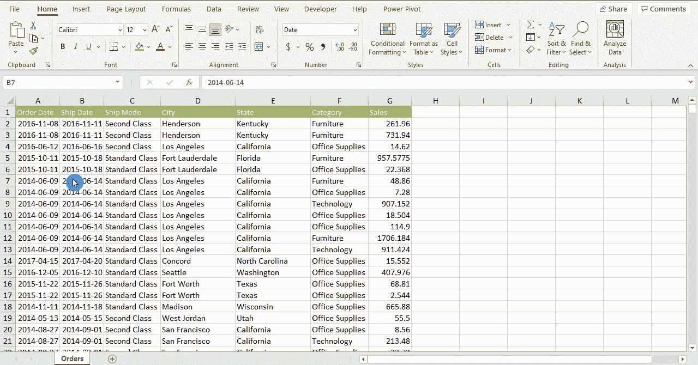

作者视频:示例 2-数据透视表(**汇总值依据)**

# 3)在每个类别中，每种发货模式产生的销售额占多少百分比

通过拖动**值、行、列**部分中的**销售、类别、发货模式**列来创建数据透视表。

现在右键单击数据透视表中的任意数字。选择**显示数值为**并选择 **%总计**选项，找出销售额的百分比**。**

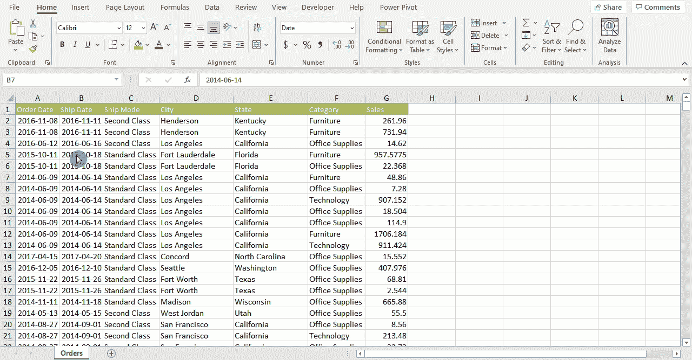

作者视频:示例 3-数据透视表(**显示值为**)

# 4)每个类别在加利福尼亚州的总销售额是多少(从最高到最低)

> **提示:**您可以使用**过滤器或切片器**过滤出加利福尼亚州的数据。

**方法一:过滤选项**

通过拖动**值、行、过滤器**部分中的**销售、类别、状态**列，创建一个数据透视表。

单击透视表上方的筛选器，并从列表中选择 California。一旦数据现在被过滤以将值从最高到最低排序，右击并选择 S**or**，然后**选择**从最大到最小排序。****

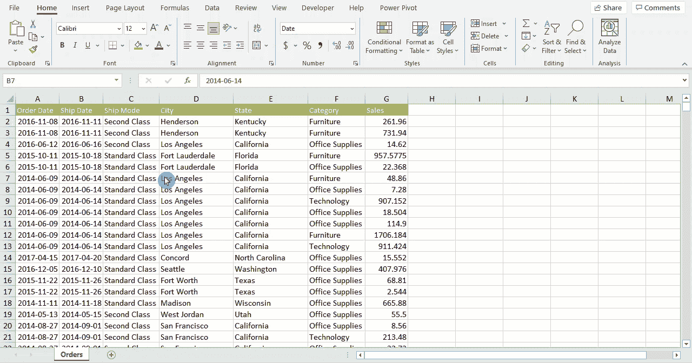

作者视频:示例 4.1-数据透视表(**过滤器选项**)

**方法 2:切片器选项**

你将看到如何使用**切片器**来过滤数据。

通过拖动**值、行**部分中的**销售、类别**列，创建一个数据透视表。

选择数据透视表中的任意单元格，转到**数据透视表分析**选项卡，并选择**插入切片器**选项。它将弹出列列表，选择州，然后选择加利福尼亚。

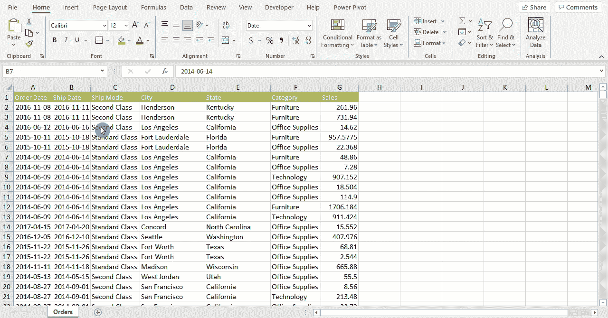

作者视频:示例 4.1-数据透视表(**切片器选项**)

# **5)洛杉矶和旧金山市在每个类别中的总销售额是多少(每个城市的报告不同)**

通过拖动**值、行、过滤器**部分中的**销售、类别、城市**列来创建数据透视表。

单击透视表上方的过滤器，并从列表中选择洛杉矶和旧金山。

进入**数据透视表分析**标签- > **数据透视表** - > **选项- >显示报表过滤页面。**

> **提示:**确保选中**选择多个项目**选项，以便您可以选择多个项目。

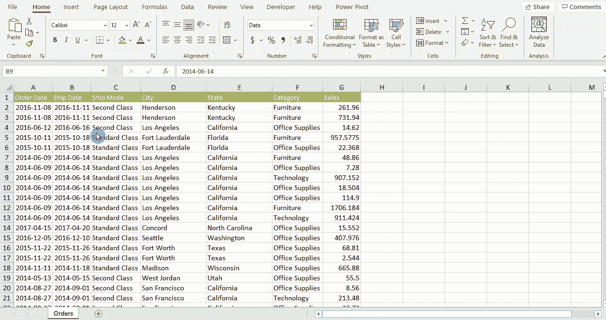

作者视频:示例 5-数据透视表(**显示报表过滤页面**)

# 6)分组

数据透视表数据可以分组，您可以对大多数项目进行分组，但日期是最常见的分组项目。

单击包含要分组的值的单元格，然后转到数据透视表分析选项卡，选择**分组选择或分组字段**选项。

在下面的示例中，默认情况下，日期分为年、季度和月。现在日期被分成年。

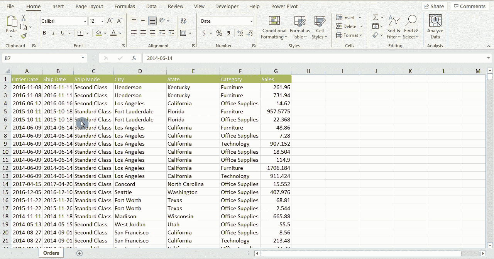

视频作者:透视表(**分组数据**)

> **提示:**
> 
> 要分组，选择有值要分组的单元格，右键单击并选择**分组**选项。
> 
> 要取消分组，选择包含要分组的值的单元格，右键单击并选择**取消分组**选项。

# 7)数据透视图

使用**销售、状态**列创建数据透视表。现在点击数据透视表，转到**数据透视表分析**选项卡并选择**数据透视图。根据您的要求选择您需要的图表。**

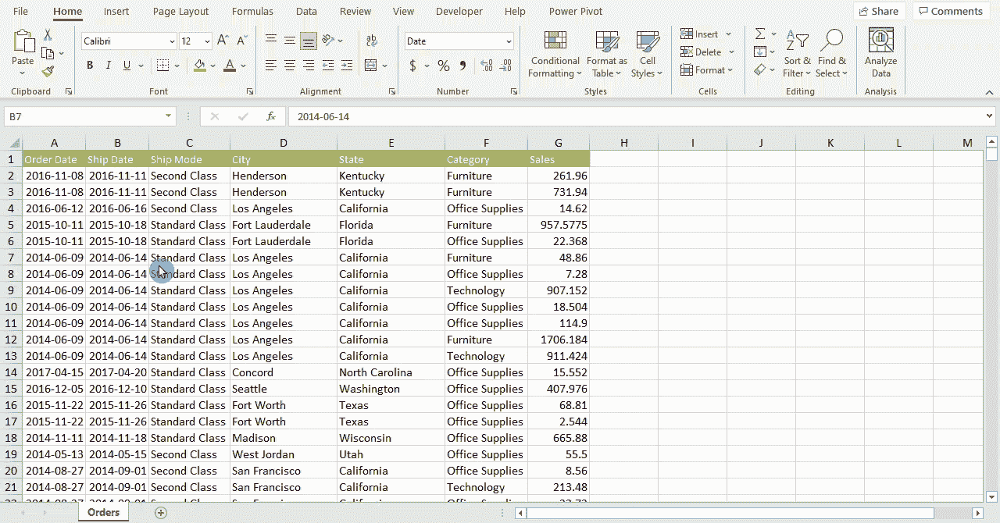

视频作者:**数据透视表**

# 8)刷新数据

情况 1:您希望编辑现有数据，并查看现有数据透视表中的更新。

**编辑数据- >选择数据透视表- >数据透视表分析选项卡- >选择刷新**

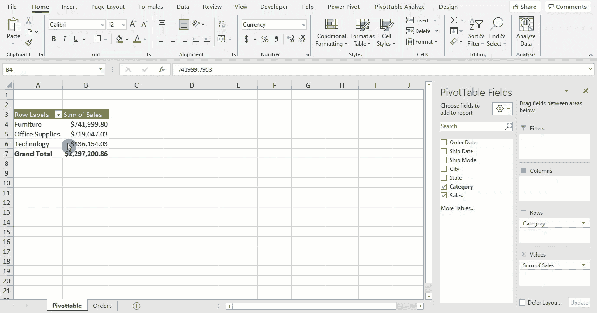

作者视频:透视表(**刷新编辑数据**

情况 2:您希望添加新数据，并查看现有数据透视表中的更新。

**添加新数据- >选择数据透视表- >数据透视表分析页签- >选择变更数据源**

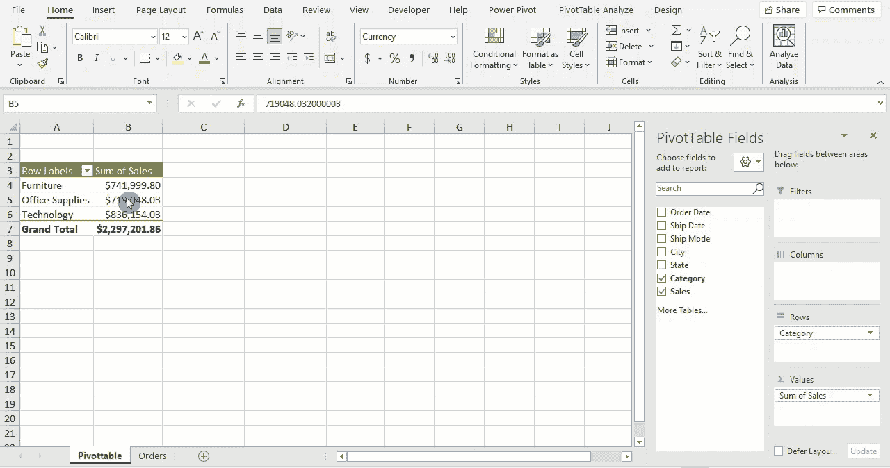

视频作者:透视表(**刷新新数据**)

数据透视表是必须的，如果你是数据分析师，在几下点击，你可以创建数据透视表，并看到数据的模式和趋势。

**感谢您的阅读:)**