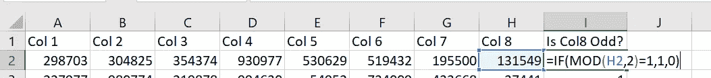
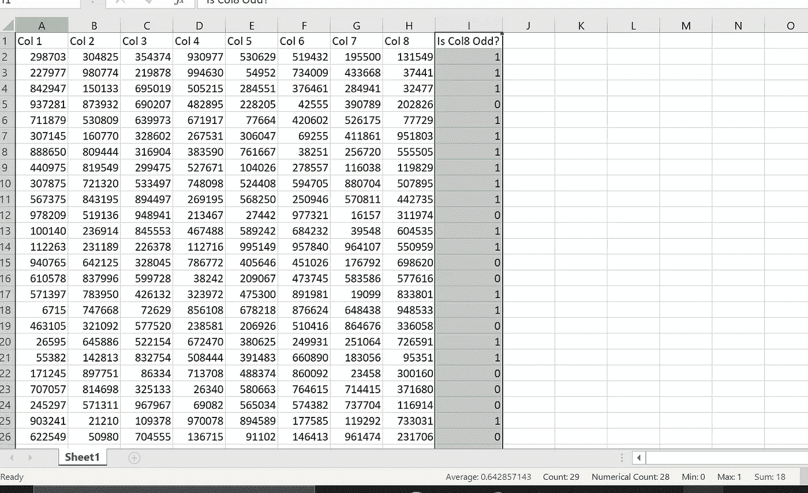
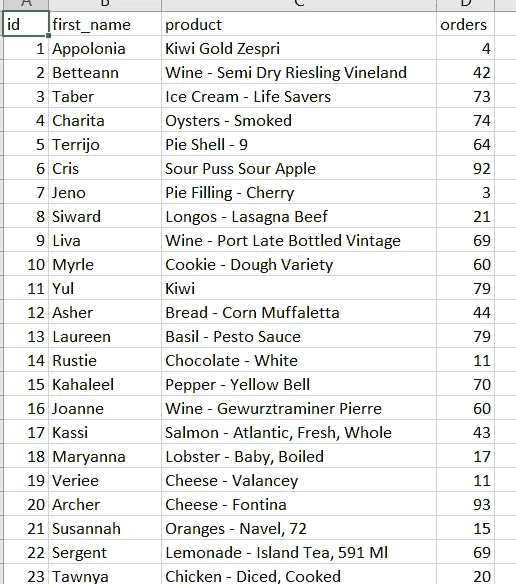
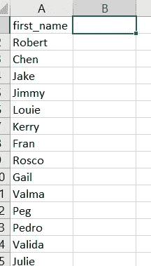
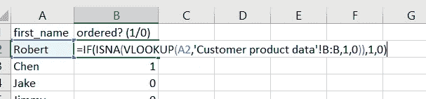
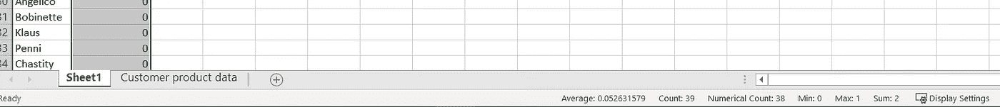
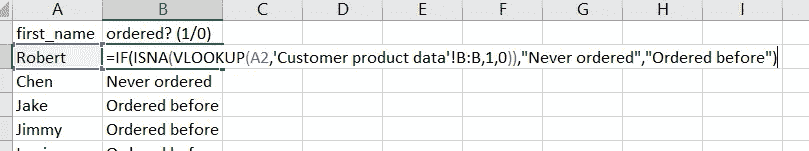
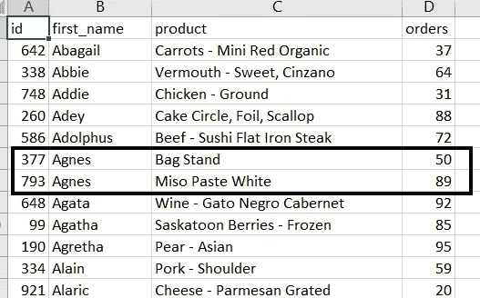
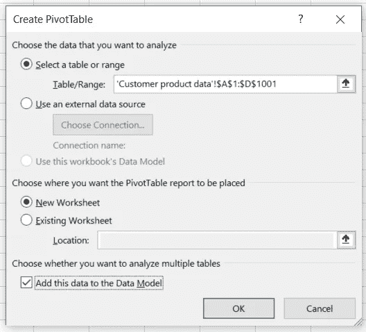
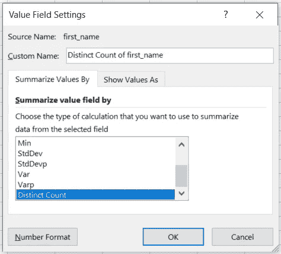

# Excel 提示和技巧第一部分

> 原文：<https://medium.com/analytics-vidhya/excel-tips-and-tricks-part-i-12dd13d564de?source=collection_archive---------17----------------------->

> 这些是 excel 中的一些技巧和窍门，我想我应该分享一下。有些比较明显，有些不明显，可能有助于任何使用该工具的人在使用 excel 时减少时间。

# ***1。*IF 语句:**

这是非常基本的一种。

可以用来检查一个条件，但是当我有很多行并且需要快速查看哪些行满足特定条件时，我喜欢使用它。

我首先使用 create condition 并指定 1 为真，0 为假。

条件来检查第 8 列的单元格中是否有奇数，如果有，则返回 1，否则返回 0。

然后，在将公式拖动到各行之后，只需选择整个列标题(即第 I 列)，这样下面状态栏中提到的总和将给出符合条件的行数以及符合条件的行的平均百分比。

您可以将鼠标悬停在状态栏上来定制这些功能，然后右键单击即可获得所有度量的下拉列表。选择你想要的——最小值、最大值、平均值和总和等。

如您所见，28 行中有 18 行满足条件，从平均值中我们得到 64.28%，这是满足条件的数据百分比。

# **2。如果，ISNA & VLOOKUP 函数组合:**

*我们都知道这些函数是独立的，但是我们可以联合使用这些函数，做真正有趣的事情。*

例如，您在 excel 工作簿中有客户级别的销售数据，并且有一个单独的客户列表，您不确定他们以前是否下过订单。如果您想快速确定哪一组客户有销售，那么 IF(ISNA(VLOOKUP()))在这种情况下非常有用。

这是我们的客户销售数据集，这将是我们的主数据集，我们需要从中检查新列表中的客户是否已经交易。

这是我们的客户列表，我们需要检查哪些客户已经下了订单，哪些没有。

使用 IF(ISNA(VLOOKUP()))我们可以分配一个 1/0 标志，看看客户是否已经下了订单，然后他们将被标记为 0 或 1。“客户产品数据”是上面提到的客户订单数据集。

通过突出显示列标题，您可以看到以前从未下过订单的客户的百分比(平均值)和计数(总和)。

如您所见，有 2 位客户之前没有下过订单。您还可以将输出更改为您想要的任何内容，即，如果我希望输出显示“从未订购”或“之前订购”，那么我将调整条件如下:

然后，您可以制作一个数据透视表来获得所需的计数。

# 3.数据透视表中的非重复计数:

*这是一个非常有用的功能，在使用数据透视表时默认情况下不可用。*

继续我们的客户订单数据集，让我们探索如何为 excel 中的特定列导出不同的条目计数。在上面提到的数据集中，如果我们想要找到已经下订单的客户的不同计数，那么进行计数是不够的，因为数据集是在客户产品级别，这意味着一个客户可以购买多个产品，因此同一客户将存在多个行，如下所示:

Agnes 购买了两种产品，此处重复。

为了获得客户的唯一计数，我们可以使用数据透视表中的 Distinct Count 函数。在直接创建数据透视表之前，请确保选中创建数据透视表对话框中的复选框**“将该数据添加到数据模型中”**。

创建包含数据透视表字段的新工作表后，您可以在“值字段设置”对话框中的“非重复计数”函数中进行选择。

然后，您会看到已下订单的独立客户的实际数量。

请继续关注更多 Excel 提示、技巧和案例。