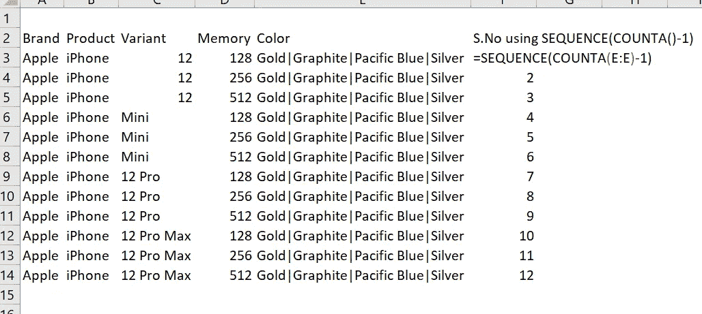

# Excel 提示和技巧第二部分

> 原文：<https://medium.com/analytics-vidhya/excel-tips-and-tricks-part-ii-ab5929c6c0cf?source=collection_archive---------12----------------------->

> 这些是 excel 中的一些技巧和窍门，我想我应该分享一下。有些比较明显，有些不明显，可能有助于任何使用该工具的人在使用 excel 时减少时间。
> 
> **第一部分:** [**Excel 小窍门第一部分:**](/analytics-vidhya/excel-tips-and-tricks-part-i-12dd13d564de)

[活动创建者](https://unsplash.com/@campaign_creators?utm_source=medium&utm_medium=referral)在 [Unsplash](https://unsplash.com?utm_source=medium&utm_medium=referral) 上拍摄的照片

# 1.excel 中的行定界数据:

*在处理基于产品属性的数据时非常有用。*

我们都知道如何根据特殊字符对列进行定界，但当您的数据具有多个属性时，行定界非常有用，例如:您想购买 iPhone 12，因此您将查看所有不同的可用型号——iPhone 12、iPhone 12 mini、iPhone 12 Pro、iPhone 12 Pro Max，每个变体都有自己独特的属性。

来自 Amazon.com 的照片

在选择手机后的产品页面上，您可以看到每个变体都有一个内存属性——128 GB、256 GB、512 GB，以及一个颜色属性——金色、石墨色、太平洋蓝、银色。

来自 Amazon.com 的照片

这个例子只是针对 iPhone，一些手机也有内存和摄像头规格。

为了节省空间，内存和颜色属性可能会通过一个特殊字符简化为数据集中的一个单元格，就像下面 iPhone 12 Pro 的截图中那样:

不同的内存和基于颜色的属性由“|”分隔，我们将使用它来划分和分解数据。

要对数据进行行定界，您需要使用 CTRL+T 将数据集转换为表格，一旦完成，它将显示如下:

数据集被转换为表。

然后打开**功率查询编辑器(数据>从其他来源获取数据>>来自表格/范围)**。打开后，您可以使用光标选择该列(您想要通过来定界)，因此在我的情况下，我将使用**内存来定界。**然后选择**通过分隔符分割列>**将会打开一个窗口，让您选择想要分隔的字符。

这通常是自动检测的。

在同一个窗口中通过**打开高级选项**并选择**行来划定整个表基础的一个属性。单击确定。**

默认设置为列，没有单独的行定界功能。

您会在 **Power Query Editor** 中看到，该表已针对每个可用内存选项的每一行进行了分解。点击**关闭&加载。**

你也可以对颜色做同样的事情，得到单独的内存和颜色行。

# 2.使用 SEQUENCE()自动生成序列号:

我过去在 excel 中创建序列号的效率是多么低。

这适用于您想要在空白表上创建序列号列的任何时候，或者适用于没有序列号列的数据集。
**低效的方法:**通常的方法是将第一个单元格赋值为 1，从第二个单元格开始，您可以使用=“第一个单元格引用”+1

然后把这个公式拖到最后。

但是这样效率不高，尤其是因为您必须手动拖动并选择公式。幸运的是，已经有一个函数可以做到这一点——“SEQUENCE([n 个数])”。

如您所见，您可以输入想要序列号的行数，它会自动填充到您的列中。

**使用 Sequence():** 让我们通过一个例子来探索这个函数，假设我们想要为上面使用的 iPhone 12 数据集分配一个序列号列，这可能会派上用场。

有 12 行数据点，所以我们增加了 12 行作为参考数字。

但是像这样使用它有一个明显的问题，如果数据是行偏移的，那么我们需要在公式中计算输入的行数吗？不是，那我们可以用 **COUNTA(【列范围】)**和这个连用。

“-1”是这里头的因子，否则我们将范围扩展到 13。

你内心的悲观主义者可能会提出一个有效的观点:“如果区间中间有一个空白怎么办？”然后，或者使用一个没有空白的不同范围，或者您可以使用涉及使用**间接+行**设置动态范围选择的公式来计算给定范围内的空白:

= SEQUENCE(COUNTA(E:E)-1**+count blank(INDIRECT(" D :D "&MAX(IF(is blank(E:E)，0，ROW(E:E)))))** )

或者最好只添加 1000 行，以防万一。

请继续关注更多 Excel 提示、技巧和案例。