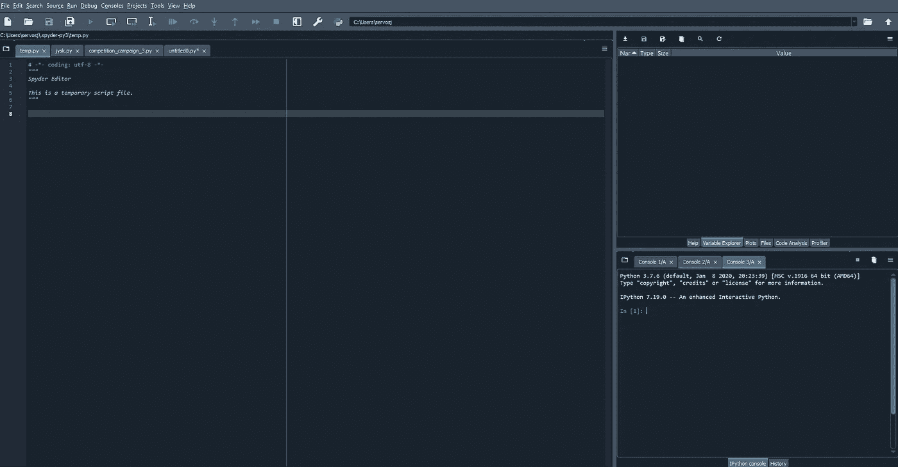
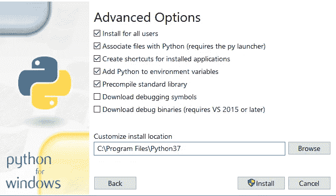

# 第 1 部分:安装 Python 和 IDE

> 原文：<https://medium.com/analytics-vidhya/excelython-part-1-install-python-and-ide-c09f723b232f?source=collection_archive---------28----------------------->

为了能够编写您的第一个脚本，您需要在您的系统中安装 Python。在本教程中，我将使用 Windows 操作系统。如果您的系统受公司管理，您可能需要获得 IT 部门的许可才能安装所提供的软件。

# **安装 Python 3.x**

## 第一步

目前，Python 的最新版本是 3.9.5。你必须访问 https://www.python.org/downloads/的 T2 才能得到最新的版本。

python.org 主页

## 第二步

点击黄色按钮，立即出现一个 **。exe* 文件将被下载到您的系统中。如果您需要安装其他版本的 Python，您可以找到以前的版本，您可以在同一页面中向下滚动，然后单击您想要的特定版本的下载按钮。

双击下载的文件，将出现以下屏幕。

勾选底部的复选框，“T6”将 Python 3.x 添加到路径，然后点击**自定义安装。**

在将出现的下一个屏幕中

选择与上述相同的框，并点击下一个的**。**

之后，将出现第三个屏幕，并选择您在下图中看到的选项。

点击**安装**，过一会儿你就会成为一名自豪的 Python 安装环境用户，可以使用！！

只需 3 个步骤！！！没什么大不了的！！

# 安装 Spyder IDE

## 第一步

在尝试了许多 IDE 之后，我得出结论，最适合商业用户工作方式的是 Spyder。

**IDE =集成开发环境*

** *如果您需要查看其他 IDE，请在 Google 中搜索“Python 的最佳 IDE ”,您会看到一些其他选项，但我建议您在学习的后期阶段尝试一下。*

访问 https://www.spyder-ide.org/并下载 Spyder 的最新版本。

下载完成后，双击文件并执行安装。这是下一个经典..然后..下次安装向导，不需要任何配置。

安装完成后，您就可以开始工作了！！！

—在您的工作站中设置 python 很难吗？

—我不这么认为。让我们继续前进！

[**转到第二部分**](https://servos-yiannis.medium.com/excelython-part-2-install-python-libraries-ebc74acdc202)