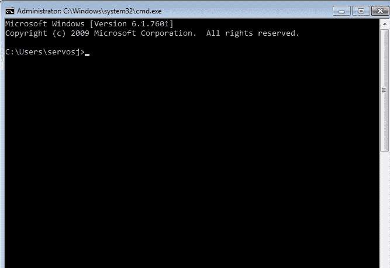
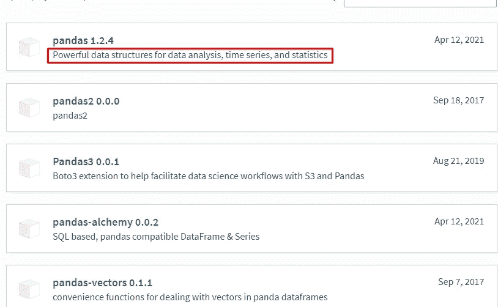

# 第 2 部分:安装 Python 库

> 原文：<https://medium.com/analytics-vidhya/excelython-part-2-install-python-libraries-ebc74acdc202?source=collection_archive---------27----------------------->


什么是 Python 库？

Python 库是预构建模块和函数的集合，因此用户不必编写所有核心代码来执行某个操作。

您的系统中安装了 Python 发行版的标准库和 3d Party 库，您需要在系统中安装这些库才能运行脚本。

作为商业用户，您需要的最常见的库是:

1.  熊猫
2.  Numpy
3.  Matplotlib
4.  要求
5.  SciPy

还有更多的，但是您将在您的道路上进一步发现它们，这取决于您希望您的脚本运行的级别。

让我们看看您将如何安装库。

# 安装一个库

## 第一步

打开命令提示符窗口。你可以通过按键盘上的 **Windows 按钮(** *左下角，Alt* **旁边)+ R** 来实现。或者你可以打开 ***运行*** app。然后将会打开以下窗口


在字段中输入单词 **cmd** 并按 **OK。**

## 第二步

按下“确定”后，屏幕上将弹出以下窗口。



为了确保你输入了正确的库名，你可以在你的书签中放入下面的站点:[https://pypi.org/](https://pypi.org/)

所有可用的图书馆都在那里。让我们试着找到并安装**熊猫**库。在搜索栏中输入单词“**熊猫**”。然后你会看到一个包的列表。选择并点击带有突出显示描述的**熊猫**包装



在库页面你会看到最新版本，一个简短的描述和软件包的发布历史。您需要做的只是复制您需要在系统上打开的命令提示符窗口中键入的命令。

格式应该是这样的: **pip 安装库 _name ==版本** *(版本部分可选)*。


那样的话就是:

```
pip install pandas #if you need the latest version, or 
pip install pandas == 1.2.4 #if you need to install a specific version
```


并按下**键进入**。

该库将成功安装到您的系统中，然后您就可以导入它了。

我们旅程的另一个艰难的部分结束了！！！！！！！

[**转到第 3 部分**](https://servos-yiannis.medium.com/excelython-part-3-project-description-846ec03504c0)