# Excel thon—第 4 部分:用 Python 读取 Excel 文件

> 原文：<https://medium.com/analytics-vidhya/excelython-part-4-read-excel-files-in-python-ca9f86986f5f?source=collection_archive---------16----------------------->


# 项目描述

你在一个采购团队工作，你想检查你的销售和库存，你可能有未完成的订单，你需要下新订单的地方，以及哪些产品需要你注意，因为它们是滞销品。

在您完成所有下载、处理和评估后，您需要通过电子邮件向另一位同事发送一份文件，其中包含所有产品，按供应商和订购量分列在不同的表格中，您还需要一份单独的 excel 文件，其中包含库存超过 4 周的产品，按前 20 名的成本价值排序，以便创建一份推动销售或将其返还给供应商的计划。

# 项目步骤 1

首先，我假设您有几个文件，每个文件都包含不同的信息，您需要下载、打开、处理和保存这些文件。

对于我们的项目，我将使用下面的模拟数据文件:

1.  **销售文件**,包含过去 4 周售出的单位

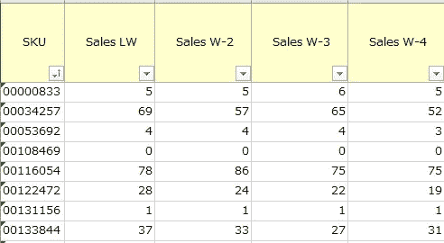

文件形状= 5 列 x 10.000 行

2.每个 SKU 仓库中的当前库存

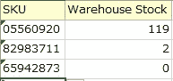

文件形状= 2 列 x 10.000 行

3.商店的当前库存和每个 SKU 的最低库存水平

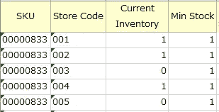

文件形状= 4 列 x 100.000 行

4.SKU 的待定订单

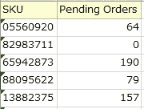

文件形状= 2 列 x 10.000 行

5.每 SKU 成本

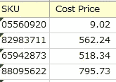

文件形状= 2 列 x 10.000 行

6.SKU 供应商

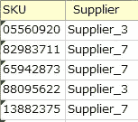

文件形状= 2 列 x 10000 行

全部打开。

> 您可以下载。xlsx 文件中有所有的样本数据 [**这里有**](https://drive.google.com/file/d/1p9lQh6LMkhh_zyr3dRdbfNKrM-murCxf/view?usp=sharing)

## Excel 步骤 1

从您的 BI 系统下载并打开以上所有文件。

## Python 步骤 1

正如我们在[**excel thon-Part 2:Install Python Libraries**](https://servos-yiannis.medium.com/excelython-part-2-install-python-libraries-ebc74acdc202)中所说，我们需要在每个脚本的开头导入我们将要使用的库。

现在是时候导入您的第一个库了。我们要导入的库是 [**熊猫**](https://pandas.pydata.org/docs/getting_started/index.html) 和**[**Numpy**](https://numpy.org/learn/)**。****

```
import pandas as pd
import numpy as np
```

**正如你在上面的代码中注意到的，我们导入了这个库，并且我们定义从现在开始我们将用更短的名字 **pd** 和 **np** 来调用它。这是为了节省打字时间。您可以随意称呼它们，但最好使用这些全局简称。**

**下一步是导入文件。我们在 Python 环境中导入的 excel 文件是作为数据帧导入的。什么是数据帧？excel 中的电子表格是一个数据框架。它是一个包含列和行的数据表。**

**该代码的结构如下:**

**定义 dataframe = **pd** (熊猫简称)的**名**。**read _ excel**(r“file . xlsx 的完整路径”)。**

```
File_1 = pd.read_excel(r"C:\path to folder of the file\file1_name.xlsx")File_2 = pd.read_excel(r"C:\path to folder of the file\file2_name.xlsx")File_3 = pd.read_excel(r"C:\path to folder of the file\file3_name.xlsx")File_4 = pd.read_excel(r"C:\path to folder of the file\file4_name.xlsx")File_5 = pd.read_excel(r"C:\path to folder of the file\file5_name.xlsx")File_6 = pd.read_excel(r"C:\path to folder of the file\file6_name.xlsx")
```

**此时你可能会问，我到底怎么才能找到文件路径呢？**

**如果您导航到您的文件位置，右键单击您要打开的 excel 文件，单击属性，选择选项卡:安全性，选择对象名称旁边的路径，从开始到文件扩展名所在的结尾，全部复制并粘贴到您的编辑器。**

**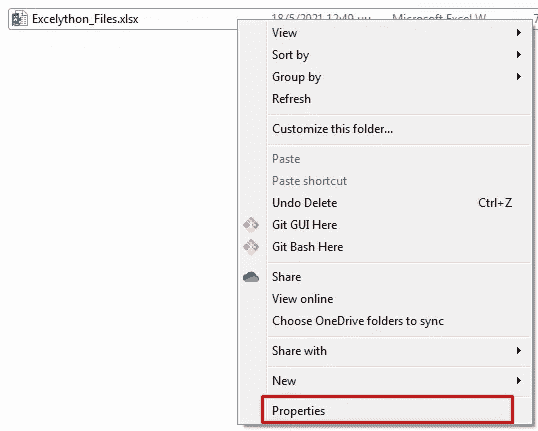****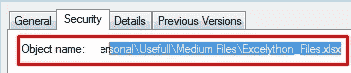**

**让我们用 Spyder 编写上面的代码，运行它，看看会发生什么。**

**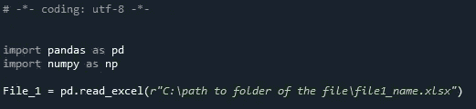**

**通过高亮显示来选择所有线。**

**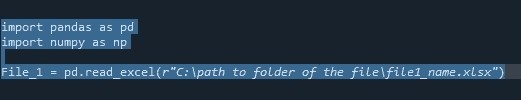**

**单击导航面板中的“运行选择或当前行”按钮。**

****

**瞧啊。！！！！！！**

**在右侧面板中的变量资源管理器选项卡下，您将看到导入 File_1 产生的数据帧。**

**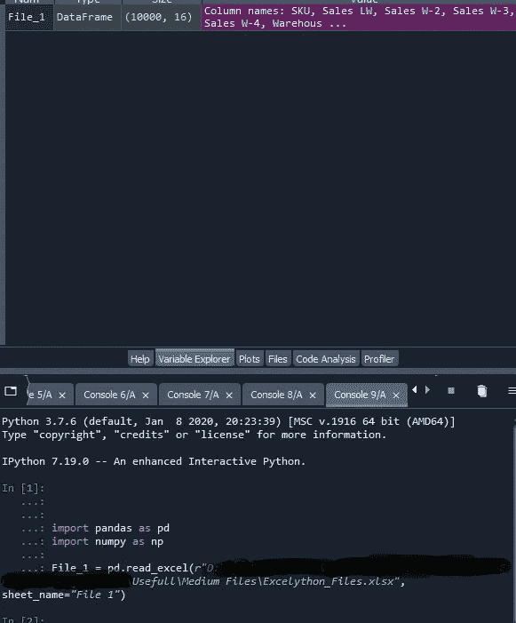**

**如果双击 DataFrame 行，可以看到一个弹出窗口，显示 python 读取的实际数据。**

**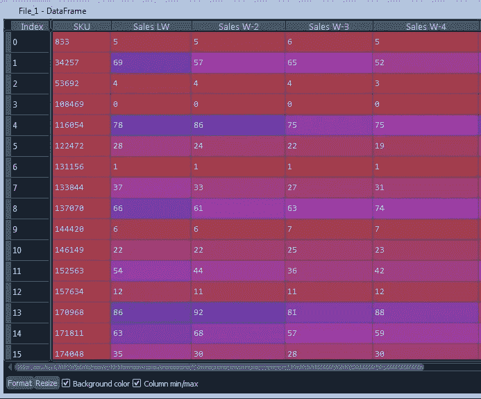**

**如您所见，我们导入了一个包含索引、excel 中的列名和数据值的表。**

**不同的是，在我们的 excel 中，SKU 是一个 8 位数的文本。Python 将其转换为数字。**

**转换回 8 位数真的很容易，但是我们会在另一部分做。**

**一旦你把所有文件导入的完整代码放在上面的代码框中，你就成功地导入了我们需要的 6 个文件。**

**pd.read_excel()是一个非常强大的函数。有些情况下，您有一个 excel:**

1.  **有多个工作表，您需要导入一个特定的工作表。有一个参数 sheet_names = "NameofSheet "，可以处理这个请求。**
2.  **您需要获取 excel 的特定列。参数 usecols 将帮助您。**

**还有很多其他特殊情况需要你去解决，而且肯定有解决方案。到目前为止，在我想知道 Python 是否能帮助我的 100 件事情中，可能有 1-2 件是我找不到 Python 解决方案的。**

**下一步，我们将看看我们能做什么，excel 的圣杯。**

**Python 中的 VLOOKUP**

**问候**

**[**转到第 5 部分**](https://servos-yiannis.medium.com/excelython-part-5-vlookup-in-python-251952a8c114)**