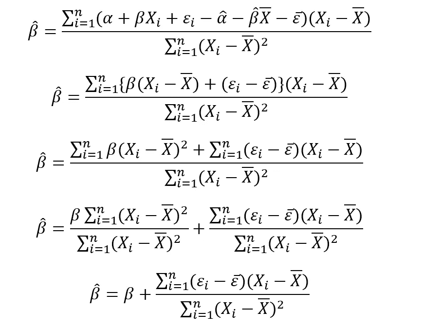
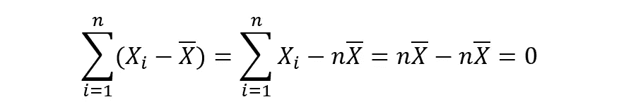
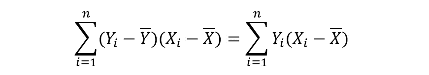

# OLS 估计的期望和方差

> 原文：<https://medium.com/analytics-vidhya/expectation-variance-of-ols-estimates-9acd2b48a635?source=collection_archive---------0----------------------->

在我之前的一篇文章中，我已经得到了简单线性回归的 OLS 估计。我将尝试更深入一点，解释这些估计的更多特征。

如前所示，一个简单的回归模型表示为:

这里，α和β是回归系数，即需要计算以了解 y 和 x 之间关系的参数。I 与 x 和 y 一起标有下标，表示我们指的是特定的观察值，即与 x 和 y 相关的特定值。εᵢ是与每个观察值 I 相关的误差项

使用一些数学上的严格性，导出了回归系数α和β的 OLS(普通最小二乘)估计。在 OLS 方法下，我们试图找到一个函数，使 Y 的真实值与 Y 的预测值之差的平方和最小化。α和β的估计值如下:

这里，α-hat 是α的估计值，β-hat 是β的估计值。在进一步深入之前，有必要探索一下期望和方差的一些基本概念和性质:

# **随机变量的期望**

随机变量 X 的期望很像它的加权平均值。如果 x 有 n 个可能的结果 X₁，X₂，X₃，…，Xₙ，发生概率 P₁，P₂，P₃，…，Pₙ，那么 x 的期望值(或其期望值)定义为:

随机变量期望的性质；

1.  常数的期望值就是常数本身，

1A 房产

2.对于两个随机变量- X & Y，它们和的期望之和等于它们的期望之和。换句话说，

2A 房产

3.如果 Y = aX + b，则 Y 的期望值定义为:

物业 3A

4.如果 Y = a1X1 + a2X2 + … + anXn + b，则 Y 的期望值定义为:

4A 房产

5.如果 X 和 Y 是两个独立变量，那么它们的乘积的期望等于它们的期望的乘积:

物业 5A

# **随机变量的方差**

随机变量 x 的方差被定义为 x 的不同值与平均 X̅.的偏差平方的期望值它显示了随机变量的分布有多广。它表示如下:

随机变量方差的性质；

1.  常数的方差为零，即，

1B 物业

2.对于两个独立的随机变量- X & Y，它们和的方差等于它们方差的和。换句话说，

2B 物业

注意:在期望中，即使随机变量不是独立的，上面的表达式也是正确的，但是方差的表达式要求随机变量是独立的。对于非独立变量，和的方差表示如下:

其中，Cov(X，Y)称为 X & Y 的协方差。协方差用于描述两个变量之间的关系。其定义如下:

3.如果 Y = aX + b，则 Y 的方差定义为:

3B 物业

4.如果 Y = a₁X₁ + a₂X₂ + … + aₙXₙ + b，那么 y 的方差定义为:

财产 4B

5.如果 Y=CᵢXᵢ，那么

如果 Cov(Xᵢ，Xᵢ) = 0，我们得到

财产 5B

这个属性可能看起来不是很直观。然而，它将在推导β-hat 的方差中起主要作用。

6.计算随机变量 X 的方差的一个非常简便的方法:

财产 6B

现在，我们将使用上述一些属性来获得α-hat 和β-hat 的期望值和方差的表达式:

# **对β-hat 的期望**

如前所示，

等式 1

众所周知，

等式 2

对双方都很刻薄，

等式 3

将上述等式代入等式 1，

等式 4

注:β-hat 为估计值，β为回归系数的真值。现在，我们将计算β-hat 的期望值:

如上所述，β是回归系数的真实值。这使得它成为一个常数。常数本身就是常数的期望(1A 性质)。我们现在可以使用属性 3A 来进一步求解:

上述等式基于我们在整个简单线性回归中所做的假设，即误差项的期望值将始终为零。这给了我们以下简单的表达式:

等式 5

# **对α帽子的期望**

如前所示，

此外，在推导α-hat 的 OLS 估计值时，我们使用了以下表达式:

等式 6

将等式 3 中的 Y̅值代入上述等式，我们得到:

等式 7

计算α-hat 的期望值，

使用属性 2A，我们获得下面的等式:

这里，α、β和 X̅是常数，并且可以使用性质 3A 来分离。如前所述，基于我们的假设，E(ε-bar)=0。从等式 5 中代入 E(β-hat ),

等式 8

所以，α和β的期望值都等于它们的真实值。这样的结果似乎很熟悉。这是无偏估计量的特性。θ的无偏估计θ-hat 将始终显示以下性质:

因此，我们已经证明了 OLS 估计是无偏的，这也是统计学家如此广泛使用它们的几个原因之一。继续讨论方差:

# **β-hat 的方差**

使用等式 1，

等式 9

现在，非常重要的一步是:

等式 10

对于任何变量，

等式 11

因此，等式 10 的第二项被取消，我们得到:

将其代入等式 9，

注意:该表达式的分母是一个常数，因此根据 3B 性质，当我们将它从方差表达式中取出时，它将被平方。

从等式 2 中代入 Yᵢ的值，

让，

上述项是一个常数。所以，利用 1B 的性质，Var(k) = 0。因此，我们得出以下等式:

我们现在将使用属性 5B。此外，我们还应当使用 Cov(εᵢ的假设，εⱼ)=0(对于 I 不等于 j)。所以，我们得到了，

同样，σ(xᵢ—x̅)是一个常数，根据性质 3B，当我们将其从方差中取出时，它将变成平方:

通过恒定方差假设，Var(εᵢ)=σ(一个常数)。因此，我们得到:

我们还定义:

最后，我们得出:

等式 12

于是，经过密集的数学运算，我们得到了β-hat 的方差。伟大的壮举！现在继续:

# **α-hat 的方差**

α-hat 的方差定义如下:

等式 13

根据等式 7，

将该表达式代入等式 13，

再一次使用 2A 房产:

等式 14

现在，我们将计算 E[ε-bar(β-hat-β)]。根据等式 2，

根据等式 11，

同样，根据定义，

等式 15

关于替代，我们得到，

因为，

根据等式 11，

等式 16

将其代入等式 14，

使用公式 12 和公式 15，

使用 3B 房产，

误差项ε₁、ε₂,…、εⱼ是独立的。因此，使用 2B 财产，

再一次，通过恒定方差假设，Var(εᵢ)=σ(一个常数)、

等式 17

这就是我们试图推导出的表达式。

**奖励概念:**那是一个很长的推导过程。很累，我必须说。让我们通过一个小而有趣的推导来总结一下——α-hat 和β-hat 之间的协方差:

根据等式 7，

使用等式 16，

根据定义，

使用等式 12，

搞定了。

# **结论**

下表总结了我们推导出的所有主要最终方程:

