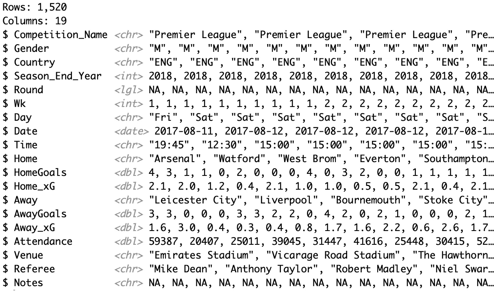
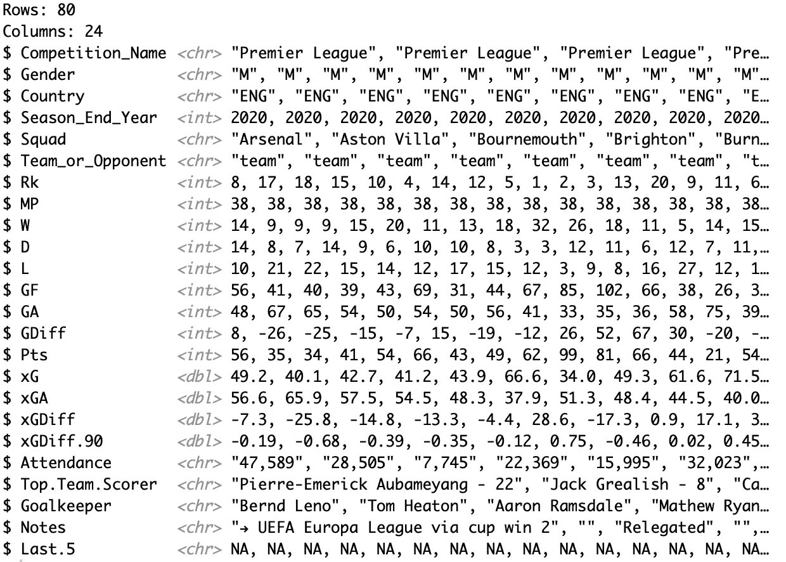
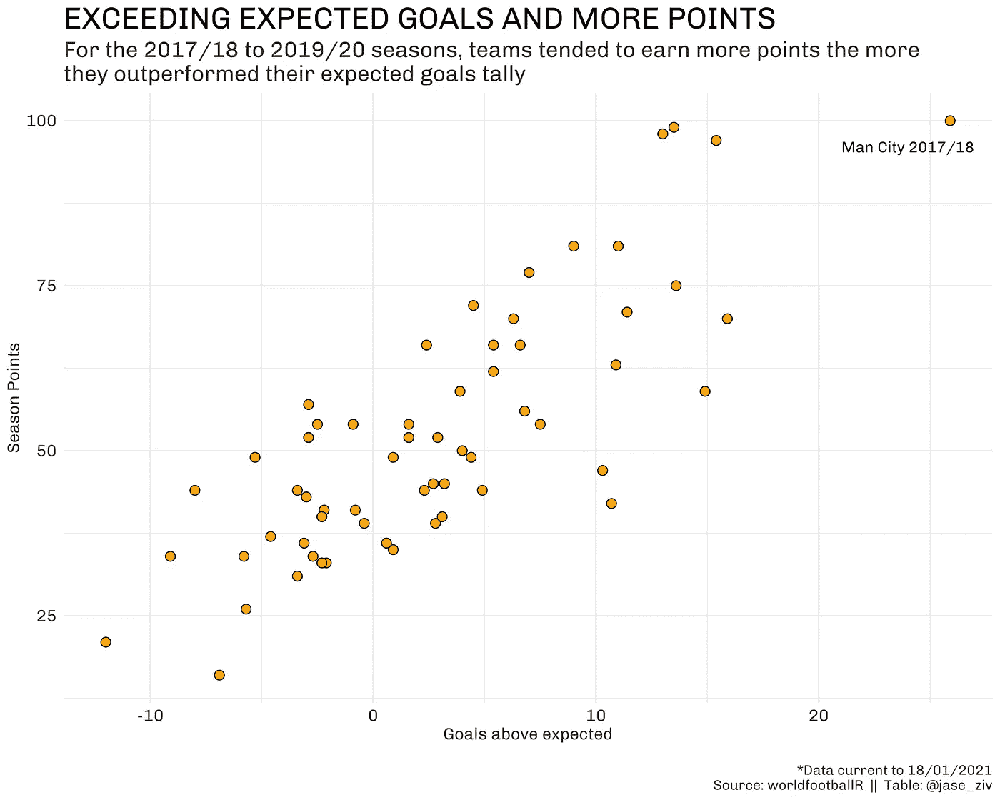
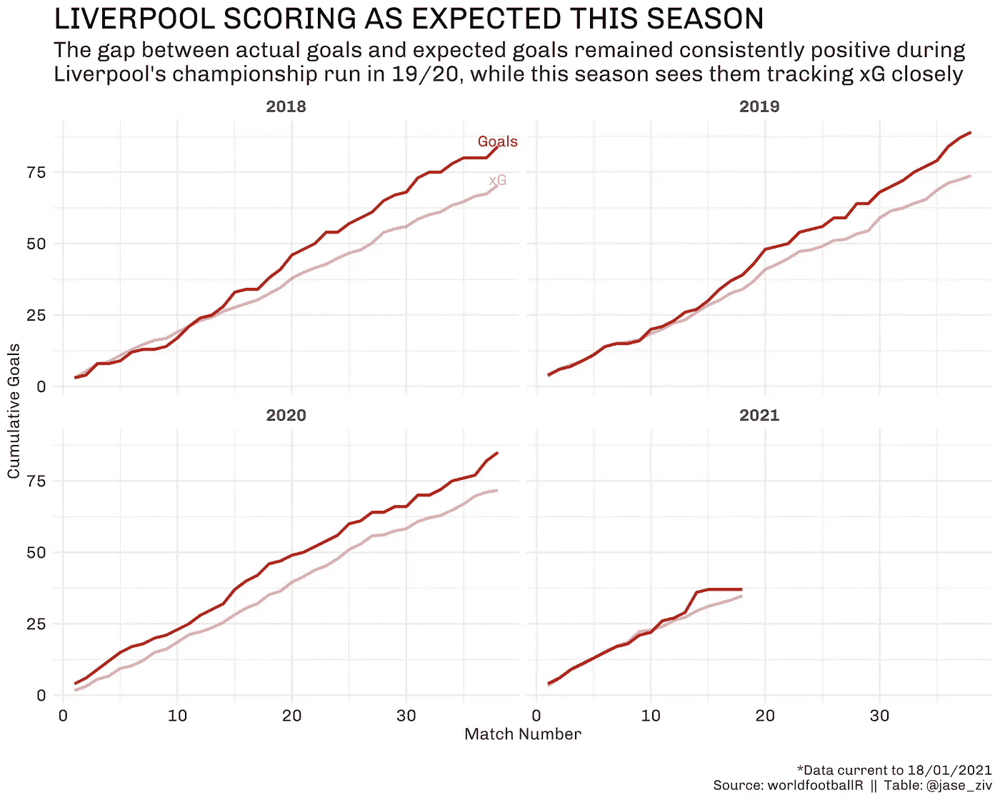

# 预期目标和利物浦——世界足球先生简介

> 原文：<https://medium.com/analytics-vidhya/expected-goals-and-liverpool-an-intro-to-worldfootballr-da1f02c17622?source=collection_archive---------16----------------------->

## 这篇文章是一系列文章的继续，旨在展示从流行的数据网站 fbref.com 提取世界足球数据的新的`[worldfootballR](https://github.com/JaseZiv/worldfootballR)` R 包。


worldfootballR 套餐

这篇文章旨在分析预期目标和实际目标，主要集中在利物浦。

本赛季，利物浦将与几支希望背靠背的球队竞争。我想看看红军本赛季的得分与过去几个赛季相比是否有所不同。

# 使用`worldfootballR`提取数据

和往常一样，我们首先安装软件包(如果您还没有这样做的话),并加载分析所需的任何库。

```
devtools::install_github("JaseZiv/worldfootballR")
**library**(tidyverse)
**library**(worldfootballR)
```

为了获得比赛结果，包括进球和 xG 数据，我们可以使用函数`get_match_results()`。因为我们希望它用于男子超级联赛，所以我们将以下值传递给该函数的参数:

```
xg_data <- get_match_results(country = "ENG", gender = "M", season_end_year = c(2018:2021))
```

我们还可以看到数据的样子:



`get_match_results()`的输出

要获得赛季排名表(包含支持和反对的进球，以及预期进球)，我们可以使用`get_season_team_stats()`函数，并将以下值传递给函数参数:

```
end_season_summary <- get_season_team_stats(country = "ENG", gender = "M", season_end_year = c(2018:2021), stat_type = "league_table")
```

并检查数据:



`get_season_team_stats()`的输出

# 分析

那么预期目标是什么呢？来自 [Opta 体育](https://www.optasports.com/services/analytics/advanced-metrics/)；

> 预期进球(XG)根据几个变量来衡量射门质量，如助攻类型、射门角度和距离球门的距离、是否是头球射门以及是否被定义为大概率射门。
> 
> 将一名球员或一支球队的预期进球加起来，可以给我们一个指标，说明在给定他们的射门次数的情况下，一名球员或一支球队平均应该进多少球。

为什么我们在这篇文章中关注预期目标？

从下面可以看出，在 2017/18 至 2019/20 赛季，球队得分超过预期目标的越多，他们在赛季结束时的积分就越多，这表明了一种相当强的正相关关系。



# 红军追踪的怎么样了？

这就把我们带到了利物浦。下面我们可以绘制出利物浦在过去四个赛季的每场比赛后的累积进步，可以看到在本赛季之前的三个赛季中，红军都超过了他们的预期进球数，上赛季的冠军球队超过了他们整个赛季的预期进球数。



本赛季，除了在塞尔赫斯特公园球场 7-0 大胜水晶宫(xG 为 2.2)之外，利物浦的进球数与预期目标非常接近。本赛季红军射手们只是不能转化那些罪恶感边缘的机会，这可能解释了榜首的挣扎。

# 包裹

这是一系列分析中的第二篇文章，这些分析将利用 worldfootballR 包中的各种数据提取功能。

在这里，我们看到利物浦似乎已经回归到平均水平，并努力获得比他们预期的高得多的分数，这是基于他们的投篮。这与前三个赛季的进球超过预期形成对比。

一如既往，任何关于作品或 R 包的问题/评论，请随时通过常规渠道联系。

这篇文章的完整版本出现在 dontblamethedata.com 的这里