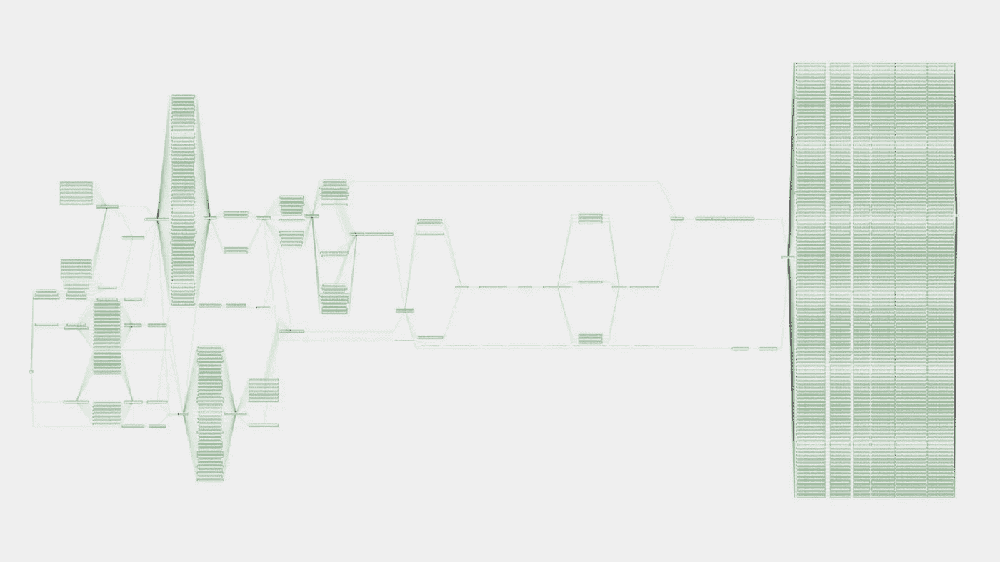
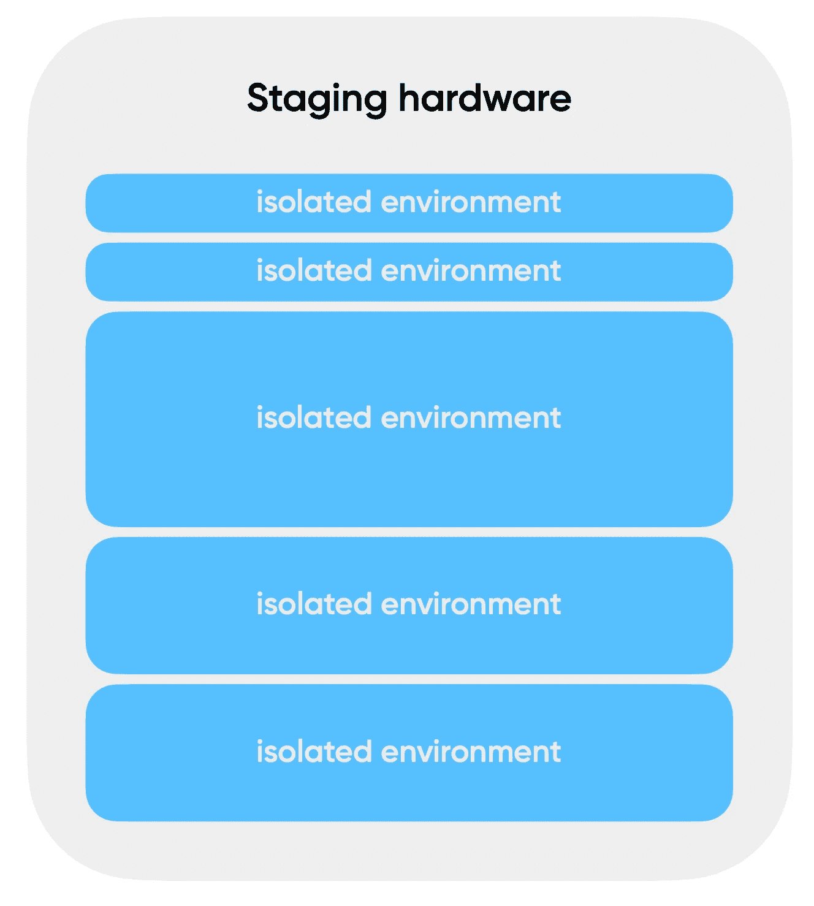
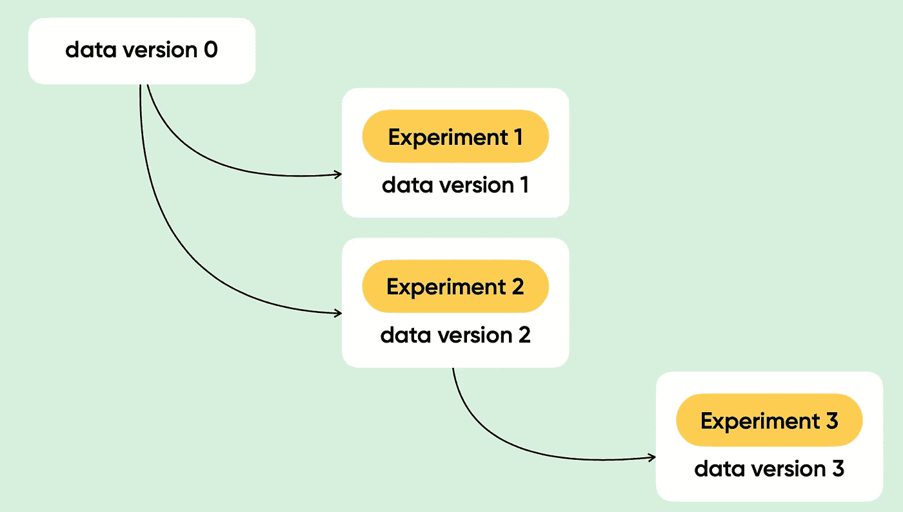

# 大数据管道实验

> 原文：<https://medium.com/analytics-vidhya/experiments-in-the-big-data-pipelines-dcfd4e9c9efc?source=collection_archive---------3----------------------->

在我们的世界中，数据管道可以有不同的形式。有时，这可能是一个简单的 ETL 工作，但根据我的经验，您可能会面临一个巨大的数据管道。例如:

阿帕奇气流的 DAG

是阿帕奇气流的 DAG(有向无环图)。我们还可以将这个 DAG 暗示为一个数据管道，其中每个节点都是一个作业。作业是一种处理数据的方法。这意味着我们的 DAG 包含大量这样的方法。

我们想改进我们的一种方法，因为我们渴望变得越来越好。在这种情况下，我们应该应对一些障碍，其中最重要的是*对最终结果的影响估计*。我们如何能够估计在我们的情况下的影响？我们有一个巨大的渠道，有大量的工作岗位。当我更改其中一个节点时，这种更改将会影响所有相关的其他节点(作业)。由于我想预测对我的最终结果的影响，这看起来不是一个简单的任务。

让我们介绍一下这个概念，作为当前故事的一个*实验*。*实验*是改变方法论的数据处理并分析这些改变对最终结果的影响的过程。这意味着我们应该研究如何试验我们的数据管道。

我们想进行实验。我们应该考虑一些选择。

1.  试着在生产中进行这个实验。
2.  用生产的拷贝或样本创建一个隔离的环境。
3.  集成数据版本管理方式。

## 试着在产品上进行这个实验。

这是最危险也是最漫长的选择。我们可以将我们的实验版本部署到生产中，并计算我们的管道。之后，我们可以分析结果，如果我们对这样的结果满意，我们需要发布这个版本，并将结果发送到 date mart 或类似的地方。这里有一些我们可以面对的问题。第一个是*中断你的生产*，第二个是*不成功的实验*。在第一种情况下，我们可以花很多时间修复您的生产环境。在第二个选项中，您应该准备好使用以前的版本重新计算您的管道，以恢复到旧的方法。既然我们在谈论大数据，这可能需要很多时间。

## 用生产的拷贝或样本创建一个隔离的环境。

这是一个很好的选择，因为我们不能分解我们的生产。我们可以创建一个隔离的环境，在其中部署服务副本，并将数据样本上传到隔离的 env。隔离的 env 可以只是一个临时环境，或者您可以提供一个更好的解决方案。对于隔离的 env，更好的解决方案是容器化和编排。在这种情况下，您只需要将所有服务容器化，并将数据上传到隔离的 env 的过程自动化。此外，您将能够在一个硬件上设置几个独立的 env。有了这些东西， [docker swarm](https://docs.docker.com/engine/swarm/) 或者 [Kubernetes](https://kubernetes.io/) 真的很好的帮到你。这里的优点是几个隔离的环境可以处理多个实验。

一个硬件上的隔离环境。

这里有一些缺点。

*   *资源需求*:你应该提供巨大的硬件来处理多个隔离的 env。
*   数据上传:这可能需要很长时间，尽管我们上传了数据样本。
*   实验信任:由于我们对数据样本进行实验，这可能会导致生产中的意外行为。

## 集成数据版本管理方式。

在我看来，这是最有趣的选择。关键的想法是，我们可以在生产的同时进行实验，而不会对我们的生产产生任何影响。一个隔离的环境将是这个选项的一个很好的补充。

看起来你可以像 git 一样处理数据。您有一个在主分支中存储所有中间结果的生产管道，以及一个在开发分支中存储中间结果的隔离环境中的管道。该隔离环境可以在生产硬件上或任何其他地方，但是该隔离环境应该能够访问支持数据版本控制的生产存储。如果您喜欢来自开发分支的结果，您可以将开发合并到 main，并在生产中更新您的工件。您不需要进行任何重新计算来将更改集成到生产中。如果您看到实验不成功，您可以删除分支并删除隔离的 env。

数据版本控制。

你可以使用 [LakeFS](https://lakefs.io/) 或者 [Apache Nessie](https://projectnessie.org/) 来处理数据版本。目前，这些技术有一些局限性。例如，LakeGS 只能与对象商店合作: [Minio](https://min.io/) ， [AWS S3](https://aws.amazon.com/s3/) 等。Apache Nessie 可以处理特定的数据格式，如[三角洲湖](https://delta.io/)和[冰山](https://iceberg.apache.org/)。

## 结论

进行的实验是你可能面临的一个不小的陷阱。各队尽了最大努力来克服这个障碍。我相信你可以找到或已经找到更多关于如何在大数据管道中进行实验的想法。我只是和你分享一些我认为应该注意的选择。

感谢您的宝贵时间！