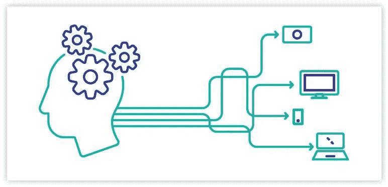
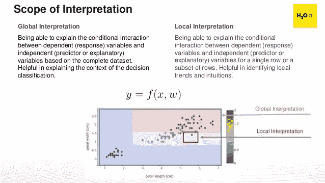
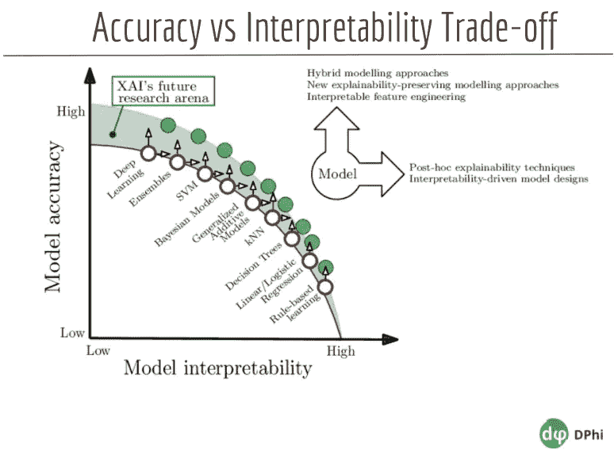
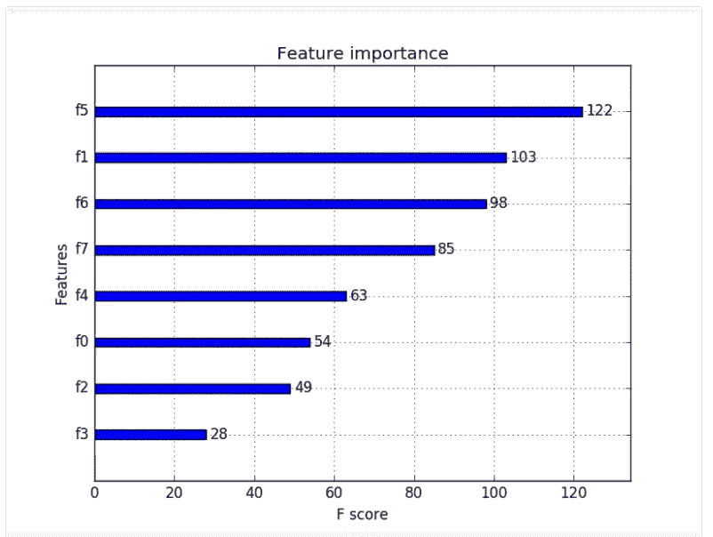
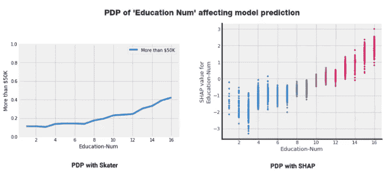
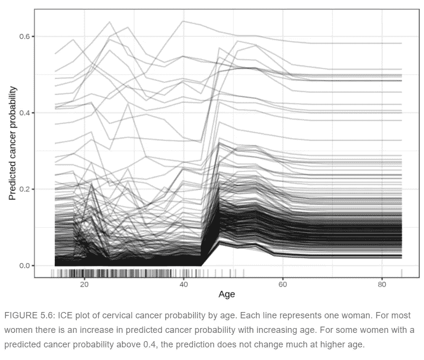

# 用可解释的人工智能解释你的模型是如何工作的

> 原文：<https://medium.com/analytics-vidhya/explain-how-your-model-works-using-explainable-ai-c7cefc42fde?source=collection_archive---------12----------------------->

# 你能解释一下你的模型是如何工作的吗？

人工智能技术被用来解决现实世界的问题。我们获取数据，执行一些操作以使其干净，并为后续流程做好准备。

我们基本上是从这个世界中挑选东西，然后由 T2 把它们带入机器的世界，用数字来表示，然后输入给一堆模型。尝试改进它们，最终*【获胜者模型】*得到测试数据。一个至关重要的问题浮现在脑海中:

> "我们如何把这个结果带回现实世界？"

可解释的人工智能(有一个更酷的名字:XAI)

**正式定义**:根据维基百科，可解释的 AI 是指人工智能技术应用中的方法和技术，使得解决方案的结果可以被人类理解。[1]

在人工智能采用的早期阶段，不理解模型以某种方式预测什么是没关系的，只要它给出正确的输出。解释它们是如何工作的并不是首要任务。现在，焦点转向建造*的人类可解释模型。*

> **模型解释的三个重要方面是:
> 1。透明度
> 2。质疑的能力
> 3。容易理解。[2]**

*模型的可解释性可以从两个层面进行检查:*

*   ***全局解读:**从更广阔的视角审视模型。例如，假设我们正在处理一个房价数据集，并且我们实现了一个神经网络。全局解释可能会说“您的模型使用平方英尺数作为一个重要特征来获得预测”*
*   ***局部解读:**顾名思义，这种方法是聚焦于某一个观测/数据点。让我们继续我们的例子。对一栋非常小的房子的预测变成了大房子。当地的解释着眼于其他特征，它可能会说“你的模型是这样预测的，因为房子的位置非常靠近市中心。”*

**

*来源:[斯里安巴蒂，抓住 MLI](https://www.slideshare.net/0xdata/get-handson-with-explainable-ai-at-machine-learning-interpretabilitymli-gym)*

# *准确性和可解释性之间的权衡*

*在行业中，您会经常听到**业务利益相关者倾向于更易于解释的模型**，如**线性模型(线性\逻辑回归)**和**树**，这些模型直观、易于验证，并向非数据科学专家解释。[2]*

*相比之下，当我们查看真实数据的复杂结构时，在模型构建和选择阶段，人们的兴趣主要转移到更高级的模型上。这样，我们更有可能获得更好的预测。*

*像这样的模型(集成、神经网络等。)被称为**黑箱**模型。随着模型越来越先进，解释它的工作原理变得越来越困难。输入神奇地进入一个盒子，瞧！我们得到了惊人的结果。*

**但是，怎么会呢？**

*当我们向涉众推荐这个模型时，他们会完全信任它并立即开始使用它吗？**否**。他们会问问题，我们应该准备好回答他们。*

> *我为什么要相信你的模型？*
> 
> **为什么模型要做某个决定？**
> 
> **是什么驱动了模型预测？**

*我们既要考虑提高模型的准确性，又不能迷失在解释中。两者之间应该有一个平衡。*

**

*来源:[dpi 高级 ML 训练营——可解释 AI](https://dphi.tech/lms/learn/ml-bootcamp-advanced/687) [2]*

*在这里，我想分享迪潘詹·萨卡尔[中帖](https://towardsdatascience.com/human-interpretable-machine-learning-part-1-the-need-and-importance-of-model-interpretation-2ed758f5f476)中关于可解释 AI 的一句话:*

> *任何机器学习模型的核心都有一个响应函数，它试图映射和解释自变量(输入)和因变量(目标或响应)之间的关系和模式。[3]*

*因此，模型接受输入，并对其进行处理以获得输出。*如果我们的数据有偏差怎么办？*也会让我们的**模型偏向**并因此**不可信**。了解&能够向我们的模型解释很重要，这样我们也可以相信他们的预测，甚至可以在向他人展示之前发现问题并解决它们。*

*为了提高我们模型的可解释性，有各种各样的技术，其中一些我们已经知道并实现了。传统技术是探索性数据分析、可视化和模型评估指标。在他们的帮助下，我们可以了解模型的策略。然而，它们有一些局限性。要了解更多关于传统方式及其局限性的信息，请查阅 Dipanjan Sarkar 的这篇令人惊叹的文章。[4]*

*已经开发了其他模型解释技术和库来克服限制。其中一些是:*

*   ***LIME** (本地可解释的与模型无关的解释)*
*   ***SHAP** (沙普利补充说明)*
*   ***ELI5** (像我 5 岁一样解释)*
*   ***滑冰者***

*这些库使用特征重要性、部分相关图、个体条件期望图来解释不太复杂的模型，如线性回归、逻辑回归、决策树等。*

***特征重要性**显示了特征对模型的重要性。换句话说，当我们从模型中删除特征时，我们的误差如何变化？如果误差增加很多，这意味着特征对于我们的模型预测目标变量是重要的。*

**

*来源:机器学习掌握， [XGBoost 特征重要性条形图](https://machinelearningmastery.com/feature-importance-and-feature-selection-with-xgboost-in-python/)*

***部分相关图**在其他一切保持不变的情况下，可视化某个特性的变化效果(用一个更酷的说法:其他条件不变)。在这些的帮助下，我们可以看到一个可能的极限值，当超过这个值时，它会将模型预测引向另一个方向。当我们可视化部分依赖图时，我们是在全局地检查模型。*

**

*来源:Dipanjan (DJ) Sarkar，[模型解释策略](https://towardsdatascience.com/explainable-artificial-intelligence-part-2-model-interpretation-strategies-75d4afa6b739)*

***单个条件期望图**显示了某个特性变化的影响，就像部分依赖图一样。但这一次，观点是地方性的。我们有兴趣看到某个特性**的变化对我们数据**中所有实例的影响。部分相关图是 ICE 图中各条线的平均值。[5]*

**

*来源:Christoph Molnar，[可解释的机器学习——让黑盒模型变得可解释的指南](https://christophm.github.io/interpretable-ml-book/)*

*在解释更高级的模型时，使用了模型不可知(不依赖于模型)技术。*

***全球代理**模型采用原始输入和你的黑盒机器学习预测。当这个新数据集用于训练和测试适当的全局代理模型(更可解释的模型，例如线性模型、决策树等)时。)，它基本上试图*模仿你的黑盒模型的预测*。通过解释和可视化这个*“更容易”*的模型，我们可以更好地理解我们的实际模型是如何以某种方式进行预测的。*

*其他可解释性工具有 **LIME、SHAP、ELI5** 和 **SKATER** 库。我们将在下一篇文章中通过*引导的实现*来讨论它们。在那之前，我会分享一些我用来写这篇文章的惊人资源以及一些额外的链接。敬请关注下一篇帖子，到时见！*

**快乐学习！**

# *参考*

*[1]维基百科，可解释 AI，[https://en . Wikipedia . org/wiki/explable _ artificial _ intelligence](https://en.wikipedia.org/wiki/Explainable_artificial_intelligence)*

*[2]dpi Tech，可讲解的人工智能课程，[https://dphi.tech/lms/learn/explainable-ai/563](https://dphi.tech/lms/learn/explainable-ai/563)*

*[3] Dipanjan (DJ) Sarkar，人类可解释机器学习的重要性，[https://towardsdatascience . com/Human-Interpretable-Machine-Learning-part-1-The-need-and-Importance-of-model-interpretation-2ed 758 F5 f 476](https://towardsdatascience.com/human-interpretable-machine-learning-part-1-the-need-and-importance-of-model-interpretation-2ed758f5f476)*

*[4]迪潘詹(DJ)萨卡尔，模型解释策略，[https://towards data science . com/explable-artificial-intelligence-part-2-Model-Interpretation-Strategies-75d 4 afa6b 739](https://towardsdatascience.com/explainable-artificial-intelligence-part-2-model-interpretation-strategies-75d4afa6b739)*

*[5] Christoph Molnar，可解释的机器学习——让黑盒模型变得可解释的指南，2019，
[https://christophm.github.io/interpretable-ml-book/](https://christophm.github.io/interpretable-ml-book/)*

**原载于 2021 年 1 月 7 日 https://www.analyticsvidhya.com**的* [*。*](https://www.analyticsvidhya.com/blog/2021/01/explain-how-your-model-works-using-explainable-ai/)*