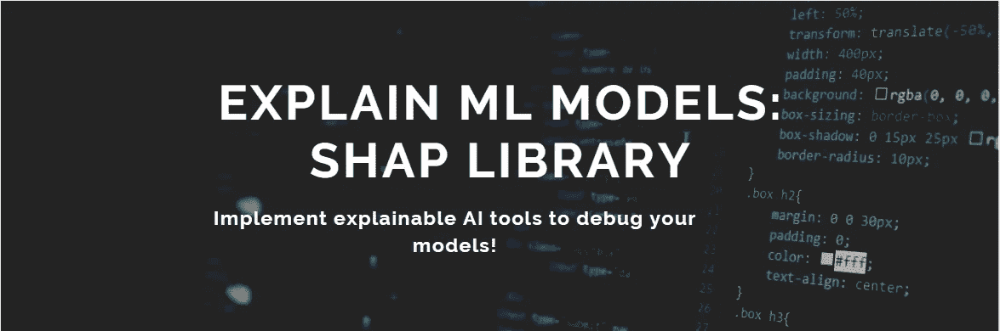
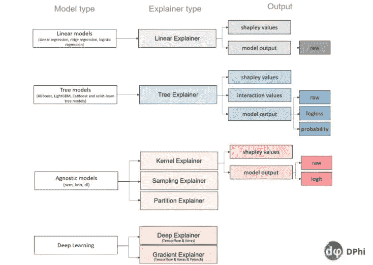
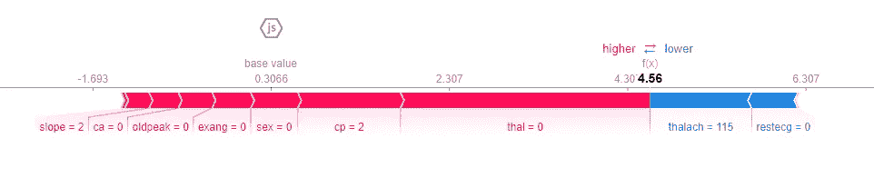
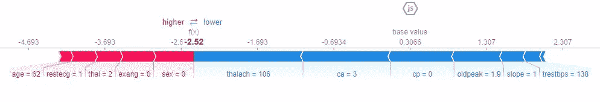
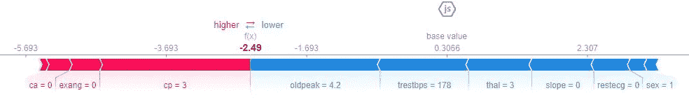
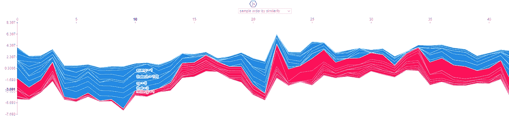

# 解释 ML 模型:SHAP 图书馆

> 原文：<https://medium.com/analytics-vidhya/explain-ml-models-shap-library-5ce375c85d7d?source=collection_archive---------4----------------------->

换句话说，SHAP(Shapley Additive Explanations)是一个用来理解*你的模型如何以某种方式*进行预测的工具。在 [**我的上一篇博客**](/analytics-vidhya/explain-how-your-model-works-using-explainable-ai-c7cefc42fde) 中，我试图解释解释我们模型的重要性。现在我们将在 act 上看到一个可解释的 AI 库，并一起在数据集上实现它。如果你对可解释人工智能一无所知，继续阅读我的*“解释你的模型如何使用可解释人工智能工作”。*

作为数据科学家，我们应该能够“调试”我们的模型，使其可以理解。利益相关者和客户都会有问题，我们应该能够回答他们。在许多场景中，我们处理的模型具有相互冲突的目标，可解释性和准确性需要权衡。所以我们要用一个度量来比较这些模型，选择一个**精确的**和**可解释的**模型。

当我们试图解释我们的模型时，我们做了什么？我们将数据可视化，查看特征，并尝试了解哪些特征对模型很重要。*每个特征在某种程度上都有助于预测。*确定贡献有多种方法。我们将讨论劳埃德·沙普利提出的方案。他介绍了一种在游戏中公平分配玩家点数的方法。这个*“公平”*是根据一个数学公式确定的。这里我们就不为它的计算费心了。阅读克里斯托夫·莫尔纳尔的《可解释机器学习》一书中的这一章,了解更多细节。[1]

Shap 库是按照上面解释的逻辑开发的工具。它对特征使用这种*公平信用分配方法*，并计算它们在最终预测中的份额。在它的帮助下，我们可以*“调试”我们的模型，观察它是如何借助 Shapley 值以某种方式预测一个观察值的。*

*在最一般的形式中，**Shapley 值是一个特征值在所有可能的联合中的平均边际贡献**。如果有 N 个要素，Shapley 值将从 N！不同的阶次组合，所以就产生了模型 *NP-hard* 的问题。Shap 库免除了我们所有的计算细节，并且非常快速地完成了计算。与其他方法相比，它既方便又可靠，因为数值是根据可靠的理论计算的。*

> *将**的预测解释为特征值玩的游戏**是令人兴奋的。[1]*

*为了演示如何使用它，我们将通过*“机器学习训练营-高级课程”*使用由 DPhi 社区提供的心脏病预测数据集。挑战的链接是[这里的](https://dphi.tech/practice/challenge/51#problem)。*

***链接到代码:***

* [## 心脏病预测 SHAP XAI

### 使用 Kaggle 笔记本探索和运行机器学习代码|使用来自非数据源的数据

www.kaggle.com](https://www.kaggle.com/semanurkps/heart-disease-prediction-xai-shap) 

我们不会深入讨论 EDA 和模型构建的细节，您可以按照笔记本上的步骤进行操作。我们的重点将完全放在 SHAP 的模型解释上。

我们用我们的数据建立了一个逻辑回归模型，并获得了 86%的准确率。现在我们将尝试理解我们的模型是如何形成其预测的。

安装并导入库

由于逻辑回归属于“线性模型”范畴，我们将使用线性解释器。对于不同的模型类型，SHAP 也有不同的解释:

[DPhi 高级机器学习课程，第 12 天，第 14 张幻灯片](https://dphi.tech/lms/learn/machine-learning-bootcamp/825)

让我们建立我们的解释器模型。

上述矩阵包括我们的“SHAP”值。它们基本上是代表那些特征在确定该行中的患者是否患有心脏病时的**重要性的系数。正值表示预测值为 1，负值表示预测值为 1。**

Shap 库为数据集中的每个观察值(行)计算一个**“基值”**。这个基值可以解释为线性回归模型中的β_ 0 系数(截距)。如果我们不知道与该观察相关的任何特征，我们将得到这个值。

当我们试图*【调试】*一个模型时，有两种基本方法，局部和全局解释。

*   *局部解释*:每一行都有它的系数，它们向我们展示了相关特征是如何对特定行的预测做出贡献的。
*   如果我们想看到*全局*(整体)特征重要性，我们可以对 shapley 值求和，并分别对所有列进行平均，而不是局部检查。

**对于复杂模型**更容易关注**局部解释**。您的模型输出的期望值是我们的参考值。对于特定的观察，我们将查看它是否超过或落后于这个基础值，然后尝试找出哪个特征驱动模型在那里进行预测。

对于观测值，每个要素的值对基值有正或负的贡献。当这些贡献对一个观测的所有特征进行求和时，我们可以看到我们离基准值有多远。shap 库中的力图很好地将它可视化。现在，我们将检查 3 个不同的观察结果，特别是第一、第五和第六个。我们为什么选择他们？

> 第一个病人**有心脏病**模型**预测正确**。
> 第五个病人**没有心脏病**模型**预测正确。**
> 第六名患者**患有心脏病**但模型**预测健康。**

Shap 使用 javascript 来形成其漂亮的可视化效果。有时它会导致错误，我们无法从 colab 或任何其他平台看到可视化效果。我建议您下载笔记本并在本地 IDE 中运行它们，以获得最佳效果。

让我们仔细看看第一个病人，为什么这个人有心脏病？这是病人的数据。

要了解特性代表什么，请查看[此链接中的元数据。](https://dphi.tech/practice/challenge/51#data)

力图中的红色特征使我们的预测为 1:病人有心脏病。**箭头越大，该特征对预测的影响越大。**最有贡献的特征如下: *thal，cp，sex，exang，oldpeak，ca，slope。*

蓝色特征表示降低患者心脏病存在概率的特征。该患者的 *Thalach* 和 *restecg* 。

患者的 thal 值为零，胸痛类型为 2，性别为女性，运动诱发的心绞痛为 0 (exang)，oldpeak 为 0。很明显，所有这些特征促使病人患心脏病。Thalach(达到的最大心率)和 restecg(静息心电图结果)对其有所帮助，但它仍然远离正方向的基础值。所以病人有心脏病。

第五个病人没有心脏病，模型设法正确识别它。

取消对这些行的注释，并在您的 IDE 中运行它。你会得到下面的力图。

可以看出，thalach、ca、cp、oldpeak 特征将模型从基值向负方向驱动。它将患者归类为健康。

模型将第六个病人归类为健康的，而实际上病人患有心脏病。让我们试着找出原因。

取消对这些行的注释，并在您的 IDE 中运行它。你会得到下面的力图。

我们可以看到，值向负方向走得很远。该模型的一个强有力的驱动因素似乎是负面的 oldpeak、trestbps 和 thal。但患者有第三型胸痛。

让我们来看看该患者的**决策图**。决策图有助于我们了解模型是如何完成决策的。它非常类似于力图，但更容易阅读。我们可以根据特性对模型的重要性对它们进行排序。我们甚至可以显示多个观察结果，并突出显示其中的特定观察结果(例如，错误的预测可以在所有观察结果中突出显示)。

“logit”选项将值转化为概率。在这里，我们可以看到，当一个人患病时，为什么模型预测他是健康的。

既然我们已经从局部的角度研究了这个模型，我们可以转向全局的解释。我们功能的重要性列举如下。

功能按最重要到最不重要的顺序排列。

显示要素重要性的另一种方法是使用不同样式的汇总图。

这样，我们可以看到每个特征的边界。如果 cp 的 shapley 值是<1 it drives model to predict healthy aand when it exceeds this value, it contributes to predict heart disease.

**依赖图**是从全局角度解释模型的另一种方式。可以同时对一个或多个要素进行绘图。它基本上是一个散点图的特点和他们的沙普利值为每一个观察。

我们可以观察到 chol(胆固醇)和它的 shapley 值(它对模型预测的贡献)之间存在线性关系。

依赖图的属性如下:

*   **ind** :想要的特性的索引，这里是 chol
*   **interaction_index** :用于显式设置哪个特征用于着色。
*   **shap_values** :我们之前生成的 shap 值矩阵
*   **特性**:用于生成依赖图(X_test)的数据。

**双向 PDP** (部分相关性图)显示了基于 shapley 值的两个特性之间的关系。

在这个图中我们可以看到胆固醇和年龄的关系。不出所料，存在线性关系。

我们也可以在一个图表中反映所有观测值的力图。它产生了一个非常全面的图形，有下拉过滤器。这里您可以看到由于 javascript 错误导致的代码快照。

总而言之，shap 是一个强大的库，可以帮助我们调试和解释模型的行为。随着模型变得越来越先进，解释它们的兴趣也增加了。这是数据科学爱好者可以添加到简历中的一项非常酷的杰出技能。在这篇文章中，我们分享了它的一些功能来帮助你开始使用它。请务必查看下面共享的资源，对它的其他功能做更多的研究，下载代码，并随心所欲地使用它们！

快乐学习！

**链接代码:**[https://www . ka ggle . com/semanurkps/heart-disease-prediction-xai-shap](https://www.kaggle.com/semanurkps/heart-disease-prediction-xai-shap)

# 参考

[1] Christoph Molnar，可解释的机器学习——让黑盒模型变得可解释的指南，2019，[https://christophm . github . io/interpreable-ml-book/Shapley . html # Shapley](https://christophm.github.io/interpretable-ml-book/shapley.html#shapley)

[2]dpi Tech，可讲解的 AI 课程，[https://dphi.tech/lms/learn/explainable-ai/563](https://dphi.tech/lms/learn/explainable-ai/563)

[3]斯科特·伦德伯格，微软研究院——用沙普利值解释机器学习，[https://youtu.be/ngOBhhINWb8](https://youtu.be/ngOBhhINWb8)

[4][https://slund Berg . github . io/shap/notebooks/plots/decision _ plot . html](https://slundberg.github.io/shap/notebooks/plots/decision_plot.html)

**附加资源**

[1][https://dphi.tech/notebooks/816/gunnika/shap-implementation](https://dphi.tech/notebooks/816/gunnika/shap-implementation)

[2][https://pub . toward sai . net/explain-your-machine-learning-predictions-with-kernel-shap-kernel-explainer-fed 56 b 9250 b 8](https://pub.towardsai.net/explain-your-machine-learning-predictions-with-kernel-shap-kernel-explainer-fed56b9250b8)

[https://dphi.tech/notebooks/816/gunnika/shap-implementation](https://dphi.tech/notebooks/816/gunnika/shap-implementation)

[https://en.wikipedia.org/wiki/Shapley_value](https://en.wikipedia.org/wiki/Shapley_value)

[LinkedIn](https://www.linkedin.com/in/semanurkapusizoglu/)——[GitHub](https://github.com/semanurkps)*