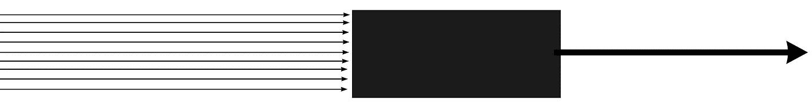
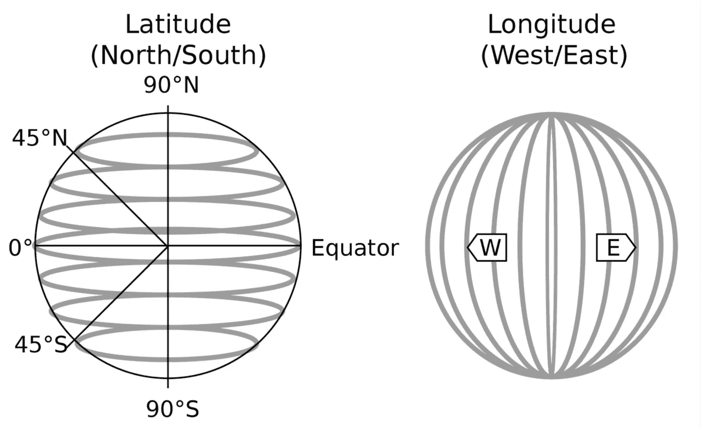

# 可解释技术可以让我们更接近公平模型

> 原文：<https://medium.com/analytics-vidhya/explainability-techniques-could-get-us-closer-to-fair-models-d7f99bffa79d?source=collection_archive---------14----------------------->

米尔科·布利克在 [Unsplash](https://unsplash.com?utm_source=medium&utm_medium=referral) 上拍摄的照片

## 但不是你想的那样

最近，随着为基于大数据做出高效决策而创建的越来越复杂的模型的激增，我们需要了解我们的模型，以便它们不是完全的黑盒，这一需求虽然滞后，但也日益增加。可解释性技术试图满足这一需求，使我们能够窥视复杂模型的盒子，如广泛使用的 boosting 算法。

然而，它们以非常具体的方式来做这件事，所以我将给出它们在实践中如何使用的一个非常简要的概述，以接下来衡量它们在负责任和公平的建模方面的可能性和局限性。

(盒子里面发生了一些事情。)对接收大量输入的黑盒模型的描述。

简而言之，可解释性技术可以评估每个输入因素(或*特性*)对模型最终结果的影响——它的*预测*。更传统的技术会以*全局*的方式评估特性影响，而更新的技术能够在*局部*级别进行评估，正如您从下面的例子中所理解的。让我们检查一个预测世界各地温度的玩具模型，使用三个特征作为输入:1- *纬度*，2- *经度*，以及 3- *一年中的某一天*。

一个**全局解释**可以说*纬度*对模型预测有很大影响，*一年中的某一天*有一般影响，而*经度*影响非常小。我们说这个解释是全球性的，因为它陈述了模型的“平均效应”。相反，当地的一个解释可以告诉我们，对于某些特定的纬度值(比如说，在北半球)，一月前后一年中的*天*会降低温度，而对于其他纬度值，一年中相同的*天*会升高温度。这很有道理，因为纬度的影响取决于是夏天还是冬天，所以“一月的一天”意味着北半球较冷，南半球较暖，而“六月的一天”意味着南半球较冷，北半球较暖。请注意*局部*解释如何能更具体地告诉我们，而全局解释只会说“这通常是有影响的”。

因此，我们可以使用可解释性技术从整体上理解模型，关注不同特性对其输出的影响，并理解特定的事件或预测。想象一下，在一个更加复杂的气候模型中，以气流为特征，我们预测瑞典在四月中旬会有非常高的温度。我们可以检查为什么模型使用本地解释给出这样的预测，并得出结论，这种预测主要是由来自南方的气团驱动的。在另一个典型的应用中，一家银行可能会注意到其客户的信用风险在上个月下降了很多，并通过使用可解释技术检查模型来了解这是由于(比如说)他们的银行账户中剩余的更多资金、由于购买行为的变化还是考虑到了其他因素。有时解释可能看起来不合理，暴露了模型中的一个问题。

## 电位

我们已经可以讨论潜力和局限性了:首先，我们可以理解在模型整体上，或者甚至在特定情况下，某些东西是否非常怪异——即使模型的平均行为看起来还可以。这也为决策的更大透明度开辟了道路。这种分析可以以多种方式用于优化和发现模型中的错误，但关于负责任和公平的建模，我一直在想，它被广泛采用的最大潜力是在越来越广泛的论坛上实现关于模型在我们生活中做出重要决策的对话。在组织内部，这已经是事实，在那里非技术的老板可以理解是什么在驱动一个模型，但是真正重要的是大众可以参与这些讨论。

天真的数据科学家可能会认为，如果我们能够理解一个模型，这样它就不再是一个黑盒，那么我们就可以小心谨慎，避免不公平或不负责任的模型。但事情远比这复杂得多。

## 局限性:我们只回答第一个为什么

我想提出的解释技巧有一个核心限制，我发现思考你可以回答的*为什么*问题的数量是很有说明性的。

北欧，明显是瑞典。由 [Krzysztof Hepner](https://unsplash.com/@nsx_2000?utm_source=medium&utm_medium=referral) 在 [Unsplash](https://unsplash.com?utm_source=medium&utm_medium=referral) 上拍摄的照片

我可以问一个模特“为什么你认为明天瑞典的温度会是 6 度？”使用解释技巧理解“3 月 27 日的事实使温度升高了 4 度”，以及“北纬 60 度的事实使温度降低了-20 度”。这一切都是有道理的，因为这是春天的开始，应该更温暖，但它也靠近北极，这使它成为一个整体上更冷的地方——没有奇怪的行为。

但是后来，我们会发现这个模型一直低估了那里的温度。我想知道为什么会发生这种情况，我问模型“*为什么*3 月 27 日增加了+4 而不是+6 的温度？”以及“*为什么*北纬 60 度降低的是零下 20 度而不是零下 15 度？”。典型的可解释性技术没有回答这个问题。当变量的行为与您的预期相反，或者数量级不同时，很容易发现“奇怪的行为”，但偏差可能在数量级上略有不同，其“正确性”很难评估。

这可能是因为我们选择只在陆地上收集数据，给了我们更多北半球的数据，或者是因为全球变暖，那里的温度比其他地方上升得更快，或者…你明白了。很多事情都会使我们的模型产生偏差，有些偏差可能会非常有害。可解释性远远不能回答难题。

***为什么*模型给了我这样的预测？**交代回答我。

***为什么*的功能会产生如此大的影响？**因为用于拟合模型的数据分布，因为用于优化的目标函数，…

*为什么*我们的数据会有这种分布？

为什么我们要以这种方式收集数据？

*我们为什么要优化这个目标函数？*

*为什么*一般人口是这样分布的？

模型捕捉数据中的相关性，而不是因果关系。有害的偏见可能会在这个过程的任何一步不经意地蔓延，而可解释性技术不足以评估公平性。

哦，你注意到了吗？所有相同的问题也适用于完全透明的模型，如逻辑回归！的确，讨论和分析它们更容易，所以不要认为这意味着黑箱或透明都是一样的，但透明模型也可能非常有害。

## 那么我们如何才能构建有道德的人工智能呢？

我甚至没有参与讨论*即使没有偏见的模型也可能是不公平的*。现在应该很清楚，这个问题远远超出了“技术”范畴。这就是为什么我认为我们必须更进一步，利用对可解释性(和相关技术)的兴趣，将围绕*的讨论带入更广泛的论坛，我们的模型在做什么*。

在构建影响周围人们生活的模型时，我们数据科学家肩负着巨大的责任。最起码我们可以做的是尝试和理解我们真正产生的影响，并且先*，*不造成伤害*。*

## *潜得更深*

*有很多人对人工智能中的*公平*和更一般的**伦理有很多话要说，所以我决定不进入这个讨论，因为我对那里发生的大量讨论有肤浅的理解，我会给你留下一些进一步的阅读和参考资料，我正在寻找这些资料，以便更好地掌握这一切。各种口味都有参考！***

*   *数学毁灭的武器([谈](https://www.youtube.com/watch?v=gdCJYsKlX_Y) | [书](https://www.goodreads.com/book/show/28186015-weapons-of-math-destruction))*
*   *赛后技术([小介绍](https://www.youtube.com/watch?v=rY8RkET3KC0) | [谈](https://www.youtube.com/watch?v=bSK2ygnuXxE) | [书](https://www.ruhabenjamin.com/race-after-technology))*
*   *[我们的数据如何对系统性种族主义进行编码](https://www.technologyreview.com/2020/12/10/1013617/racism-data-science-artificial-intelligence-ai-opinion/amp/)(麻省理工技术评论邮报)*
*   *[Tim nit Gebru 的公平和人工智能伦理趋势](https://twimlai.com/twiml-talk-336-trends-in-fairness-and-ai-ethics-with-timnit-gebru/)(播客)*
*   *[评估风险，自动化种族歧视](https://science.sciencemag.org/content/366/6464/4) ( *科学*论文——有付费墙)*

*特别感谢拉蒙·维拉里诺，他是我的朋友，也是人工智能伦理学者，他让我思考这个问题，并帮助我挑选了一些好的参考资料与大家分享。*