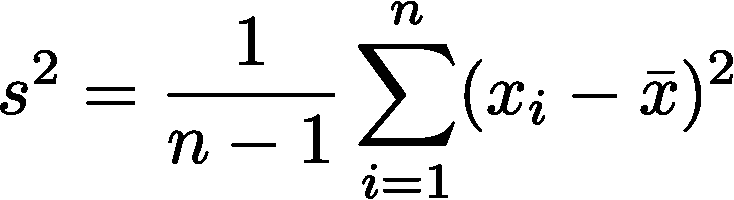
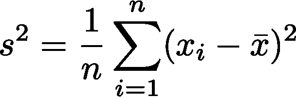
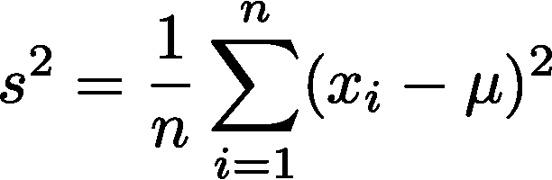
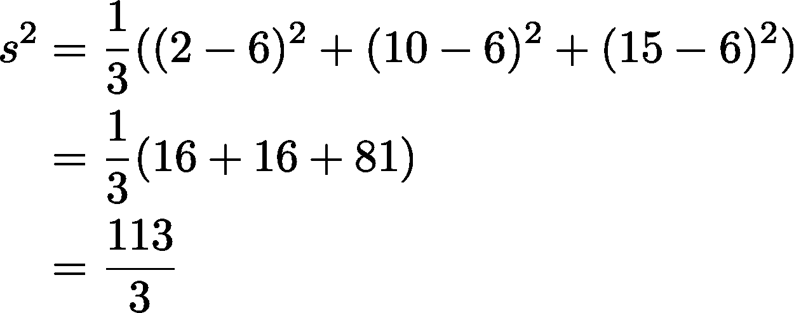
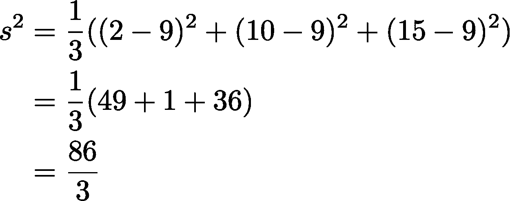

# 解释 n-1——贝塞尔样本方差修正背后的直觉

> 原文：<https://medium.com/analytics-vidhya/explaining-n-1-the-intuition-behind-bessels-correction-for-sample-variance-daee48bd6fde?source=collection_archive---------6----------------------->

这是大多数大学标准的“统计学导论”课程中经常出现的样本方差公式。在分母中用 n-1 代替 n 称为贝塞尔校正。很少有人对 n-1 部分的解释超出了一些关于无偏估计量的挥手和喃喃自语。当我在网上四处寻找时，我很难找到任何简洁地解释这个概念的文章(大多数“清晰”的解释需要 15 个段落和 5 个图表来展示他们的解释)。这个页面试图用尽可能少的词语提炼并清晰地呈现这个[维基百科页面](https://en.wikipedia.org/wiki/Bessel%27s_correction)上的材料。

这篇文章是写给对统计学有所了解的人的，我希望你在高中或大学的某个时候学过统计学。我要澄清的唯一词汇是术语 [**无偏估计量**](https://en.wikipedia.org/wiki/Bias_of_an_estimator) :

> 在统计学中，一个估计量的**偏差**(或**偏差函数**)是这个估计量的期望值与被估计参数的真实值之差。

从总体中抽取样本时，我们通常希望能够从抽取的样本数据中准确估计总体指标。例如，样本均值是总体均值的无偏估计量，它的期望值等于总体均值。通常最好使用无偏的估计量。

# 为什么幼稚的公式会有偏差？

样本方差的简单公式如下:

朴素方差公式(等式 1)

为什么这个公式会有偏差？让我们将其与无偏估计量进行比较，即总体方差公式:

人口方差公式(等式 2)

(你们中的一些人已经注意到，用样本平均值代替总体平均值会引入偏差。)

如果我们的估计量(等式 1)总是小于或等于另一个我们知道是无偏的估计量(等式 2)，那么它将有一个向下的偏差。换句话说，一旦我们证明这个估计量可以低于一个无偏估计量，但它永远不会超过，我们就知道它一定是一个有偏估计量。

让我们看一个小例子，假设我们从{0，2，4，5，10，15}组成的总体中抽取样本。我把手伸进包里，拿出{2，10，15}。我们的两个估计量会如何表现？

无偏估计量产生以下结果:

简单的(有偏差的)公式会产生以下结果

请注意，朴素公式低于同一样本的无偏估计量！这是为什么呢？嗯，我们可以认为方差是衡量一组点围绕另一个点聚集的紧密程度(姑且称之为μ)。对于给定的一组点，μ越靠近点的中心，方差就越低！

凭直觉，你可以想到样本平均值**总是**位于样本数据点的中间，而总体平均值可能真的在别的地方。这意味着朴素方差公式总是选择最小化样本方差的μ，而总体方差公式通常选择不最小化样本方差的μ。这导致我们的天真公式达不到无偏估计量。

事实上，朴素公式等价于无偏估计量的唯一情况是抽取的样本恰好等价于总体均值。没有哪种情况下朴素公式比无偏估计量产生更大的方差。你自己试试！这个概念是为什么朴素公式是一个有偏估计量的核心。

现在我们知道了朴素公式是一个有偏估计量，我们必须努力思考如何找到一个有用的总体方差的无偏估计量。我们不仅仅使用本节介绍的无偏估计量的原因是，当我们取样时，我们很少知道总体均值。如果我们想创建一个无偏估计量，我们必须设法找到一个不同的样本方差公式。

# n-1 为什么有效？

显然，上面的部分表明，天真的估计有一个趋势，下冲的参数，我们正在估计，所以创建一个无偏估计将涉及扩展我们的天真公式。但是增加多少呢？为什么是 n-1？为什么 n-2 或 n/3 不起作用？

嗯，要想真正理解它，我建议[亲自研究一下证据](https://en.wikipedia.org/wiki/Bessel%27s_correction#Proof_of_correctness_%E2%80%93_Alternative_1)。我将尝试提供一些直觉，但是如果它让你感到不满意，考虑这个动机来完成证明！

当我们从数量为 n 的总体中抽取两个观察值(替换)时，有 1/n 的概率相同的观察值被采样两次。这意味着，无论人口分布如何，都有 1/n 的机会观察到 0 采样平方差。

直观地说，样本方差为 0 的概率为 1/n，这意味着我们需要通过除以(1–1/n)或者乘以 n/(n-1)来修正公式。现在，当我们用这个值乘以这个简单的公式，会发生什么呢？我们在底部看到了臭名昭著的 n-1 表达式！

Tada！

如果你觉得这篇文章有什么不清楚的地方，我强烈推荐你通读一下维基百科上关于贝塞尔的修正的文章。这不是最容易阅读的，但这是我在这篇文章中提取几乎所有内容的地方。如果你喜欢这篇文章，请考虑留下掌声！如果这种类型的内容对其他人有用，我愿意继续制作。

如果你想看更多的文章，请在 Medium 上关注我(虽然不能保证是关于统计的)。感谢[朱敏瀚](https://medium.com/u/56ece25b532f?source=post_page-----daee48bd6fde--------------------------------)和[阿迪曼纳里](https://medium.com/u/37fc7cf53ca7?source=post_page-----daee48bd6fde--------------------------------)对本文初稿的反馈。