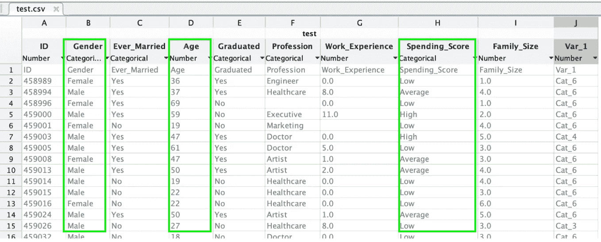
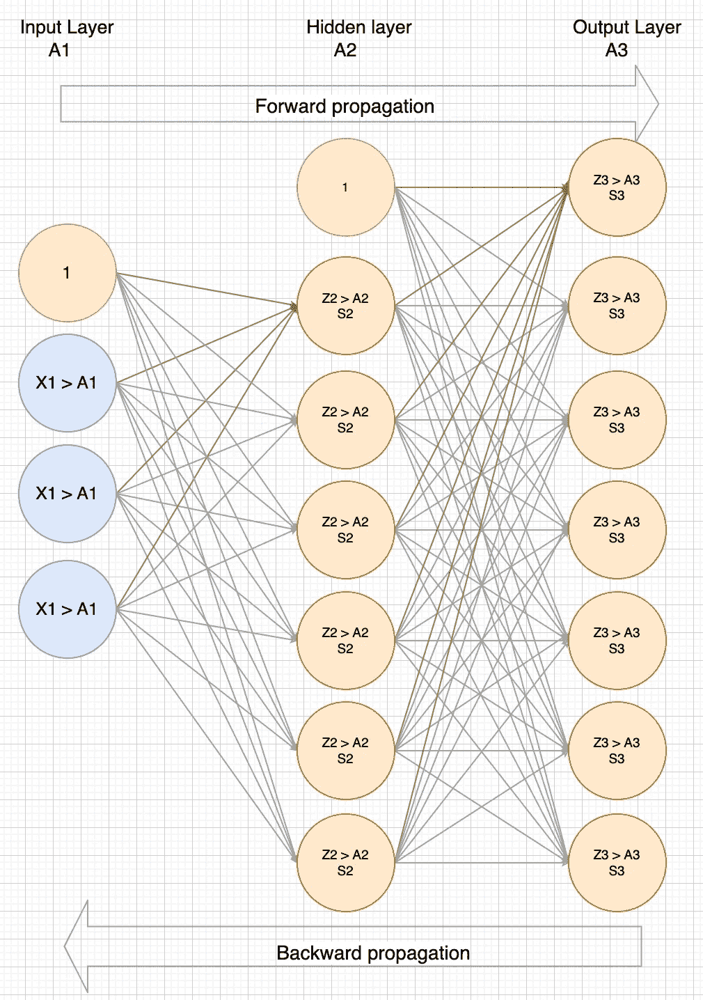
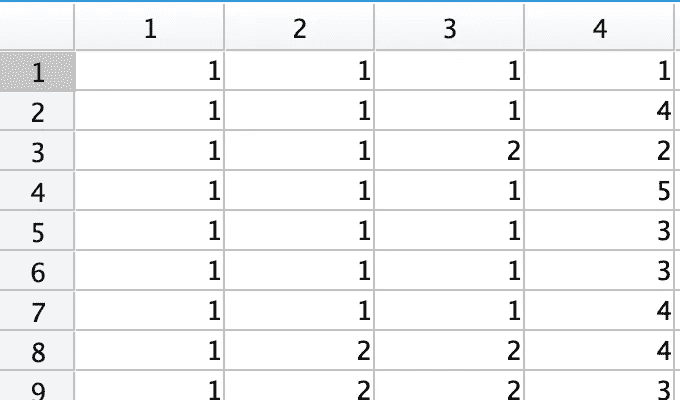
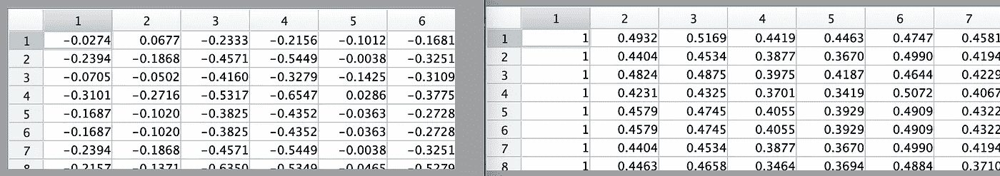
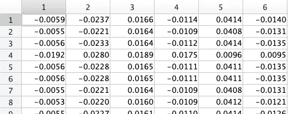
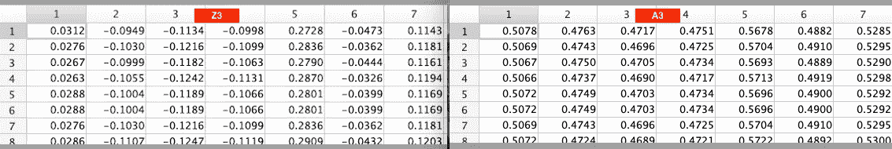
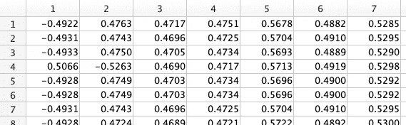

# 解释神经网络 101

> 原文：<https://medium.com/analytics-vidhya/explaining-neural-networks-101-a36356113cbd?source=collection_archive---------9----------------------->

神经网络反映了人脑的行为。它们允许程序识别模式并解决机器学习中的常见问题。这是执行回归分析分类的另一种选择。如果你没有看到我的关于[物流回归](/geekculture/logistics-regression-in-5-minutes-1-3-64a890ed79e1)的系列文章，那么先看看那些，因为这个系列将使用相同的一组数据。在 [Rapidtrade](http://www.rapidtrade.com) ，我们使用神经网络对数据进行分类，并运行回归场景。

所以为了**让**我们将在这个系列中使用的数据可视化，请看下面。我们将使用它来训练网络根据 j 列对我们的客户进行分类。我们还将使用突出显示的 3 个特征对我们的客户进行分类。特性选择很重要，看看这篇[文章](/geekculture/classifying-customers-with-logistics-regression-one-vs-all-f34ed2e5f042)就知道我为什么选择这 3 个特性了。

> 请记住，我们将把所有的字母字符串值转换成数字。毕竟，我们不能将字符串插入方程；-)

图 1

神经网络总是由层组成，如图 2 所示。这一切看起来很复杂，但让我们解开它，使它更容易理解。

图 2

一个神经网络有 6 个重要的概念，我将在这里简单解释一下，但在这一系列文章中会详细介绍。

- **权重** — *这些就像我们在其他算法中使用的* ***theta 的*** *-**层** — *我们的网络将有 3 层*
- **前向传播** — *使用特征/权重来获得 Z 和一个*
- **反向传播***

在这个系列中，我们将建立一个三层的神经网络。我们的将有以下 3 层。

# 输入层

我们将这个结果称为 **A1** 。该图层的**大小** (# units) 取决于我们数据集中要素的**数量。构建我们的输入层并不困难，你只需简单地用 X** 复制**，但是添加一个被称为**偏向层**，默认为“1”。
第 1 栏:**偏向**图层默认为“1”
第 2 栏:**“曾经结婚”**我们的第一个特征，并已被重新标记为 1/2
第 3 栏:**“毕业”**我们的第二个特征，并被重新标记为 1/2
第 4 栏:**“家庭规模”**我们的第四个特征**

图 3:可视化 A1 —输入层

# 隐蔽层

我们只有 **1 个隐藏层**，但是你可以为每个特征设置一个隐藏层。如果你有比我下面提到的逻辑更多的隐藏层，你将为每个隐藏层重复计算。大小(单位数)由您决定，我们选择了#features * 2。

该层是在向前和向后传播期间计算的。运行**和**这两个步骤后，我们**计算每个单元的 Z2、A2 和 S2** 。运行每个步骤后的输出如下。

**正向传播**

在这一步，我们计算 Z2 和 A2。你可以看到下面的结果。
- **Z2** 包含我们对隐藏层中的**假设**计算的结果。
-而 **A2** 也包括偏置层(col 1)并具有应用于 Z2 中每个单元格的 sigmoid 函数。

因此 Z2 有 6 列，A2 有 7 列。

> 现在还不要担心方程，这将在下一篇文章中介绍。

图 4:可视化 Z2 和 A2

**反向传播**

因此，在前向传播穿过所有层之后，我们然后执行**反向传播**步骤来计算 **S2** 。S2 被称为该单位假设计算的**δ**。这用于计算该θ的**梯度**，随后，结合该单元的**成本**，帮助梯度下降计算出最佳θ/重量。

> 再一次，方程将在后面出现，现在，理解 back prop 帮助我们决定每个单元中每个假设的成本/梯度。

图 5:可视化 S2 的梯度

# 输出层

我们的输出层给出了我们假设的结果。即。如果应用这些 thetas，我们对这些客户分类的最佳猜测是什么。**大小**(#单位)来自 Y 的数字标签，或者在图 1 中的 j 列。从图 1 中可以看出，有 7 个标签，因此输出层的大小为 7。

与隐藏层一样，这是在**向前和向后**传播的 2 个步骤中计算的。运行这两个步骤后，结果如下:

**正向传播**

同样，在这一步中，我们将为输出层计算 **Z3** 和 **A3** ，就像我们为隐藏层所做的一样。参考上面的图 1，可以看到不需要偏置柱，下面可以看到 Z3 和 A3 的结果。

图 6:可视化 Z3 和 A3

**反向传播**

现在(参考图 1)我们有了 Z3 和 A3，让我们来计算 **S3** 。由于 S3 只是一个基本的成本计算，从 Y 中减去 A3，所以我们将在接下来的文章中探索这些等式，但是我们仍然可以看到下面的结果

图 9:想象 S3

# 把所有的放在一起

因此，上面是一个有点尴尬，因为它可视化的输出在每一层。我们在神经网络中的主要焦点是计算神经网络成本的函数。该函数的编码将采取以下步骤。

1.  **初始化**一组权重/θ
2.  执行**成本优化**，执行步骤 **(3)至(6)** ，直到找到用于预测的最佳权重/θ
3.  按以下顺序进行**正向传播**计算:
    Z1>A1>Z2>A2>Z3>A3
4.  执行**反向传播**这样按顺序计算:
    S3 > S2
5.  计算正向/反向传播的**成本**
6.  计算**增量**，然后计算**梯度**。(由梯度下降或成本优化使用)

好了，这是一大堆信息，继续第二部分[，详细介绍正向传播](https://shaun-enslin.medium.com/forward-propagation-deep-dive-102-bbeabe4d2fb2)。

# 来源

很棒的文章:[https://towards data science . com/under-the-hood-of-neural-network-forward-propagation-the-terrorible-matrix-multiplication-a 5360 b 33426](https://towardsdatascience.com/under-the-hood-of-neural-network-forward-propagation-the-dreaded-matrix-multiplication-a5360b33426)

如果你在找课程:[https://www.coursera.org/learn/machine-learning/](https://www.coursera.org/learn/machine-learning/)