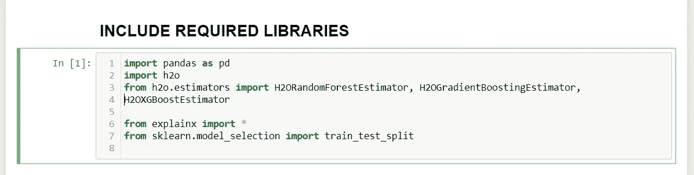
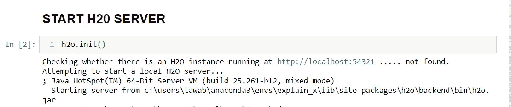
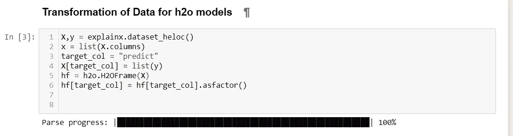
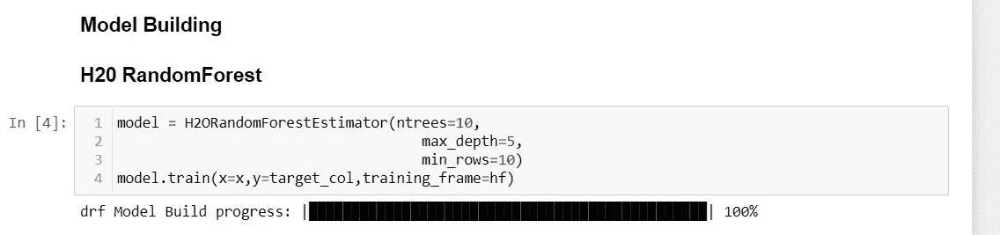
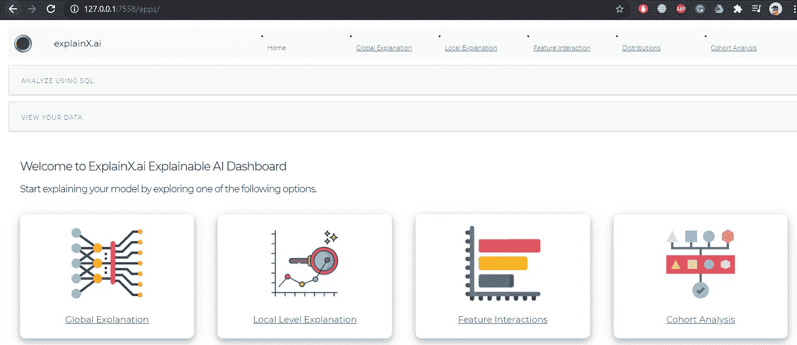
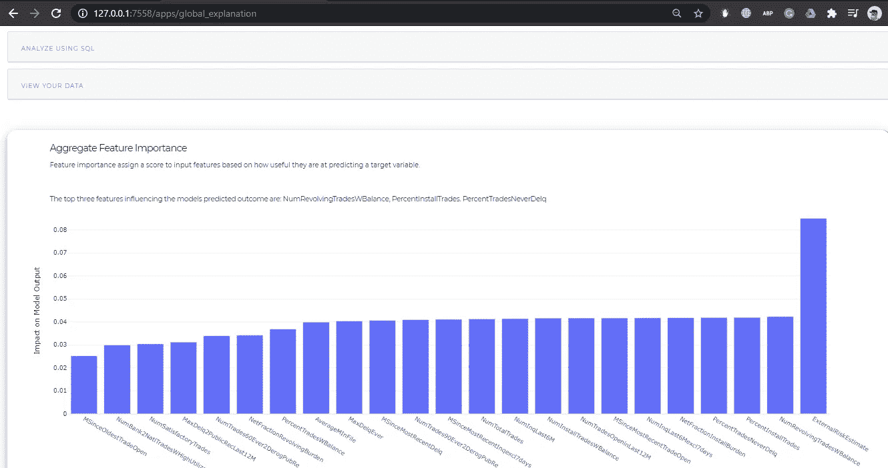

# Explainx。人工智能与 H2O 模型

> 原文：<https://medium.com/analytics-vidhya/explainx-ai-with-h2o-models-639fdc3c197f?source=collection_archive---------26----------------------->

Explainx.ai

explainx.ai 新功能推出

在 explainex . ai 仪表板上成功集成 Scikit-learn 模型以解释模型的黑盒性质之后，explainex . ai 开源库现在可以兼容 **H2O** 模型。

# H2o 与 Explainx.ai 集成难还是易？

h2o 模型很难解释吗？

你是不是在想，用 **Explainx.ai** 解释 **H2O** 模型，会被要求做很多事情？那你绝对错了！

Explainx 让用户很容易解释他们的 H2O 模型。只需一行代码，您就可以查看包含各种方法的 explainx.ai 仪表板，这些方法将有助于理解机器学习模型

# **如何在 H2O 车型上使用 Explainx】**

只需几个简单的步骤，您的 explainx 仪表板就准备好了

1.  导入所需的库

包括库

2.运行 H2O 服务器

运行 H2O 服务器

3.H2O 数据框中的变换数据

数据转换

4.火车 H2O 模型

*注:****H2 orandomforestestestimator，H2 ogradientboostingestimator****，*，*H2 oxgboostimator**兼容 explainx.ai*

H2O 随机森林模型正在接受训练

5.打开 **Explainx.ai** 仪表板的最后一行神奇代码

explainx.h2o automl

6.只要打开网址，最终的仪表板就会出现

Explainx.ai 仪表盘

来自 explainx.ai 的特性重要性图表

我希望这篇帖子提供了将 H2O 模型与 Explainx.ai 开源库集成的教程。

**Explainx.ai** 认为 ai 应该用在一个引导和可控的环境中。只有当数据科学家在部署模型之前完全理解了他们的模型，才能实现这一点

请用你的**掌声**鼓励一下，并在评论区分享你的评论