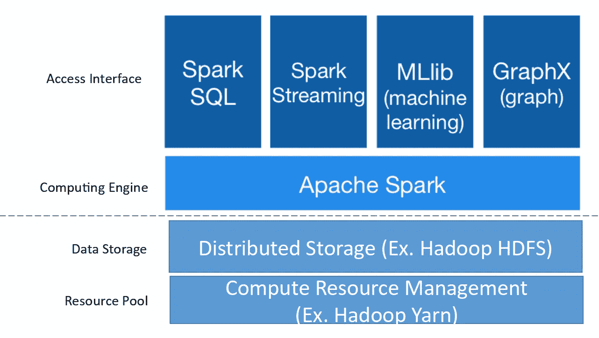
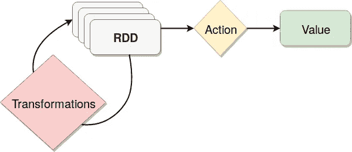
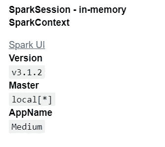

# PySpark 和编码的解释

> 原文：<https://medium.com/analytics-vidhya/explanation-of-pyspark-and-coding-afc4af43b3b3?source=collection_archive---------0----------------------->

**阿帕奇火花:**

Apache Spark 是一个强大的 ETL 工具，用于分析大数据。这个工具现在被业界的**数据工程师**和**数据科学家**广泛使用。火花是用 **Scala** 的语言写的。Spark 工具可以在各种编程语言中执行，如 R、Python、Java、JavaScript、Scala 和。Net，但是 spark 在 Python、Java 和 Scala 语言中被广泛使用。


那么 PySpark 是什么，无非就是用 python 语言**spark**都叫 **PySpark** 。让我们使用 Python 来关注 Spark。

在 python 中使用 spark 很好，因为 python 是拥有更高开发人员社区的语言之一，比任何其他竞争语言都有更多的库支持，拥有超过 13 万个库。使用 python 你可以执行高级任务，比如 spark streaming、Graphx、Spark SQL 和 MLlib(机器学习)。是的，你可以使用 spark 进行机器学习。



火花核心

RDD:

代表**弹性分布式数据集**，RDD 是一个只读的对象集合，跨集群中的多台机器进行分区。在一个典型的 Spark 程序中，一个或多个 rdd 作为输入被加载，并通过一系列转换被转换成一组目标 rdd

I .容错的分布式对象集合。

二。在 spark 中，每个任务都以下列方式表示:

*   创建新的`RDD(s)`
*   改造现有的`RDD(s)`
*   在`RDD(s)`上调用操作

RDD 只支持两种类型的操作转换和动作。

**转换**:从现有数据集创建一个新数据集，以执行映射、平面映射、过滤、联合、采样、连接、groupByKey。

**动作**:在数据集上运行计算以执行收集、归约、计数、保存后，向驱动程序返回值。



RDD 过程

如需了解更多信息，请点击链接[此处](https://spark.apache.org/docs/latest/rdd-programming-guide.html#rdd-operations)。

**PySpark 编码(动手):**

要导入所需的库，请使用下面的代码。

```
import pyspark
import pandas as pd
import numpy as np 
import seaborn as sns
import matplotlib.pyplot as plt
from pyspark.sql import SparkSession
from pyspark.sql import functions as fs
```

让我们创建一个火花会议。

```
spark = SparkSession.builder.appName(‘Medium’).getOrCreate()
spark
```

上面的代码将创建一个 spark 会话，它只是一个集群，可以监视和控制其中的任何其他操作。您可以在中给出任何名称来创建一个集群`appName(‘Preferred_name’).`



火花会议

一旦创建了 spark 会话，您可以单击 Spark UI，它将显示在输出中，将带您到新的 Spark 门户，以监控您的所有操作。

PySpark 语法与**熊猫**非常相似，只是有一些独特的区别，现在让我们开始导入数据并做一些基本的操作。

```
df=spark.read.csv('ramen_rating.csv',header=True,inferSchema=True)
df.show()
```

在上面的代码中，我已经导入了一个名为`ramen_rating` 的文件，它在 Kaggle 中可用。我建议用户在导入文件时给**头**和**推断模式**头是列名，推断模式是从文件中选择的数据类型。如果您没有使用 inferSchema，代码将自动为该列选择任何数据类型，通常它会选择`string` 作为任何列的数据类型，所以我建议您使用 inferSchema。

与 Pandas 不同，一旦你调用了变量`df` ，spark 将不会显示数据，所以我们需要给`df.show()`命令来查看存储在变量中的数据。

这段代码将帮助你找到`df.printSchema()`表中每一列的数据类型或模式

该代码用于调用单列或多列来显示`df.select(‘Brand’).show()`

你可以用和我们在熊猫身上用的一样的描述

现在，让我们做一些算术运算。

```
df = df.withColumn(‘Stars_10’,df[‘Stars’]+5) 
df.show()
```

上面的代码将使用算术创建一个新列，我采用了一个星形列，其中`mode`是 5，所以我添加 5 来创建一个新列，并将列名指定为`Stars_10.`

你也可以像我们用的熊猫一样掉柱`df=df.drop(‘Stars_10’)`

```
df = df.withColumnRenamed(‘Stars’,’Stars_5')
df.show()
```

这里我用上面的代码把`Stars`改成了`Stars_5` 。

```
df = df.withColumn('Product (Type)',fs.concat(df.Brand,fs.lit(' ('),df.Style,fs.lit(')')))
df.show()
```

最初，它可能看起来很复杂或者与 **Pandas 语法**混淆，但是一旦你**理解并且用 **spark** 练习**就很容易了。这里我用`Brand`和`Style`列将`concat` 列到`Product (Type)`列。在`withcolumn` 中，您需要给出新的列名，后跟`concat` 语法来添加两列。

## 临时视图:

我能感觉到大多数人都在等这个。在 spark 中，您可以通过连接来自任何其他环境(如 Hadoop、Big Query 等)的数据来执行 SQL 语法。

```
df.createTempView("temp")
df_sql = spark.sql("SELECT *, avg(Stars_5) over(PARTITION BY Style) as Average FROM temp order by Brand asc, Country desc")
```

在上面的代码中，我创建了一个临时视图来使用 SQL 命令，然后我执行了一个**窗口函数。**

## 过滤操作:

与熊猫不同，你不能通过给定任何条件来直接过滤数据。所以在 Spark 中，我们使用 filter 选项来过滤在**范围内**或通过 **not null** 值或在**任何条件下**的数据。

```
df.filter("Stars_5<3 and Stars_5>1.5").show()
```

该命令用于过滤数据，在`Stars_5` 栏中指出数据应小于 3，同时应大于 1.5。

**分组依据:**

星火中的群聚和熊猫一样。下面的代码将根据`Style` 列计算`mean` 。

```
df.groupby(‘Style’).mean().show()
```

您也可以在一个命令中的两列中执行两个不同的操作。

```
df.groupby('Brand').agg({'Stars_5':"sum","Percentage":"mean"}).show()
```

在这里，我对`Stars_5` 列进行了相加(求和),并通过对`Brand`列进行分组来计算`Percentage` 列的平均值。

您也可以通过命令在一个组中使用多个列。

我试图在本文中涵盖尽可能多的基础知识和广泛使用的操作。我已经在 **GitHub、**中以 jupyter 笔记本格式附上了我的 PySpark 作品，这将在编码部分向你做更多的解释。请找到这篇文章下面的链接。

在下一篇文章**对 PySpark 和编码 II 的解释**中，请继续关注使用 PySpark 的 RDD 和机器学习。

要继续阅读下一篇文章，请**跟我来**，如果这是一篇好文章，请**鼓掌**。**享受！**💙

感谢阅读。:)

GitHub:[https://github.com/anand-lab-172/PySpark](https://github.com/anand-lab-172/PySpark)