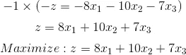
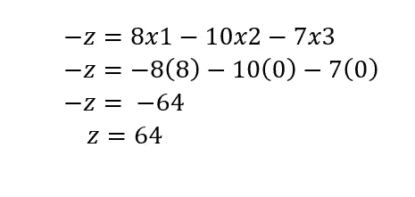

# 单纯形法最小化的解释。

> 原文：<https://medium.com/analytics-vidhya/explanation-of-simplex-method-for-minimization-e32def1ef214?source=collection_archive---------1----------------------->

照片取自[维基百科](https://en.wikipedia.org/wiki/Simplex_algorithm#/media/File:Simplex-method-3-dimensions.png)

# 介绍

单纯形法是一种手动求解线性规划模型的方法，使用松弛变量、表和枢轴变量作为寻找优化问题的最优解的手段。线性规划是在给定带有线性约束的最大值或最小值方程的情况下实现最佳结果的方法。大多数线性规划可以使用 MatLab 等在线求解器来求解，但单纯形法是一种手动求解线性规划的技术。要使用单纯形法求解线性规划模型，必须执行以下步骤:

●标准形式

●引入松弛变量

●创造场景

●枢纽变量

●创造一个新的场景

●检查最佳性

●确定最佳价值

本文档将单纯形法分解为上述步骤，并在整个文档中遵循下面所示的示例线性规划模型来寻找最优解。

**第一步:标准表格**

标准形式是在求解最优解之前所有线性程序的基准格式，并且具有三个要求:(1)必须是最大化问题，(2)所有线性约束必须是小于或等于不等式，(3)所有变量都是非负的。通过使用基本代数和代换变换任何给定的线性程序，总是可以满足这些要求。标准形式是必要的，因为它为尽可能有效地解决单纯形法以及解决最优化问题的其他方法创造了一个理想的起点。

要将最小化线性规划模型转换为最大化线性规划模型，只需将目标函数的左侧和右侧都乘以-1。

将线性约束从大于或等于不等式转换为小于或等于不等式可以类似于对目标函数所做的那样来完成。两边都乘以-1，不等式就可以变成小于或等于。

一旦模型是标准形式，松弛变量可以添加，如单纯形法的步骤 2 所示。

**第二步:确定时差变量**

松弛变量是引入到线性程序的线性约束中的附加变量，用于将它们从不等式约束转换为等式约束。如果模型是标准形式，时差变量的系数总是+1。约束中需要松弛变量来将它们转换成有一个明确答案的可解等式。

引入松弛变量后，可以设置表来检查最优性，如步骤 3 所述。

**第三步:设置桌面**

单纯形表用于在线性规划模型上执行行操作，以及检查最优解。该表由对应于线性约束变量的系数和目标函数的系数组成。在下面的表格中，表格中加粗的第一行说明了每一列所代表的内容。下面两行表示来自线性规划模型的线性约束可变系数，最后一行表示目标函数可变系数。

一旦表格完成，就可以检查模型的最优解，如步骤 4 所示。

**步骤 4:检查最优性**

最大化线性规划模型的最优解是分配给目标函数中的变量的值，以给出最大的 zeta 值。最优解将存在于整个模型的图形的角点上。要使用 tableau 检查最优性，最后一行中的所有值必须包含大于或等于零的值。如果一个值小于零，这意味着变量没有达到其最佳值。如上表所示，底行中存在三个负值，表明此解决方案不是最佳的。如果一个 tableau 不是最优的，下一步是确定新 tableau 所基于的 pivot 变量，如步骤 5 所述。

**第五步:确定支点变量**

pivot 变量在行操作中用于确定哪个变量将成为单位值，并且是单位值转换中的一个关键因素。通过查看表格的底行和指示器，可以识别枢轴变量。假设解决方案不是最优的，在最下面一行中选择最小的负值。位于该值列中的一个值将是枢纽变量。要查找指标，请将线性约束的 beta 值除以包含可能的透视变量的列中的相应值。具有最小非负指标的行与底行中最小负值的行的交叉点将成为枢纽变量。

在下面的例子中，-10 是最后一行中最小的负数。这将指定 *x2* 列包含枢纽变量。通过求解指标，我们得到第一个约束的值为 10/3，第二个约束的值为 8/5。由于是最小的非负指标，pivot 值将位于第二行，值为 5。

既然已经确定了新的枢纽变量，就可以在步骤 6 中创建新的 tableau 来优化变量并找到新的可能的最优解。

**第六步:创建新的 Tableau**

新的表格将用于确定新的可能的最优解。既然在第 5 步中已经确定了 pivot 变量，就可以执行行操作来优化 pivot 变量，同时保持 tableau 的其余部分等价。

I .为了优化 pivot 变量，需要将其转换为一个单位值(值为 1)。若要转换该值，请将包含透视变量的行乘以透视值的倒数。在下面的示例中，pivot 变量最初是 5，因此将整行乘以 1/5

二。确定单位值后，包含该单位值的列中的其他值将变为零。这是因为第二个约束中的 x2 正在被优化，这要求其他等式中的 x2 为零。

三。为了保持 tableau 的等价性，必须使用新的透视值来计算透视列或透视行中不包含的其他变量。对于每个新值，将旧透视列中值的负值乘以新透视行中与正在计算的值相对应的值。然后将其与旧表中的旧值相加，为新表生成新值。这一步可以浓缩成下一页的等式:

新 tableau 值=(旧 tableau 透视列中的负值)x(新 tableau 透视行中的值)+(旧 tableau 值)

***旧画面:***

***新画面:***

下面提供的数字示例有助于更好地解释这个概念。

***数值例子:***

*I.* *求第 1 行的 s2 值:*

新 tableau 值=(旧 tableau 透视列中的负值)*(新 tableau 透视行中的值)+(旧 tableau 值)

新 tableau 值= (-3) * (1/5) + 0 = — 3/5

*二。* *查找第 3 行的 x1 变量:*

新 tableau 值=(旧 tableau 透视列中的负值)*(新 tableau 透视行中的值)+(旧 tableau 值)

新值= (10) * (1/5) + -8 = -6

一旦新的表格完成，就可以检查模型的最优解。

**第七步:检查最优性**

如步骤 4 所述，最大化线性规划模型的最优解是分配给目标函数中的变量的值，以给出最大的 zeta 值。在每个新表格之后，需要检查最优性，以查看是否需要确定新的中枢变量。如果底行中的所有值都大于或等于零，则认为解决方案是最佳的。如果所有值都大于或等于零，则认为解决方案是最佳的，可以忽略步骤 8 到 11。如果存在负值，解决方案仍然不是最佳的，需要确定一个新的支点，如步骤 8 所示。

**步骤 8:确定新的枢纽变量**

如果该解决方案被确定为不是最优的，则需要确定一个新的中枢变量。pivot 变量是在 Step 5 中引入的，在行操作中用于确定哪个变量将成为单位值，并且是单位值转换中的一个关键因素。透视变量可以通过具有最小非负指示符的行与底部行中最小负值的交集来标识。

识别出新的 pivot 变量后，可以在步骤 9 中创建新的 tableau。

**第九步:创建新画面**

在确定了新的 pivot 变量之后，需要创建一个新的 tableau。在步骤 6 中引入的 tableau 用于优化 pivot 变量，同时保持 tableau 的其余部分等价。

I .通过将包含 pivot 变量的行乘以 pivot 值的倒数，使 pivot 变量为 1。在下面的表格中，pivot 值是 1/5，所以所有值都要乘以 5。

二。接下来，将 pivot 变量列中的其他值设置为零。这是通过将透视列中旧值的负值乘以透视行中的新值来实现的。然后将该值添加到被替换的旧值中。

**第十步:检查最优性**

使用新表格，检查最优性。如第 4 步所述，当最下面一行中的所有值都大于或等于零时，会出现最佳解决方案。如果所有值都大于或等于零，则跳到步骤 12，因为已经达到了最优性。如果负值仍然存在，重复步骤 8 和 9，直到获得最佳解决方案。

**步骤 11:确定最佳值**

一旦表格被证明是最优的，就可以确定最优值。这些可以通过区分基本变量和非基本变量来找到。一个基本变量可以被分类为在它的列中只有一个 1 值，其余的都是 0。如果一个变量不满足这个标准，它被认为是非基本的。如果一个变量是非基本的，这意味着该变量的最优解为零。如果变量是基本变量，包含 1 值的行将对应于 beta 值。β值将代表给定变量的最优解。

基本变量:x1，s1，z

非基本变量:x2、x3、s2

对于变量 x1，1 位于第二行。这表明最佳 x1 值位于β值的第二行，即 8。

变量 s1 在第一行中的值为 1，显示 beta 列中的最佳值为 2。由于 s1 是一个松弛变量，它实际上不包含在最优解中，因为该变量不包含在目标函数中。

zeta 变量在最后一行有一个 1。这表明最大目标值将是 beta 列的 64。

最终解决方案显示每个变量的值为:

x1= 8，

s1= 2，

x2= 0，

s2= 0，

x3= 0

让我们将这些值代入最小化方程:

z= 64

最大最佳值为 64，位于目标函数的(8，0，0)处。

**结论**

单纯形法是一种手工确定线性规划最优值的方法。该方法产生满足给定约束的最优解并产生最大 zeta 值。为了使用单纯形法，给定的线性规划模型需要是标准形式的，其中可以引入松弛变量。使用 tableau 和 pivot 变量，可以获得最佳解决方案。**根据本文档中的示例，可以确定最佳目标值为 64，并且可以在 x1=8、x2=0 和 x3=0 时找到**。

**词汇**

**基本变量**是最优解方面的非负变量。

**约束**是一系列等式和不等式，是寻找最优解时必须满足的一组标准。

**不等式**是一个表达式，它没有一个明确的解，可以用它的“大于”或“小于”符号来代替传统的等号。

**线性程序**是一种模型，用于在给定带有线性约束的最大或最小方程的情况下实现最佳结果。

**非基本变量**是在最优解方面为零的变量。

**最大化线性规划模型的最优解**是分配给目标函数中的变量的值，以给出最大的 zeta 值。最优解将存在于整个模型的图形的角点上。

**枢纽变量**用于行操作中，确定哪个变量将成为单位值，是单位值转换的关键因素。

**单纯形法**是一种手动求解线性规划模型的方法，使用松弛变量、表格和枢轴变量作为寻找优化问题最优解的手段。

**单纯形表**用于在线性规划模型上执行行操作以及检查最优性。

**松弛变量**是引入到线性程序的线性约束中的附加变量，用于将它们从不等式约束转换为等式约束。

**标准格式**是所有线性程序在求解最优解之前的基线格式。

参考:[https://math.libretexts.org/](https://math.libretexts.org/Bookshelves/Applied_Mathematics/Book%3A_Applied_Finite_Mathematics_(Sekhon_and_Bloom)/04%3A_Linear_Programming_The_Simplex_Method/4.02%3A_Maximization_By_The_Simplex_Method)，书:布利泽，数学思维|皮尔森。