# 使用两种不同的建模技术，即基线模型和 ARIMA 模型，对解释性数据进行分析，并创建 COVID 19 疫情期间(2020 年 3 月-2020 年 12 月)的机场交通预测模型。

> 原文：<https://medium.com/analytics-vidhya/explanatory-data-analysis-and-creating-a-predictive-model-on-airport-traffic-during-covid-19-a01cb6aa193d?source=collection_archive---------3----------------------->

# 导入报表

```
%matplotlib inline
import os
import urllib
import matplotlib.pyplot as plt
import seaborn as sns
from pandas import ExcelWriter
from pandas import ExcelFile
import pandas as pd
import numpy as np
from sklearn.metrics import mean_squared_error
from statsmodels.graphics.tsaplots import plot_acf, plot_pacf
from statsmodels.tsa.arima_model import ARIMA
from pmdarima.arima import ADFTest, auto_arima
```

# 获取和加载数据

```
root = 'https://drive.google.com/drive/folders/1LWFC344Ng-M8JborpJ2qoeQ8vIkesYi2'

def fetch_data(ROOT=root):
    urllib.request.urlretrieve(ROOT, 'covid_impact_on_airport_traffic.xlsx')
```

```
rootdir = 'C:/Users/TATAN/covid_impact_on_airport_traffic.xlsx'

def load_data(ROOTDIR=rootdir):
    csv_path = ROOTDIR
    return pd.read_excel(csv_path, encoding='cp1252', parse_dates=True)
```

```
data = load_data()
```

```
data = data.sort_values(by="Date")
```

```
data.head()
```

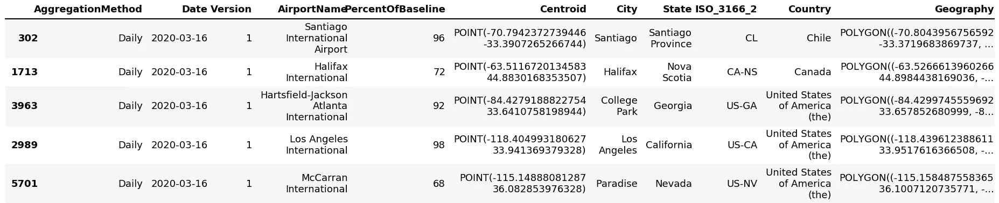

```
data.tail()
```

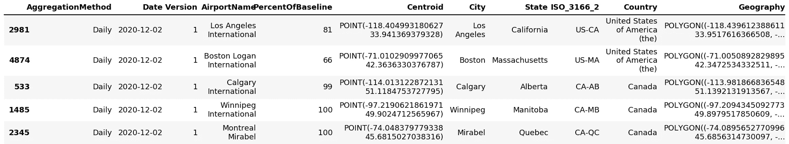

```
data.shape
```

```
(7247, 11)
```

```
grouping = data.groupby("Country").count()
grouping
```

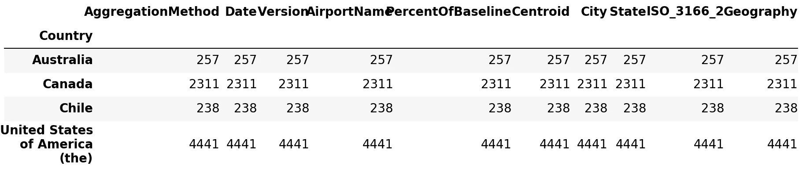

# 从数据中选择特征

```
data = data.drop(['AggregationMethod', 'Version', 'ISO_3166_2', 'Geography', 'Centroid', 'State', 'AirportName', 'City'], 
                         axis=1)
```

```
data.head()
```

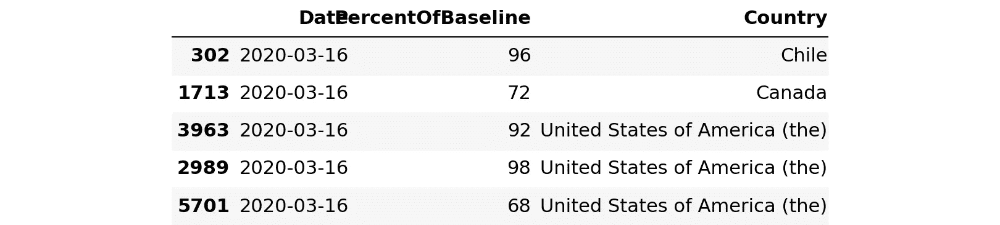

```
data.describe()
```


# 数据可视化

```
groups = data.groupby('Country')
aus_series = groups.get_group('Australia')
canada_series = groups.get_group('Canada')
chile_series = groups.get_group('Chile')
us_series  = groups.get_group('United States of America (the)')

print(aus_series.shape, us_series.shape, chile_series.shape, canada_series.shape)
```

```
(257, 3) (4441, 3) (238, 3) (2311, 3)
```

```
# This is the mean variation of the PercentOfBaseline w.r.t each Country . 

plt.figure(figsize=(8,5))
sns.barplot('Country', 'PercentOfBaseline', hue='Country', data=data)
plt.xticks(rotation=90)
plt.legend(loc='upper right')
```

```
C:\Users\TATAN\anaconda3\lib\site-packages\seaborn\_decorators.py:43: FutureWarning: Pass the following variables as keyword args: x, y. From version 0.12, the only valid positional argument will be `data`, and passing other arguments without an explicit keyword will result in an error or misinterpretation.
  FutureWarning

<matplotlib.legend.Legend at 0x2c2280fa08>
```

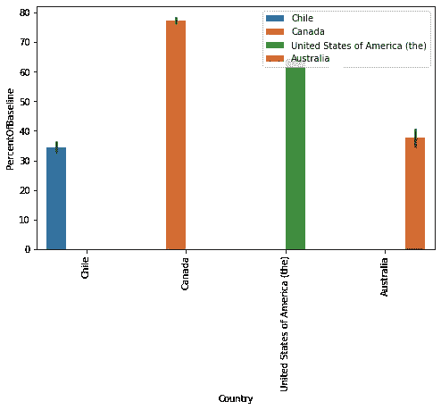

```
# Density plot of countries according to their PercentOfBaseline . 

plt.figure(figsize=(8,5))
sns.kdeplot(data=data, hue='Country', x='PercentOfBaseline', shade=True)
plt.xticks(rotation=90)
plt.legend(loc='upper right', title="Country", labels=['Canada', 'USA', 'Australia', 'Chile'])
plt.show()
```

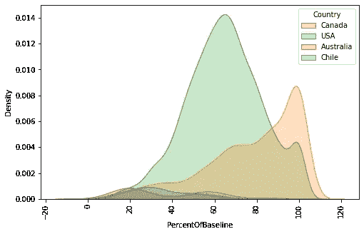

```
# Time series variation of Baseline Percentage of Australia .

aus_series.plot(x='Date')

canada_series.plot(x='Date')

chile_series.plot(x='Date')

us_series.plot(x='Date')
```

```
<matplotlib.axes._subplots.AxesSubplot at 0x2c226c7f88>
```

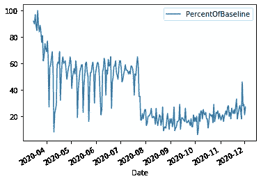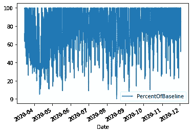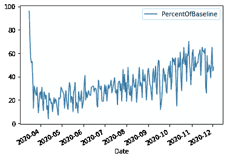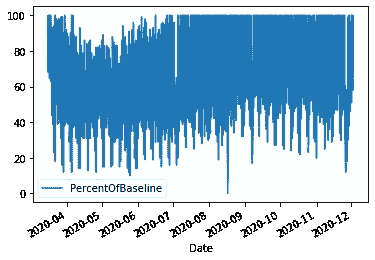

## 上述图的滚动平均将为我们提供一个无噪声的可视化

```
# USA's timeseries had some noise which is eliminated by using a rolling average plot . 
```

```
# Moving or rolling avg is the average of n days , 20 in our 
# case , which is replaced with the first reading and so on.
```

```
us_avg = us_series.drop('Country', axis=1)
us_avg = us_avg.set_index('Date')
us_mean = us_avg.rolling(20).mean()
us_mean = us_mean.PercentOfBaseline.fillna(us_mean.PercentOfBaseline.mean())
us_mean.plot()
```

```
<matplotlib.axes._subplots.AxesSubplot at 0x2c2288b948>
```

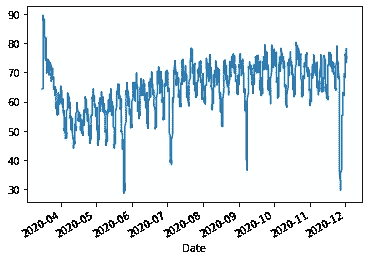

```
# Canada's timeseries had some noise as well which is eliminated by using a rolling average plot again .  

canada_avg = canada_series.drop('Country', axis=1)
canada_avg = canada_avg.set_index('Date')
canada_mean = canada_avg.rolling(20).mean()
canada_mean = canada_mean.PercentOfBaseline.fillna(canada_mean.PercentOfBaseline.mean())
canada_mean.plot()
```

```
<matplotlib.axes._subplots.AxesSubplot at 0x2c22950a08>
```

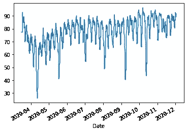

```
chile_avg = chile_series.drop('Country', axis=1)
chile_avg = chile_avg.set_index('Date')
chile_avg.head()
```


```
aus_avg = aus_series.drop('Country', axis=1)
aus_avg = aus_avg.set_index('Date')
aus_avg.head()
```


# 数据建模——原始方法或基线方法

这里我们假设第(t+1)天的产量受第(t)天产量的影响很大。

在这里，我们只是创建一个 pandas 系列，并将两个系列连接在一起，实际系列+预测系列，换句话说，这意味着在预测列中，特定日期的读数就是前一天实际列的读数。因此，第一个的预测列读数是 NaN，这就是我们在将数据分为 train 和 test 时使用切片来删除该部分的原因。

```
# Australia 
aus_model = aus_series.drop('Country', axis=1)
aus_model = aus_model.set_index('Date')
aus_values = aus_model.values
aus_values = aus_values.flatten()    # converting a 2D array to 1D array .
aus_values = pd.Series(aus_values)

# Canada
canada_model = canada_series.drop('Country', axis=1)
canada_model = canada_model.set_index('Date')
canada_values = canada_model.values
canada_values = canada_values.flatten()    # converting a 2D array to 1D array .
canada_values = pd.Series(canada_values)

# Chile
chile_model = chile_series.drop('Country', axis=1)
chile_model = chile_model.set_index('Date')
chile_values = chile_model.values
chile_values = chile_values.flatten()    # converting a 2D array to 1D array .
chile_values = pd.Series(chile_values)

# USA
us_model = us_series.drop('Country', axis=1)
us_model = us_model.set_index('Date')
us_values = us_model.values
us_values = us_values.flatten()    # converting a 2D array to 1D array .
us_values = pd.Series(us_values)
```

## 训练和测试设备

```
us_pred = pd.concat([us_values, us_values.shift(1)], axis=1)
us_pred.columns = ('Actual', 'Predicted')

aus_pred = pd.concat([aus_values, aus_values.shift(1)], axis=1)
aus_pred.columns = ('Actual', 'Predicted')

chile_pred = pd.concat([chile_values, chile_values.shift(1)], axis=1)
chile_pred.columns = ('Actual', 'Predicted')

canada_pred = pd.concat([canada_values, canada_values.shift(1)], axis=1)
canada_pred.columns = ('Actual', 'Predicted')
```

```
# One has been shown to clarify the above process of joining two series objects , Actual Series + Predicted Series . 

us_pred.head()
```


```
us_train, us_test = us_pred[1:180], us_pred[180:]

chile_train, chile_test = chile_pred[1:180], chile_pred[180:]

aus_train, aus_test = aus_pred[1:180], aus_pred[180:]

canada_train, canada_test = canada_pred[1:180], canada_pred[180:]
```

下面给出了各个国家基线百分比的 RMSE 值，这些是通过使用 naiive 方法获得的均方根值。

这意味着预测值具有实际值±RMSE 值的误差

```
error_us = mean_squared_error(us_train.Actual, us_train.Predicted)
print("The RMSE of PercentOfBaseline in USA is : ",np.sqrt(error_us))

error_aus = mean_squared_error(aus_train.Actual, aus_train.Predicted)
print("The RMSE of PercentOfBaseline in Australia is : ",np.sqrt(error_aus))

error_chile = mean_squared_error(chile_train.Actual, chile_train.Predicted)
print("The RMSE of PercentOfBaseline in Chile is : ",np.sqrt(error_chile))

error_canada = mean_squared_error(canada_train.Actual, canada_train.Predicted)
print("The RMSE of PercentOfBaseline in Canada is : ",np.sqrt(error_canada))
```

```
The RMSE of PercentOfBaseline in USA is :  18.885423423293823
The RMSE of PercentOfBaseline in Australia is :  12.131725802610307
The RMSE of PercentOfBaseline in Chile is :  10.93735335097218
The RMSE of PercentOfBaseline in Canada is :  26.23145793650937
```

# ARIMA 模型——自回归综合移动平均模型

```
plot_acf(us_values)       # Determines the value of q
```

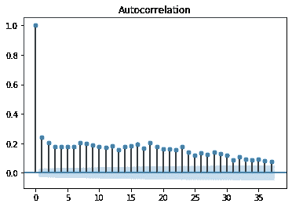

```
plot_pacf(us_values)         # Determines the value of p
```

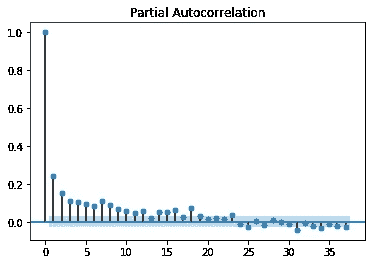

## ARIMA 的美国模式评估

```
# Stationary Check  
adf_us = ADFTest()
adf_us.should_diff(us_avg)
```

```
(0.01, False)
```

```
# Model fitting
us_train_set, us_test_set = us_avg[:3000], us_avg[3000:]
us_arima_model = auto_arima(us_train_set)

us_arima_model.summary()

us_forecast = pd.DataFrame(us_arima_model.predict(n_periods=1441), index=us_test_set.index)
us_forecast.columns = ['Predicted']
us_forecast.head()

print('The RMSE value of US model using ARIMAX is: ',np.sqrt(mean_squared_error(us_test_set['PercentOfBaseline'], us_forecast)))
```

```
The RMSE value of US model using ARIMAX is:  18.08401653770757
```

# 澳大利亚模式在 ARIMA

```
# Stationary Check  
adf_aus = ADFTest()
adf_aus.should_diff(aus_avg)
```

```
(0.4789346473319759, True)
```

```
# Model fitting
aus_train_set, aus_test_set = aus_avg[:200], aus_avg[200:]
aus_arima_model = auto_arima(aus_train_set)

aus_arima_model.summary()

aus_forecast = pd.DataFrame(aus_arima_model.predict(n_periods=57), index=aus_test_set.index)
aus_forecast.columns = ['Predicted']
aus_forecast.head()

print('The RMSE value of AUS model using ARIMAX is: ',np.sqrt(mean_squared_error(aus_test_set['PercentOfBaseline'], 
                                                                                 aus_forecast)))
```

```
The RMSE value of AUS model using ARIMAX is:  23.86492851256695
```

# ARIMA 的加拿大模式

```
# Stationary Check  
adf_canada = ADFTest()
adf_canada.should_diff(canada_avg)
```

```
(0.01, False)
```

```
# Model fitting
canada_train_set, canada_test_set = canada_avg[:2000], canada_avg[2000:]
canada_arima_model = auto_arima(canada_train_set)

canada_arima_model.summary()

canada_forecast = pd.DataFrame(canada_arima_model.predict(n_periods=311), index=canada_test_set.index)
canada_forecast.columns = ['Predicted']
canada_forecast.head()

print('The RMSE value of Canada model using ARIMAX is: ',np.sqrt(mean_squared_error(canada_test_set['PercentOfBaseline'], 
                                                                                 canada_forecast)))
```

```
The RMSE value of Canada model using ARIMAX is:  19.894301935116854
```

# ARIMAX 中的智利模型

```
# Stationary Check  
adf_chile = ADFTest()
adf_chile.should_diff(chile_avg)
```

```
(0.01, False)
```

```
# Model fitting
chile_train_set, chile_test_set = chile_avg[:200], chile_avg[200:]
chile_arima_model = auto_arima(chile_train_set)

chile_arima_model.summary()

chile_forecast = pd.DataFrame(chile_arima_model.predict(n_periods=38), index=chile_test_set.index)
chile_forecast.columns = ['Predicted']
chile_forecast.head()

print('The RMSE value of Canada model using ARIMAX is: ',np.sqrt(mean_squared_error(chile_test_set['PercentOfBaseline'], 
                                                                                 chile_forecast)))
```

```
The RMSE value of Canada model using ARIMAX is:  10.892022320721628
```

# 结论

几个值得注意的结论:

1.  naiive 模型在澳大利亚的情况下表现得更好，这在某种程度上是可预测的，因为零假设没有被拒绝。
2.  与 naiive 模型相比，美国、加拿大和智利的 ARIMA 模型仅略微降低了 RMSE 值。

```
rmse_n = np.sqrt([error_aus, error_canada, error_chile, error_us])

rmse_arima = np.sqrt([
                      mean_squared_error(aus_test_set['PercentOfBaseline'], aus_forecast),
                      mean_squared_error(canada_test_set['PercentOfBaseline'], canada_forecast),
                      mean_squared_error(chile_test_set['PercentOfBaseline'], chile_forecast), 
                      mean_squared_error(us_test_set['PercentOfBaseline'], us_forecast)
                    ])
```

```
overview = pd.DataFrame({'RMSE-Naiive Model':rmse_n, 'RMSE ARIMA Model': rmse_arima}, 
                        index=['Australia', 'Canada', 'Chile', 'United States'])
```

```
overview.head()
```


这是对美国、智利、加拿大和澳大利亚这四个国家的新冠肺炎交通数据的详细分析。获得的值是密度的百分比，这是本案例研究中的目标变量。