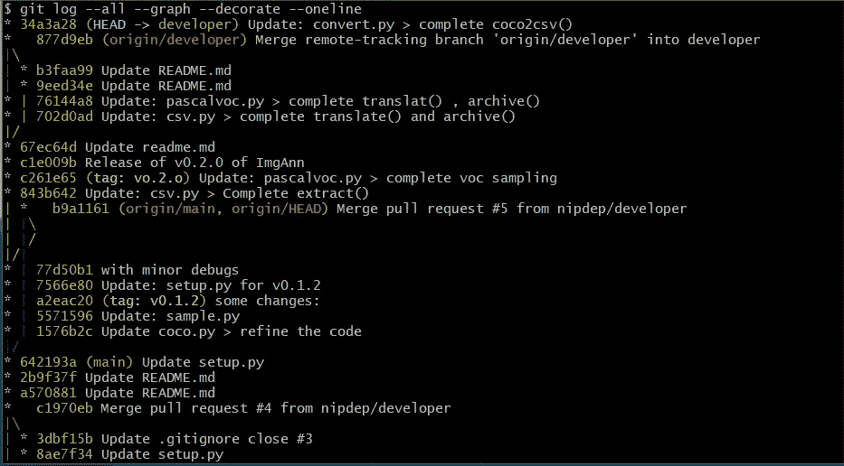

# 对 python 包构建(编码)有明确的理解

> 原文：<https://medium.com/analytics-vidhya/explicit-understanding-of-python-package-building-coding-93fa72c7cb95?source=collection_archive---------11----------------------->

照片由[穆罕纳德·阿贾恩](https://unsplash.com/@isword?utm_source=unsplash&utm_medium=referral&utm_content=creditCopyText)在 [Unsplash](https://unsplash.com/s/photos/python-code?utm_source=unsplash&utm_medium=referral&utm_content=creditCopyText) 拍摄

尽管有很多关于 python 打包的资料，但是你很难找到关于如何编写一个可持续的、高效的、对用户和开发者都友好的包的资料。因此，本文的目标是简要描述在构建您的包时需要注意的方面，并提供一些参考来深入研究每一部分。

因此，有许多主要领域需要跟进。我将尝试在这里讨论与您在打包中使用的架构无关的主题，换句话说，在开始编码之前您必须知道的基本概念。

> ***代码库版本***

你首先要明白的是，这不同于包版本控制。通常 git 用作版本控制系统{不是 GitHub }，GitHub 用作远程存储库控制器。在开始打包之前，您必须掌握一些基本概念。

*   分支——因为 python 包是一个工件[ *,工件是一个可以部署的软件。* ]必须有两个环境用于开发，另一个用于部署或生产。因此，您必须遵循的最常见步骤是:

`git init`-在项目文件夹中设置 git

`git branch developer`-创建一个开发者分支【分支名称是约定的，但是您可以使用任何名称】。这是因为当您启动主分支时，git 会创建它。所以，一般来说，我们使用主分支作为部署分支。

`git checkout developer`-设置你的 git 头到开发者分支。默认情况下，将所有更改添加到 developer 分支中。

*   git 提交——如果你熟悉 git，你一定会知道我们可以通过使用`git commit -am"git commit massage"`保存所有项目文件的快照。用技术术语来说，我们可以在有向无环图中添加一个带有唯一散列键的 blob。所以，重点是说 git 提交的良好实践。

— 1.在代码库的每一次重大变更后提交。前任。在完成每一个方法之后[ *这真的在测试驱动开发(TDD)* 中使用

— 2.编写有意义的完整提交消息。—因为提交消息的目的是让您在查看 git 提交历史时，对当时所做的更改有一个大概的了解。当您当前的变更与先前的变更不兼容时，这种实践肯定会有回报。

给你的承诺历史一个很好的总结。

控制良好的 git 日志报告将是这样的

*   git 标签——简单地说，这是 git 中真正的版本控制。从技术上讲，git 标签是指向特定点 git 历史的引用点。黄色( *tag: v0.3.0* )类零件由其标记生成。作为一个良好的实践，您将在每个到主分支的 pull-request 之后添加一个 git 标记{这将在包版本控制部分讨论。}您可以使用`git tag -a v0.2.0`命令添加一个 git 标签，这个标签会将标签添加到最近的提交中。[您还可以通过在末尾添加一个提交散列来为任何提交添加一个标记。但是标签版本必须按升序排列。]

链接:

[使用 git 进行版本控制](https://www.atlassian.com/git/tutorials/what-is-git#version-control-with-git)

[设置存储库](https://www.atlassian.com/git/tutorials/setting-up-a-repository)

[git 标签](https://www.atlassian.com/git/tutorials/inspecting-a-repository/git-tag)

> ***doc 文件&doc 字符串***

doc 文件和 docstring 在包的文档中。这两者都非常重要，因为包的文档是清楚了解包的功能以及用户在调用时必须输入的语法和参数的唯一途径。它不仅是一个用户指南，而且文档文件也是一个开发者了解某些函数的输入和输出类型的好地方。

*   *docstring* —它就像一个普通的注释，但是 docstring 更强大。例如，当您调用像`>>> help(some function)`这样的命令时，该命令显示特定函数中的文档字符串。此外，您可以使用`repr(some_function.__doc__)`或`print(some_function.__doc__)`输出相同的结果。那么，如何写好 docstring 呢？。有两种常规方法。
*   1.**单行 docstring —** 使用三个单引号或三个双引号。左引号和右引号必须在同一行。这是语法，但是单行 docstring 的用法是非常简要地说明模块和函数的功能。尤其是对于模块。因为单行 docstring 大多用类的顶部来描述类。

*   2.**多行 docstring—S**yn 与单行 docstring 的区别在于，开始和结束引号不需要在同一行。实际上，由于编写多行 docstrings 的格式，它永远不会发生。通常用于描述功能或方法。

正如你在上面看到的，有一个格式，但没有一个通用的格式。你可以在不同的包中通过键入`help()`看到这一点。但是，结果必须详细说明函数的参数是什么，函数具体做什么，如果没有错误或警告，输出和输出类型是什么。

*   doc 文件——通常这就是你在 PyPI、GitHub 或 readthedocs 网站上读到的内容。无论您将 doc 文件存放在哪里，doc 文件都必须包含关于软件包的一些基本内容。1-快速回顾:给出这个包应该是什么样子的想法。2-安装:最重要的部分。这里，`pip install your-package`命令和它需要的其他内部和外部依赖项。3-用法:这是对包装的一种详细描述。对于小包装，这部分是功能文档区[通常有单独的功能描述和示例]。如果你在 [PyPI](https://pypi.org/) 或 GitHub 中托管文档，你可以使用 LaTeX 或 markdown 作为编写语言，但是如果你希望在 [readthedocs](https://readthedocs.org/) 站点中托管文档文件，你必须坚持使用 markdown。

链接:

[python 打包](https://realpython.com/pypi-publish-python-package/#documenting-your-package)

[python 文档](https://realpython.com/documenting-python-code/)

> ***日志***

正如它听起来的那样，日志记录创建关于函数/方法在运行时如何表现的日志文件。通常，您的代码将日志保存在您在`log/`主目录下给出的文件中。这在开发人员方面很有帮助，因为开发人员可以理解各种输入中的代码流。这在调试阶段非常有用。就这样吗？不，即使这样也不是你必须使用日志程序而不是传统的`print()`语句的主要原因。主要原因是 python 打包中禁止使用 print 语句。同样，如果你在你的包中使用了一些面向对象的设计模式，那么`print()`语句是没有用的。命令，状态]。第二个主要原因是，因为你正在构建一个包，所以你必须向用户提供关于操作如何进行的信息。

在 python 中，有一个名为‘logging’的原生日志库，你可以通过`import logging`导入它。但不像日志中的其他库，你必须创建它的一个实例，并在每个 python 文件的顶部配置它。

基本了解如何配置记录器。不要太在意方法类是什么。

正如我通常所说的，日志文件保存在一个单独的文件中。但是这对用户来说一点用都没有，否则消息会显示在它运行的终端或控制台中。幸运的是，在默认配置的日志库中。但是您必须编写一些额外的行来配置在外部文件中写日志。根据严重性，有几个日志事件。

1.  *调试*
2.  *信息*
3.  *警告*
4.  *错误*

*4.5。例外【这不是主要的，但是你会经常用到】*

*5。关键*

您可以手动决定消息的重要级别以及每个 python 文件支持的最低重要级别。[ *上图最后一行就是这么做的]* 除此之外，你还必须明白，日志记录操作不会杀死任何进程。所以，如果你在文件中写了一个错误信息，你必须通过一个`try : except:`块手动处理这个异常。

链接:

[python 日志](https://realpython.com/python-logging/)

[python 日志深入人心](https://realpython.com/python-logging-source-code/)

这只是冰山一角，你将面临建设自己的图书馆。有很多事情需要掩盖:

*   文件和版本控制 ✅
*   [封装架构](/analytics-vidhya/explicit-understanding-of-python-package-building-structuring-4ac7054c0749)
*   python 装饰者
*   python 生成器
*   python 上下文管理器
*   面向对象的设计模式用法
*   包测试——单元测试——没有模仿/模仿
*   异常处理
*   CI/CD 管道建筑
*   自动化 CI/CD 管道
*   未来兼容性

所以，正如我所说的，有很多问题需要讨论。那么，一会儿见！