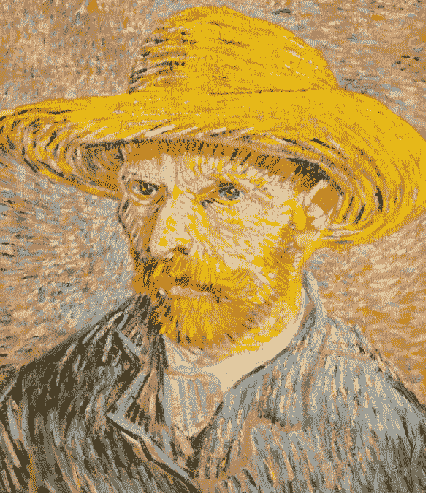
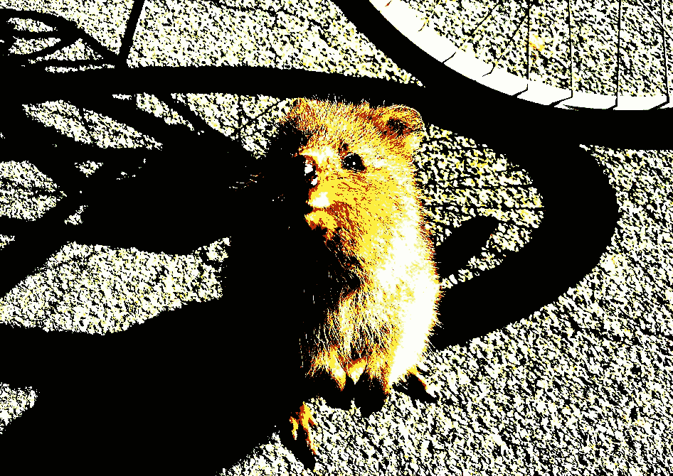
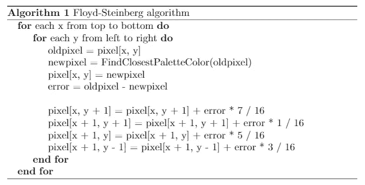
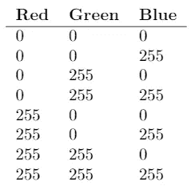
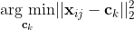
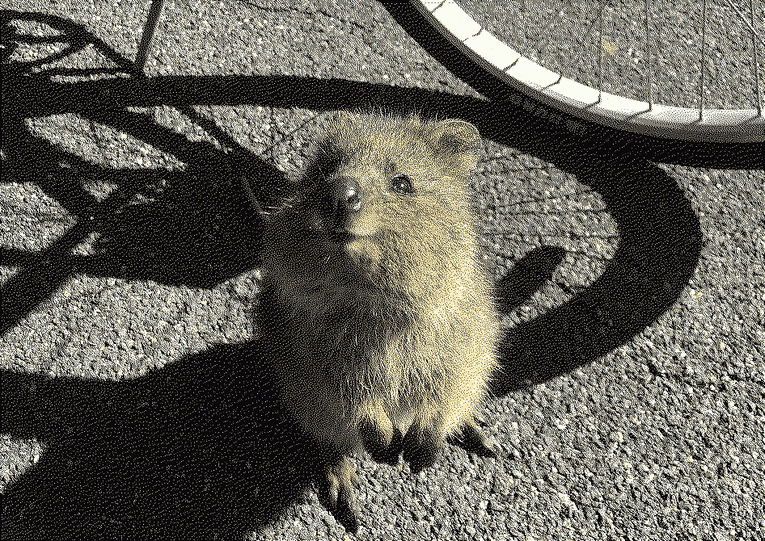

# 利用 Floyd-Steinberg 算法在 R

> 原文：<https://medium.com/analytics-vidhya/exploiting-the-floyd-steinberg-algorithm-for-image-dithering-in-r-c19c8008fc99?source=collection_archive---------5----------------------->



图片来自[rawpixel.com](https://www.rawpixel.com/image/537402/free-illustration-image-van-gogh-vincent-van-gogh-painting)

```
(statistics == programming)> TRUE
```

回到 2019 年，当我在莱顿大学开始攻读统计科学硕士学位时，我根本不知道上述表达式可能会评估为`TRUE`。有教育科学背景的我，在 SPSS 的语法窗口编辑一些代码的时候，总觉得自己是一个真正的程序员。嗯……没有。在我的第一个学期，我注册了“R 统计计算”这门课程，在这门课程中，我学习了统计编程的基础知识。这些课程被证明是我参加过的最有用的课程之一，在这些课程中，我真正对 R 作为一种(统计)编程语言产生了一些喜爱。现在，仅仅一年半之后，我在 Medium 上写了我的第一篇文章——并非完全偶然——关于用于抖动图像的 Floyd-Steinberg 算法:这是对我的第一个真正的编程任务的致敬！

## **图像抖动:一个简短的解释**

好了，图像抖动。很可能你从未听说过它。虽然这不是 Medium 上第一篇文章最吸引人的主题，但它的名字和工作算法都很酷。它还有一些相当不错的基本统计概念，我将在这篇博文的第二部分中讨论。所以，让我们潜入图像抖动的丰富多彩的世界！

> 抖动用于在有限的调色板中创建图像的“颜色深度”的幻觉——这种技术也被称为颜色量化 *~维基百科*

换句话说:我们可以使用抖动来使图片看起来仍然很棒，尽管使用了较少的颜色。这在某种意义上是通过愚弄我们的大脑来实现的。为了揭开这个令人眼花缭乱的把戏，有一些关于图片和标准 RGB 调色板的基本知识是很有见地的。有趣的事实:抖动的图像通常通过小圆点或点来识别。就像梵高那顶惊人的草帽！

## RGB 调色板

图像由像素组成，每个像素可以由具有三个不同值的向量来表示:一个值用于亮度 R 的亮度，一个值用于亮度 G 的亮度，一个值用于亮度 T4 的亮度。假设我们有一张 480×480 = 230，400 像素的图片，并想象左上角的像素由向量 **x** ₁,₁ = {0，0，0}表示。现在，这个像素将是黑色的，因为所有的颜色都设置为最低强度。另一个像素，例如右上角的像素，可以用 **x** ₁,₄₈₀ = {1，0，0}来表示，结果像素就像鲁道夫的鼻子一样红。
使用全色板给了我们 256 = 16，777，216 种不同的颜色:这听起来太夸张了，太多了，人眼都分辨不出来。此外，它使我们的形象不必要的大！下面是这样一张图片(1.2MB)


多可爱啊！小一点的调色板也可以很好的显示这个小男孩，但是如果我们只用三位色系呢？三位意味着 2 = 8 种颜色，或者换句话说:像素向量中的每个 R 值、G 值或 B 值要么关闭(255)，要么打开(0)。结果是:



嗯，看起来我们丢失了大量的信息。幸运的是，现在我们至少知道存在类似抖动的东西，这应该有助于我们让 Quokka Quinten 看起来很好，即使调色板非常小！多亏了罗伯特·弗洛伊德和路易斯·斯坦伯格，我们有了一个神奇的算法来完成这项工作。

## **弗洛伊德-斯坦伯格算法**

弗洛伊德和斯坦伯格早在 1976 年就提出了他们的想法，事实上他们发现了一种欺骗人类大脑的方法，利用了一种叫做*错误扩散的原理。*关于详细的解释，我参考了[维基百科页面](https://en.wikipedia.org/wiki/Floyd%E2%80%93Steinberg_dithering)或[编码列车的这个很棒的解释视频](https://www.youtube.com/watch?v=0L2n8Tg2FwI)。

简而言之，该算法的工作原理如下:



从伪代码中可以看出，误差被指定为用全色调色板表示的像素值与使用较小调色板时的像素值之间的差异。随后，这种误差被分布——或*扩散—* 到相邻像素上。这真的很有帮助，因为我们人类将这种扩散视为较小调色板中可用颜色的一尘不染的混合:我们观察到的颜色比实际上更多！

## **在 R 中抖动图像**

现在我们至少对图像抖动的工作原理有了一个基本的了解，是时候利用弗洛伊德-斯坦伯格算法，让 Quokka Quinten 看起来更精致了！我们首先加载所需的包并读取映像。请注意，该图像为 670×946 像素，因此它被表示为一个由三个矩阵(红色、绿色和蓝色各一个)组成的阵列，这三个矩阵“相互堆叠”。因为我们只需要前三个通道，所以我们只需要选择这些通道。

```
library("tidyverse")
library("png")quokka <- png::readPNG(source = "0_img/quokka.png")
quokka <- quokka[, , 1:3]
```

下一步是编写一个函数来创建一个更小的调色板。我喜欢能够创建不同大小的调色板，例如八种颜色(3 位)、512 种颜色(9 位)甚至 32，768 种颜色(15 位)。因此，该函数取决于 *K* ，它或者是我们想要在调色板中拥有的颜色数量，或者是比特大小。我已经内置了一些简单的检查，但如果你忽略它们，这不是犯罪。

```
CreatePalette <- function(K){ if (K %in% c(8, 64, 512, 4096, 32768) == FALSE &&
     K %in% c(3, 6, 9, 12, 15) == FALSE) {
    stop("Input K must be a one of these numbers: 
        (8, 64, 512, 4096, 32768) or (3, 6, 9, 12, 15)")
 }

 if (K %in% c(3, 6, 9, 12, 15) == FALSE & log2(K) %% 3 != 0) {
   stop("Your input must satisfy the following condition: 
         log2(K) %% 3 == 0")
 } if (K %in% c(8, 64, 512, 4096, 32768)) {
   K = K^(1/3)
 }

 if (K %in% c(3, 6, 9, 12, 15)) {
    K = 2^(K/3)
 } color_combs <- expand.grid(seq(0, 255, 255/(K - 1)), 
                            seq(0, 255, 255/(K - 1)), 
                            seq(0, 255, 255/(K - 1)))

 colnames(color_combs) <- c("Red", "Green", "Blue")

 all_colors <- apply(color_combs, 1, function(x){
   red <- x[1]
   green <- x[2]
   blue <- x[3] 
   col <- rgb(red, green, blue, maxValue = 255)
   }) out <- list(cols = all_colors,
             dat = color_combs)

 return(out)
}
```

前两个`if`语句用于检查我们是否提供了有效的输入。接下来的两个`if`语句确保 *K* 被转换成像素向量的单个条目可以取的值*的数量。假设我们想要创建一个 3 位调色板。这意味着我们有八种不同的 RGB 组合:*



注意，我们使用 R 的内置`rgb`函数，它将像素亮度转换成十六进制代码的实际颜色。不要惊慌，这只是另一种表现颜色的方式——就像 RGB 配色方案一样！

在我们实际应用 Floyd-Steinberg 算法之前，最后一步是编写一个函数，为每个像素找到较小调色板中“最接近”的颜色，其中接近度定义为:



其中 **c** ₖ = {Redₖ，Greenₖ，Blueₖ}对于 *k* ∈ {1，…， *K* }是缩减调色板中的特定颜色， **x** ᵢⱼ是我们考虑的像素的强度向量。用不太专业的术语来说:最接近的颜色是平方欧几里德距离最小的颜色！使用功能`FindClosestPaletteColor`，我们可以在较小的调色板中用最接近的颜色替换每个像素:

```
FindClosestPaletteColor <- function(picture, n_bit, maxValue = 255){ if (maxValue != 1 & maxValue != 255) {
    stop("maxValue should be either 1 or 255")
 }

 if (maxValue == 1) {
    picture <- picture * 255
 }

 col_palette <- CreatePalette(n_bit)$dat

 closestpixel <- array(dim = dim(picture))

 for (i in 1:nrow(picture)) {
   for (j in 1:ncol(picture)) {
       pixel <- picture[i, j, ]
       ind <- which.min(rowSums(t(pixel - t(col_palette))^2))

       closestpixel[i, j, ] <- as.numeric(col_palette[ind, ])
   }
 }

 return(closestpixel)
}
```

到目前为止，我们已经准备好了能够顺利地将弗洛伊德和斯坦伯格的想法处理成工作算法的所有要素。祝你好运！

```
DitherImage <- function(picture, n_bit) {

 pixels <- picture
 quant_error <- array(dim = dim(picture))
 col_palette <- CreatePalette(n_bit)$dat/255

 for(i in 1:(nrow(pixels) - 1)){
   for(j in 1:(ncol(pixels) - 1)){
       oldpixel <- pixels[i, j, ] 
       newpixel <- Closest(oldpixel, col_palette)
       pixels[i, j, ] <- newpixel
       quant_error[i, j, ] <- oldpixel - newpixel

       pixels[i    , j + 1, ] <- pixels[i, j + 1, ] +
                              quant_error[i, j, ] * 7 / 16
       pixels[i + 1, j + 1, ] <- pixels[i + 1, j + 1, ] + 
                              quant_error[i, j, ] * 1 / 16
       pixels[i + 1, j    , ] <- pixels[i + 1, j    , ] + 
                              quant_error[i, j, ] * 5 / 16
       pixels[i + 1, j - 1, ] <- pixels[i + 1, j - 1, ] + 
                              quant_error[i, j, ] * 3 / 16
   }
 } col_oldpixels <- pixels[, ncol(pixels), ]
 col_newpixels <- matrix(nrow = nrow(col_oldpixels), 
                         ncol = ncol(col_oldpixels))

 for (i in 1:nrow(col_oldpixels)) {
    col_newpixels[i, ] <- Closest(col_oldpixels[i, ], col_palette)
 }

 pixels[, ncol(pixels), ] <- col_newpixels
 quant_error[, ncol(pixels), ] <- col_oldpixels - col_newpixels row_oldpixels <- pixels[nrow(pixels), , ]
 row_newpixels <- matrix(nrow = nrow(row_oldpixels), 
                         ncol = ncol(row_oldpixels))

 for (i in 1:nrow(row_oldpixels)) {
    row_newpixels[i, ] <- Closest(row_oldpixels[i, ], col_palette)
  }

 pixels[nrow(pixels), , ] <- row_newpixels
 quant_error[nrow(pixels), , ] <- row_oldpixels - row_newpixels

 out <- list(New_Colors = pixels,
             Errors = 255 * quant_error,
             Loss = sum((255 * quant_error)^2))

 return(out)
}
```

有几个小细节值得补充说明:

1.  双`for`循环是大部分抖动发生的地方。由于该算法只能正确处理除第一列和最后一列以及最后一行之外的所有内容，因此我们需要一些额外的代码来抖动图像边缘。这是处理所有后续代码的地方。
2.  为了找到较小调色板中新像素的亮度，我使用了函数`Closest`。这其实是`FindClosestPaletteColor`更快的实现。代码如下:

```
Closest <- function(pixel, col_palette = col_palette) {
 ind <- which.min(rowSums(t(pixel - t(col_palette))^2))

 newpixel <- as.numeric(col_palette[ind, ])

 return(newpixel)
}
```

这是一个总结！那是一些杰出的*高级菜肴*，在那里我们成功地实现了 Floyd-Steinberg 算法来抖动 Quokka Quinten。保存结果的一个相当方便的方法是运行下面几行代码:

```
dithered_03 <- DitherImage(quokka, n_bit = 3)
writePNG(dithered_03$New_Colors, "0_img/quokka_dithered_03.png")
```

看看他！Quiten 现在看起来好多了，尽管我们只用了 8(！)颜色。在第二部分中，我们将更深入地探究算法背后的统计过程，并且我们将尝试提出一种合理的方法来确定颜色的最佳数量。希望你喜欢！



抖动 3 位 qu kka Quinten(0.28 MB)

[1] R.W. Floyd 和 L. Steinberg“空间灰度的自适应算法”，《信息显示学会会议录》，第 17 卷第 2 期，1976 年，第 75-77 页。

完整源代码:【https://github.com/justinkraaijenbrink/imagedithering 