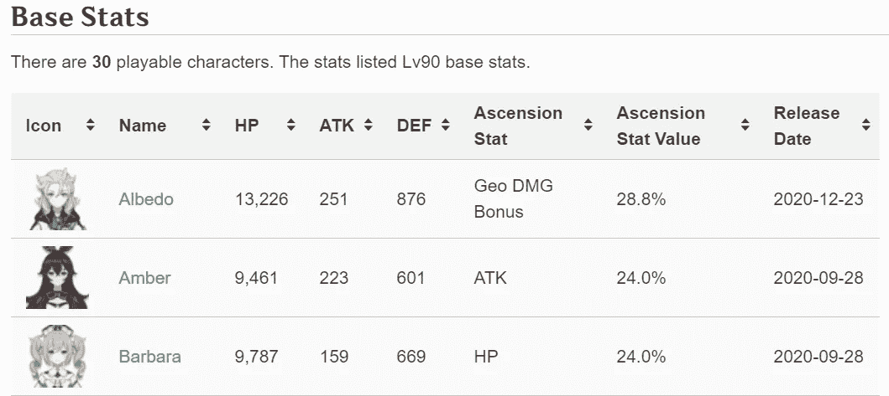
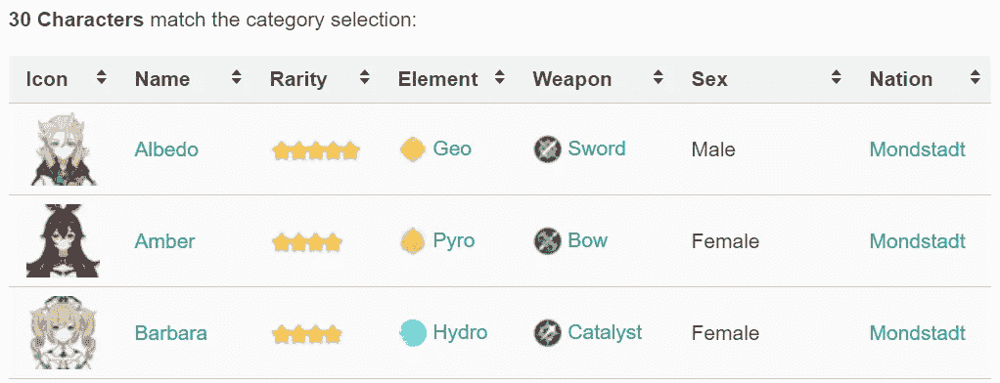
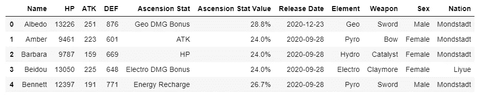
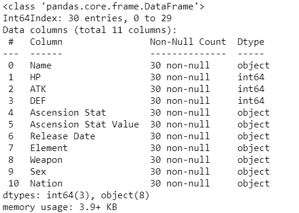
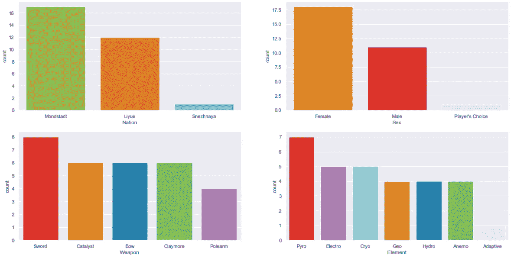
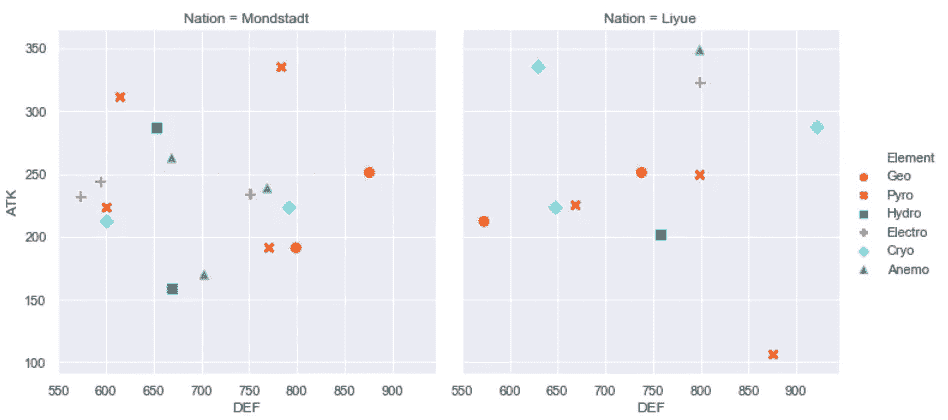
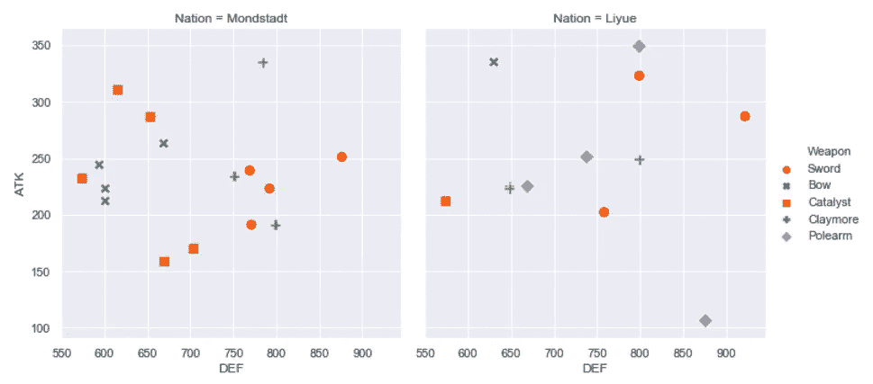
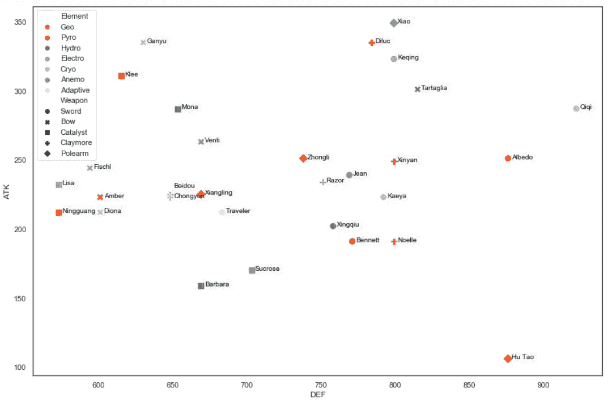

# 探索性分析根生对熊猫和海伯恩的影响:李越队比蒙德斯塔特队强？

> 原文：<https://medium.com/analytics-vidhya/exploratory-analysis-on-genshin-impact-characters-with-pandas-seaborn-are-liyues-stronger-than-f46a9af07fb5?source=collection_archive---------9----------------------->

风筝节即将结束。我们的旅行者第一次来到特瓦特已经有一段时间了。随着 Genshin Impact 的收入在今年 3 月[超过 10 亿美元](https://sensortower.com/blog/genshin-impact-one-billion-revenue)，在我们探索 Mondstadt 和前往李越的旅途中也发生了很多事情。从营救德瓦林、保护玉石室、帮助艾拉·马斯克练习[希利科里亚](https://genshin-impact.fandom.com/wiki/Hilichurlian)，向阿德普图斯致敬，到“照顾”蒂米的鸟儿...你说吧。

多达 30 个*可玩角色(嗯，gacha-able)* 和它不断扩展的世界，我们肯定有很多要涵盖。战斗系统的深度和角色的众多统计数据也产生了[飘带社区](https://www.twitchmetrics.net/channels/viewership?game=Genshin+Impact)来展示如何最好地扮演每个角色，通常接下来是关于哪个(哪些)可以给出最高伤害输出的辩论。

本文旨在从一个稍微不同的角度为类似的话语做出贡献，即:**来自最近地区(李越)的人物客观上更强吗？**这是一个有趣的问题，因为 Mihoyo 倾向于引入[专栏人物](https://www.oneesports.gg/gaming/3-reasons-why-xiao-is-the-best-main-dps-in-genshin-impact-right-now/)(有时[据称削弱了他们](https://www.hoyolab.com/genshin/article/137567)，但不是真的)，而且因为我们看到了来自李越的多个新人物。

# **方法论**

比较将着眼于 90 级角色的 ATK 基础属性，控制可用的特征，如元素，武器类型&。这忽略了其他能让角色变得异常强大的变量，比如；物品、装备、提升属性、星座、元素反应、共鸣、被动/天赋、游戏风格，当然还有玩家的技能。

该方法使用 [Pandas](https://pandas.pydata.org/pandas-docs/version/0.23/generated/pandas.read_html.html) 读取 html 源表并创建数据帧，然后使用 [Seaborn](https://seaborn.pydata.org/) 进行简单的数据可视化。

# **数据来源**

我们将使用 Pandas 从 [Genshin-Impact Fandom wiki](https://genshin-impact.fandom.com/wiki/Characters) 网站导入数据。我们想要检索的表的屏幕截图如下:



图 1:90 级时 30 个角色的基本统计数据(来自 genshin-impact.fandom.com)



图 2:可玩角色信息(来自 genshin-impact.fandom.com)

# **数据准备&分析**

**a .使用 Pandas *read_html* 导入数据集**我们通过*url1*&*url2*获取我们想要的表，并命名为 *df1* & *df2* 。索引[0]和[1]是我们想要的表的位置。Python 从 0 开始索引，所以拥有[0]和[1]意味着正确的表是表 1 用于 *url1* ，表 2 用于 *url2* 。一些 NaN 列被移除。drop 方法，结果表被合并到 *df3* 中。

使用 df3.head(5)检查前 5 行数据会生成以下结果；



合并的 df3 表显示了我们需要的所有信息

现在，一个好的做法是确保我们想要的列没有 NaN 值。我们可以使用下面的语法来检查:

```
df3.info()
```



df3.info()显示非空计数和数据类型

完美！现在我们已经有了所有需要的数据，没有空值和正确的数据类型，我们准备进入问题的第二部分，使用 Seaborn 的探索性数据分析(EDA )!

**b. Seaborn for EDA**

首先，我们将导入库 seaborn & *pyplot* 。然后，我们定义调色板字典，使每个类别在视觉上更加明显。对于我们的第一次探索，我们将使用*计数图*来探索我们的数据。下面可以看到代码；

结果如下:



df3 数据集的计数图、结果的数据探索

有意思！在 30 个字符中，超过 50%来自 Mondstadt。也许这就是为什么李越的角色不断出现？人物多为用剑者，女性，不足为奇。烟火，所谓的最强元素是最高的！我们准备开始比较李越和蒙德斯泰特。在我们继续之前，Snezhnaya 区域(Childe)和自适应元素(Traveler)可能需要省略。

**c .比较视野(元素):蒙德斯塔特 vs 李越**

我们将使用 *relplot* 来可视化视觉(元素)比较，蒙德斯塔特 vs 李越。代码如下所示。

结果如下:



比较视觉(元素)用户，蒙德斯塔特与李越

你注意到模式了吗？蒙德都特只有 2 个角色在 90 级时 ATK 超过 300，而李越有 3 个。蒙德都特只有一个基础防御超过 850 的角色，而李越有两个。不仅如此，在蒙德斯塔特的 ATK 和 DEF 中唯一突出的视觉(元素)是火焰(你能猜到是谁吗？)，而在李越，我们看到的是 Anemo、Electro & Cryo。意识到最高级别的电影角色来自李越，这难道不有趣吗？

注意:对于较大的数据集，最好使用百分位数来确定阈值上限。但是给定小样本，ATK (>300) & DEF (>850)阈值应该是“可以”的，可以通过查看视觉效果来任意定义。

**d .对比武器类型:蒙德斯塔特 vs 李越**

好吧，也许只看元素是不够的。毕竟，武器类型会影响游戏风格/角色对团队的贡献。所以接下来我们将使用 relplot 来可视化的武器类型比较，蒙德斯塔特 vs 李越。代码如下所示。

结果如下；



比较武器类型，蒙德斯塔特 vs 李越

嗯，似乎对于克莱莫来说，蒙德斯塔特提供了最好的角色。在较小程度上，还有催化剂。没有任何长柄武器特征的蒙德斯塔特可能值得注意(*咳* [罗莎丽娅](https://gamewith.net/genshin-impact/article/show/23585)*咳*)。看看李越，它无疑提供了更多的多功能性。不仅最高 ATK 的角色来自不同的元素，他们也有不同的武器类型；长柄武器，弓&剑。太好了！

**e .总结:绘制所有角色 ATK & DEF**

好了，现在我们知道了如何比较蒙德斯塔德和李越，让我们来比较一下所有的角色，看看哪个角色相对于其他角色位于 ATK 基地。使用的代码如下:

结果如下:



根据 ATK 和 DEF 绘制所有角色

结果似乎表明，人物基数最高的前 5 位是肖、甘雨、迪吕克、柯青和克利。不出所料，他们都是 5 星角色(来自 gacha 的最低点击率)，其中 3 人(肖、甘雨和柯青)来自。在其他条件相同的情况下，当你将这 5 个技能提升到 90 级时，它们将会提供最高的 ATK，因此有可能提供更高的伤害输出。虽然拥有最高的 ATK 并不一定能为你的团队创造最高的价值，但是大多数玩家都会同意这 5 个确实值得一看(&也许是希望？).

# **结论**

从视觉(元素)和武器类型的角度来看，李越比蒙德都有更多 ATK 和整体 DEF 更高的角色。从武器类型来看也是如此。

李越是严酷的，它的性格是坚强的。蒙德都有节日，李越有一些告别仪式。虽然蒙德施塔特的 NPC 经常提供像捡花或取回物品这样的任务，但李越的 NPC 分享着类似于前现代时代的生活，那里有许多悲惨的事故，资源开采和满是宝藏贮藏者的土地，导致了 GI 宇宙中最令人心碎的任务之一——就像这个 [one](https://www.oneesports.gg/gaming/this-genshin-impact-side-quest-made-me-cry-buckets/) 。

也许这就是为什么有更强的性格是有意义的，这样他们才能在李越生存下来。或者这只是一个巧合，因为他们中的一些人是[的专家](https://genshin-impact.fandom.com/wiki/Adepti)？或者这可能只是 Mihoyo 试图提升他们的 gacha 游戏？说说你的想法。

注:完整版本的代码可在本[笔记本](https://github.com/taufiqbashori/medium/blob/main/EDA%20on%20Genshin%20Impact%20Characters%20with%20Pandas%20%26%20Seaborn.ipynb)中获得。