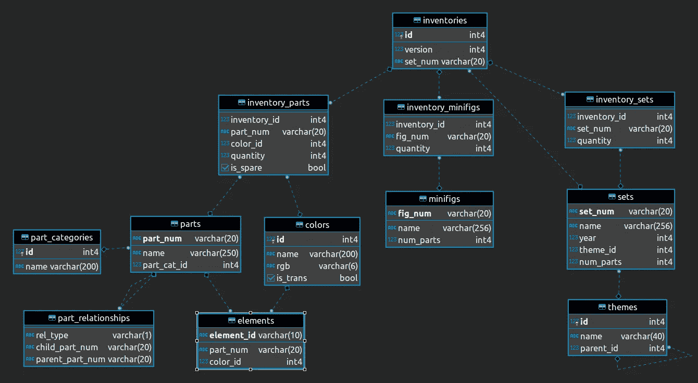
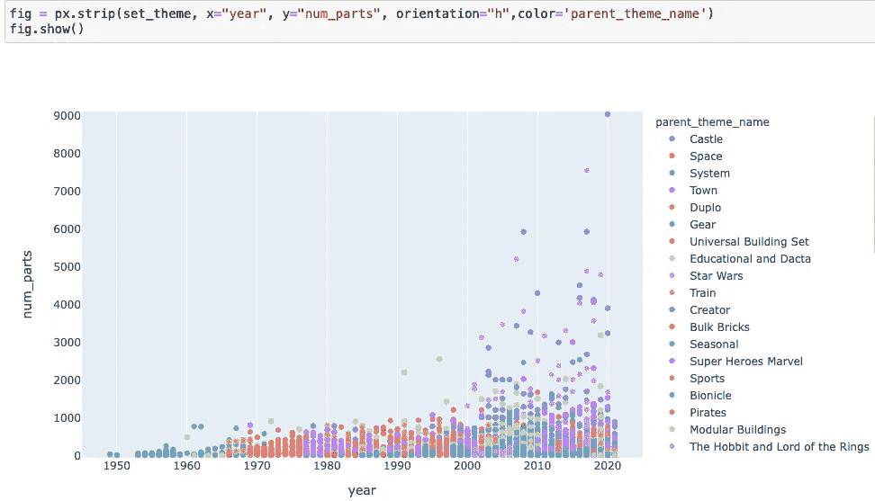
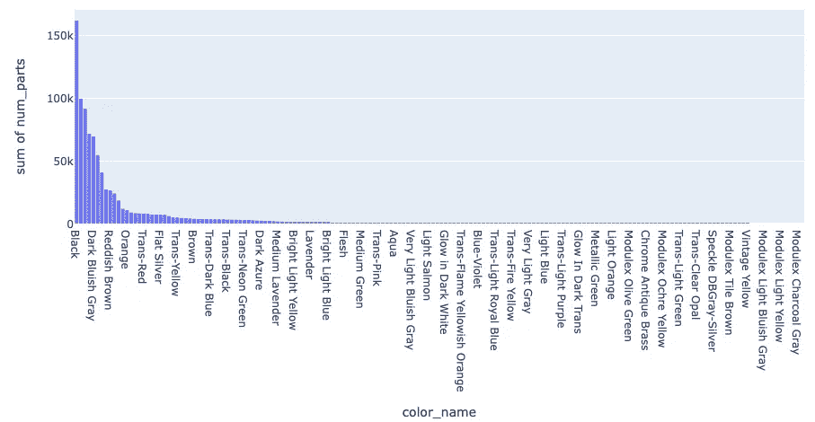

# 乐高数据集的探索性分析

> 原文：<https://medium.com/analytics-vidhya/exploratory-analysis-on-lego-dataset-8967e37fc5dd?source=collection_archive---------6----------------------->

作为一个对乐高感兴趣的年轻人，我一直想分析乐高数据集，以了解趋势、主题和布景的变化。此分析受此模式分析[帖子](https://mode.com/blog/lego-data-analysis/)的启发

*   数据源

数据集来自网站[可重新点击](https://rebrickable.com/)。它提供了一个数据库存储乐高项目-集，零件和迷你图。每日数据可通过 CSV 下载或 API 访问

首先，我直观地检查了每个数据集，以理解每个表的结构和表之间的关系。考虑库存数据集不是乐高公司库存的真实反映。我的分析主要集中在布景、主题、部件和颜色上。

器械包表格包含器械包数量、名称、年份、主题标识、零件数量等列。

主题表包含 Id、name 和 parent_id 列。

*   数据争论

加入 theme_id=Id 后，我们有了从 1949 年到 2021 年的集合和主题信息的统一视图。在 16691 个唯一集合记录中，9625 个记录具有主题 parent_id。num_parts 高度右倾，基于这样一个事实:中位数(41) <mean percentile="" num_parts="" is="" the="" extreme="" outlier="" pieces="" of="" parts="" belong="" to="" set="" class="ae jo" href="https://www.toysnbricks.com/lego-the-ultimate-battle-for-chima-set-10004-pieces/" rel="noopener ugc nofollow" target="_blank">奇马终极之战将于 2015 年上映。处理如此大量的零件是一个相当大的挑战！</mean>

主题表中有 133 个父主题。主题表上的自联接将子集映射到父主题(parent_id=id)。最终组合的数据集(set_theme)如下图，基于此，我在代码中用包 plotly.express，px 作为别名创建了一些交互可视化。

数据分析结果

*   每个不同父主题的零件数量

从 2000 年开始，随着主题的日益多样化，每套零件的数量成倍增加。好几个创作者主题(深紫色)的套装都有 2000 多件。《星球大战》主题套装在 2000 年左右开始出现在系列中，接近《星球大战:第一集——幽灵的威胁》的上映时间。

*   设定每年的数量

在 1970 年之前，大部分布景来自主题系统，该系统具有较高的布景数量，然后最高布景数量在 1971-1979 年逐渐转移到主题乐高乐园(第一个乐高乐园游乐度假村于 1968 年开业)，在 1981-2010 年转移到 Duplo、Universal Building Set、Binocial。从 2011 年开始，可收藏的迷你人偶主题有很多套。你可能想知道乐高小人是否值得收藏，看看这篇[帖子](https://blog.minifigures.com/are-lego-minifigures-worth-collecting/)。

将所有主题结合在一起，在过去的 72 年中，每年器械包计数的总体趋势是上升的。到目前为止，最高峰是在 2015 年(集数是 304)。这反映了乐高的[财务状况](https://en.wikipedia.org/wiki/The_Lego_Group):2015 年上半年营业额为 141.42 亿丹麦克朗，以当地货币计算，较 2014 年同期增长 18%。2015 年上半年的销售额受到所有地理区域两位数增长和强大产品创新的推动，如[乐高 Ninjago](https://en.wikipedia.org/wiki/Lego_Ninjago) 、[乐高精灵](https://en.wikipedia.org/wiki/Lego_Elves)和[乐高创造者](https://en.wikipedia.org/wiki/Lego_Creator)。

*   每年组合的器械包和零件数量

我不想单独查看器械包数量和零件号，而是希望有一个统一的视图来呈现这两个数据点的趋势。总的来说，器械包数量和平均零件数量逐年上升。每年零件数的中位数总是小于平均零件数，进一步证实了零件数的分布是右偏的。

中值:除了 1960 年(部分 263 的中值#)、1968 年(部分 123 的中值#)、1976 年(部分 119 的中值#)之外，中值都在范围(0，75)之间。

在 1976 年之前，中值和平均值非常接近，这部分是由于器械包数量少造成的，但是在 2000 年之后，差距变大了，除了器械包数量增加之外，这主要是由于某些器械包中的零件数量多造成的。

*   21 世纪的流行主题

现在，仔细看看 21 世纪的布景和主题。为了定义流行度，我使用了从 2000 年到现在每个主题的最高总集数作为代理。排名前 20 的热门主题从《星球大战》、《忍者神龟》、蝙蝠侠电影到《超级马里奥》。

每个主题在部分的数量上有相当不同的分布。就像我们之前提到的，零件数量最多的一组是奇马终极之战。一般来说,《星球大战》、《忍者神龟》、《电影忍者神龟》、《蝙蝠侠》和《技术》都有大量的角色，这增加了场景的复杂性和趣味性。Brickheads 是我最想购买的产品之一:价格实惠，设计多样，而且非常容易组装。

*   零件颜色

与集合、主题表相比，颜色表没有用于与其他表进行映射的质量连接键，在 7788 个 set_themes_year 记录中，只有 33 个记录映射了有效的颜色元素。在这种情况下，我把库存 _ 零件和颜色一起分析了。在过去的 72 年里，最常用的 5 种颜色是黑色、白色、浅蓝灰色、红色和深蓝灰色。

外卖:

*   2000 年后，乐高发布了更多受流行电影启发的不同主题的套装，如《星球大战》、《蝙蝠侠》。
*   在过去的 72 年中，设定主题的变化表明了多元化的乐高产品战略:开发乐高乐园和制作 Ninjago 电视系列。
*   随着每套部件数量的逐年增加，乐高积木套组的复杂程度也在增加。

附加信息:

*   该分析是在来自可重新点击网站的 2021 年 2 月 28 日的数据集上进行的。它不是实时分析，并且在数据点定期刷新后会发生变化。
*   图表是通过 plotly.express 包创建的，由于网站的限制，图表没有交互性。
*   如果你想知道填充这些图表的代码，请在这里找到 Github 代码