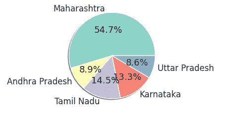

# 探索性数据分析

> 原文：<https://medium.com/analytics-vidhya/exploratory-data-analysis-104675188a4d?source=collection_archive---------25----------------------->

探索性数据分析

我们都知道 EDA(探索性数据分析)大多被**机器学习**爱好者使用。这是一种从数据中可视化、总结和获得有用见解的方式。

进入实际定义**探索性数据分析是指对数据进行初步调查的关键过程，以发现模式，发现异常，测试假设，并在汇总统计和图形表示的帮助下检查假设。**

在这里，我们将分享我们如何在取自[数据世界](https://data.world/)的新冠肺炎数据集上执行 EDA。而 EDA 就是在 [googlecolab](https://colab.research.google.com/drive/1ylFKUcaUQ0vcpyG7y1J0fIGcFP-J4P0G?usp=sharing) 中对此进行的。

在这里你可以找到[数据集](https://data.world/dataman-udit/india-covid-19-state-wise-data/workspace/file?filename=India+COVID-19+State-wise+Info)。

**对这些数据执行 EDA 的需求是什么，执行 EDA 我们能得到什么？**

我们都知道 EDA 就是从数据中获取全面的见解。在执行 EDA 时，我们可以获得关于数据的清晰信息，并且可以找到数据中存在的任何缺失值，并对其执行某些操作以将其最小化。在执行 EDA 时，我们可以获得数据中的隐藏模式，并且可以获得数据的概览。我们可以知道特性是如何相互关联并影响数据的。

**执行 EDA 的步骤**

要执行 EDA，我们的数据必须清晰，没有任何缺失值(NaN ),因此当我们加载数据时，我们必须删除缺失值和不重要的特征。寻找缺失值并将其最小化的过程称为数据清理。

我们数据的样本视图

我们数据的视图

之后，我们将使用下面给出的代码验证任何列中是否有任何缺失值。

> #查找是否有任何缺失值
> 
> df.isna()。总和()

这导致了

我们可以看到没有丢失值

我们正在使用的 Python 包

我们的数据包含州名、活跃病例数、恢复病例数、特定州死亡人数等特征。

找到特征之间的相关性对于执行 EDA 是最重要的。

发现确诊病例数与痊愈病例数之间的相关性。

我们可以看到，康复病例和确诊病例之间有很高的正相关性

发现确诊病例数与死亡数之间的相关性。

我们可以看到，死亡病例和确诊病例之间的正相关性较小。

寻找受新冠肺炎影响最大的州

> df1 = df . sort _ values(by =[' confirmed _ cases ']，ascending=False)
> 
> df1 = df1.head()
> 
> sns.barplot(y = df1["state_ut"]，x = df1["confirmed_cases"])
> 
> #水平轴标签
> 
> plt.ylabel("States ")
> 
> #垂直轴标签
> 
> plt.xlabel(“案例”)

寻找被新冠肺炎收复最多的州

> df2 = df . sort _ values(by =[' recovered _ cases ']，ascending=False)
> 
> df2 = df2.head()
> 
> sns.barplot(y = df2["state_ut"]，x = df2["recovered_cases"])
> 
> #水平轴标签
> 
> plt.ylabel("States ")
> 
> #垂直轴标签
> 
> plt.xlabel(“恢复案例”)

寻找死亡病例最多的州

> df3 = df . sort _ values(by =[' death _ cases ']，升序=False)
> 
> df3 = df3.head()
> 
> sns.barplot(y = df3["state_ut"]，x = df3["death_cases"])
> 
> #水平轴标签
> 
> plt.ylabel("States ")
> 
> #垂直轴标签
> 
> plt.xlabel(“死亡”)

前 5 个州的活动案例百分比

> plt.figure(figsize=(20，20))
> 
> 图 1，ax1 = plt.subplots()
> 
> labels = df1["state_ut"]
> 
> size = df1[" active _ cases "]
> 
> ax1 . pie(size，labels=labels，autopct = ' % 1.1f % % '，shadow=True)
> 
> # ax1.axis('equal ')
> 
> plt.show()

前 5 个州中已恢复案例的百分比

> plt.figure(figsize=(20，20))
> 
> 图 1，ax1 = plt.subplots()
> 
> labels = df1["state_ut"]
> 
> size = df1[" recovered _ cases "]
> 
> ax1 . pie(size，labels=labels，autopct = ' % 1.1f % % '，shadow=True)
> 
> # ax1.axis('equal ')
> 
> plt.show()

前 5 个州的死亡病例百分比

> plt.figure(figsize=(20，20))
> 
> 图 1，ax1 = plt.subplots()
> 
> labels = df1["state_ut"]
> 
> size = df1[" death _ cases "]
> 
> ax1 . pie(size，labels=labels，autopct = ' % 1.1f % % '，shadow=True)
> 
> # ax1.axis('equal ')
> 
> plt.show()

**我们通过对数据执行 EDA 得到的结论:**

通过对数据进行不同的可视化处理，我们了解到

马哈拉施特拉邦有更多的人患有新冠肺炎，也有更多的人从疾病中康复，也有更多的人死于疾病。

以下是活跃病例、痊愈病例和死亡病例较多的邦:马哈拉施特拉邦、安得拉邦、泰米尔纳德邦、卡纳塔克邦、北方邦。

我们可以清楚地看到康复病例和确诊病例之间的相关性，即如果确诊病例数量增加，那么康复病例也会增加。

由此我们可以看出，马哈拉施特拉邦、安得拉邦、泰米尔纳德邦、卡纳塔克邦、北方邦都处于危险地带。