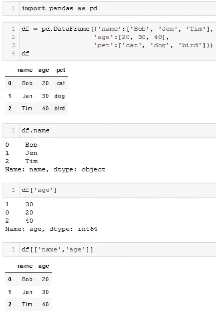
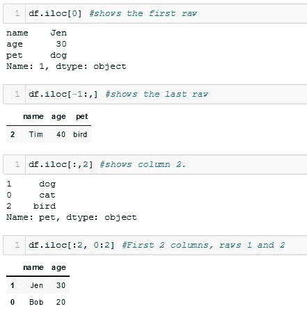
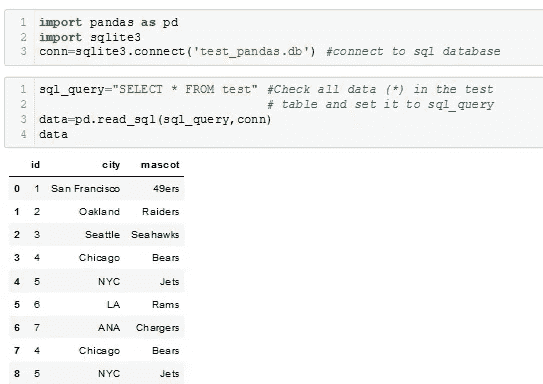
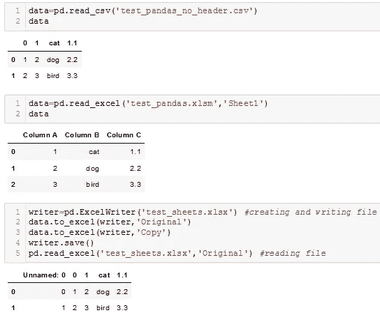
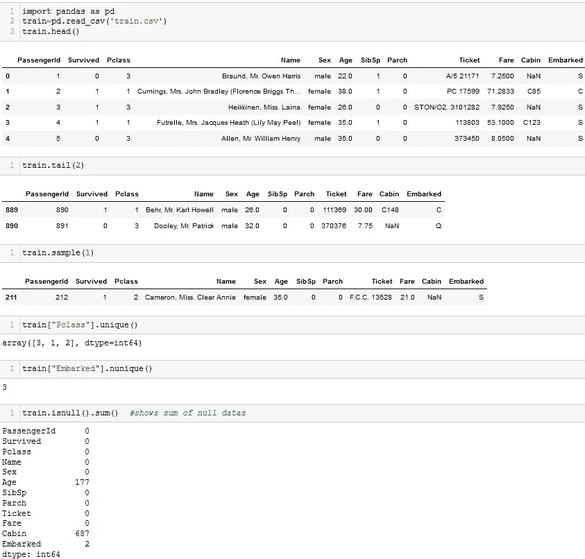
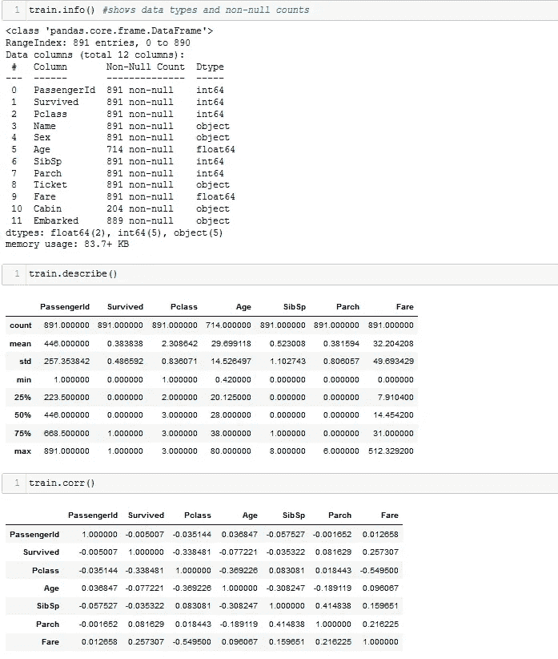
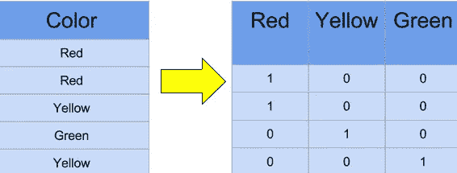
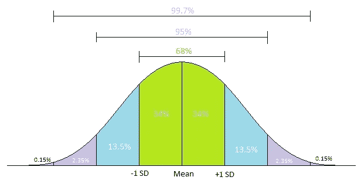
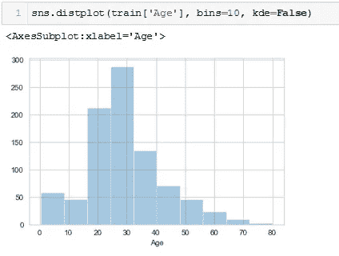
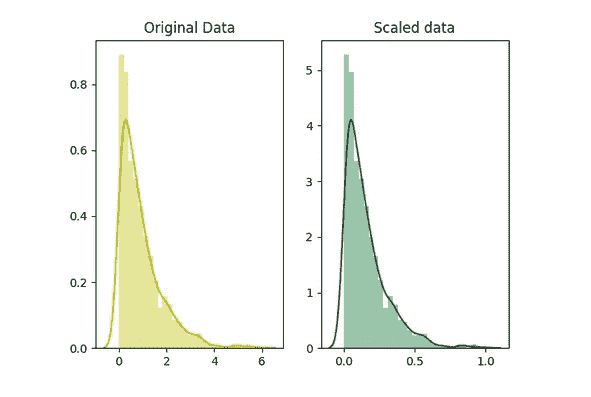

# 探索性数据分析和特征工程

> 原文：<https://medium.com/analytics-vidhya/exploratory-data-analysis-and-feature-engineering-a95e6a79f73a?source=collection_archive---------12----------------------->

再次向大家问好，今天的帖子将包括以下主题:

*创建数据框架和读取数据，探索性数据分析(EDA)-PPR，特征工程*

在我之前的文章中，我谈到了什么是数据以及数据是什么样子的。现在让我们通过用 python 写代码从数据结构和分析开始。首先，熊猫库中的数据结构有两种，dataframe 和 series。Series 是一维数据结构如下，dataframe 是二维或多维数据结构，它有行和列。

## ***创建数据帧***

我们使用“df.columnname”或 df.columnname 来查看特定的列。对于 exp。这些是系列，它们形成数据框架“df”。

## ***读取数据***

有了熊猫图书馆，我们可以读取 csv、excel、sql 等多种格式的数据。

## ***【探索性数据分析】——PPR***

EDA 是一组允许我们检查数据的各种功能。让我们和 eda 一起探索“泰坦尼克号计划”。这是传统！:)

我们还可以使用 train.shape()函数查看训练数据的大小。

这些是我们亲爱的基本功能:)

您可能希望通过使用 visuality 来比较数据，从而提供一个更快、更清晰的视图，而不是逐个检查所有数据。我们也用 PPR 来做这个。这个伟大的方法允许我们在图表中查看数据的摘要信息。试试看，给你惊喜！

全在一个功能中…

## 特征工程

特征工程是使用数据的领域知识来创建使机器学习算法工作的特征的过程。特征工程可以大大提高机器学习模型的性能。以下是一些基本的特征工程技术:

*   归罪
*   处理异常值
*   扔掉
*   对数变换
*   一键编码
*   分组操作
*   缩放比例

数据可能并不完全完整，那么我们如何处理缺失值呢？我们当然做*插补*。通过插补，我们填充数字或分类缺失值。根据给定列的可能值，我们可以用 3 M(均值/众数/中值)中的任何一个来替换缺失值/空值，或者直接删除缺失值。我们还可以使用预测模型(如回归)来填充缺失值。让我们填写泰坦尼克号数据中“年龄，上船”栏中缺少的值:

好了，我们填好了数据。但是机器学习只能对数字进行操作。如果我们有分类值，我们应该使用假人！在机器学习中，它通常以*一键编码*方案来描述单个变量。因此，虚拟变量或布尔变量是定性变量，只能取值 0 或 1 来表示特定条件的存在或不存在。然后呈现给机器学习。

如果我们的成功率低怎么办？也许我们的数据中有异常值？他们在哪里？检测异常值的最佳方式*是直观地展示数据。*

如果一个值与平均值的距离大于 x *标准偏差，则可以将其视为异常值。换句话说，如果你的数据范围从 0 到 100，你的前 5%不是 96 到 100 之间的值。前 5%在这里是指数据的第 95 个百分位数之外的值。

嗯，我们去掉了异常值数据，但是我们仍然想要更高的成功率。为此，我们将使用特征工程的其他技术:

例如，使用*宁滨*，我们可以从年龄列中的值得出有意义的结果。这样，您可以使您的数据更有条理。

或者使用*分组操作*，您可以使用透视表对数据进行分类分组，或者使用 pd.concat()函数对数据进行数值分组。您将看到如何在项目中使用它。

*对数变换*有助于处理偏斜数据，变换后，分布变得更接近正态分布。它还减少了由于幅度差异的归一化而导致的异常值的影响，并且模型变得更加稳健。

另一种技术是*缩放*。在大多数情况下，数据集的数字特征没有一定的范围，它们彼此不同。为了获得对称数据集，需要进行缩放。在缩放(也称为最小-最大缩放)中，对数据进行变换，使特征在特定范围内，例如[0，1]。了解这里的统计数据对你有好处。

**参考文献**

[1][https://kharshit . github . io/blog/2018/03/23/scaling-vs-normalization](https://kharshit.github.io/blog/2018/03/23/scaling-vs-normalization)