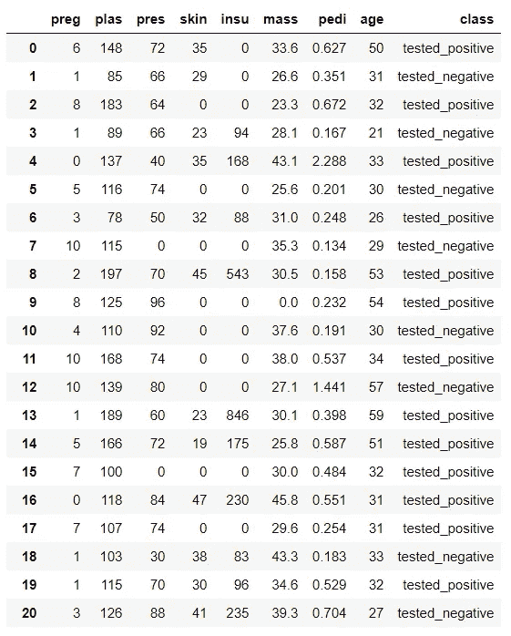
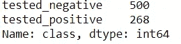
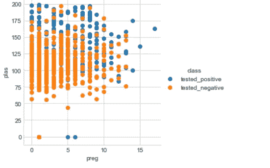
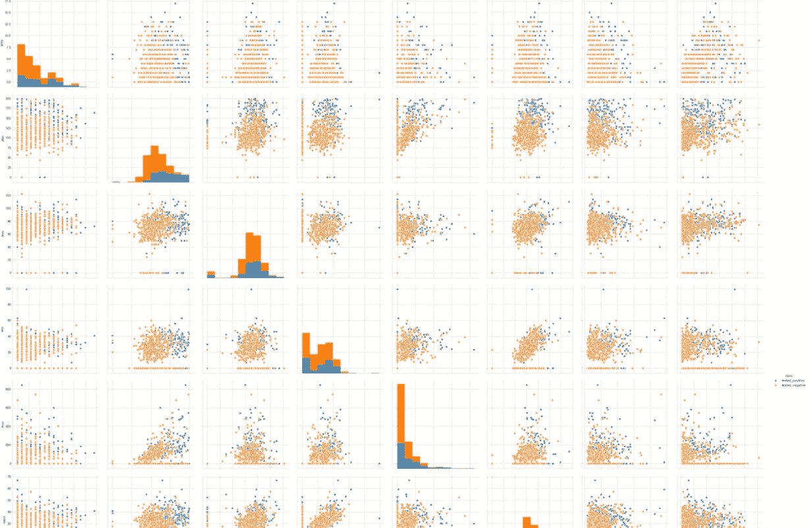
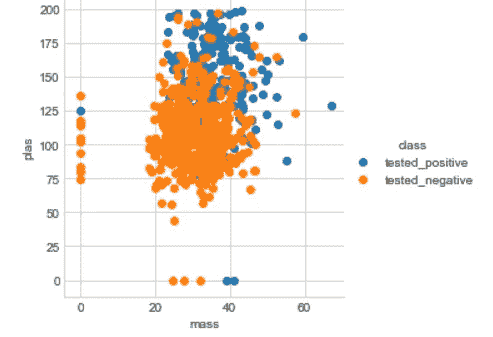
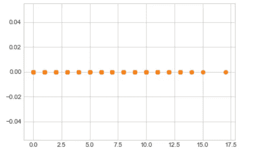
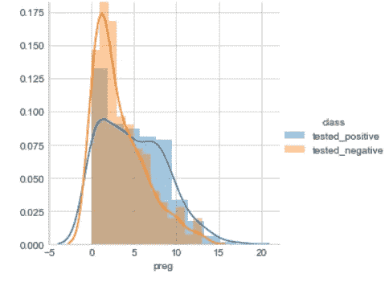
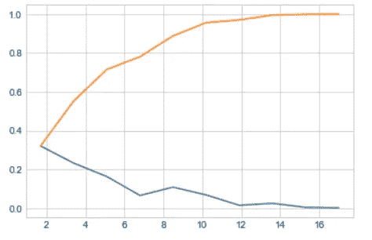
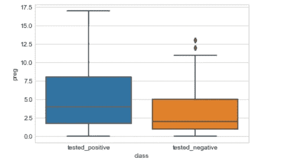
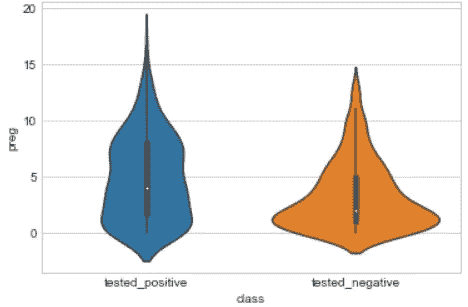

# 探索性数据分析-概念

> 原文：<https://medium.com/analytics-vidhya/exploratory-data-analysis-concept-1d45b36468c?source=collection_archive---------9----------------------->

*可视化和分析数据的艺术*

> 嘿，我是 Anurag Kataria，一位热心的数据科学家，在这里我将向您解释一些使用一些基本绘图工具、代数和几何表达式来可视化和分析数据的基础和关键概念，我们将在整个博客中使用 python。

# 让我们理解数据:

数据不过是一组元素，可以是高十进制值、图像、曲线、名称等等。而利用不同的数学和科学工具提取一些有价值的、明确的信息，并进一步利用*来预测或实现某种目标的过程称为数据分析。*

EDA:探索性数据分析定义为使用基本绘图工具、代数表达式和几何概念对原始数据进行详细分析，以评估某些目标或从中提取有价值的信息。

# **让我们简单了解一下 EDA:**

在这里，我将举一个糖尿病数据集的例子来提取一些信息，从而深入解释你的 EDA

*   **读取数据:**

我从 OPEN ML 网站上获取了糖尿病数据集，我们将对其进行探索性数据分析:

```
import pandas as pd 
diabetes=pd.read_csv("diabetes.csv")
diabetes
```

在这里，我已经将数据以逗号分隔值(csv)文件格式下载到我的电脑中，文件名为糖尿病。



这是我们的数据集的样子

让我们了解基本术语:

*   我们数据集中的行数和列数是:

```
print(diabetes.shape)
```

这里我们有 768 行和 9 列，即 786 X 9。

*   现在，列是指变量，这里有 9 个变量。现在所有变量的值都被称为数据点，这些数据点成行排列。
*   类别标签:这些是定义数据点的输出变量，我们将它们分别归类到属于哪一组类别。类别标签也可以称为自变量，而变量是因变量。
*   在通过图分析数据的过程中，我们根据数据点各自的类别标签对数据点集合进行分区，以便我们可以区分哪些数据点属于哪个类别。
*   让我们查找属于每个标签的数据点数量:

```
diabetes['class'].value_counts()
```

我们有:



因此，我们可以看到，糖尿病检测阴性的患者人数多于检测阳性的患者。由于两个类别标签的数据点不同，因此我们可以说这是不平衡的数据集。

# 情节:

我们有 1D、2D 和 3D 图，其中 D 是维度(在这里将它们视为变量)。我们不能在剧情中直接超越 3d，因为人类只限于 3D。因此，为了制作 3D 以上的图，我们使用配对图、t-sne、Pac 等。

*   我们将首先了解 2D 和 3D，以获得基本的想法，然后我们将跳转到 1D 图，配对图等。

**我们数据集的 2D 图将:**

这里，因为它是 2d 的，所以我们可以为每个标签只取两个维度或变量。因此，这里我们将采用 preg 和 PLA:

```
import seaborn as sns
sns.set_style('whitegrid')
sns.FacetGrid(diabetes,hue='class',size=4).map(plt.scatter,'preg','plas').add legend()
```



数据集糖尿病的 2D 散点图

因此，通过这个散点图，我们可以很容易地看到我们的 preg 和 PLA 散点图有多混乱，因此，如果我们试图通过这些数据点划分我们的类别，那么超过 50%的情况下我们会得到错误的结果。因此，这些数据点不是线性可分的。

线性可分意味着当我们试图划分或区分两种或多种不同类型数据点时，我们使用线性表面来分离它们。这些线性表面是:

2D 线

三维平面

nD 中的超平面

*   在 3D 绘图中，我们使用平面作为线性表面。

3D 绘图是有用的，因为我们可以根据需要改变绘图的大小和形状，以便更有效地划分数据点，但是 3D 绘图的缺点是我们不能通过纸和笔很好地理解它，因为它通常具有复杂的立方体形状结构。(ps。可以在谷歌上搜索各种 3D 图)

# 配对图

现在，正如我们之前讨论的，我们使用配对图来绘制 3D 上方的图。

*   配对图基本上形成不同的维度(变量)对，并形成每个维度(变量)的散点图，从而使我们更容易分析并找出最适合的散点图，以便根据其类别标签分别划分数据点。
*   配对图具有矩阵型结构，对角线上有直方图，对角线上有配对图，对角线下有这些配对图的镜像。

由于在我们的数据集中有 8 个变量，因此将形成 C(8，2)对:

```
sns.set_style('whitegrid')
sns.pairplot(diabetes,hue='class',size=4)
plt.show()
```



结对图看起来像这样

在这里，我们将得到对角线上方的 28 个配对图和对角线下方的 28 个配对图，它们是对角线上方配对图的镜像。我们可以看到每一对图都是 2D 散点图。

**结论:现在在检查了所有对地块后，我发现(mass，plas)对地块最适合分区。因为所有的数据点仍然没有从两类中分离出来，但是它们几乎是线性分离的。**

## (质量、等离子)散点图:



如果我们像这样划分区域:

如果(plas≤150 ),则测试为阴性

else 测试 _ 阳性

*   这里仍然存在不确定性，测试的阴性数据点的总和高于 150，一些测试的阳性数据点也低于 150，但大多数情况下我们会得到准确的结果。
*   配对图的局限性在于它们在高维空间中是无效的，因为阅读每个图来找出合适的一个需要花费太多的时间。

## **1D 散点图:**

这里我们将使用每个类的单个变量来分析和提取数据中的信息。

```
import numpy as np 
import matplotlib.pyplot as plt
diabetes_neg=diabetes.loc[diabetes['class']=='tested_negative']
diabetes_pos=diabetes.loc[diabetes['class']=='tested_positive']
print('1d scatter:')
plt.plot(diabetes_neg['preg'],np.zeros_like(diabetes_neg['preg']),'o')
print(plt.plot(diabetes_pos['preg'],np.zeros_like(diabetes_pos['preg']),'o'))
```



1D 散点图

这里我们在 X 轴上有变量“preg ”,这些点在一条直线上是可见的。现在，如果我们想要缩小并查看位于 X 轴特定范围内的患者数量，那么我们使用直方图或基本密度图。

# 概率密度函数:

*   PDF 被定义为概率密度函数，如果我们试图用简单的语言来理解它，那么它就是一条穿过每个直方图的线，形成一条曲线。
*   PDF 显示变量的密度。它有两个参数均值和方差。这里均值定义其峰值，方差定义其扩散。
*   基本上，PDF 给出了曲线的分布值，因此通过分布，我们可以概括出数量的概念或变量的密度。PDF 还有助于更准确地划分课程。

## 形成上述一维散点图的密度图:

```
sns.set_style('whitegrid')
sns.FacetGrid(diabetes,hue='class',size=4).map(sns.distplot,'preg').add_legend()
```



可变怀孕的密度图

现在可以看到，我们有两个 PDF，一个用于 tested_negative，另一个用于 tested_positive 类标签，变量为 preg。在 pdf 中，如果你看到了，那么你将得到每个范围的直方图，并且 pdf 与每个直方图相接触，形成一条平滑的线。

> 对于一个连续的随机变量 X，如果我们画出它的密度图，如果它形成一个钟形曲线，那么变量 X 服从高斯分布。对于这样的 pdf，我们可以在不知道变量的值的情况下，仅通过根据 PDF 的参数查看形状，就可以很容易地说出各种属性。

现在，由于我们的变量 preg 的密度图过于混乱，因为两个 pdf 重叠，因此我们不能使用它来划分每个类别标签的数据点。

为了解决这些问题，我们使用单变量分析:

*在单变量分析中，我们形成每个变量的密度图，然后分析哪个变量最适合划分数据点。*

# **累积分布函数:**

累积分布函数给出了变量的密度概率，即有多少百分比的值位于 X 轴或变量的相应值内。

> 对于遵循高斯分布的连续随机变量 X，其 CDF 在本质上将是对称的，具有参数均值和标准差。CDF 最著名的是它的 68–95–97.5 规则，我们将在其他博客中讨论。

因此，对于我们上面的密度图，如果我们试图形成 PDF 和 CDF 都在其中的图:

```
counts,bin_edges=np.histogram(diabetes['preg'],bins=10,density=True)
pdf=counts/sum(counts)
cdf=np.cumsum(pdf)
plt.plot(bin_edges[1:],pdf)
plt.plot(bin_edges[1:],cdf)
```



这里上面的橙色线是 cdf，下面的蓝色线是变量 preg 的 pdf。

*当我们试图通过 CDF 划分类别标签的数据点时，精确度增加了。*

*   可以清楚地看到，我们的 Y 轴在 0 到 1 之间，因为它描绘了 cdf，CDF 的范围在 0 到 1 之间，因为它给出了 x 的相应值的密度概率。
*   我们还可以通过将所有直方图相加直到范围 X 或者取曲线下的面积来计算某个 X 值的 cdf。
*   对于给定的范围:PDF 的积分给出 CDF。
*   *CDF 的微分给出 PDF。*

# **百分位数:**

它基本上告诉我们一个元素在一个排序列表中的位置。更一般地说，我们可以说它告诉了一个元素的秩。

让我们试着从一个例子来理解它:

我们有一个由 5 个数字组成的排序列表，X={2，3，4，7，8}

因此，如果我们必须告诉 X 的第二百分位，它将是值 3，因为百分位遵循相同的规则，索引遵循仅仅百分位从 1 开始计数。

让我们取 Y={2，3，4，5，6，22，33，44，55，66}

现在我们在一个排序列表中有 10 个数字。

现在，Y 的第 4 百分位是 5，这意味着 Y 值的前 40%小于第 4 百分位，剩余的 60%大于第 4 百分位。

如果我们取第 6 百分位，即 22，那么 Y 的前 60%的值小于第 6 百分位的值，剩余的 40%的值大于第 6 百分位的值。

# 分位数:

## 第 25、50、75 和 100 个百分位数称为分位数。并分别计为第一、第二、第三和第四分位数。

因为这四个将列表划分成最佳部分用于估计。

*   第 50 百分位值称为中位数。

百分点值和分位数的代码片段:

```
print(np.percentile(diabetes_neg['preg'],np.arange(0,100,25)))
```

这里我们得到的输出是:[0。1.2.5.]

现在，np.arange(0，100，25)表示从第 0 个百分位数开始，到第 75 个百分位数，在 25 的差距处比第 100 个百分位数低一个百分位数。

因此，我们得到了第 0、25、50 和 75 百分位值。

我们还可以通过移除一个 range 函数并输入您想要查找其值的百分位来计算一个百分位值。

# IQR:

这代表四分位数范围。基本上，当我们发现两个百分点的差异时，我们得到了四分位数范围。通常我们取两个*分位数的差。*

假设我们在从 1 到 100 的 100 个排序自然数的第 25 个百分位数和第 75 个百分位数之间寻找 IQR。那么我们的 IQR 将会是:

第 75 个百分位数(或第 3 个分位数)=75

第 25 个百分位数(或第 1 个分位数)=25

**因此，它们之间的 IQR 是 50，这表示 50%的值位于范围 50 内，这是正确的。假设对于任何第 75 百分位减去第 25 百分位，我们得到 IQR 12.22，那么这意味着在 12.22 的短范围内，我们有 50%的值。**

基本上，IQR 会告诉你这个价值所在的范围。

# 箱线图:

盒图是 EDA 中的一个重要课题。

到目前为止，我们已经分析了数据，并使用散点图、pdf 和 cdf 划分了数据点，但是划分出的区域或我们的数据点几乎是线性分离的，其中存在一些模糊性，或者有 10-20%的机会得到错误的结果。但是我们并不完全确定有多少模糊或错误的结果，或者我们有多少正确的结果。

甚至当我们在 pdf 或 cdf 中取一个阈值点时，我们得到了模糊性。 *(ps.threshold point 指的是 pdf 中的点，我们在该点设置或限制特定数据点的类别，因此直到 pdf 曲线的末端才开始，以减少模糊的机会)。*

现在，箱线图帮助我们找出在分区中有多少模糊的机会，因此也给出了一个很好的方法来分区关于它们的分类标签的数据点。我们称之为箱形图，因为当我们绘制它时，在我们的图形中有箱形结构。

因此，为两种数据类别的 preg 变量绘制箱线图:

```
sns.boxplot(x='class',y='preg',data=diabetes)
plt.show()
```



箱形图

这里我们得到了两个在 y 轴上具有可变 preg 的盒状结构。

箱形图用于获得 1D 散点图中变量的百分位数。

**例如，如果我们将 tested_positive 类的蓝框放在这里，框的最上面一行是第 75 个百分位数，中间一行是第 50 个百分位数，下面一行是第 25 个百分位数。**

因此，现在我们知道我们的 25%价值位于哪个范围，我们的 50%价值位于哪个范围，等等。由于百分位数之间的差异给出了值的百分比，y 轴上的对应点将给出范围。

*例如，如果我们在这里取 tested_negative 的箱线图，我们可以说在 2.4 到 3 的范围内，我们有 25%的值。*

> 现在，如果我们尝试将变量 preg 中的数据点分区，我们可以很容易地说，如果我们尝试覆盖整个蓝色框，那么 25%的黄色框也将被视为蓝色框的第 25 个百分位数，而黄色框的第 50 个百分位数。因此，现在我们知道我们的模糊性会形成多少，我们在划分区域时会正确多少。因此，有 25%的机会有歧义。

*   *盒子上的 T 形线被称为胡须*

# 小提琴情节:

到目前为止，我们已经做出了密度图和箱线图。我们知道，密度图给出了数据点的 PDF 和 CDF，基本上说明了数据点的密度(密度与分布成反比),箱线图给出了变量的百分位数。

**Violin 图基本上是密度图和箱形图的组合，因为它在中心有一个箱形图，周围是 pdf，为我们提供了密度图。**

让我们为两个类的 preg 变量编写 violin 图:

```
sns.violinplot(x='class',y='preg',data=diabetes)
plt.show()
```



小提琴情节

这里可以清楚地看到，我们在中心有一个方框图，在两边有 pdf。

# 致谢:

*我们进行探索性数据分析的糖尿病数据集来自 OPEN ML 网站。*

> 这就是我对 EDA 概念的全部看法，如果你喜欢阅读这篇博客，那么如果你与你的 ML 和数据科学爱好者朋友和同事分享它，将会受到高度赞赏。
> 
> 谢谢你，
> 
> 阿努拉格·卡塔里亚