# 探索性数据分析

> 原文：<https://medium.com/analytics-vidhya/exploratory-data-analysis-eda-cbfc0b0e4922?source=collection_archive---------13----------------------->

卢克·切瑟在 [Unsplash](https://unsplash.com?utm_source=medium&utm_medium=referral) 上的照片

## 介绍

探索性数据分析是分析或理解数据并提取数据的洞察力或主要特征的过程。EDA 通常分为两种方法，即图形分析和非图形分析。

EDA 非常重要，因为在动手之前，首先理解问题陈述和数据特征之间的各种关系是一种很好的做法。

**探索性数据分析**

从技术上讲，EDA 的主要目的是

*   *检查数据分布*
*   *处理数据集的缺失值(每个数据集最常见的问题)*
*   *处理异常值*
*   *删除重复数据*
*   *对分类变量进行编码*
*   *归一化和缩放*

注意——如果您不熟悉上面的一些术语，请不要担心，我们会详细了解每一个术语。

**了解 EDA**

为了理解 EDA 中涉及的步骤，我们将使用 Python 作为编程语言和 Jupyter 笔记本，因为它是开源的，不仅是一个优秀的 IDE，而且非常适合可视化和演示。

第一步

首先，我们将导入为此所需的所有 python 库，包括用于数值计算和科学计算的 **NumPy** 、用于处理数据的 **Pandas** 以及用于可视化的 **Matplotlib** 和 **Seaborn** 。

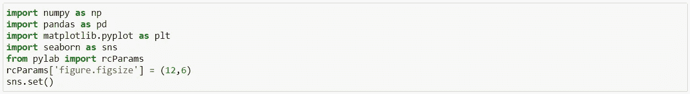

**第二步**

然后我们将数据加载到**熊猫**数据帧中。为了这个分析，我们将使用“世界幸福报告”的数据集，它有以下几列:人均 GDP、家庭、预期寿命、自由、慷慨、信任政府腐败等。来描述这些因素在评估幸福感中的作用程度。

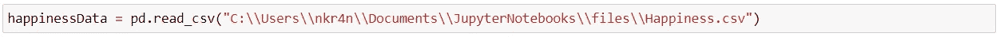

**第三步**

我们可以通过使用 head()方法检查几行来观察数据集，head()方法返回数据集中的前五条记录。

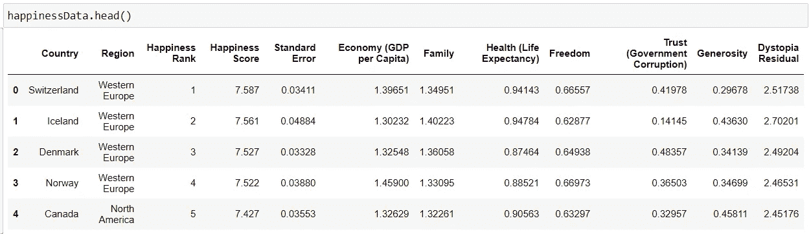

**第四步**

使用形状，我们可以观察数据的维度。

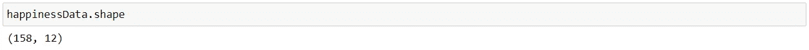

**第五步**

**info()** 方法显示了数据的一些特征，比如列名、非空值列的数量、数据的数据类型和内存使用情况。

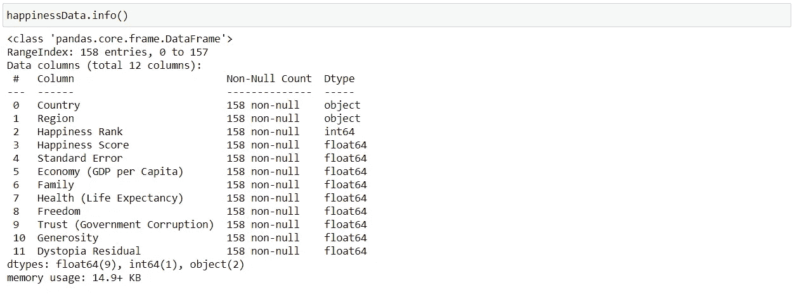

由此我们可以观察到，我们拥有的数据没有任何缺失值。在这种情况下，我们非常幸运，但是在现实生活场景中，数据通常会有缺失值，我们需要处理这些缺失值以使我们的模型准确工作。(注意—稍后，我将向您展示如果数据中有缺失值，如何处理数据)

**第六步**

我们将使用 **describe()** 方法，该方法显示每个数值特征(int64 和 float64 类型)的基本统计特征:非缺失值的数量、平均值、标准差、范围、中位数、0.25、0.50、0.75 四分位数。

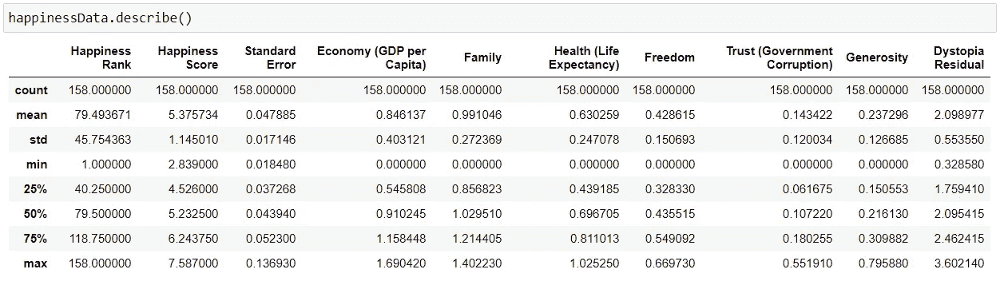

**第七步**

处理数据集中缺失的值。幸运的是，这个数据集没有任何缺失值，但是现实世界并不像我们的例子那样天真。

因此，我特意删除了几个值，只是为了描述如何处理这种特殊情况。

我们可以通过下面的命令检查我们的数据是否包含空值

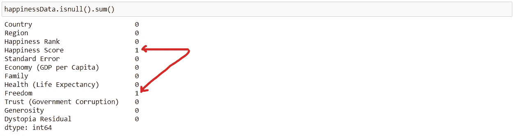

正如我们可以看到的，“幸福分数”和“自由”功能各有 1 个缺失值。

因此，现在我们可以通过使用一些技术来处理丢失的值，这些技术是

*   *删除丢失的值——如果数据集很大，而丢失的值很少，那么我们可以直接删除这些值，因为这不会有太大影响。*
*   *用平均值替换—我们可以用平均值替换缺失值，但如果数据有异常值，这是不可取的。*
*   *用中值替换—我们可以用中值替换缺失值，如果数据有异常值，建议使用中值。*
*   *替换为模式值——我们可以在分类特征的情况下这样做。*
*   *回归-它可用于使用数据集中的其他详细信息来预测空值。*

对于我们的例子，我们将通过用中值替换来处理缺失值。

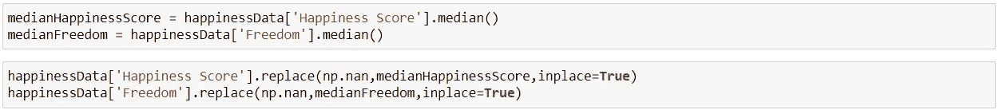

现在，我们可以再次检查丢失的值是否已被处理。

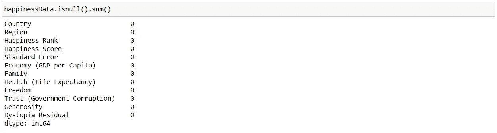

现在我们可以看到，我们的数据集现在没有任何空值。

**第 8 步**

我们可以检查数据集中的重复值，因为重复值的存在会影响 ML 模型的准确性。

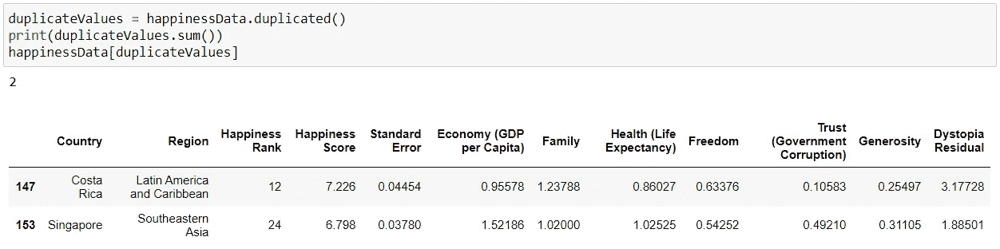

我们可以使用 **drop_duplicates()** 删除重复值

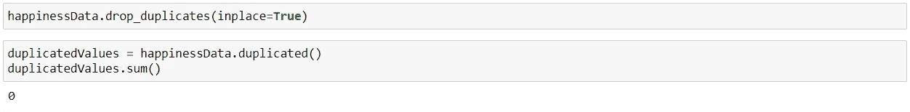

正如我们可以看到的，重复值现在得到了处理。

第九步

处理数据中的异常值，即数据中的极值。我们可以使用箱线图找到数据中的异常值。

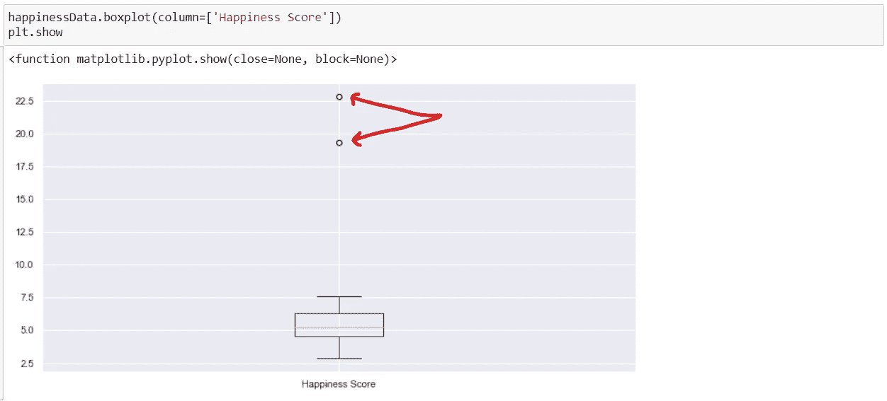

从上面的箱线图中我们可以观察到，数据的正常范围位于区块内，异常值由图形末端的小圆圈表示。

因此，为了解决这个问题，我们可以丢弃异常值，或者使用 IQR(四分位间距方法)替换异常值。

IQR 计算为数据的第 25 和第 75 百分位之间的差值。可以通过对特定指数的选择值进行排序来计算百分位数。IQR 用于通过定义作为 IQR 系数 k 的样本值的限制来识别异常值。系数 k 的常用值是 1.5。

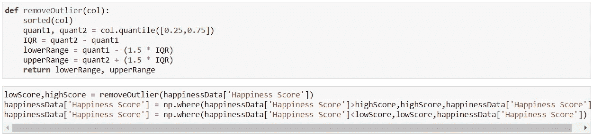

现在，我们可以再次绘制箱线图，并检查是否处理了异常值。

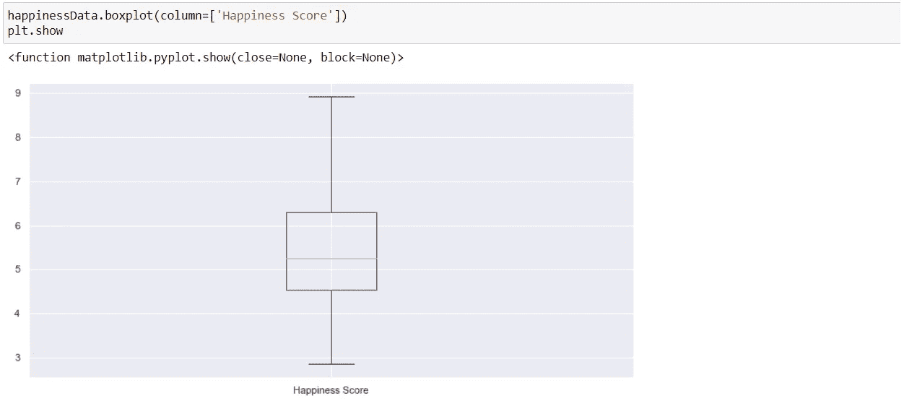

最后，我们可以观察到我们的数据现在没有异常值。

**第十步**

归一化和缩放-数据归一化或要素缩放是对数据要素范围进行标准化的过程，因为范围可能会有很大变化。因此，我们可以使用 ML 算法对数据进行预处理。为此，我们将对数值使用 StandardScaler，它使用公式作为 x 均值/标准差。

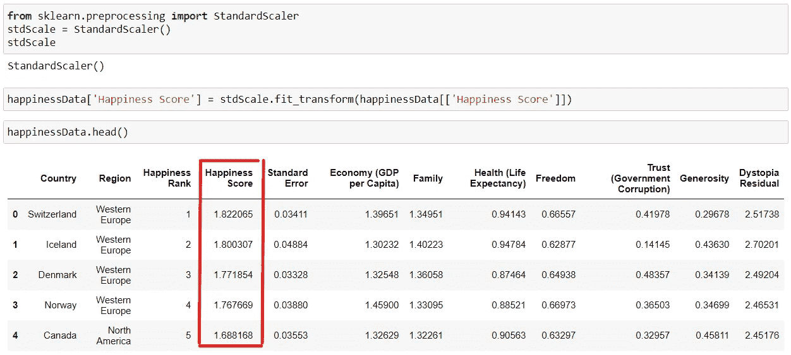

我们可以看到“幸福分数”一栏已经正常化了。

**第十一步**

我们可以使用 **corr()** 方法找到不同列数据之间的成对相关性。(注意—所有非数字数据类型列都将被忽略。)

happinessData.corr()用于查找数据帧中所有列的成对相关性。任何“na”值都会被自动排除。

结果系数是介于-1 和 1 之间的值，其中:

*   1:总正线性相关
*   0:没有线性相关性，这两个变量很可能互不影响
*   -1:总体负线性相关

皮尔逊相关是函数“corr”的默认方法。

现在，我们将使用 Seaborn 创建一个热图，以可视化我们的数据的不同列之间的关联:

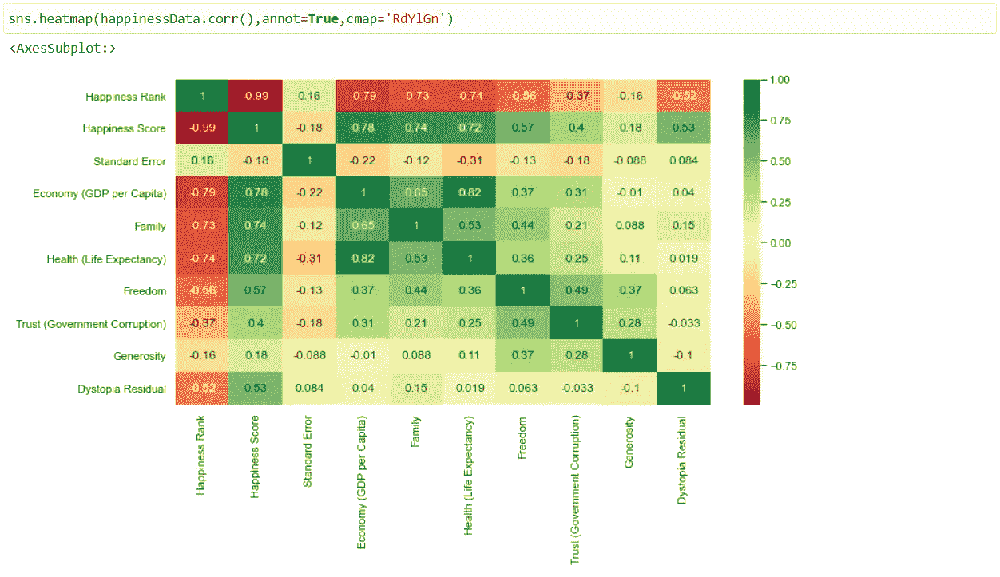

正如我们从上面的关联热图中所观察到的，在以下两者之间有很高的关联

*   幸福得分—经济(人均 GDP)= 0.78
*   幸福指数——家庭= 0.74
*   幸福指数——健康(预期寿命)= 0.72
*   经济(人均 GDP 健康(预期寿命)= 0.82

**第 12 步**

现在，使用 Seaborn，我们将通过使用回归图来可视化经济(人均 GDP)和幸福得分之间的关系。正如我们所看到的，随着经济的增长，幸福指数也在增长，这表明了一种积极的关系。

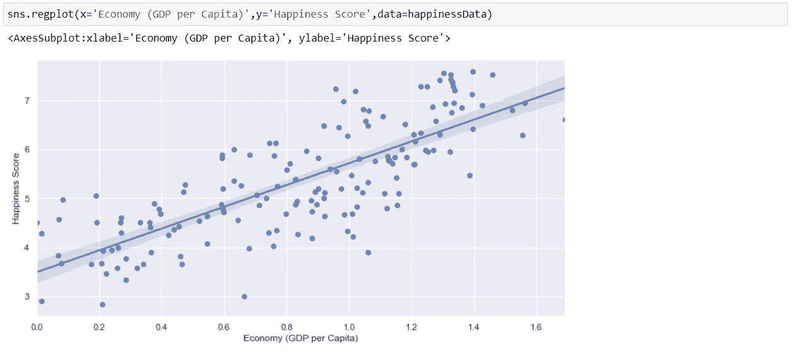

现在，我们将通过使用回归图来可视化家庭和幸福得分之间的关系。

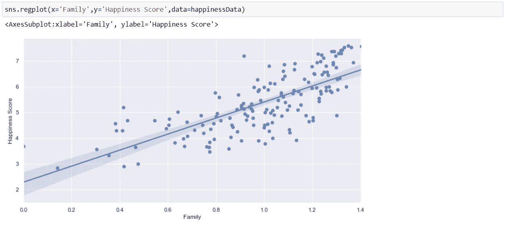

现在，我们将通过使用回归图来可视化健康(预期寿命)和幸福得分之间的关系。正如我们可以看到的那样，幸福依赖于健康，也就是说，健康等于更多的幸福。

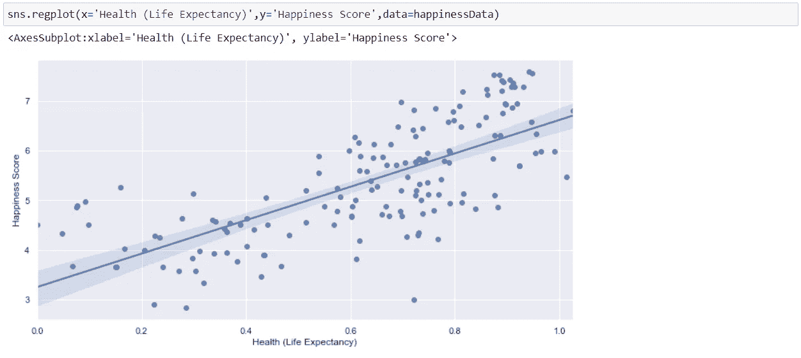

现在，我们将通过使用回归图来可视化自由和幸福分数之间的关系。正如我们可以看到的，由于这两个参数之间的**相关性较小**，因此该图更加分散**和**，并且两者之间的**相关性较小。**

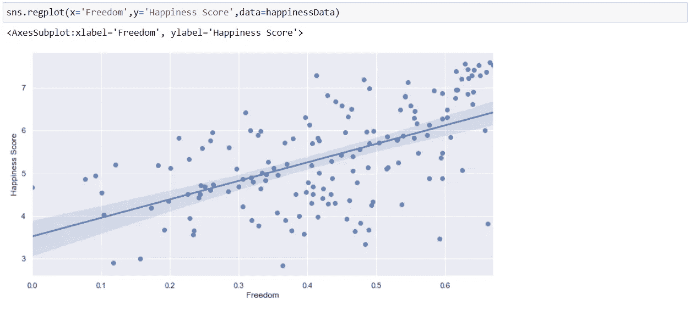

结束了。

我希望我们现在都对如何执行探索性数据分析(EDA)有了基本的了解。

因此，以上是我个人在探索性数据分析中遵循的步骤，但是还有各种其他的图表和技术，我们可以使用它们来探索更多的数据。

感谢阅读，继续学习。

要获取完整的笔记本，请点击此处的。

如果你觉得这篇文章有用，请点击[这里](https://www.linkedin.com/in/nkr4nikhilraj)，在 LinkedIn 上关注我。