# Python 中关于自杀率的探索性数据分析(EDA)

> 原文：<https://medium.com/analytics-vidhya/exploratory-data-analysis-eda-in-python-on-suicide-rates-33da65855add?source=collection_archive---------7----------------------->

由婉儿·梅在帆布上创作

# **简介**

在美国，自杀是一个必须解决和分析的健康问题。尽管美国富裕繁荣，但根据世界卫生组织的数据，其自杀率仍约为每 10 万人中有 10 至 11 人。根据我的经验，我遇到了许多患有抑郁症和其他心理健康问题的朋友和家人。除此之外，过去一年的疫情给人们造成了很大的压力。因此，对于我的第一个 EDA，我决定研究自杀率，并试图找出当面临自杀想法时，哪一组和哪一部分人口具有更高的风险。

# 第 1 部分:清理数据集

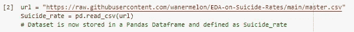

导入数据集

我找到了一个完美而简单的数据集供我在 Kaggle 上使用。这是从 1985 年到 2016 年自杀率的概述。虽然只有 12 列，但是仍然需要清理数据集。下面是该数据集前 5 行的快速演示。

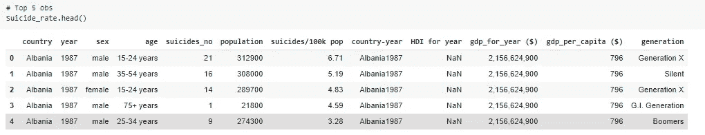

显示数据集的前 5 行

在成功导入数据集之后，我必须清理这个数据集，使它更加有组织和直观。为此，我首先检查数据集的属性，然后我发现由于语法的原因，列的一些名称可能是一个问题。因此，我更改了两个列名。然后，我删除了我不会在这个 EDA 中使用的列。之后，我删除了重复的行和缺少值的行。

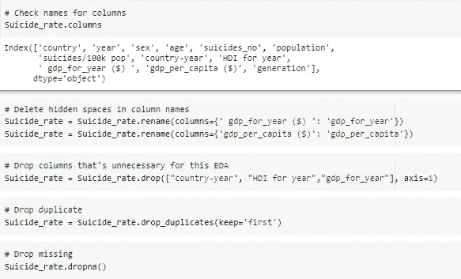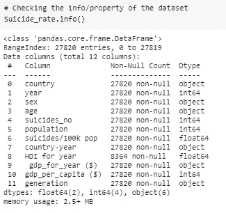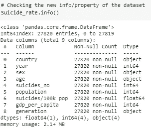

清理数据集(左 1)，清理前后(右 2 和右 1)

接下来，我使用“describe”方法来查找列的计数、唯一值、上限值、频率、平均值、标准差、最小值、25%百分点、50%百分点、75%百分点和最大值(如果有的话)。NaN 表示该统计分析不能在该列上操作。

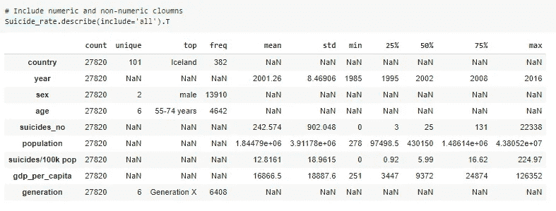

“描述”法

然而,“describe”方法并没有告诉我们哪个值是异常值，因此，我找到了一些可以指示异常值的函数。在那之后，我创建了一个新的特性，将基于自杀率统计分析的值分为“异常值”和“正常值”。

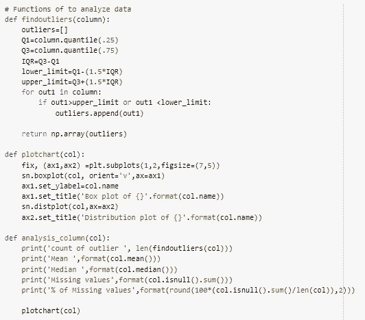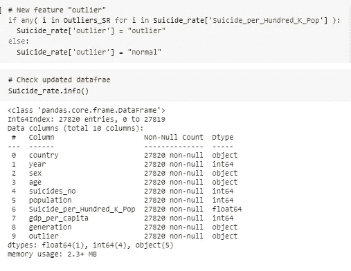

我发现的异常值函数和我创建的新列“异常值”

这是包含异常值和排除异常值的直方图的比较。差别不大，但粉色图表更详细，我们可以看到大多数国家和州的自杀率低于 5，仍有大约 4200 个国家和州的自杀率在 5 到 10 之间。而在蓝色图表中，我们只能粗略地假设大多数国家和州的自杀率都低于 50。但是我们不知道这些数据是如何分布的。

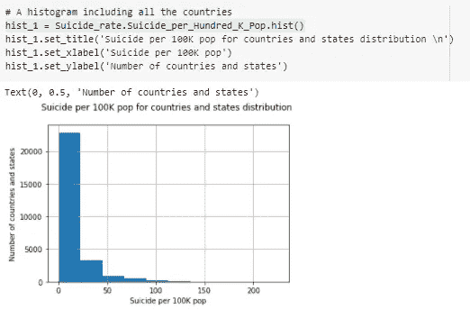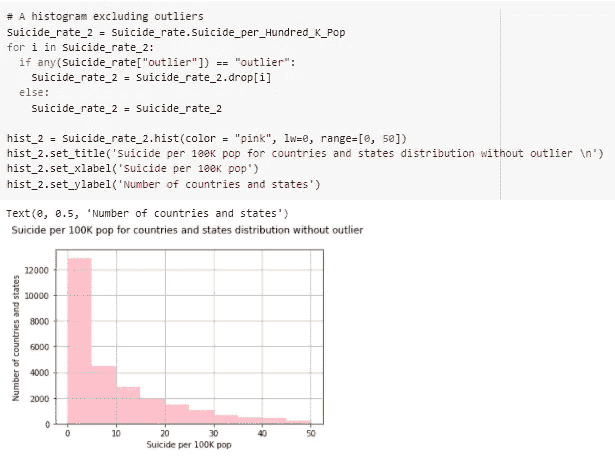

有异常值(蓝色)，无异常值(粉色)

# 第 2 部分:分析数据集

在测试了一些图表后，我决定做一组人均 GDP 的箱线图和分布图，另一组是每年自杀的数量。在人均 GDP 中，我们可以看到收入低于 25，000 美元的人有很高的自杀风险。在每年自杀数量的集合中，我们可以从分布中看到每年自杀数量有所增加。2000 年后，自杀率有所上升。在分布图中，有一个条形图显示了每年的自杀人数。对于每个条形组，都有细条形表示当年自杀的年龄组。到目前为止，我们还不知道年龄是否在这里起了很大的作用，但从 2000 年到 2010 年，不同年龄组的自杀人数相似。

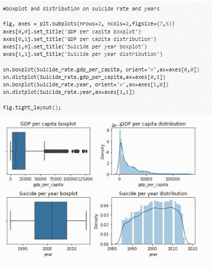

箱线图和正态分布

在我们进行更详细的分析之前，我想检查是否所有的国家和州都有相同数量的值。下图显示了某些国家和州缺少某些年份和某些年龄的数据。因此，由于数据集不完整，会有一些误差。

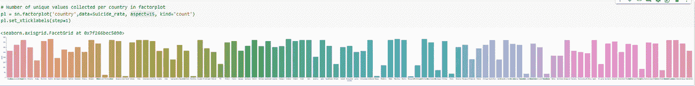

每个国家和州的唯一值数量

接下来，我制作了一个热图，展示了具有数值的列之间的相关性。蓝色表示正相关，而红色表示负相关。例如，自杀人数和人口有很强的正相关性。这个热图帮助我确定应该分析哪些列。因为深蓝色和深红色表明这两个变量可能相关。

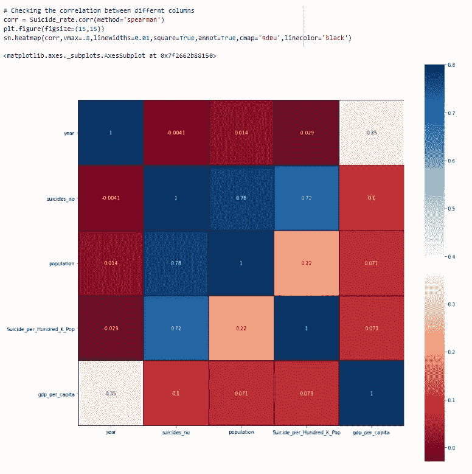

显示不同列之间相关性的热图

例如，人均国内生产总值和每 10 万人的自杀率有很强的负相关性。这意味着当自杀率上升时，人均 GDP 下降。下面的散点图证明了这一点。我们可以看到，那里的大部分数值都放在 GDP 高、自杀率低的地方，或者相反。

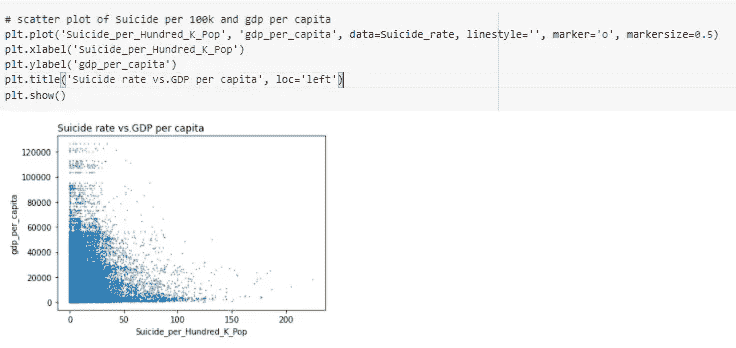

自杀率与人均国内生产总值

除了使用原始值，我还使用了自杀率的 p 值均值，并试图再次检查相关性。该图的 p 值约为 3.02，这意味着它具有统计学意义。因此，自杀率和国内生产总值之间有很强的负相关关系。

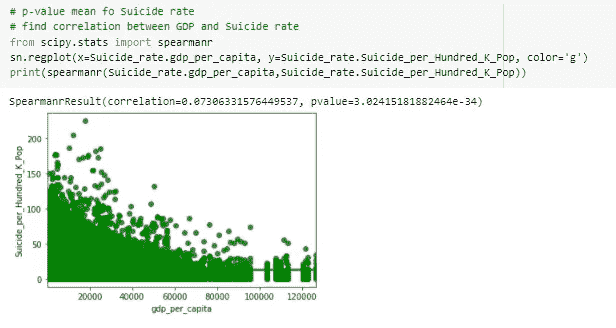

自杀率与人均国内生产总值的 p 值平均值

接下来，我决定看看自杀率和人口之间的相关性。这两列之间似乎存在微弱的负相关。然而，这不是我所期望的。我的假设是人口的增长会导致自杀率的上升。因此我决定分析这两个因素之间的关系。在下面的散点图中，显示了负相关。但是，也有一些值与相关性相反。因此，我们可以说，自杀率和人口并没有那么大的相互影响。

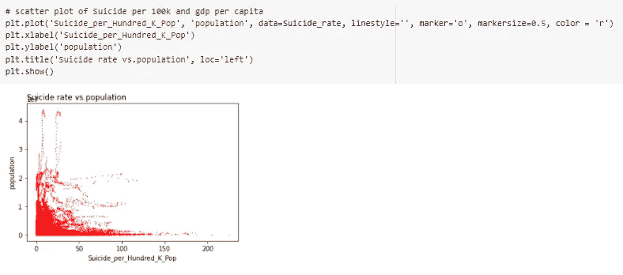

评论上有个错别字，应该是自杀率和人口。

在检查了相关性之后，我认为对于其余的列，我可以相信热图提供的分析。因此，在下面的分析中，我将比较分类值和自杀率。

因为我早些时候提到一些国家和州缺少一些数据。因此，我决定比较各国历年的平均自杀率。下图显示，越发达的国家自杀率越高。从图表上看，一些排名靠前的国家包括澳大利亚、韩国和西班牙。

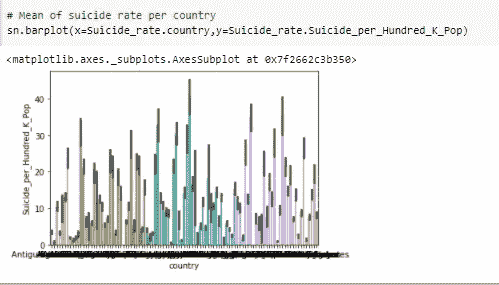

每个国家平均自杀率

之后，我想看看性别是如何影响自杀率的。令人惊讶的是，男性比女性有更高的自杀风险。

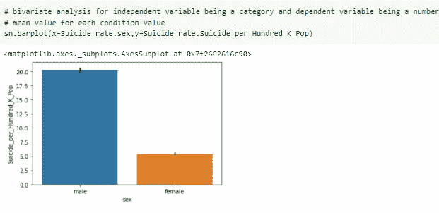

男女自杀率的平均值

接下来，我绘制了每一代人的平均自杀率。我决定把 Z 世代和千禧一代排除在外，因为这个数据集主要关注 2010 年之前的几代人。所以，可能没有足够的千年一代和 z 一代的数据。集中于前几代，我们看到 G.I 一代有最高的自杀率。G.I 一代是指在 1900 年至 1927 年间出生的人。接下来是沉默的一代和婴儿潮一代，然后是 x 一代。因此，我们看到年龄越大的人自杀的风险越高。

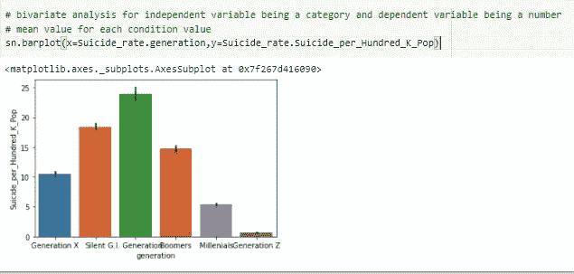

每一代自杀率的平均值

下面的图表显示了每个年龄组的平均自杀率，也支持这一说法。

各年龄组自杀率的平均值

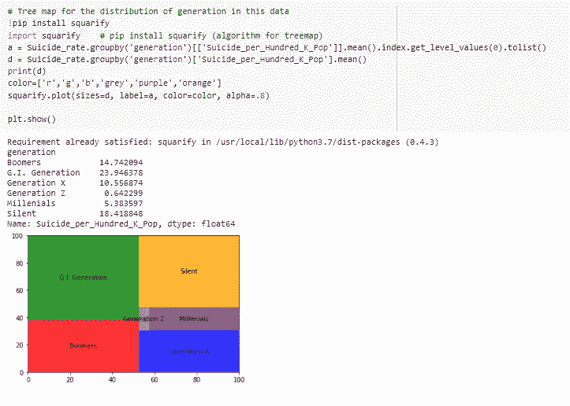

显示不同世代自杀率分布的树状图

# 结论

总之，在过去的几十年中，以下人群有更大的自杀风险:低收入人群、生活在发达国家的人、男性和老一辈人。

谢谢你阅读我的博客！