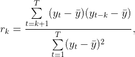

# 非季节性时间序列的探索性数据分析

> 原文：<https://medium.com/analytics-vidhya/exploratory-data-analysis-eda-of-non-seasonal-time-series-51923db4006e?source=collection_archive---------2----------------------->

用于获得洞察力的精选 EDA 工具

尼古拉斯·卡佩罗在 [Unsplash](https://unsplash.com?utm_source=medium&utm_medium=referral) 上拍摄的照片

至少有两个原因使得实验数据分析(简称 EDA)特别重要。这是一个从新遇到的数据集收集信息的过程

1.  为感兴趣的受众提供可解释的见解，或
2.  当涉及到建模时，有助于通过数据鉴定缩小相关模型的范围

我将展示一些 Python 中的图形分析工具，这些工具可能有助于得出结论，并为构建仪表板或模型选择方法提供输入。

一些感兴趣的技能关键词可能会扩大读者的知识面:

1.  熊猫的数据选择和处理
2.  锡伯恩的箱线图
3.  matplotlib 中的条形图，带有注释和阈值线指示
4.  一张图上 5 乘 5 矩阵的直方图，带有参数化注释
5.  大熊猫 Spearman 相关系数的计算及海洋热图可视化
6.  在 stats 模型中绘制自相关函数(ACF)和偏自相关函数(PACF)

本文的目的是展示上述工具，并通过展示 8 个有用的见解让读者熟悉数据集。

选择用于演示的数据集是在 [Kaggle](https://www.kaggle.com/c/the-winton-stock-market-challenge/data) 上发布的 Winton Stock Market Challenge 数据。挑战已经过期，它仍然对公众开放，但是应该同意使用条款。详情请访问 Kaggle 页面。完整数据集的简要概述解释如下。

提供的文件是 csv 格式的训练和测试数据集。对于 EDA 演示，只处理了训练数据集。它包含 40，000 行和 211 列，每行都与一个 ID 值相关联。
数据字段如下:

1.  Feature_1 至 Feature_25: 25 个对分析有用或无用的特征，如出版物中所述
2.  Weight_Intraday，Weight_Daily:用于评估当天(第 0 天)或每日回报预测的权重
3.  5 天交易窗口内的任意股票回报数据:

*   Ret_2 到 Ret_180:在 5 天窗口(第 0 天)的中间，从 2 分钟到 180 分钟按分钟报告股票回报。Ret_121 至 Ret_180 是目标变量，不在测试数据集中提供
*   Ret_MinusTwo，Ret_MinusOne:每日股票回报数据，前两天 0
*   Ret_PlusOne，Ret_PlusTwo:第 0 天之后 2 天的每日股票回报数据(目标变量)

除了上面列出的变量之外，还计算了当天(第 0 天)的每日总回报，完成了 5 天的时间序列。

这项挑战的主要目标是预测:

1.  第一天和第二天的每日股票收益
2.  从第 121 分钟到第 180 分钟的日内股票收益(给定日或第 0 天)

**重要提示**:股票收益在这里被认为是百分比数据。每分钟报告的每个返回值是股票价值相对于上次报告的价值的百分比变化。因此，当天(第 0 天)的每日总回报计算为每个 ID 的一系列返回值(Ret_2 至 Ret_180) + 1 的累积积的最后一项。

同样，日回报数据也被认为是百分比。因此，有四种时间序列可供分析:

1.  股票收益数据在第 0 天以*百分比变化*的形式按分钟报告
2.  相对于第一分钟(为 1) 的初始值，第 0 天按分钟报告的股票回报数据为
3.  *5 天窗口时间范围(包括第 0 天)的每日总回报，以*百分比变化*表示*
4.  *5 天窗口时间范围(包括第 0 天)的每日总回报，如*相对于第二天的初始值(即 1)**

*除非另有说明，否则给出的结果是基于相对值。*

*结果的详细技术概述如下。首先，要检查特性，理解每个特性的相关性并检查分布。然后，分析日收益和特征之间的关系，得出一些特征重要性的结论，最后，显示第 0 天的详细报告数据以及自相关函数。为了清晰和有目的地讨论结果，对代码进行了丰富的注释。*

*首先导入相关的库。添加了几个组件，但是有一个原因:*

*   *用于在数据帧中存储数据的熊猫*
*   *数组操作的数值*
*   *用于计算统计数据的 Scipy，例如 t 统计数据和相应的 p 值*
*   *用于绘图的 Matplotlib*
*   *统计模型专门用于绘制自相关函数，以及计算 KPSS 统计量来检查数据的平稳性*
*   *Seaborn 用于绘制热图*
*   *Sklearn 的 StandardScaler 类，用于缩放特征值*
*   *警告用于取消 KPSS 计算的特定警告的 python 类*

*数据导入后，`info()`被调用:*

*生成一个 seaborn `sns.boxplot()`很快就会发现，其中一个特性明显优于其他特性。为了比较，必须以三种不同的比例绘制三个箱线图。*

**洞察#1:在对数据建模时，一个或多个特征在数量上相对于其他特征的这种优势高估了它们对模型的贡献，特别是在机器学习算法中，这可能导致有偏见或低效的模型。**

*不同尺度特征值的解决方案是缩放。`StandardScaler()` class 是从 Sklearn 包通过 Z-score 归一化来实现的一种方法。缩放特征后，它们的分布变得更具可比性:*

**洞察#2:缩放值的箱线图显示一些特征是连续的，一些是离散的，一些特征有异常值。特性#16 似乎有两个唯一的值，这对于一个有意义的推论来说是不够的，放弃这个特性是相当重要的。**

*通过嵌套的条形图，可以更仔细地查看唯一值计数，更重要的是，查看非唯一值计数:*

*蓝条水平揭示了连续和离散变量。*

**洞察#3:红色条形图显示所有特征中有 5 个具有太多没有值的空单元，这大大缩小了建模数据的输入范围。它们对建模的有用性值得怀疑，如果保留，应该考虑填充 NaN 值的策略。**

*关于特征分布概况的完整概述，`sns.histplot()`适用。在 5×5 矩阵中，可以绘制所有 25 个特征。唯一值计数和 NaN 值计数标注在相应的轴上，如果后者超过 5 %(任意)阈值，则用红色标出:*

**洞察#4:特征#16 被确认对建模完全不重要，因为一个值几乎只出现在完整的数据集中。其他功能也具有这一特性，如功能#10 和#15。特征#1、#5、#8、#9、#10、#13、#16 和#20 被确认为离散变量。**

*每日股票回报是在五天时间窗口中的四天给出的，但是第 0 天必须从每分钟报告的数据中计算出来。在对 40，000 个累积产品进行资源密集型计算后，结果被导出用于存储，并在数据框架中再次导入。以第 0 天为补充，检验日收益和所有 25 个特征之间的相关性。这是通过将熊猫`.corr()`方法应用到数据帧上来完成的。最终，spearman 等级相关值由`sns.heatmap()`可视化:*

**洞察力#5:每日股票回报和特征之间的关系都非常弱，在 1-2%之间变化，在任何情况下都不超过 7%。特征相关性显示了一个可见的模式，并且其中大多数彼此之间具有很强的相关性，这就提出了建模中的多重共线性问题，也就是说，这些特征的效果可能彼此无法区分。**

*总的来说，25 个特征中有 13 个受到观察到的相关模式的影响，其中一个特征是分类的，其他的是连续的。相关性级别可能表示冗余，一些功能可能会被删除。*

*弱相关性不一定意味着无关紧要的相关性。为了检验显著性，计算每个相关值的 t 统计量和相应的 p 值。对于 p 值，使用 Scipy 方法，并通过`sns.heatmap()`再次显示结果:*

**洞察#6:如上所述，相关性分析不可分割的一部分是对 p 值的观察。事实上，一些看似无关紧要的相关性在计算 p 值时变得非常重要，因此有助于部分解释每日股票回报的变化。**

*每个每日股票回报的总解释方差可以作为任何模型的可能最大性能的近似值进行求和:*

**洞察#7:报告数据显示不超过大约。在不考虑多重共线性的情况下，18%的变异可以用给定的特征来解释。考虑后者可能会降低该值，但这取决于所应用的模型。**

*最后，详细报告的股票回报与自相关函数和偏自相关函数一起按顺序可视化。这些函数是 Box-Jenkins 方法的一部分，通过观察特定模式来手动推断最佳时间序列 ARIMA(p，d，q)模型参数。*

**洞察#8:结果显示每个 ID 的不同模式，在某些情况下没有显示显著的自相关，表明这些数据本质上是随机的。然而，在存在显著自相关的情况下，没有一个单一的模型可以描述这种变化，而是具体到每个模型。**

*我想暂停一下，阐述一下 ACF 和 PACF 的作用。Hyndman & Athanasopoulos 的 ACF 图简介:*

> *正如相关性度量两个变量之间线性关系的程度一样，自相关度量时间序列滞后值之间的线性关系。*
> 
> *有几个自相关系数，……例如， *r(1)* 度量 *y(t)* 与*y(t1)*的关系， *r(2)* 度量 *y(t)* 与*y(T2)*的关系，等等。 *r(k)* 的值可以写成*

**

*PACF 不同于 ACF，它控制时间 *t* 和 *t-k* 之间的相关值，因此在 *y(t)* 的值 *s* 和 *y(t-k)* 之间观察到直接的相关性。*

*在检查 ACF 和 PACF 图之前，一个重要的先决条件是确认我们正在分析平稳数据。时间序列数据的平稳性意味着均值和方差不随时间变化(没有趋势)。上面的时间序列图由科维亚特科夫斯基-菲利浦斯-施米特-申(KPSS)检验统计量 p 值标注，作为平稳性的确认。如果条件不满足，就需要转换数据，在这种情况下就是差分。注意:statsmodels 可以计算 0.10 到 0.01 之间的 p 值，如果值超出范围，则返回相应的限制。*

*虽然不能从上面显示的函数总体中得出单一结论，但根据 Box-Jenkins 方法，ACF 用于预测任何自回归 AR(p)过程的“p”参数，PACF 用于预测任何移动平均 MA(q)过程的“q”参数。在每种情况下，自相关值在滞后 p+1 或滞后 q+1 之后变得不重要，这取决于所选择的模型。结合来自 ACF 和 PACF 的观察结果，可以提出一个更复杂的 ARIMA(p，d，q)模型，例如根据 Hyndman & Athanasopoulos:*

> *如果差异数据的 ACF 和 PACF 图显示以下模式，则数据可能遵循 ARIMA(p，d，0)模型:*
> 
> *ACF 呈指数衰减或正弦衰减；
> ——在 PACF 的滞后 p 处有显著的尖峰，但在滞后 p 之后没有尖峰*
> 
> *如果差异数据的 ACF 和 PACF 图显示以下模式，则数据可能遵循 ARIMA(0，d，q)模型:*
> 
> *—PACF 呈指数衰减或正弦衰减；
> ——在 ACF 的滞后 q 处有显著的尖峰，但在滞后 q 之后没有尖峰*

*总结展示的情节和其他有用信息，您可能已经学会:*

1.  *绘制箱线图以比较特征并检查其分布*
2.  *使用 Sklearn `StandardScaler()`类缩放数据集值*
3.  *绘制带有注释和阈值线指示的嵌套条形图*
4.  *在 5×5 矩阵中绘制直方图，并调整图形以避免重叠*
5.  *向各种图添加和放置注释*
6.  *计算与熊猫的相关性*
7.  *绘制带有注释值的自定义热图*
8.  *绘制时间序列数据以及自相关函数和偏自相关函数。*

*希望以上介绍对你有用。请找到我的 [Jovian 简介](https://jovian.ai/danielandthelions/the-winton-stock-market-challenge-eda)中包含所有代码的笔记本。*

*引用:*

*[1] Hyndman，R.J .，& Athanasopoulos，G. (2021) *预测:原则与实践*，第三版，OTexts:澳大利亚墨尔本。OTexts.com/fpp3.在 21 楼。06.2021.*

*[2] SAGE Publications Ltd. (2017)利用美国农业部饲料谷物数据库(1876-2015 年)的数据，在 SPSS 中了解时间序列 ACF 和 PACF[。从 21 楼进入。06.2021.](http://methods.sagepub.com/base/download/DatasetStudentGuide/time-series-acf-pacf-in-us-feedgrains-1876-2015)*