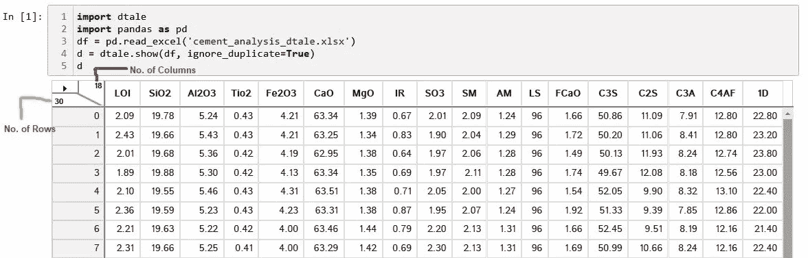
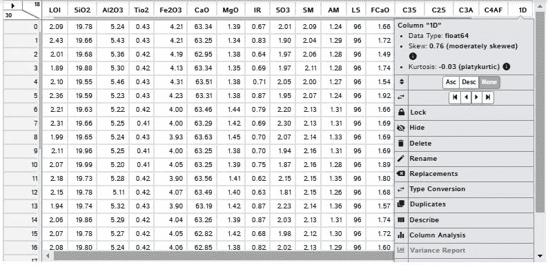
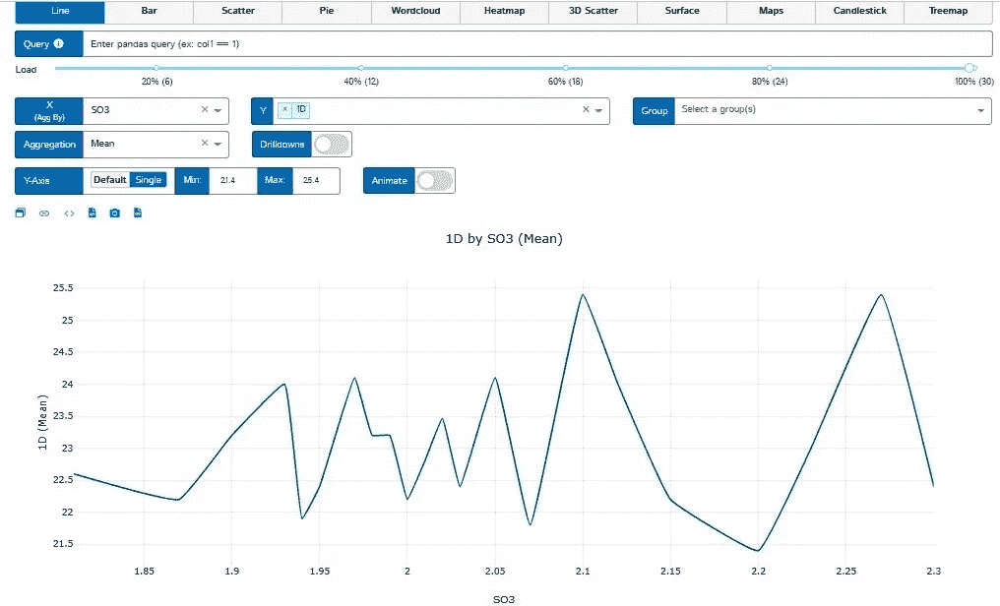
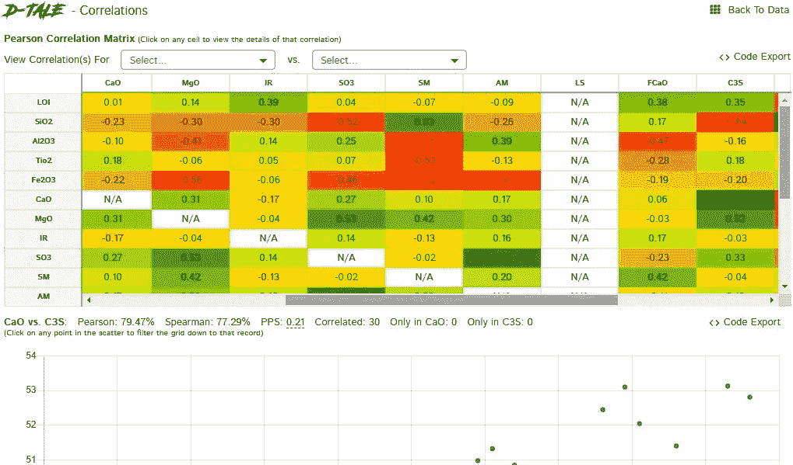

# 职业转型者的探索性数据分析

> 原文：<https://medium.com/analytics-vidhya/exploratory-data-analysis-for-career-transitioner-a523f87aab28?source=collection_archive---------14----------------------->

来源:[https://www . analyticsvidhya . com/data-science-career-transition/](https://www.analyticsvidhya.com/data-science-career-transition/)

理解探索性数据分析(EDA)的快速、技术和简单的方法。

EDA 是在任何数据科学、机器学习和人工智能项目中在我们的数据集中进行的第一次分析，以通过视觉方法理解统计数据、模式和主要特征。作为职业过渡者，人们可能会发现很难记住 EDA 所需的功能、方法和代码。

有一种快速的方法可以克服这种困惑，我称之为回溯计算。很少有像 Pandas Profiling、Sweetviz、Autoviz 和 D-Tale 这样的 python 包用于快速 EDA。这里我们就来说说 D-Tale。

**D-Tale** 是一个开源的 python 自动可视化库。可以使用 D-Tale 对数据进行详细的具体探索。它有一个导出代码的功能**【代码导出】**，对于报告中的每一个情节或分析，只需要几行代码。对于职业过渡者来说，D-Tale 最棒的一点是，他们可以使用它，浏览 D-Tale 提供的输出、可视化和代码，并可以反算和理解他们的需求。

让我们借助水泥分析数据集快速浏览一下

首先要做的是安装 dtale- " **pip install dtale"**

现在导入 dtale，导入 pandas，读取您的数据文件，为数据帧指定一个名称，然后调用它。

其中 18 是列数，30 是行数。

中间的箭头可以让你玩你的数据。只需点击任何选项，然后继续玩下去。

点击任何一列，你可以把它移到前面或后面，你可以隐藏，重命名，改变类型和做很多事情。

只需一次点击，您就可以生成表示熊猫描述功能的特定列的描述性统计数据。

类似地，可以生成任何列的差异报告。

假设在数据框(1D)的最后一列中，您想要过滤大于 24 的值，那么只需单击一下就可以过滤掉这些值。

假设你想做任何 EDA 项目中最重要的部分，也就是说，你想可视化你的数据，然后只需点击图表，选择所需的图表和栏目，你就会得到你的可视化。

如果您想要关联任何列，也可以通过几次点击来完成。

dtale 最美妙的一点是，你可以随时复制所需参数的代码，并研究它们，在其他项目中实现它们。

作为一名新手，不要犹豫尝试和做一些新的事情，只要记住做这里表达的逆向计算，就像如果你想成为一名数据分析师或数据科学家，那么你在做同样的事情，即逆向计算成为数据分析师或数据科学家所需的基础知识。