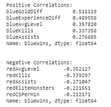
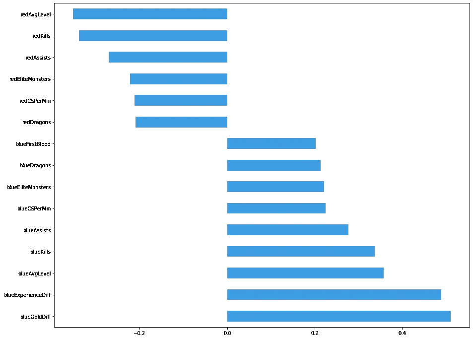
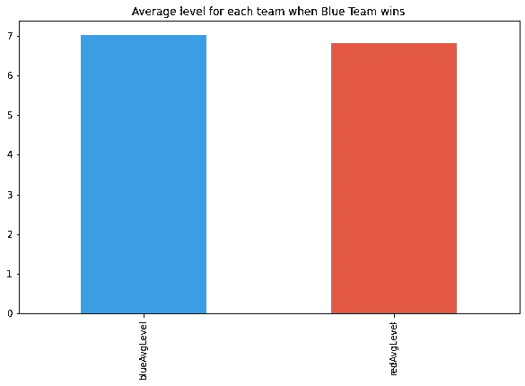
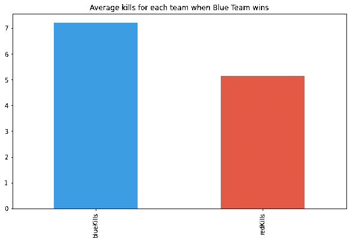
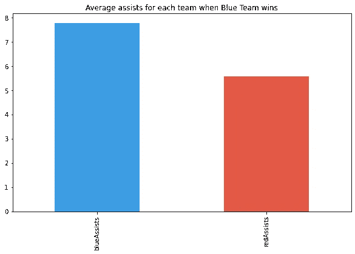
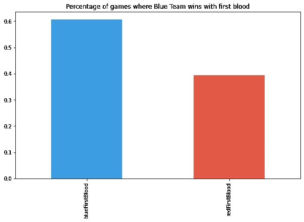

# 英雄联盟游戏的探索性数据分析

> 原文：<https://medium.com/analytics-vidhya/exploratory-data-analysis-for-league-of-legends-games-a5786c427050?source=collection_archive---------13----------------------->

赢得大多数游戏的数据科学家指南。


弗洛里安·奥利佛在 [Unsplash](https://unsplash.com?utm_source=medium&utm_medium=referral) 上拍摄的照片

这是我上一篇关于[英雄联盟获胜预测](/swlh/league-of-legends-win-prediction-5f5516c4b1d7?source=your_stories_page-------------------------------------)的文章的前传，在这篇文章中，我们创建了几个模型，根据几个游戏内的特征来预测游戏的结果。这篇文章和上一篇文章都是基于来自包含 9800 多个高排名游戏的 [Kaggle](https://www.kaggle.com/bobbyscience/league-of-legends-diamond-ranked-games-10-min) 的数据集。

**语境**

如果你玩过《英雄联盟》,你就会知道很多游戏感觉就像扔硬币一样，但在大多数情况下，你实际上可以做点什么来赢得它！让我们对这个数据集做一些探索性的数据分析，看看你如何(从统计上)赢得更多的比赛。

该数据集中的特征在每场比赛的第 10 分钟被查询。

**数据预处理**

首先，我们需要导入数据集。

```
df = pd.read_csv('high_diamond_ranked_10min.csv')
```

在之前的[文章](/swlh/league-of-legends-win-prediction-5f5516c4b1d7)中，我们使用 Sci-kit Learn 中的 SelectKBest 选择了最佳功能，现在我们可以继续选择对游戏结果影响最大的功能。

```
best_features_list = ['blueWins','blueGoldDiff','blueExperienceDiff','blueAvgLevel','redAvgLevel','redKills','blueKills','blueAssists','redAssists','blueCSPerMin','redCSPerMin','blueFirstBlood','redFirstBlood','blueEliteMonsters','redEliteMonsters','blueDragons','redDragons']new_df = df[best_features_list]
```

**EDA**

现在让我们用 pandas 来找出特征与独立变量的相关性。corr()方法。

```
corr = new_df.corr()print('Positive Correlations:')
print(corr.loc['blueWins'].sort_values(ascending=False)[1:6])print('\n')print('Negative Correlations:')
print(corr.loc['blueWins'].sort_values(ascending=True)[:5])
```



正如我们所看到的，正相关显示了在赢得游戏时最重要的特征(blueWins = 1)，负相关显示了在输掉游戏时最重要的特征(blueWins = 0)。下一个条形图以更整洁的方式显示了之前的信息。



既然我们已经看到了相关性，我们可以开始看看具体的特征以及它们如何影响游戏的结果。

我们的第一个特征是最重要的一个，因为它具有最高的相关性，它是 blueGoldDiff，两个团队之间的黄金差异。是蓝队总金减去红队总金的结果。


正如你在前面的条形图中看到的，蓝队在领先 10 分钟的情况下赢得了大约 72%的比赛。这个很直观，因为如果你比你的对手拥有更多的金币，你就可以更快地购买物品，获得更多的杀戮，[滚雪球](https://gaming.stackexchange.com/questions/179949/what-does-snowballing-mean)游戏。这告诉我们，如果你在 10 分钟前领先金牌，有 72%的机会，你会赢得比赛。

下一个特征显示两个队之间几乎没有区别，这很可能是因为这个数据来自高排名的游戏，并且高排名的玩家知道如何不落后于早期水平。尽管如此，这表明蓝队的平均水平比红队高一点。



我们的下一个特色是团队杀戮。平均来说，到了第 10 分钟，在一场蓝队会赢的比赛中，蓝队会有 7 次杀戮，而红队会有 5 次，如下图所示。



这与我们分析的第一个特征----金币差异相吻合，因为当你杀死对手时，你会得到金币奖励。

助攻在早期(前 10 分钟)比赛中意义重大，因为这可能意味着你的容格勒正在[gang king](https://gaming.stackexchange.com/questions/5727/what-is-ganking)球道，或者其他球道正在漫游。这是一个保护和赢得航线的好策略。



第一滴血是一个重要的特性，因为它让你的团队提前领先，在大多数情况下，被杀死的对手团队冠军将不得不浪费一个召唤师的法术，如瞬间移动，以回到莱恩赶上潜在的失踪 CS。



据统计，如果你的团队得到了第一滴血，你将有 60%的机会赢得比赛，比标准的 50%的机会多 10%。

**结论**

总的来说，作为一个团队拥有最多的金牌是你赢得比赛的原因，并让你一路滚雪球走向胜利。有几种方法可以获得黄金线索，例如:获得第一滴血，获得塔盘，避免对方团队获得你的，CSing，以及许多其他方法(漫游到地图的另一边杀死 0/5 支持不是其中之一)。

作为最后一个观察，记住永远要开心。你不可能赢得每一场比赛，但你可以试着享受乐趣。

像往常一样，我们欢迎建设性的批评。请随意在回复中留下您的意见。

*感谢您抽出时间阅读本文。*